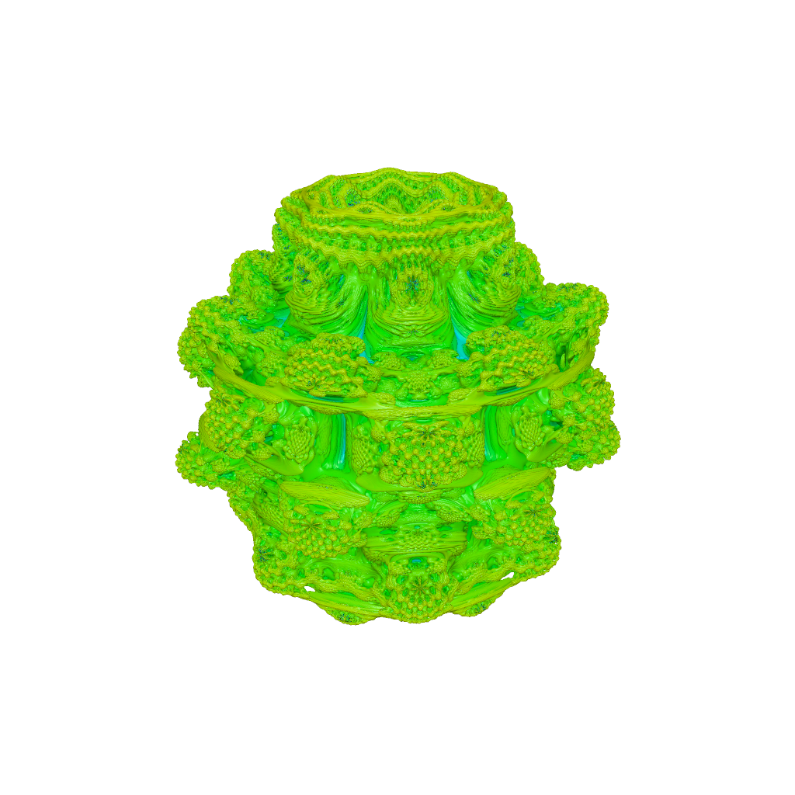
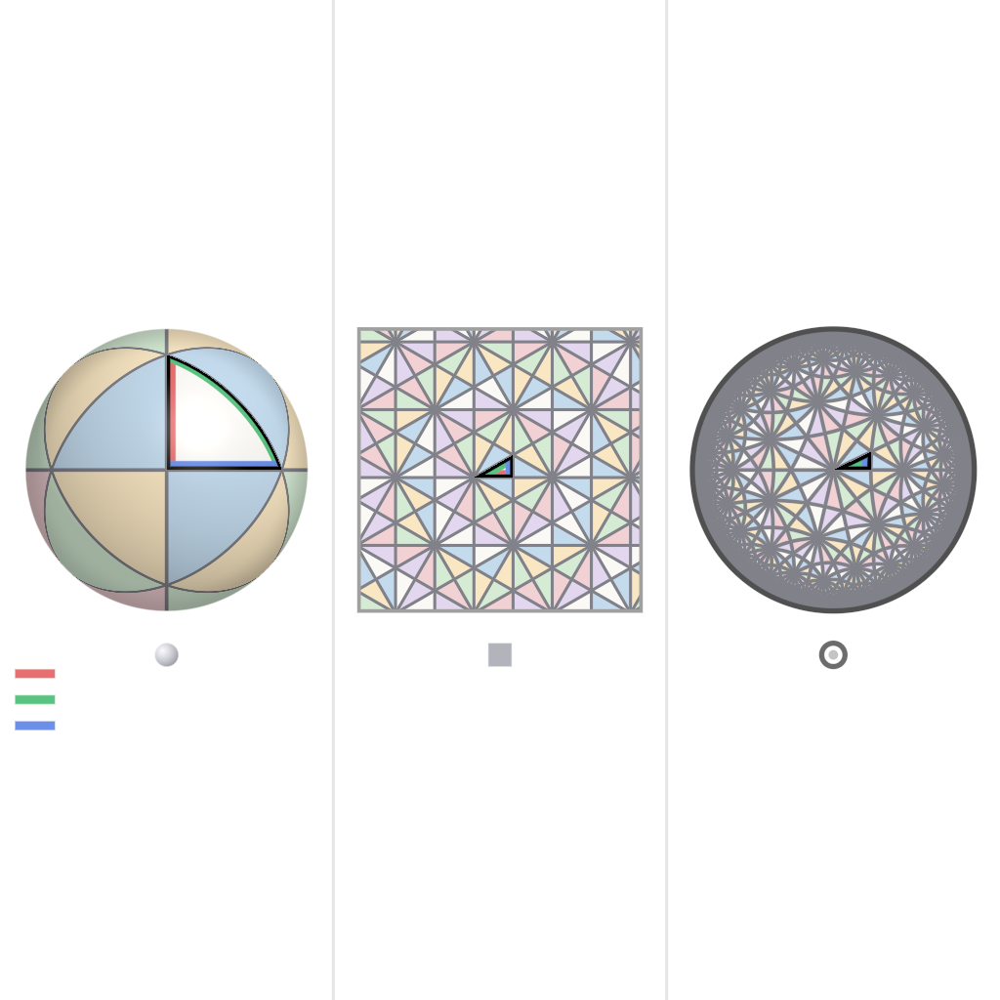
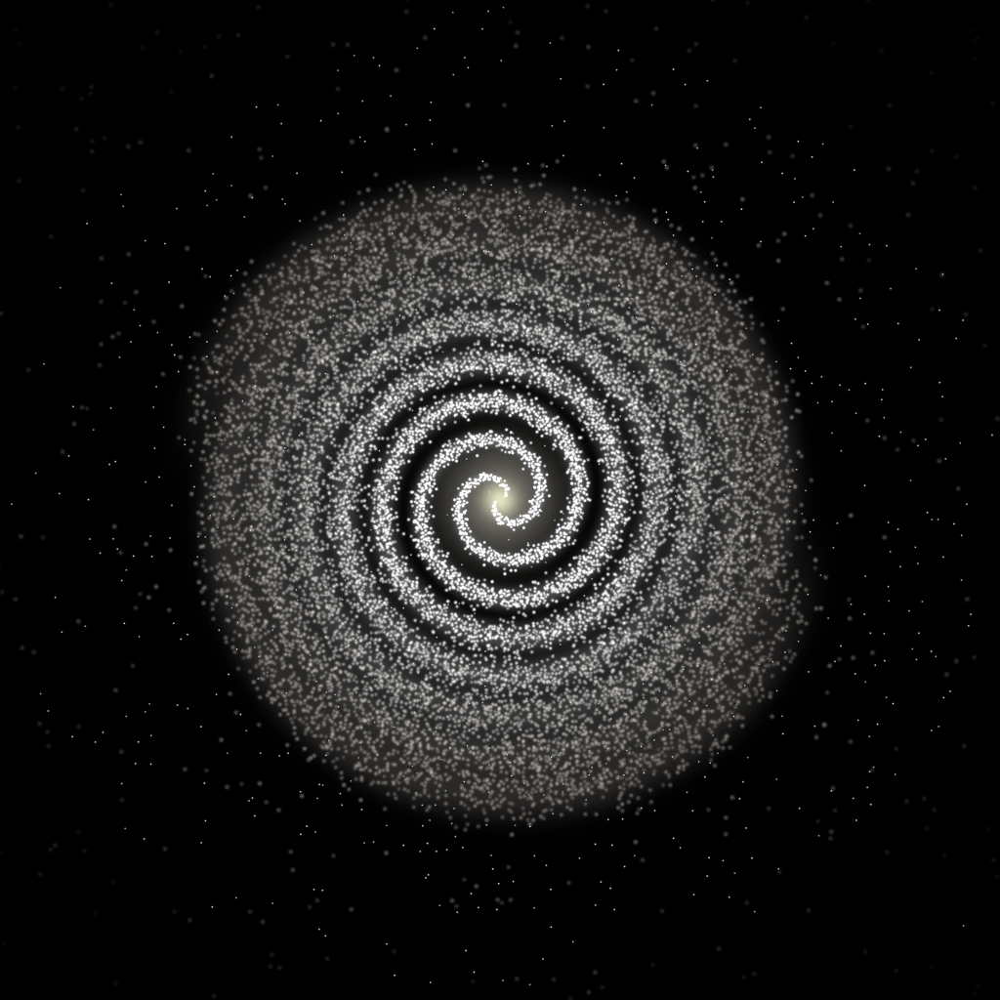
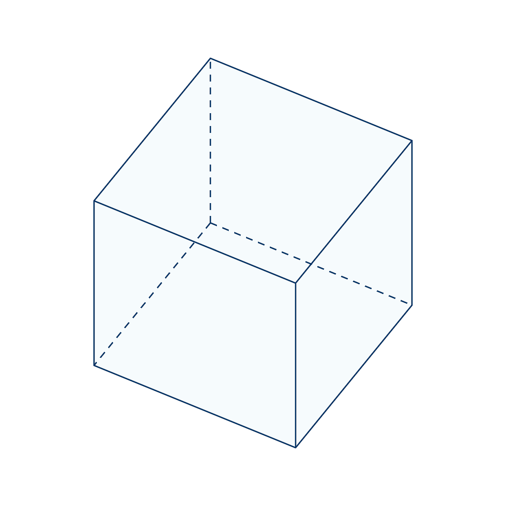
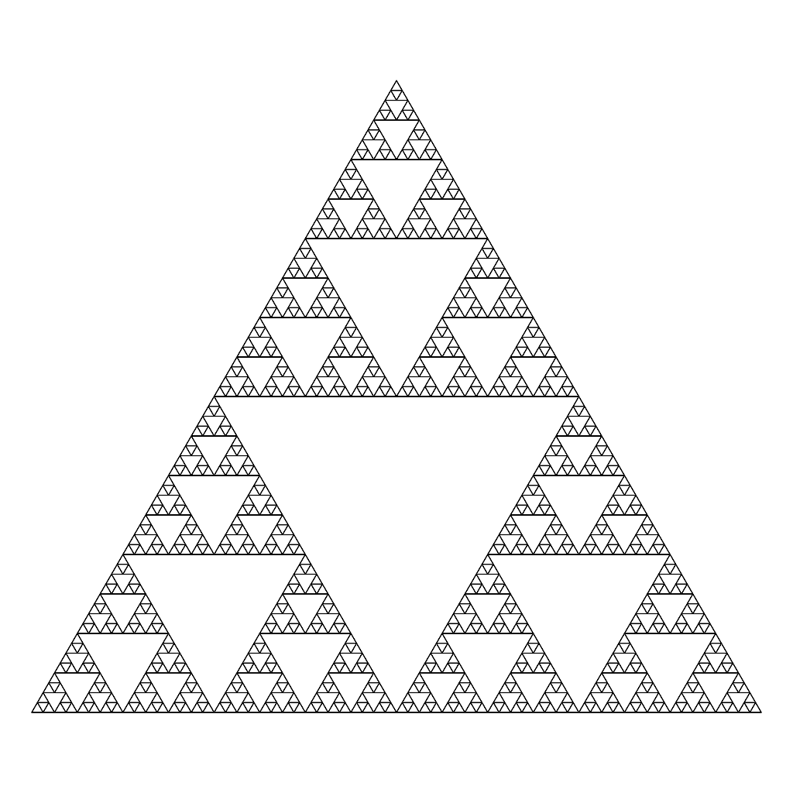

# Shader Benchmark Report

**Model:** cli/claude:claude-fable-5
**Generated:** 2026-06-10 04:11:19
**Total Tests:** 5
**Successful Renders:** 5
**Success Rate:** 5/5 (100.0%)
**Scored Tests:** 5

---

## Summary Statistics

### Average Scores by Category

| Category | Average Score |
|----------|---------------|
| Mathematical Accuracy | 86.2/100 |
| Visual Quality | 86.4/100 |
| Color Implementation | 87.4/100 |
| Geometric Completeness | 82.2/100 |
| Reference Elements | 83.2/100 |
| **Overall Average** | **85.1/100** |

### Performance Highlights

**Best Test:** Sierpinski Triangle 6 Iterations (Total: 460/500)
**Worst Test:** Mandelbulb Fractal (Total: 386/500)

---

## Detailed Test Results

### Test 1: Mandelbulb Fractal

**Test ID:** `000_mandelbulb_fractal`
**Shader Files:** shader.wgsl
**Execution Status:** ✅ Success
**Image Generated:** ✅ Yes
**Judge Scores:** ✅ Available

#### Problem Prompt

> **Objective**
> Render a single, high‑resolution image of the order‑8 *Mandelbulb* fractal using ray‑marching with a distance estimator. No reference image is provided—follow the mathematical and stylistic requirements below.
>
> **Fractal definition**
>
> 1. **Iteration**   For a point **p** ∈ ℝ³ let
>
>    $
>      \mathbf z_{0}=\mathbf p,\qquad
>      \mathbf z_{k+1}=F(\mathbf z_{k})+ \mathbf p,
>    $
>
>    where
>    – write $\mathbf z_{k}$ in spherical co‑ordinates $(r,\theta,\phi)$ (with $r=‖\mathbf z_{k}‖$);
>    – apply the "power‑8 bulb" map
>
>    $
>      F(r,\theta,\phi)= r^{8}\bigl(\sin(8\theta)\cos(8\phi),\;\sin(8\theta)\sin(8\phi),\;\cos(8\theta)\bigr).
>    $
> 2. **Escape test**   Stop after $N_{\max}=18$ iterations or when $‖\mathbf z_{k}‖>4$.
>
> **Distance estimator**
> Use the analytic estimator
>
> $
>   d(\mathbf p)= \frac{‖\mathbf z_{n}‖\;\ln‖\mathbf z_{n}‖}{\bigl|\partial_r‖\mathbf z_{n}‖\bigr|},
> $
>
> accumulated alongside the iteration in standard fashion (analytic derivative chain‑rule). Terminate the ray when the accumulated distance to the surface falls below 0.001 of the scene radius or the ray exits a 5‑unit bounding sphere.
>
> **Camera & lighting**
>
> * Camera origin $(3,\,3,\,2)$ looking at the origin; right‑handed coordinate frame; 45° vertical FOV.
> * One white point light at $(4,\,4,\,4)$; Phong shading with ambient = 0.1, diffuse = 0.7, specular = 0.2, shininess = 32.
>
> **Colouring**
> Map the *smooth escape value*
>
> $
>   \nu = n + 1 - \frac{\ln\ln‖\mathbf z_{n}‖}{\ln 8}
> $
>
> to HSV hue = $\nu/18$, saturation = 1, value = 1, then convert to sRGB. Inside points (non‑escaped) are coloured #101010.
>
> **Rendering requirements**
>
> * Resolution ≥ 2000 × 2000 px, 4× SSAA.
> * Gamma‑correct output (γ = 2.2), saved as 16‑bit PNG.
> * White background for rays that miss the fractal. No text or overlays.
>
> **Deliverable**
> A single PNG file that meets all constraints.

#### Judge Scores

| Category | Score |
|----------|-------|
| Mathematical Accuracy | 79/100 |
| Visual Quality | 77/100 |
| Color Implementation | 85/100 |
| Geometric Completeness | 69/100 |
| Reference Elements | 76/100 |
| **Total** | **386/500** |
| **Average** | **77.2/100** |

#### Rendered Output

---

### Test 2: Coxeter Reflection Kaleidoscope

**Test ID:** `001_coxeter_reflection_kaleidoscope`
**Shader Files:** shader.wgsl
**Execution Status:** ✅ Success
**Image Generated:** ✅ Yes
**Judge Scores:** ✅ Available

#### Problem Prompt

> **Objective**
> Produce a single high-resolution Coxeter-group reflection kaleidoscope comparing spherical, Euclidean, and hyperbolic reflection tilings. The image should be a triptych with one panel for each geometry and a clearly marked fundamental triangle.
>
> **Mathematical specification**
> 1. Render three panels from left to right:
>    - Spherical Coxeter triangle with angles `(π/2, π/3, π/3)` on the unit sphere.
>    - Euclidean Coxeter triangle with angles `(π/2, π/3, π/6)` in the plane.
>    - Hyperbolic Coxeter triangle with angles `(π/2, π/3, π/7)` in the Poincare disk.
> 2. Reflection generators: each fundamental triangle has three mirror edges labeled or color-coded as `A`, `B`, and `C`.
> 3. Generate cells by reflecting the fundamental triangle across its edges up to visible depth:
>    - Spherical: enough reflections to tile the sphere with tetrahedral/octahedral-like symmetry patches.
>    - Euclidean: at least `8` reflection layers outward from the center triangle.
>    - Hyperbolic: at least `7` reflection layers in the Poincare disk, with cells shrinking toward the boundary.
> 4. Cell coloring: color by reflection word length modulo a palette cycle, e.g. `length mod 6`. Adjacent cells should generally have different colors.
> 5. The central fundamental triangle must be outlined in black in every panel.
>
> **Geometry to render**
> - Spherical panel: a shaded unit sphere with triangular geodesic arcs drawn on the surface.
> - Euclidean panel: flat triangular kaleidoscope tiling in a square or circular viewport.
> - Hyperbolic panel: Poincare disk with geodesic arcs drawn as circular arcs orthogonal to the disk boundary.
> - Mirror edges: three thicker lines in the fundamental triangle, with distinct colors or tiny labels.
>
> **Rendering style**
> - White background.
> - Clean high-contrast tiling lines, anti-aliased.
> - Use a restrained six-color palette for cells.
> - Spherical panel should have subtle lighting to show curvature; Euclidean and hyperbolic panels should be mostly flat but crisp.
>
> **Composition / overlays**
> - Arrange the three panels evenly with small captions or icon markers for spherical, Euclidean, and hyperbolic if text is available.
> - Add a small legend showing the three mirror generator colors `A/B/C`.
> - Hyperbolic disk boundary should be a dark circle; cells near the boundary should visibly shrink.
>
> **Technical specs**
> - Resolution at least `1600 × 1600` pixels.
> - Static frame only; no animation.
> - Output format: PNG.
>
> **Deliverable** A single PNG image satisfying the above.

#### Judge Scores

| Category | Score |
|----------|-------|
| Mathematical Accuracy | 87/100 |
| Visual Quality | 86/100 |
| Color Implementation | 89/100 |
| Geometric Completeness | 86/100 |
| Reference Elements | 86/100 |
| **Total** | **434/500** |
| **Average** | **86.8/100** |

#### Rendered Output

---

### Test 3: Archimedean Spiral Galaxy

**Test ID:** `002_archimedean_spiral_galaxy`
**Shader Files:** shader.wgsl
**Execution Status:** ✅ Success
**Image Generated:** ✅ Yes
**Judge Scores:** ✅ Available

#### Problem Prompt

> **Objective** – Render a face‑on **two‑arm** spiral galaxy whose stellar arms follow the *Archimedean* law $r = a\theta$.
>
> **Star‑field specification**
>
> * **Spiral parameters** $a = 0.25$ (units: galaxy‐normed).  Two arms offset by $\pi$. θ spans [0, 8π] (four full turns).
> * **Star sampling** – generate 120 000 stars:
>
>   * Draw θ uniformly; compute arm centre $r=a\theta$.
>   * Tangential spread: add Gaussian offset Δθ ~ $\mathcal N(0,\sigma_{θ}^{2})$ with $\sigma_{θ}=0.035$.
>   * Radial blur: Gaussian offset Δr ~ $\mathcal N(0,\sigma_{r}^{2})$, where $\sigma_{r}=0.025(1+0.5θ)$.
>   * **Radial density fall‑off** weight $w = \exp(-r/3)$; keep star if $u<w$ where $u\sim U(0,1)$.
> * **Background** – 10 000 disc‑halo stars: radius sampled $p(r)\propto r\,e^{-r/3}$ up to $r=10$; angle uniform; small white dots.
>
> **Colour & magnitude**
>
> * Star colour temperature $T(r)=7200-250r\;\text{K}$; convert to sRGB with black‑body approximation.
> * Star brightness proportional to $e^{-0.5r}$ (clipped).  Render each star as Gaussian sprite of FWHM = 0.03 + 0.004 r.
>
> **Canvas & camera**
>
> * Orthographic view of square region r ≤ 10.  Resolution 3000 × 3000 px, black background.
> * Supernova‑like core glow: add additive circular bloom (radius 0.4, colour #ffffaa, opacity 0.6).
>
> **Deliverable** – 16‑bit PNG.

#### Judge Scores

| Category | Score |
|----------|-------|
| Mathematical Accuracy | 79/100 |
| Visual Quality | 83/100 |
| Color Implementation | 80/100 |
| Geometric Completeness | 72/100 |
| Reference Elements | 74/100 |
| **Total** | **388/500** |
| **Average** | **77.6/100** |

#### Rendered Output

---

### Test 4: Geometric Cube

**Test ID:** `003_geometric_cube`
**Shader Files:** shader.wgsl
**Execution Status:** ✅ Success
**Image Generated:** ✅ Yes
**Judge Scores:** ✅ Available

#### Problem Prompt

> Axis-aligned cube, side = 2, centred at origin.
>
> Rendering:
> - Wireframe style: edges 3 px midnight-blue (#003366); transparent faces α = 0.1 sky-blue
> - Hidden edges dashed
> - Camera: Elevated view from upper-right, looking down at cube corner (approx 45° elevation, 30° azimuth)
> - Perspective: Orthographic projection. Canvas 1800×1800
>
> Deliverable: Outputs a single image.

#### Judge Scores

| Category | Score |
|----------|-------|
| Mathematical Accuracy | 92/100 |
| Visual Quality | 94/100 |
| Color Implementation | 89/100 |
| Geometric Completeness | 93/100 |
| Reference Elements | 91/100 |
| **Total** | **459/500** |
| **Average** | **91.8/100** |

#### Rendered Output

---

### Test 5: Sierpinski Triangle 6 Iterations

**Test ID:** `004_sierpinski_triangle_6_iterations`
**Shader Files:** shader.wgsl
**Execution Status:** ✅ Success
**Image Generated:** ✅ Yes
**Judge Scores:** ✅ Available

#### Problem Prompt

> **Objective**
> Generate the Sierpinski triangle fractal through recursive subdivision.
>
> **Construction**
> * Start with upright equilateral triangle side = 1.
> * Remove central inverted triangle recursively 6 levels.
> * Stroke 1 px black; fills white. 2400 × 2080 px PNG.
>
> **Deliverable** – PNG.

#### Judge Scores

| Category | Score |
|----------|-------|
| Mathematical Accuracy | 94/100 |
| Visual Quality | 92/100 |
| Color Implementation | 94/100 |
| Geometric Completeness | 91/100 |
| Reference Elements | 89/100 |
| **Total** | **460/500** |
| **Average** | **92.0/100** |

#### Rendered Output

---

