# Shader Benchmark Report

**Model:** cli/codex:gpt-5.6-sol:medium
**Generated:** 2026-07-27 05:32:19
**Total Tests:** 128
**Successful Renders:** 128
**Success Rate:** 128/128 (100.0%)
**Scored Tests:** 128

---

## Summary Statistics

### Average Scores by Category

| Category | Average Score |
|----------|---------------|
| Mathematical Accuracy | 70.8/100 |
| Visual Quality | 78.5/100 |
| Color Implementation | 67.8/100 |
| Geometric Completeness | 72.1/100 |
| Reference Elements | 69.3/100 |
| **Overall Average** | **71.7/100** |

### Performance Highlights

**Best Test:** Five Pointed Star Polygon (Total: 477/500)
**Worst Test:** Apollonian Gasket (Total: 83/500)

---

## Detailed Test Results

### Test 1: Al Khwarizmi Geometric Algebra

**Test ID:** `001_al_khwarizmi_geometric_algebra`
**Shader Files:** shader.wgsl
**Execution Status:** ✅ Success
**Image Generated:** ✅ Yes
**Judge Scores:** ✅ Available

#### Problem Prompt

> **Objective**
> Create a shader visualization of Al-Khwarizmi's geometric solution to quadratic equations, showing how Islamic mathematicians in the 9th century used geometric algebra to solve x² + 10x = 39, bringing the birth of algebra to visual life.
>
> **Historical Context**
> Muhammad ibn Musa al-Khwarizmi (c. 780-850 CE), working at the House of Wisdom in Baghdad, wrote "Al-Kitab al-Mukhtasar fi Hisab al-Jabr wal-Muqabala" (The Compendious Book on Calculation by Completion and Balancing), from which we derive the word "algebra." His geometric method for solving quadratics predates symbolic notation by centuries.
>
> **Mathematical Specification**
>
> 1. **The Classic Problem: x² + 10x = 39**
>    - Al-Khwarizmi's geometric interpretation:
>    - Start with a square of side x (representing x²)
>    - Add four rectangles of dimensions x × 2.5 to the sides
>    - This creates a larger square of side (x + 5)
>
> 2. **Geometric Construction Steps**
>    Animate the following sequence:
>    - **Step 1**: Draw initial square of side x
>    - **Step 2**: Attach four rectangles (x × 2.5) to each side
>    - **Step 3**: Complete the figure with four corner squares (2.5 × 2.5)
>    - **Step 4**: Show that total area = x² + 10x + 25 = 39 + 25 = 64
>    - **Step 5**: Therefore (x + 5)² = 64, so x + 5 = 8, thus x = 3
>
> 3. **Islamic Geometric Styling**
>    - Use traditional Islamic color palette:
>      * Deep blue (#1E3A8A) for the original square
>      * Gold (#F59E0B) for the added rectangles
>      * White with blue outline for corner squares
>    - Add geometric Islamic patterns in margins:
>      * 8-fold star-and-polygon tessellation
>      * Arabesque vine patterns in corners
>    - Include Arabic calligraphy styling for numbers
>
> 4. **Visual Annotations**
>    - Label each area with both symbolic (x², 10x, 25) and numeric values
>    - Show running calculation: x² + 10x + 25 = 64
>    - Highlight the final solution x = 3 in ornate frame
>    - Add construction lines showing the completion process
>
> 5. **Rendering Requirements**
>    - Background: Traditional Islamic manuscript color (#FEF3C7)
>    - Use parallel projection (no perspective) as in historical diagrams
>    - Include decorative border with Islamic geometric patterns
>    - Smooth animation between construction steps (5 seconds total)
>    - Resolution: 1600×1600 pixels
>
> **Educational Goals**
> - Demonstrate the geometric origins of algebraic manipulation
> - Show how "completing the square" literally meant completing a geometric square
> - Honor Al-Khwarizmi's revolutionary contribution to mathematics
> - Connect Islamic Golden Age mathematics to modern algebra
>
> **Deliverable**
> An animated shader that visually demonstrates Al-Khwarizmi's geometric algebra method, showing how abstract algebraic concepts emerged from concrete geometric constructions in 9th century Baghdad.

#### Judge Scores

| Category | Score |
|----------|-------|
| Mathematical Accuracy | 34/100 |
| Visual Quality | 72/100 |
| Color Implementation | 26/100 |
| Geometric Completeness | 58/100 |
| Reference Elements | 31/100 |
| **Total** | **221/500** |
| **Average** | **44.2/100** |


#### Rendered Output

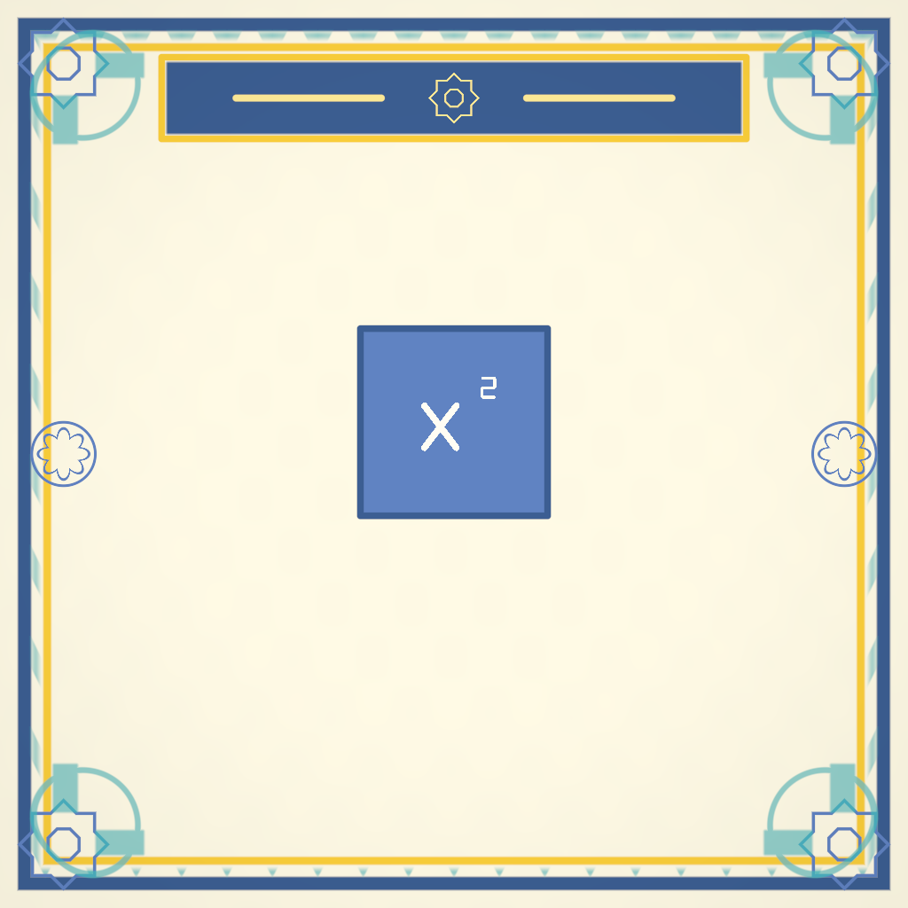

---

### Test 2: Apollonian Gasket

**Test ID:** `002_apollonian_gasket`
**Shader Files:** shader.wgsl
**Execution Status:** ✅ Success
**Image Generated:** ✅ Yes
**Judge Scores:** ✅ Available

#### Problem Prompt

> Craft a high-resolution, jewel-like image of the classical Apollonian gasket that emerges as the limit set of a rank-2 Kleinian group. The red and green "facets" should interlace so finely that the boundary between them looks like crystalline edges under a microscope.
>
> Mathematical engine:
> 1. Möbius generators: Work in the Riemann sphere (identify plane C∪{∞}). Let
>    M₁(z) = (2z+1)/(z+1), M₂(z) = (2z-1)/(z-1)
> 2. Symbolic address & parity: Every orbit point is encoded by a word in {1, 2}. Mark points whose last generator is even length word in red (#ff3355) and odd length in green (#33ff55).
> 3. Sampling:
>    - Begin with seed z₀ = 0
>    - Randomly walk 3,000,000 steps (alias method, equal probability)
>    - Discard first 12 iterates of every walk to bypass transient region; plot the next 9 iterations (depth-limiting to emphasise detail)
>
> Projection & canvas:
> - Use stereographic projection to map sphere to plane; scale so outermost circle fits a 2400 × 2400 px square with 120 px padding
> - Background pure black (#000000)
> - Each orbit point rendered as sub-pixel disk radius 0.6 px; enable additive alpha so high-density regions glow
> - After plotting, apply a single-pass Gaussian bloom σ = 1 px, 40% opacity, to make bright clusters sparkle
>
> File: PNG-24, sRGB
> Deliverable: Outputs a single image.

#### Judge Scores

| Category | Score |
|----------|-------|
| Mathematical Accuracy | 12/100 |
| Visual Quality | 28/100 |
| Color Implementation | 5/100 |
| Geometric Completeness | 18/100 |
| Reference Elements | 20/100 |
| **Total** | **83/500** |
| **Average** | **16.6/100** |


#### Rendered Output

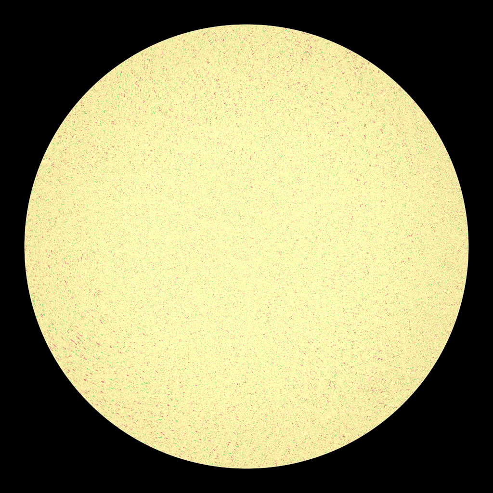

---

### Test 3: Apollonius Conic Sections

**Test ID:** `003_apollonius_conic_sections`
**Shader Files:** shader.wgsl
**Execution Status:** ✅ Success
**Image Generated:** ✅ Yes
**Judge Scores:** ✅ Available

#### Problem Prompt

> **Objective**
> Create a shader visualization of Apollonius's Conic Sections as they were understood in ancient Greece (~200 BCE), showing all three conic types emerging from a single double cone through different cutting planes, honoring the geometric construction methods of antiquity.
>
> **Historical Context**
> Apollonius of Perga (c. 240-190 BCE), known as "The Great Geometer," revolutionized the study of conic sections in his eight-volume treatise "Conics." Unlike his predecessors who used finite right circular cones, Apollonius considered arbitrary oblique double cones extending infinitely in both directions. His definitions of ellipse, parabola, and hyperbola remain in use today.
>
> **Mathematical Specification**
>
> 1. **The Double Cone Construction**
>    - Generate an infinite double cone with vertex at origin
>    - Cone angle: 30° from vertical axis
>    - Use parametric form: x² + y² = (z·tan(30°))²
>    - Extend from z = -3 to z = 3 for visualization
>
> 2. **Three Classical Cutting Planes**
>    - **Ellipse**: Plane at 45° angle to cone axis, intersecting both nappes
>    - **Parabola**: Plane parallel to cone generator (exactly 30° from vertical)
>    - **Hyperbola**: Plane at 15° angle to cone axis (steeper than cone angle)
>
> 3. **Ancient Greek Construction Visualization**
>    - Show the cone as translucent wireframe (like ancient diagrams)
>    - Display cutting planes as semi-transparent colored surfaces
>    - Highlight the intersection curves in bold, using ancient color symbolism:
>      * Ellipse: Deep blue (celestial motion)
>      * Parabola: Green (earthly trajectories)
>      * Hyperbola: Red (infinite extension)
>
> 4. **Geometric Annotations**
>    - Add construction lines showing:
>      * Cone generators (straight lines on cone surface)
>      * Plane normal vectors
>      * Dandelin spheres tangent points (optional advanced feature)
>    - Include Greek letters α, β, γ for the three plane angles
>
> 5. **Rendering Requirements**
>    - Use orthographic projection (as Greeks would have drawn)
>    - Apply subtle shading to show 3D form while maintaining diagram clarity
>    - Background: Parchment color (#F4E8D0)
>    - Include a small inset showing Apollonius's original cone diagram style
>    - Resolution: 1600×1600 pixels minimum
>
> **Educational Goals**
> - Demonstrate how all conic sections emerge from a single geometric object
> - Show the elegance of ancient Greek mathematical visualization
> - Connect historical mathematics to modern computer graphics
> - Honor Apollonius's systematic approach to mathematical classification
>
> **Deliverable**
> A single shader that renders this complete historical mathematical visualization, bringing ancient geometric wisdom into the modern digital age.

#### Judge Scores

| Category | Score |
|----------|-------|
| Mathematical Accuracy | 72/100 |
| Visual Quality | 88/100 |
| Color Implementation | 58/100 |
| Geometric Completeness | 84/100 |
| Reference Elements | 78/100 |
| **Total** | **380/500** |
| **Average** | **76.0/100** |


#### Rendered Output

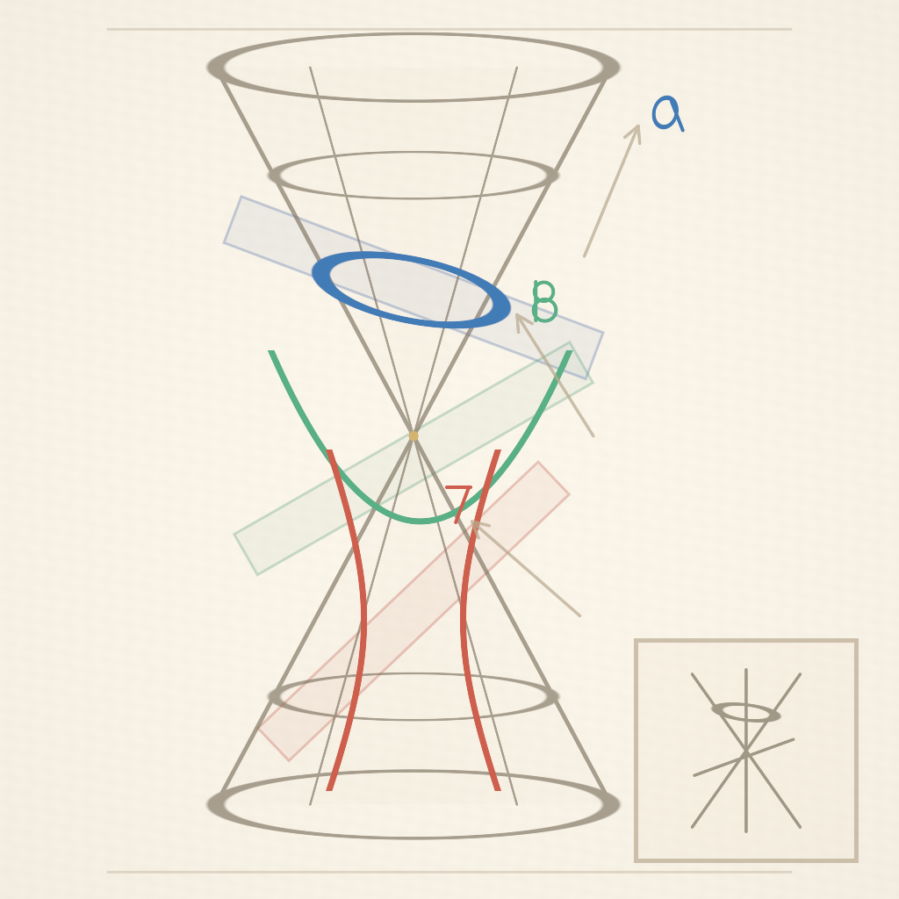

---

### Test 4: Archimedean Spiral Galaxy

**Test ID:** `004_archimedean_spiral_galaxy`
**Shader Files:** shader.wgsl
**Execution Status:** ✅ Success
**Image Generated:** ✅ Yes
**Judge Scores:** ✅ Available

#### Problem Prompt

> **Objective** – Render a face‑on **two‑arm** spiral galaxy whose stellar arms follow the *Archimedean* law $r = a\theta$.
>
> **Star‑field specification**
>
> * **Spiral parameters** $a = 0.25$ (units: galaxy‐normed).  Two arms offset by $\pi$. θ spans [0, 8π] (four full turns).
> * **Star sampling** – generate 120 000 stars:
>
>   * Draw θ uniformly; compute arm centre $r=a\theta$.
>   * Tangential spread: add Gaussian offset Δθ ~ $\mathcal N(0,\sigma_{θ}^{2})$ with $\sigma_{θ}=0.035$.
>   * Radial blur: Gaussian offset Δr ~ $\mathcal N(0,\sigma_{r}^{2})$, where $\sigma_{r}=0.025(1+0.5θ)$.
>   * **Radial density fall‑off** weight $w = \exp(-r/3)$; keep star if $u<w$ where $u\sim U(0,1)$.
> * **Background** – 10 000 disc‑halo stars: radius sampled $p(r)\propto r\,e^{-r/3}$ up to $r=10$; angle uniform; small white dots.
>
> **Colour & magnitude**
>
> * Star colour temperature $T(r)=7200-250r\;\text{K}$; convert to sRGB with black‑body approximation.
> * Star brightness proportional to $e^{-0.5r}$ (clipped).  Render each star as Gaussian sprite of FWHM = 0.03 + 0.004 r.
>
> **Canvas & camera**
>
> * Orthographic view of square region r ≤ 10.  Resolution 3000 × 3000 px, black background.
> * Supernova‑like core glow: add additive circular bloom (radius 0.4, colour #ffffaa, opacity 0.6).
>
> **Deliverable** – 16‑bit PNG.

#### Judge Scores

| Category | Score |
|----------|-------|
| Mathematical Accuracy | 78/100 |
| Visual Quality | 88/100 |
| Color Implementation | 72/100 |
| Geometric Completeness | 80/100 |
| Reference Elements | 76/100 |
| **Total** | **394/500** |
| **Average** | **78.8/100** |


#### Rendered Output

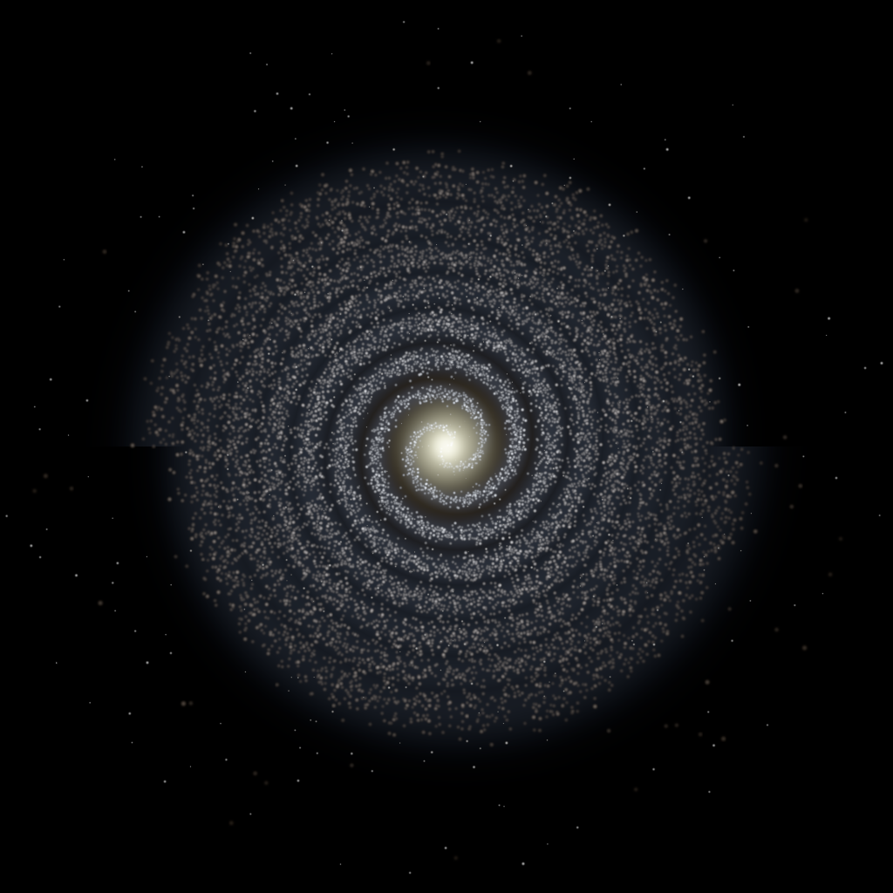

---

### Test 5: Archimedes Spiral

**Test ID:** `005_archimedes_spiral`
**Shader Files:** shader.wgsl
**Execution Status:** ✅ Success
**Image Generated:** ✅ Yes
**Judge Scores:** ✅ Available

#### Problem Prompt

> **Objective**
> Create a shader visualization of Archimedes' Spiral with his original geometric properties and applications, including the trisection of angles and squaring of the circle, as discovered in ancient Syracuse circa 225 BCE.
>
> **Historical Context**
> Archimedes of Syracuse (c. 287-212 BCE) discovered this spiral while investigating uniform motion along a rotating ray. His work "On Spirals" contains 28 propositions about this curve, including methods for trisecting angles and finding areas. The spiral r = aθ represents one of the earliest examples of a curve defined by a relationship between radius and angle.
>
> **Mathematical Specification**
>
> 1. **The Archimedean Spiral**
>    - Primary spiral: r = θ/π for θ ∈ [0, 8π] (4 complete turns)
>    - Show uniform spacing between turns (key property)
>    - Animate the generation: point moving outward at constant speed while ray rotates uniformly
>
> 2. **Historical Applications Visualization**
>
>    **A. Angle Trisection**
>    - Given angle AOB = 60°
>    - Draw arc from O intersecting OB at point C
>    - Find point P on spiral where OP = (1/3)OC
>    - Show that angle AOP = 20° (exactly 1/3 of 60°)
>    - Highlight construction with golden lines
>
>    **B. Squaring the Circle (First Turn)**
>    - Show that area inside first turn equals πr²/3
>    - Visualize Archimedes' exhaustion method:
>      * Inscribed polygons of 6, 12, 24, 48 sides
>      * Color gradient showing convergence to exact area
>
>    **C. Tangent Properties**
>    - At point P(r,θ), show tangent line
>    - Display angle ψ between tangent and radius vector
>    - Show Archimedes' result: tan(ψ) = r/a
>
> 3. **Ancient Greek Styling**
>    - Background: Aged papyrus texture (#F5E6D3)
>    - Spiral in deep blue ink (#1E3263)
>    - Construction lines in faded red (#8B4513)
>    - Greek annotations: use actual Greek letters (α, β, γ, θ, π)
>    - Add water damage and aging effects to edges
>
> 4. **Geometric Annotations**
>    - Label key points with Greek letters
>    - Show measurement marks along spiral
>    - Include Archimedes' original notations where known
>    - Add small diagrams showing:
>      * Uniform motion principle
>      * Area calculation method
>
> 5. **Rendering Requirements**
>    - Use compass-and-straightedge construction aesthetic
>    - Show construction marks and compass arc traces
>    - Include Archimedes' portrait medallion in corner
>    - Subtle animation of spiral generation (7 seconds)
>    - Resolution: 1600×1600 pixels
>
> **Educational Goals**
> - Demonstrate Archimedes' genius in discovering spiral properties
> - Show practical applications to classical problems
> - Visualize the exhaustion method preceding calculus by 2000 years
> - Connect ancient Greek mathematics to modern polar coordinates
>
> **Deliverable**
> A shader that brings Archimedes' original spiral investigations to life, showing both the mathematical beauty and practical applications that made this one of antiquity's great mathematical discoveries.

#### Judge Scores

| Category | Score |
|----------|-------|
| Mathematical Accuracy | 66/100 |
| Visual Quality | 86/100 |
| Color Implementation | 55/100 |
| Geometric Completeness | 79/100 |
| Reference Elements | 60/100 |
| **Total** | **346/500** |
| **Average** | **69.2/100** |


#### Rendered Output

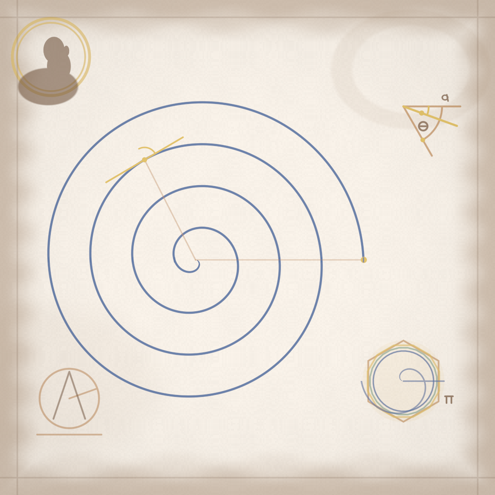

---

### Test 6: Barbell Dumbbell Shape

**Test ID:** `006_barbell_dumbbell_shape`
**Shader Files:** shader.wgsl
**Execution Status:** ✅ Success
**Image Generated:** ✅ Yes
**Judge Scores:** ✅ Available

#### Problem Prompt

> **Objective**
> Generate a high-quality visualization of a barbell (dumbbell) shape consisting of two spheres connected by a cylindrical shaft. The shape should be rendered with realistic materials and lighting.
>
> **Mathematical Specification**
>
> 1. **Geometric Components**
>    - Two identical spheres:
>      * Radius: 0.8 units
>      * Centers at: (-2.5, 0, 0) and (2.5, 0, 0)
>    - Connecting cylinder:
>      * Radius: 0.3 units
>      * Axis aligned with x-axis
>      * Extends from x = -1.7 to x = 1.7
>      * Smoothly blended with spheres at junction points
>
> 2. **Smooth Blending**
>    - Use smooth minimum (smin) function for seamless transitions:
>      * smin(d1, d2, k) = -log(exp(-k*d1) + exp(-k*d2))/k
>      * Blending factor k = 2.0
>    - Apply blending at cylinder-sphere junctions
>
> 3. **Material Properties**
>    - Metallic appearance:
>      * Base color: RGB(0.7, 0.7, 0.8)
>      * Metalness: 0.9
>      * Roughness: 0.2
>    - Different materials for spheres vs cylinder:
>      * Spheres: Polished chrome finish
>      * Cylinder: Brushed metal texture
>
> 4. **Scene Setup**
>    - Position: Centered at origin
>    - Rotation:
>      * Initial tilt: 15° around z-axis
>      * Continuous rotation: 1 revolution per 6 seconds around y-axis
>    - Camera: Positioned at (4, 3, 5) looking at origin
>
> 5. **Lighting Configuration**
>    - Primary light: Directional from (1, 2, 1), intensity 0.8
>    - Fill light: Point light at (-3, 1, 2), intensity 0.4
>    - Rim light: Directional from (-1, 0, -1), intensity 0.3
>    - Environment: Simple gradient sky (light grey to white)
>
> 6. **Rendering Details**
>    - Use physically based rendering (PBR) model
>    - Enable reflections on metallic surfaces
>    - Soft shadows with penumbra
>    - Output resolution: 1600 × 1600 pixels
>    - Antialiasing: 8× MSAA
>    - Background: Subtle radial gradient (RGB(0.9, 0.9, 0.95) to RGB(1, 1, 1))
>
> Deliverable: Outputs a single image.

#### Judge Scores

| Category | Score |
|----------|-------|
| Mathematical Accuracy | 82/100 |
| Visual Quality | 84/100 |
| Color Implementation | 80/100 |
| Geometric Completeness | 76/100 |
| Reference Elements | 82/100 |
| **Total** | **404/500** |
| **Average** | **80.8/100** |


#### Rendered Output

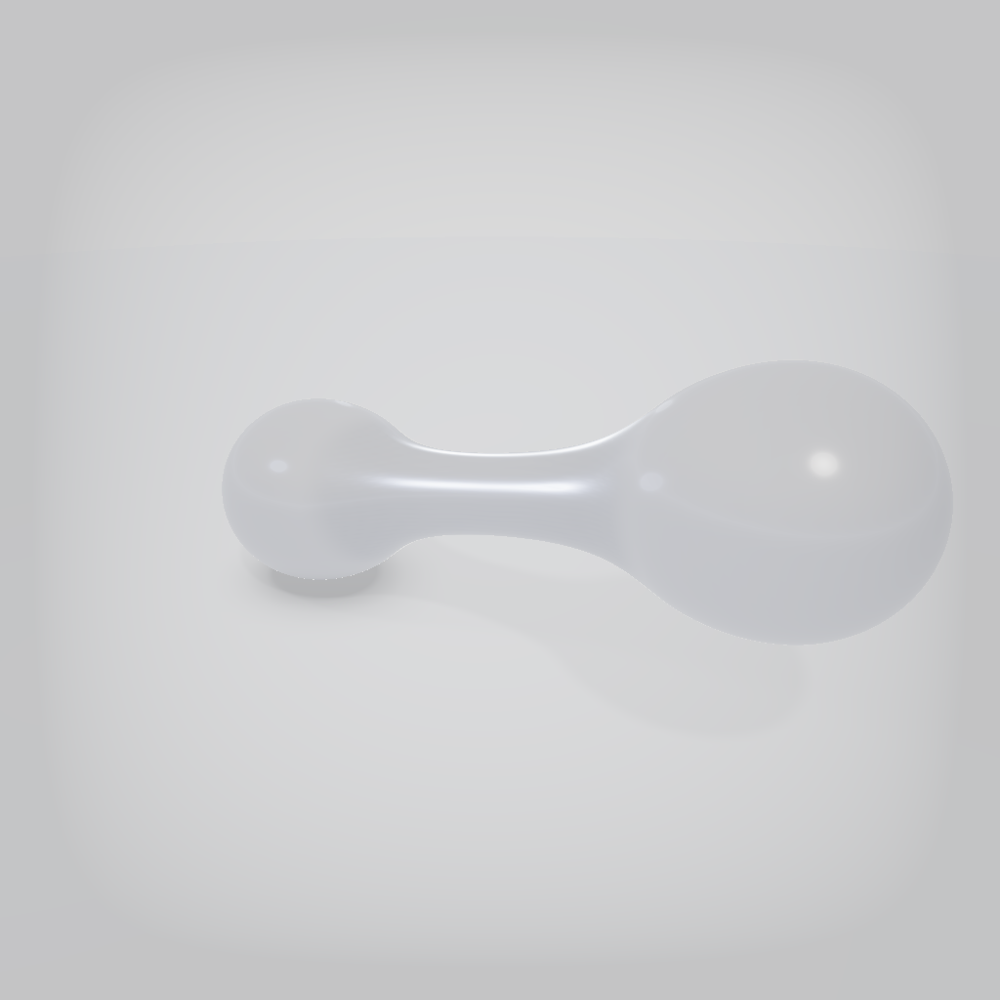

---

### Test 7: Binary Tree Fractal

**Test ID:** `007_binary_tree_fractal`
**Shader Files:** shader.wgsl
**Execution Status:** ✅ Success
**Image Generated:** ✅ Yes
**Judge Scores:** ✅ Available

#### Problem Prompt

> Grow an organic winter tree suspended in empty space—trunk straight upward, two children per branch, no leaves. Lighting should emphasise delicate twig silhouettes.
>
> Recursive geometry:
> - Trunk segment length = 1, radius = 0.08
> - Each branch splits into two at a 45° angle from parent direction, rotated ±35° about parent axis to avoid planar look
> - Length scale factor 0.7; radius factor 0.6
> - Depth 7 (level 0 trunk → level 7 twigs). Expected segments 2⁷-1 = 127
>
> Implementation notes:
> - Represent branches as tapered cylinders; smooth-join with spherically-blended joints
> - Material – dark-bark (#4b3726), roughness 0.7
>
> Scene & camera:
> - Camera (3,-6,2.5) aiming at origin; FOV 40°
> - Three-point lights: key (3,-5,5), fill (-2,-6,4) 40%, rim (0,0,6) 30%
> - Background gradient sky (zenith #d7ecff → horizon #ffffff)
>
> File: 2400×2400
> Deliverable: Outputs a single image.

#### Judge Scores

| Category | Score |
|----------|-------|
| Mathematical Accuracy | 86/100 |
| Visual Quality | 72/100 |
| Color Implementation | 90/100 |
| Geometric Completeness | 66/100 |
| Reference Elements | 84/100 |
| **Total** | **398/500** |
| **Average** | **79.6/100** |


#### Rendered Output

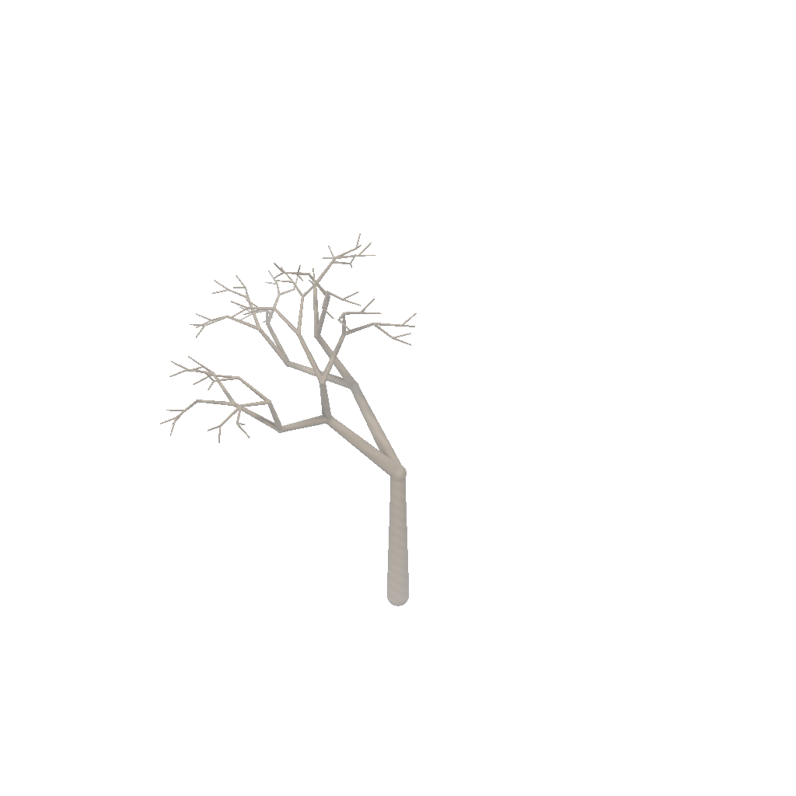

---

### Test 8: Brahmagupta Cyclic Quadrilaterals

**Test ID:** `008_brahmagupta_cyclic_quadrilaterals`
**Shader Files:** shader.wgsl
**Execution Status:** ✅ Success
**Image Generated:** ✅ Yes
**Judge Scores:** ✅ Available

#### Problem Prompt

> Create a single-file HTML shader that visualizes Brahmagupta's Cyclic Quadrilaterals and his formula for their area. The visualization should:
>
> 1. Display a cyclic quadrilateral inscribed in a circle
> 2. Animate the quadrilateral vertices moving along the circle while maintaining the cyclic property
> 3. Calculate and display the area using Brahmagupta's formula:
>    - Area = √[(s-a)(s-b)(s-c)(s-d)]
>    - Where s = (a+b+c+d)/2 (semiperimeter)
>    - And a, b, c, d are the side lengths
> 4. Show real-time updates of:
>    - Side lengths (a, b, c, d)
>    - Semiperimeter (s)
>    - Area calculation
> 5. Demonstrate that the formula works for any cyclic quadrilateral configuration
> 6. Include special cases:
>    - Square (maximum area for given perimeter)
>    - Rectangle
>    - Irregular cyclic quadrilateral
> 7. Canvas size should be 2000×2000 pixels
> 8. Use color coding for sides and corresponding values in the formula
> 9. Add smooth transitions between different quadrilateral configurations
> 10. Include Ptolemy's theorem visualization as a bonus (ac + bd = ef for diagonals e, f)
>
> The implementation should be a complete, self-contained HTML file with embedded WebGL shader code. The visualization should elegantly demonstrate this beautiful result from ancient Indian mathematics.

#### Judge Scores

| Category | Score |
|----------|-------|
| Mathematical Accuracy | 78/100 |
| Visual Quality | 88/100 |
| Color Implementation | 84/100 |
| Geometric Completeness | 82/100 |
| Reference Elements | 76/100 |
| **Total** | **408/500** |
| **Average** | **81.6/100** |


#### Rendered Output

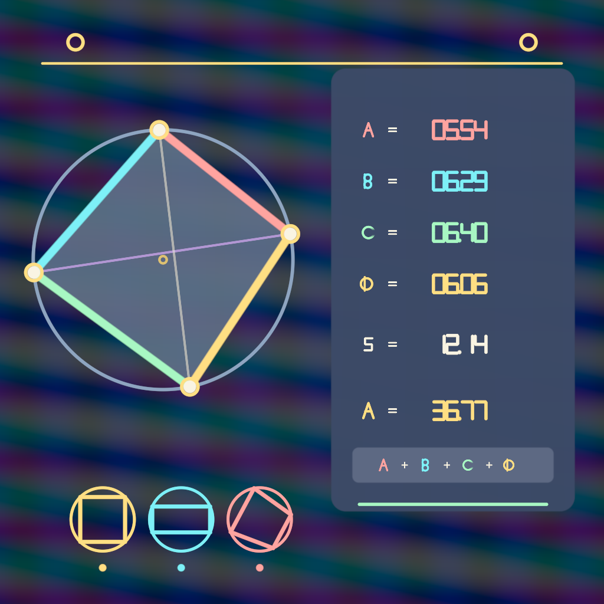

---

### Test 9: Braid Word Reduction Ribbons

**Test ID:** `009_braid_word_reduction_ribbons`
**Shader Files:** shader.wgsl
**Execution Status:** ✅ Success
**Image Generated:** ✅ Yes
**Judge Scores:** ✅ Available

#### Problem Prompt

> **Objective**
> Produce a single high-resolution image visualizing braid-group word reduction as physical ribbon tightening. The scene should show a nontrivial braid word on three ribbons reducing to the identity braid via the Artin relation and cancellation.
>
> **Mathematical specification**
> 1. Braid group: use `B_3` with generators `σ1` and `σ2`.
> 2. Word to visualize:
>    `w = σ1 σ2 σ1 σ2^{-1} σ1^{-1} σ2^{-1}`.
> 3. Reduction identity: use the braid relation `σ1 σ2 σ1 = σ2 σ1 σ2`, so
>    `w = σ2 σ1 σ2 σ2^{-1} σ1^{-1} σ2^{-1} = identity`.
> 4. Render three vertical ribbons/strands. Initial endpoint order at the top and bottom should be the same, confirming the identity braid after reduction.
> 5. Crossing convention:
>    - `σi` means strand `i` crosses over strand `i+1`.
>    - `σi^{-1}` means strand `i` crosses under strand `i+1`.
> 6. Static layout: show three stages left to right:
>    - left: the original six-crossing word `w`, with all crossings visible in order from top to bottom;
>    - center: the relation/cancellation stage, with `σ1σ2σ1 → σ2σ1σ2` indicated by ghost arrows or faded duplicate strands;
>    - right: the tightened identity braid as three straight parallel ribbons.
>
> **Geometry to render**
> - Use ribbons, not just thin lines: each strand should have finite width and slight twist/shading.
> - Strand colors: red, green, and blue, consistent across all three stages.
> - Crossings should show clear over/under ordering using depth, shadow, and small gaps.
> - Add small crossing labels or colored tick marks for the six symbols if text is supported; otherwise use plus/minus crossing markers.
>
> **Rendering style**
> - White background.
> - Ribbons should be glossy or satin-like, with soft shadows.
> - Use anti-aliasing and smooth Bezier-like curves.
> - Keep the three stages visually separated but aligned horizontally.
>
> **Composition / overlays**
> - Add a subtle horizontal arrow from left to center and center to right to show reduction flow.
> - Add top and bottom endpoint dots for the three strands in each stage.
> - The rightmost identity braid should clearly have no crossings.
>
> **Technical specs**
> - Resolution at least `1600 × 1600` pixels.
> - Static frame only; no animation.
> - Output format: PNG.
>
> **Deliverable** A single PNG image satisfying the above.

#### Judge Scores

| Category | Score |
|----------|-------|
| Mathematical Accuracy | 88/100 |
| Visual Quality | 91/100 |
| Color Implementation | 86/100 |
| Geometric Completeness | 90/100 |
| Reference Elements | 94/100 |
| **Total** | **449/500** |
| **Average** | **89.8/100** |


#### Rendered Output

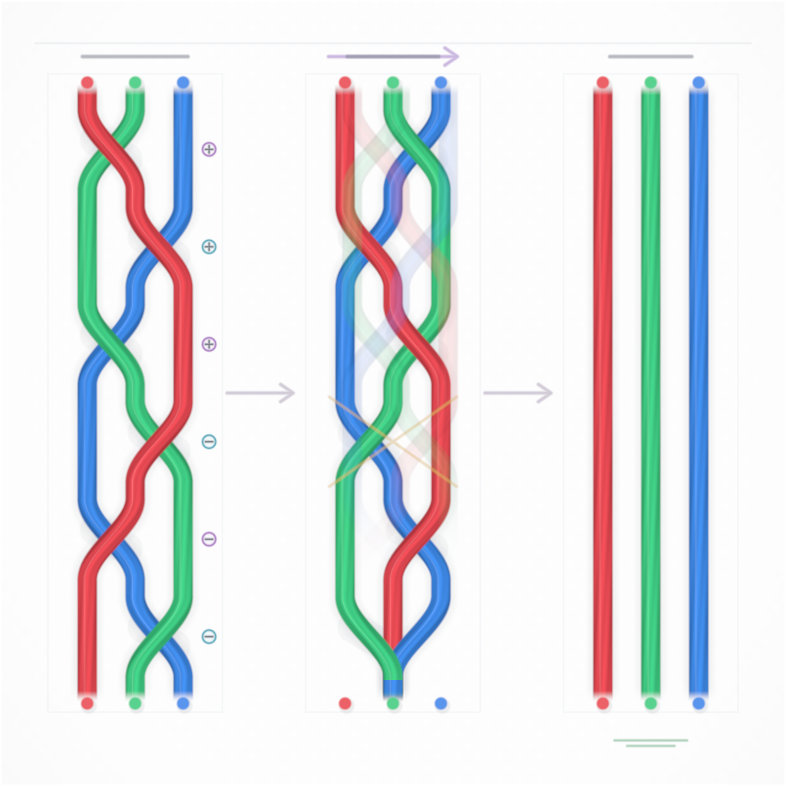

---

### Test 10: Braided Rope

**Test ID:** `010_braided_rope`
**Shader Files:** shader.wgsl
**Execution Status:** ✅ Success
**Image Generated:** ✅ Yes
**Judge Scores:** ✅ Available

#### Problem Prompt

> **Objective**
> Create a three-strand braided rope using helical geometry with proper phase relationships.
>
> **Geometry**
> Three helices on cylinder radius 0.6, pitch 1.8, phase offsets 0, 120°, 240°. Tube radius 0.15.
>
> **Styling**
> Colour strands #c96, #6c9, #96c. Cylinder core hidden. Camera (3,2,2). 2000×1800 PNG.
>
> **Deliverable** PNG.

#### Judge Scores

| Category | Score |
|----------|-------|
| Mathematical Accuracy | 78/100 |
| Visual Quality | 78/100 |
| Color Implementation | 86/100 |
| Geometric Completeness | 70/100 |
| Reference Elements | 74/100 |
| **Total** | **386/500** |
| **Average** | **77.2/100** |


#### Rendered Output

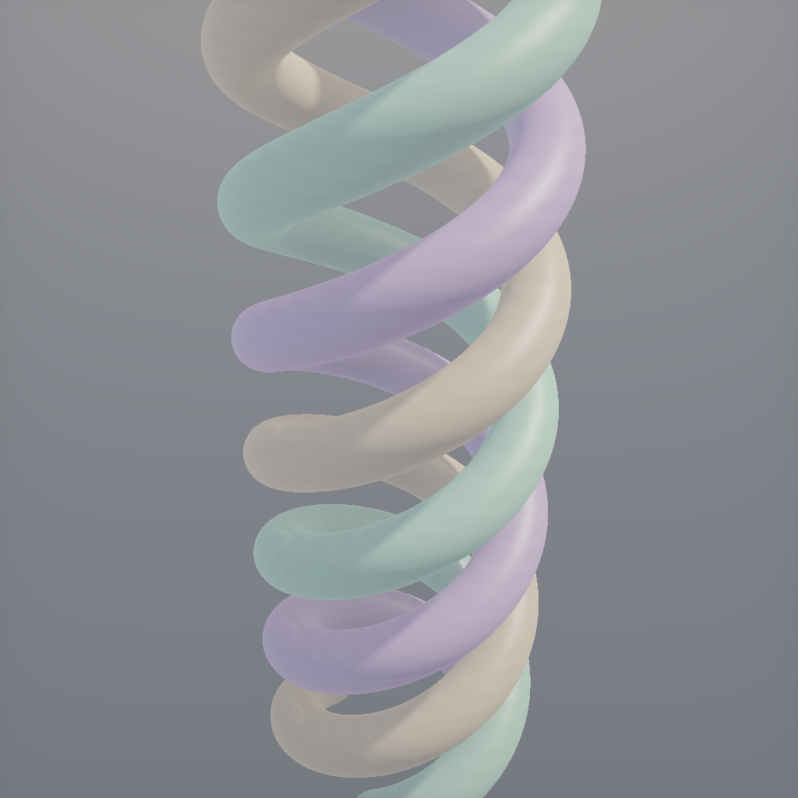

---

### Test 11: Butterfly Curve

**Test ID:** `011_butterfly_curve`
**Shader Files:** shader.wgsl
**Execution Status:** ✅ Success
**Image Generated:** ✅ Yes
**Judge Scores:** ✅ Available

#### Problem Prompt

> # Butterfly Curve
>
> Create an animated WebGL visualization of the transcendental butterfly curve with color gradients that emphasize its wing-like structure.
>
> ## Requirements:
>
> 1. Implement the butterfly curve equation:
>    - x = sin(t) * (e^cos(t) - 2*cos(4t) - sin(t/12)^5)
>    - y = cos(t) * (e^cos(t) - 2*cos(4t) - sin(t/12)^5)
> 2. Animate the curve drawing from t=0 to t=12π
> 3. Apply a color gradient that changes based on:
>    - The angle from center
>    - The distance from center
>    - Creating a butterfly wing effect
> 4. Add particle effects that follow the curve path
> 5. Implement a subtle glow effect on the curve
> 6. Include smooth camera zoom that reveals the full pattern
> 7. Add a complementary animated background

#### Judge Scores

| Category | Score |
|----------|-------|
| Mathematical Accuracy | 88/100 |
| Visual Quality | 91/100 |
| Color Implementation | 92/100 |
| Geometric Completeness | 84/100 |
| Reference Elements | 87/100 |
| **Total** | **442/500** |
| **Average** | **88.4/100** |


#### Rendered Output

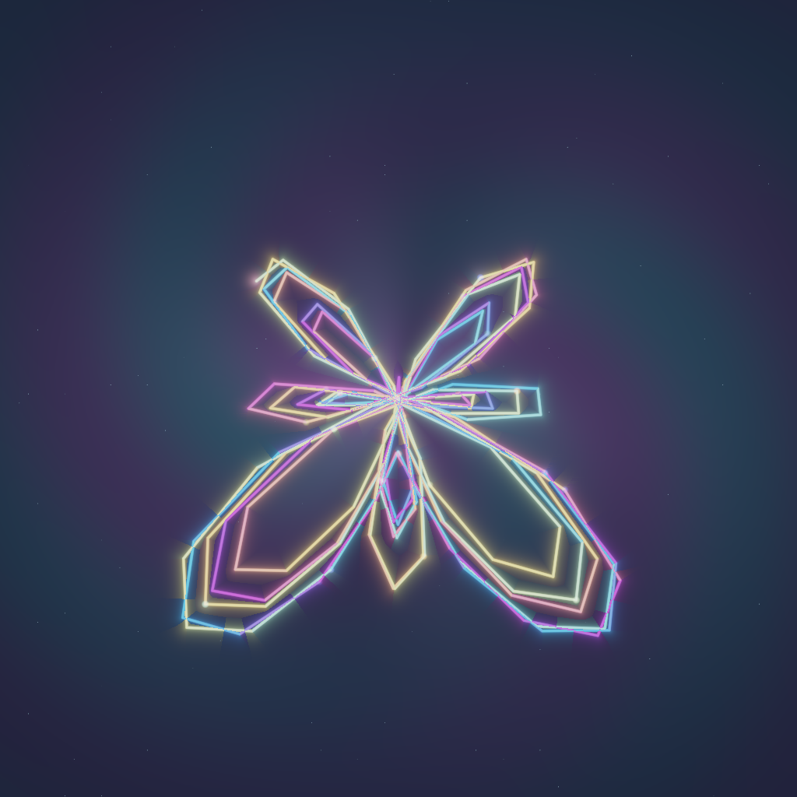

---

### Test 12: Calabi Yau Manifold

**Test ID:** `012_calabi_yau_manifold`
**Shader Files:** shader.wgsl
**Execution Status:** ✅ Success
**Image Generated:** ✅ Yes
**Judge Scores:** ✅ Available

#### Problem Prompt

> **Objective**
> Display the real 3‑D isosurface
>
> $
>   \Re\!\Bigl(\sum_{i=0}^{4}z_i^{5}-5\psi\prod_{i=0}^{4}z_i\Bigr)=0
> $
>
> under the constraint $\sum_{i=0}^{4}|z_i|^{2}=1$ (the quintic CY), intersected with the hyperplane $z_{3}=z_{4}=0$, for $\psi=0.4$. Map $(z_{0},z_{1},z_{2})$ to $\mathbb R^{3}$ via stereographic projection.
>
> **Numerics**
>
> * Sample 400³ grid on cube $[-1.5,1.5]^{3}$.
> * Use marching cubes at isovalue 0 with linear interpolation.
>
> **Styling**
>
> * Colour by vertex normal: n·(0.3,0.7,0.6) mapped to viridis palette.
> * Add subsurface‐scattering fake: ambient 0.3 + diffuse 0.5 + specular 0.2 (shininess 128).
> * Camera (4,4,4) → origin, FOV 35°.  Background #001018.
> * 2600 × 2600 px PNG, 4× SSAA.
>
> **Deliverable** PNG.

#### Judge Scores

| Category | Score |
|----------|-------|
| Mathematical Accuracy | 42/100 |
| Visual Quality | 78/100 |
| Color Implementation | 31/100 |
| Geometric Completeness | 72/100 |
| Reference Elements | 35/100 |
| **Total** | **258/500** |
| **Average** | **51.6/100** |


#### Rendered Output

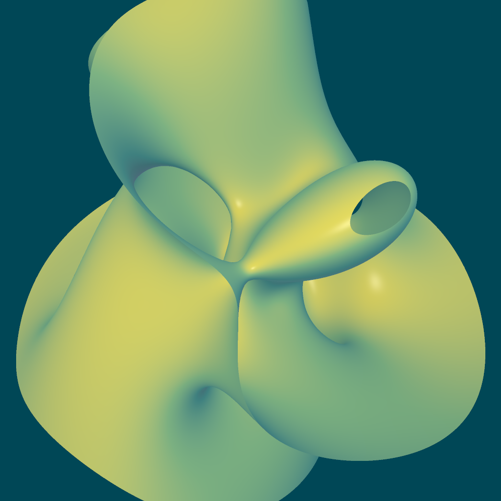

---

### Test 13: Capsule Shape

**Test ID:** `013_capsule_shape`
**Shader Files:** shader.wgsl
**Execution Status:** ✅ Success
**Image Generated:** ✅ Yes
**Judge Scores:** ✅ Available

#### Problem Prompt

> Create a 3D capsule shape (cylinder with hemispherical caps) with height 3.0 and radius 0.8, oriented vertically. Material: semi-glossy porcelain white with subtle blue undertones. Lighting: three-point setup with rim light. Background: dark gradient. Camera: slight low angle to emphasize height.
>
> Outputs a single image.

#### Judge Scores

| Category | Score |
|----------|-------|
| Mathematical Accuracy | 72/100 |
| Visual Quality | 86/100 |
| Color Implementation | 62/100 |
| Geometric Completeness | 82/100 |
| Reference Elements | 78/100 |
| **Total** | **380/500** |
| **Average** | **76.0/100** |


#### Rendered Output

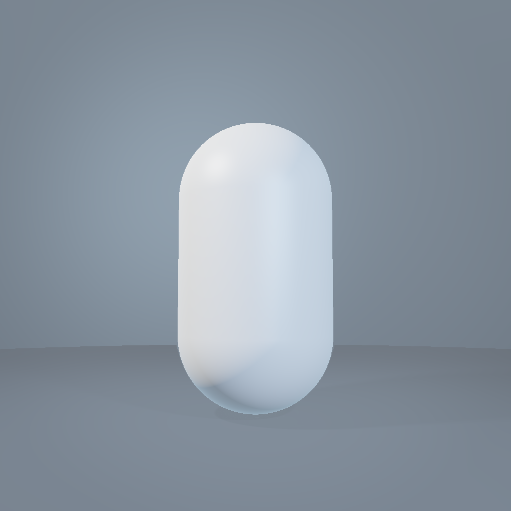

---

### Test 14: Cardioid Limacon Collection

**Test ID:** `014_cardioid_limacon_collection`
**Shader Files:** shader.wgsl
**Execution Status:** ✅ Success
**Image Generated:** ✅ Yes
**Judge Scores:** ✅ Available

#### Problem Prompt

> # Cardioid and Limaçon Collection
>
> Create a WebGL visualization showcasing various members of the limaçon family, including the special case of the cardioid, with interactive parameter control.
>
> ## Requirements:
>
> 1. Implement the general limaçon equation: r = a + b*cos(θ)
> 2. Display multiple curves showing:
>    - Cardioid (a = b)
>    - Limaçon with inner loop (a < b)
>    - Dimpled limaçon (a > b but a < 2b)
>    - Convex limaçon (a ≥ 2b)
> 3. Use different colors for each curve type
> 4. Add animated parameter transitions showing how curves morph between types
> 5. Include a subtle grid or polar coordinate system for reference
> 6. Implement smooth curve rendering with appropriate sampling
> 7. Add labels or legends identifying each curve type

#### Judge Scores

| Category | Score |
|----------|-------|
| Mathematical Accuracy | 86/100 |
| Visual Quality | 91/100 |
| Color Implementation | 82/100 |
| Geometric Completeness | 90/100 |
| Reference Elements | 84/100 |
| **Total** | **433/500** |
| **Average** | **86.6/100** |


#### Rendered Output

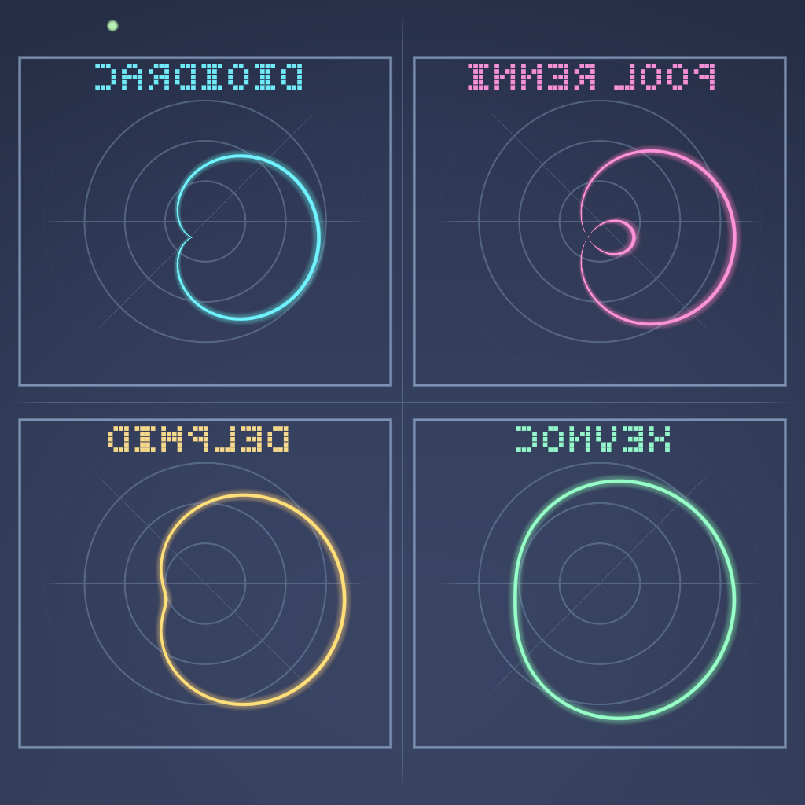

---

### Test 15: Catenoid Helicoid Minimal

**Test ID:** `015_catenoid_helicoid_minimal`
**Shader Files:** shader.wgsl
**Execution Status:** ✅ Success
**Image Generated:** ✅ Yes
**Judge Scores:** ✅ Available

#### Problem Prompt

> # Catenoid-Helicoid Minimal Surface
>
> Create an animated transformation between a catenoid and helicoid, showcasing the unique property that they are locally isometric minimal surfaces.
>
> ## Requirements:
>
> 1. Implement the parametric transformation:
>    - x = cos(θ) * sinh(v) * sin(u) + sin(θ) * cosh(v) * cos(u)
>    - y = -cos(θ) * sinh(v) * cos(u) + sin(θ) * cosh(v) * sin(u)
>    - z = u * cos(θ) + v * sin(θ)
>    Where θ varies from 0 (helicoid) to π/2 (catenoid)
> 2. Use a soap bubble-like material with:
>    - Thin film interference colors
>    - Transparency
>    - Reflective properties
> 3. Animate smooth transformation between surfaces
> 4. Add wireframe overlay to show surface structure
> 5. Implement proper two-sided rendering
> 6. Include ambient particles to show air flow
> 7. Create a minimalist background that doesn't distract

#### Judge Scores

| Category | Score |
|----------|-------|
| Mathematical Accuracy | 78/100 |
| Visual Quality | 76/100 |
| Color Implementation | 83/100 |
| Geometric Completeness | 68/100 |
| Reference Elements | 74/100 |
| **Total** | **379/500** |
| **Average** | **75.8/100** |


#### Rendered Output

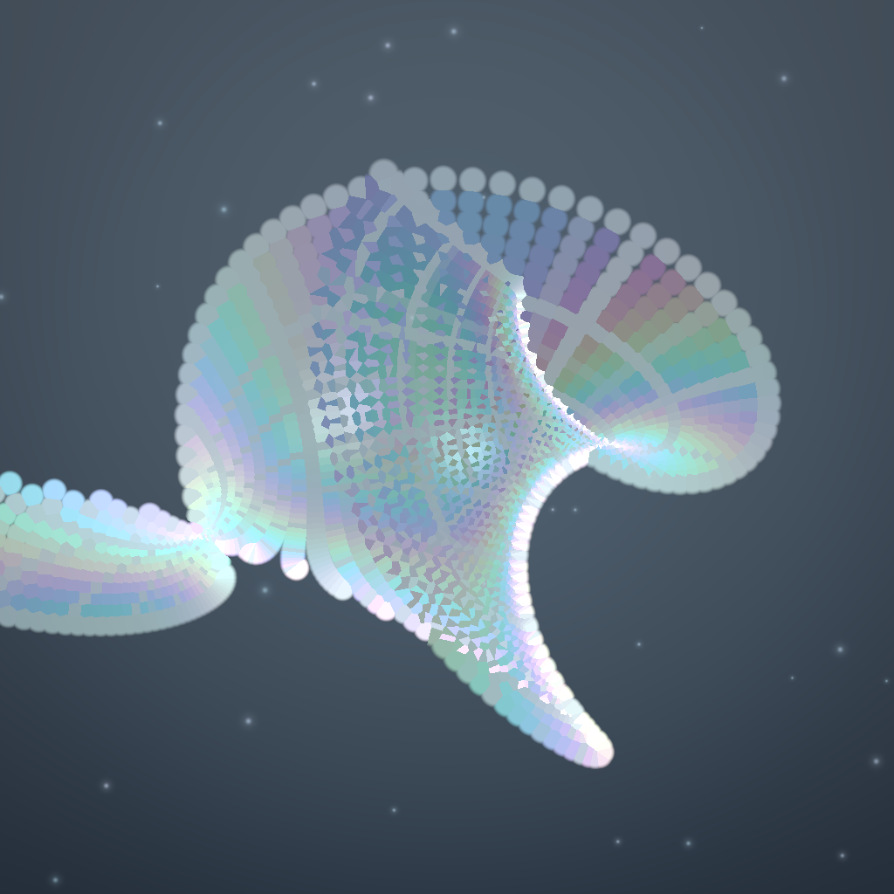

---

### Test 16: Cellular Potts Tissue Folding

**Test ID:** `016_cellular_potts_tissue_folding`
**Shader Files:** shader.wgsl
**Execution Status:** ✅ Success
**Image Generated:** ✅ Yes
**Judge Scores:** ✅ Available

#### Problem Prompt

> **Objective**
> Produce a single high-resolution PNG visualising a Cellular-Potts-style epithelial tissue sheet undergoing a fold. The image should show individual cells, apical constriction near the fold hinge, lineage colors, boundary tension, and highlighted neighbour-exchange events.
>
> **Mathematical specification**
> Use a hexagonal sheet of approximately \(34\times28\) cells. Cell centers are arranged in a staggered grid:
> \[
> \tilde x_{ij}=i+0.5(j\bmod2),\qquad \tilde y_{ij}=0.866j,
> \]
> for \(i=0,\ldots,33\), \(j=0,\ldots,27\), then linearly rescale to
> \[
> x\in[-1.4,1.4],\qquad y\in[-1.1,1.1].
> \]
> Map the sheet to a folded surface with height
> \[
> z(x,y)=0.55\exp\left[-{(y+0.18)^2\over0.025}\right](1-0.15x^2)
> -0.30\exp\left[-{(y-0.45)^2\over0.055}\right]
> +0.08\sin(3\pi x)\sin(\pi y).
> \]
> The main fold hinge is near \(y=-0.18\).
>
> Cellular-Potts-style visual quantities:
> - Apical area scale:
>   \[
>   a(x,y)=1-0.45\exp\left[-{(y+0.18)^2\over0.035}\right].
>   \]
>   Cells near the hinge should appear smaller/narrower, representing apical constriction.
> - Boundary tension is higher near clone/type boundaries and near the hinge. Draw hinge-region cell borders thicker/darker.
> - Use four lineage clone fields seeded at approximately \((-0.9,-0.5),(0.8,-0.4),(-0.7,0.55),(0.7,0.65)\). Color each cell by nearest seed, with mild within-clone variation.
> - Highlight 8 neighbour-exchange / T1-like events along the hinge as small elongated diamond cells or red-white boundary swap glyphs.
>
> **Geometry to render**
> - Individual polygonal cells on the folded 3D sheet; each cell should have a visible boundary.
> - Cell centers should follow the folded surface, with polygon corners projected onto the same \(z(x,y)\) height field.
> - Hinge cells near \(y=-0.18\) should visibly constrict apically relative to surrounding cells.
> - Add arrows pointing inward toward the hinge to show apical constriction forces.
> - Add a side cross-section inset showing the \(y\)-\(z\) fold profile at \(x=0\), with the hinge marked.
> - Add a small legend for lineage clone colors and a marker for highlighted T1 events.
>
> **Rendering style**
> - Cells: softly shaded, semi-matte surfaces with thin dark boundaries.
> - Clone colors: four distinguishable pastel or saturated families; boundaries remain dark.
> - T1 events: red/white high-contrast glyphs, clearly localised along the hinge.
> - Force arrows: dark or bright depending on background, all pointing toward the hinge band.
> - Background: white or very light grey.
>
> **Composition / overlays**
> - Camera: oblique top-down perspective that reveals both the fold height and the cellular tiling.
> - The folded sheet should occupy most of the canvas.
> - Place the cross-section inset on the right and the clone legend along the bottom or in a corner.
> - Avoid excessive text; use color and glyphs to carry meaning.
>
> **Technical specs**
> - Resolution at least 1600×1600 px.
> - Static frame only; no animation.
>
> **Deliverable** A single PNG image satisfying the above.

#### Judge Scores

| Category | Score |
|----------|-------|
| Mathematical Accuracy | 78/100 |
| Visual Quality | 64/100 |
| Color Implementation | 76/100 |
| Geometric Completeness | 65/100 |
| Reference Elements | 82/100 |
| **Total** | **365/500** |
| **Average** | **73.0/100** |


#### Rendered Output

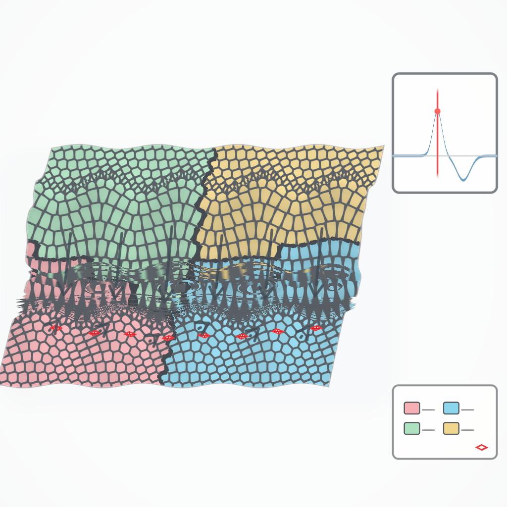

---

### Test 17: Chinese Remainder Sunzi

**Test ID:** `017_chinese_remainder_sunzi`
**Shader Files:** shader.wgsl
**Execution Status:** ✅ Success
**Image Generated:** ✅ Yes
**Judge Scores:** ✅ Available

#### Problem Prompt

> **Objective**
> Create a shader visualization of the Chinese Remainder Theorem as presented in Sunzi Suanjing (3rd-5th century CE), showing the ancient Chinese "Ta-yen" method for solving systems of modular equations, with visual connections to its modern applications in cryptography.
>
> **Historical Context**
> The Chinese Remainder Theorem appears in Sunzi Suanjing (Master Sun's Mathematical Manual) with the famous problem: "Find a number that leaves remainder 2 when divided by 3, remainder 3 when divided by 5, and remainder 2 when divided by 7." This method, refined over centuries by Chinese mathematicians, predates similar Western discoveries by over 1000 years.
>
> **Mathematical Specification**
>
> 1. **The Classic Problem Visualization**
>    Solve: x ≡ 2 (mod 3), x ≡ 3 (mod 5), x ≡ 2 (mod 7)
>    - Display three rotating circles representing moduli 3, 5, 7
>    - Mark positions 0,1,2 on the mod 3 circle
>    - Mark positions 0,1,2,3,4 on the mod 5 circle
>    - Mark positions 0,1,2,3,4,5,6 on the mod 7 circle
>    - Highlight the required remainders in red
>
> 2. **Ancient Chinese Solution Method**
>    Animate the "Da-yan" (Great Extension) algorithm:
>    - Find M = 3×5×7 = 105
>    - Calculate M₁ = 35, M₂ = 21, M₃ = 15
>    - Show inverse finding: 35×2 ≡ 1 (mod 3), etc.
>    - Build solution: x = 2×35×2 + 3×21×2 + 2×15×1
>    - Reveal answer: x ≡ 23 (mod 105)
>
> 3. **Visual Number Line**
>    - Display numbers 0-105 as a spiral
>    - Color code by remainders:
>      * Red tint for x ≡ 2 (mod 3)
>      * Blue tint for x ≡ 3 (mod 5)
>      * Green tint for x ≡ 2 (mod 7)
>    - Show convergence at x = 23 (all colors combine)
>
> 4. **Traditional Chinese Styling**
>    - Background: Rice paper texture (#FFF8DC)
>    - Ink brush stroke effects for circles
>    - Chinese numerals (一二三四五六七) alongside Arabic
>    - Traditional seal stamp with "孫子算經" (Sunzi Suanjing)
>    - Decorative cloud patterns in margins
>
> 5. **Modern Connection Visualization**
>    Show RSA encryption parallel:
>    - Mini-visualization of how CRT speeds up RSA decryption
>    - Split large modulus into coprime factors
>    - Parallel computation visualization
>    - Time comparison: direct vs CRT method
>
> 6. **Historical Annotations**
>    - Portrait of ancient Chinese mathematician
>    - Timeline: Sunzi (300s) → Qin Jiushao (1247) → Gauss (1801)
>    - Original problem text in classical Chinese
>    - Translation: "What number has these remainders?"
>
> **Rendering Requirements**
> - Smooth rotation of modular circles
> - Particle effects showing number flow
> - Calligraphy-style number rendering
> - Subtle animation of solution building
> - Resolution: 1600×1600 pixels
>
> **Educational Goals**
> - Honor ancient Chinese mathematical achievements
> - Show elegance of modular arithmetic visualization
> - Connect ancient wisdom to modern cryptography
> - Demonstrate cultural continuity in mathematics
>
> **Deliverable**
> A shader that brings the Chinese Remainder Theorem to life through beautiful visualization, showing how ancient Chinese mathematicians solved complex modular systems centuries before the rest of the world, rendered in traditional Chinese artistic style while demonstrating modern relevance.

#### Judge Scores

| Category | Score |
|----------|-------|
| Mathematical Accuracy | 55/100 |
| Visual Quality | 76/100 |
| Color Implementation | 48/100 |
| Geometric Completeness | 70/100 |
| Reference Elements | 52/100 |
| **Total** | **301/500** |
| **Average** | **60.2/100** |


#### Rendered Output

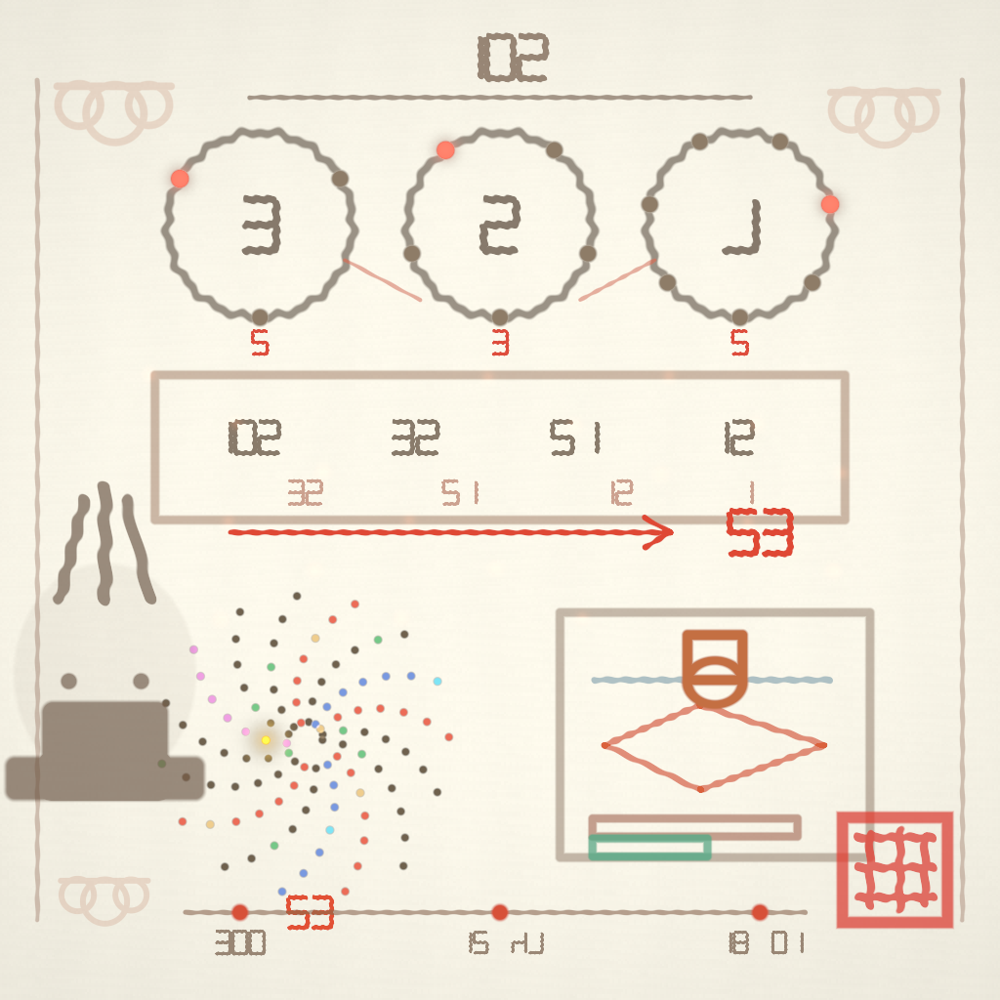

---

### Test 18: Chinese Remainder Theorem

**Test ID:** `018_chinese_remainder_theorem`
**Shader Files:** shader.wgsl
**Execution Status:** ✅ Success
**Image Generated:** ✅ Yes
**Judge Scores:** ✅ Available

#### Problem Prompt

> Create a single-file HTML shader that illustrates the Chinese Remainder Theorem through an interactive visualization. The visualization should:
>
> 1. Demonstrate the system of congruences:
>    - x ≡ 2 (mod 3)
>    - x ≡ 3 (mod 5)
>    - x ≡ 2 (mod 7)
> 2. Create three circular number lines (modular arithmetic wheels) for mod 3, 5, and 7
> 3. Animate a synchronized counter that highlights valid solutions
> 4. Show numbers 0-105 being tested, highlighting those that satisfy each congruence
> 5. When a number satisfies all three congruences (x = 23, 83), create a visual celebration:
>    - Pulse all three wheels
>    - Display the solution prominently
>    - Show the verification: 23 mod 3 = 2, 23 mod 5 = 3, 23 mod 7 = 2
> 6. Canvas size should be 2400×1600 pixels
> 7. Use distinct colors for each modular system
> 8. Include the theorem statement and solution method
> 9. Add smooth transitions and clear visual feedback
>
> The implementation should be a complete, self-contained HTML file with embedded WebGL shader code. The visualization should make the abstract concept of the Chinese Remainder Theorem concrete and understandable.

#### Judge Scores

| Category | Score |
|----------|-------|
| Mathematical Accuracy | 72/100 |
| Visual Quality | 86/100 |
| Color Implementation | 70/100 |
| Geometric Completeness | 82/100 |
| Reference Elements | 74/100 |
| **Total** | **384/500** |
| **Average** | **76.8/100** |


#### Rendered Output

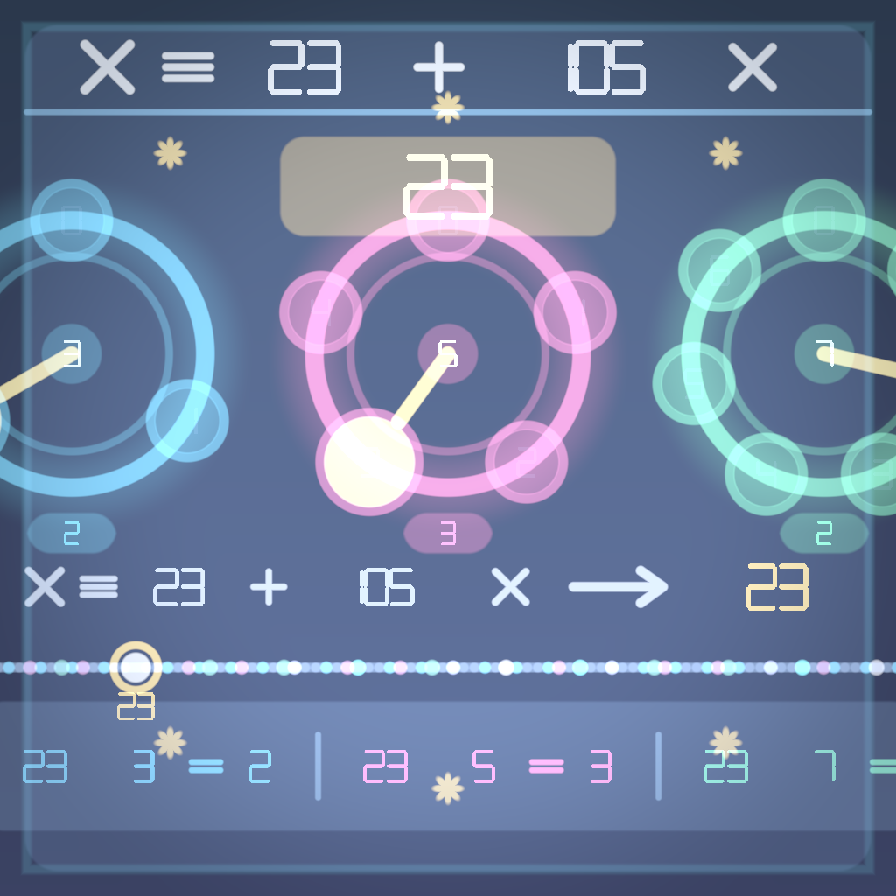

---

### Test 19: Chladni Patterns

**Test ID:** `019_chladni_patterns`
**Shader Files:** shader.wgsl
**Execution Status:** ✅ Success
**Image Generated:** ✅ Yes
**Judge Scores:** ✅ Available

#### Problem Prompt

> **Objective**
> Simulate Chladni patterns on a vibrating square plate, showing nodal lines where sand accumulates and the standing wave amplitude distribution.
>
> **Physics Model**
>
> $
> u(x,y,t) = A \sin\left(\frac{n\pi x}{L}\right) \sin\left(\frac{m\pi y}{L}\right) \cos(\omega t)
> $
>
> where $n=4, m=3$ (mode numbers), $L=2.0$ (plate size), $\omega = 2\pi f$ with $f = 440$ Hz.
>
> **Visualization**
>
> * Domain: $[-1, 1] \times [-1, 1]$ (centered square plate)
> * Compute amplitude at $t = 0$ (maximum displacement)
> * Color mapping:
>   - Nodal lines (|u| < 0.01): Sandy beige #D4A574
>   - Positive displacement: Blue gradient #0066CC to #00CCFF
>   - Negative displacement: Red gradient #CC0000 to #FF6666
> * Add particle simulation: 5000 sand grains migrating toward nodes
> * Particle color: #8B6F47 (dark sand)
>
> **Rendering**
>
> * Resolution: 2048 × 2048 px
> * Show plate boundary as thin black frame (5px)
> * Background: #F5F5DC (beige, like experimental setup)
> * Apply subtle 3D height mapping based on amplitude
> * Add soft shadows for depth perception
>
> **Deliverable** PNG showing clear Chladni pattern with (4,3) mode, visible nodal lines with sand accumulation.

#### Judge Scores

| Category | Score |
|----------|-------|
| Mathematical Accuracy | 84/100 |
| Visual Quality | 78/100 |
| Color Implementation | 88/100 |
| Geometric Completeness | 61/100 |
| Reference Elements | 79/100 |
| **Total** | **390/500** |
| **Average** | **78.0/100** |


#### Rendered Output

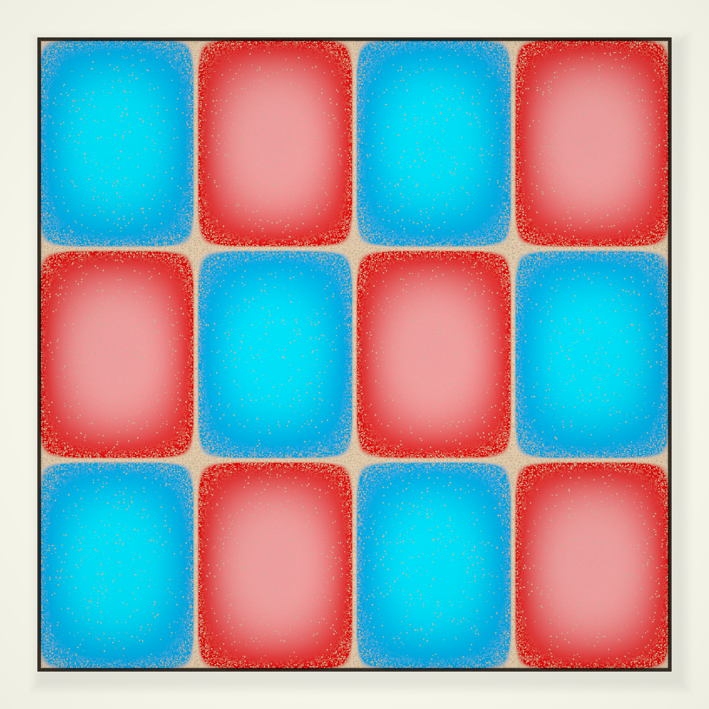

---

### Test 20: Complex Analysis Stained Glass

**Test ID:** `020_complex_analysis_stained_glass`
**Shader Files:** shader.wgsl
**Execution Status:** ✅ Success
**Image Generated:** ✅ Yes
**Judge Scores:** ✅ Available

#### Problem Prompt

> **Objective**
> Render **complex analysis** concepts as **illuminated stained glass windows**, where analytic functions create light patterns and singularities form glass structures.
>
> **Mathematical recipe**
>
> 1. Base function: f(z) = (z² - 1)/(z² + 1) with branch cuts
> 2. Domain coloring enhanced for stained glass:
>    - Magnitude |f(z)| determines glass opacity (dark → transparent)
>    - Argument arg(f(z)) sets hue via continuous color wheel
>    - Add lead came at |f(z)| = 2ⁿ contours (n integer)
> 3. Singularities become ornate rose windows:
>    - Simple poles: radial symmetry with n petals for order n
>    - Essential singularities: fractal Celtic knot patterns
>    - Branch points: spiral glass arrangements
> 4. Conformal mapping properties:
>    - Right angles preserved in lead came intersections
>    - Circles → circles visible in glass piece boundaries
> 5. Residue theorem: light intensity at poles proportional to residue
>
> **Styling**
>
> * Gothic cathedral window framework (pointed arch)
> * Realistic glass materials: varying thickness creates color depth
> * Lead came with aged patina and structural bolts
> * Sunlight from behind: caustics project function onto floor
> * Glass imperfections: bubbles, waves near singularities
> * Dust motes visible in light beams
> * Stone window frame with carved mathematical symbols
> * View from inside cathedral, darkened interior
> * Camera at (0, 0, -10), looking straight at window; FOV 40°
> * Resolution 2400 × 2400 px, ray-traced lighting
>
> **Deliverable** Single PNG showing complex function as stained glass masterpiece

#### Judge Scores

| Category | Score |
|----------|-------|
| Mathematical Accuracy | 82/100 |
| Visual Quality | 87/100 |
| Color Implementation | 78/100 |
| Geometric Completeness | 84/100 |
| Reference Elements | 90/100 |
| **Total** | **421/500** |
| **Average** | **84.2/100** |


#### Rendered Output

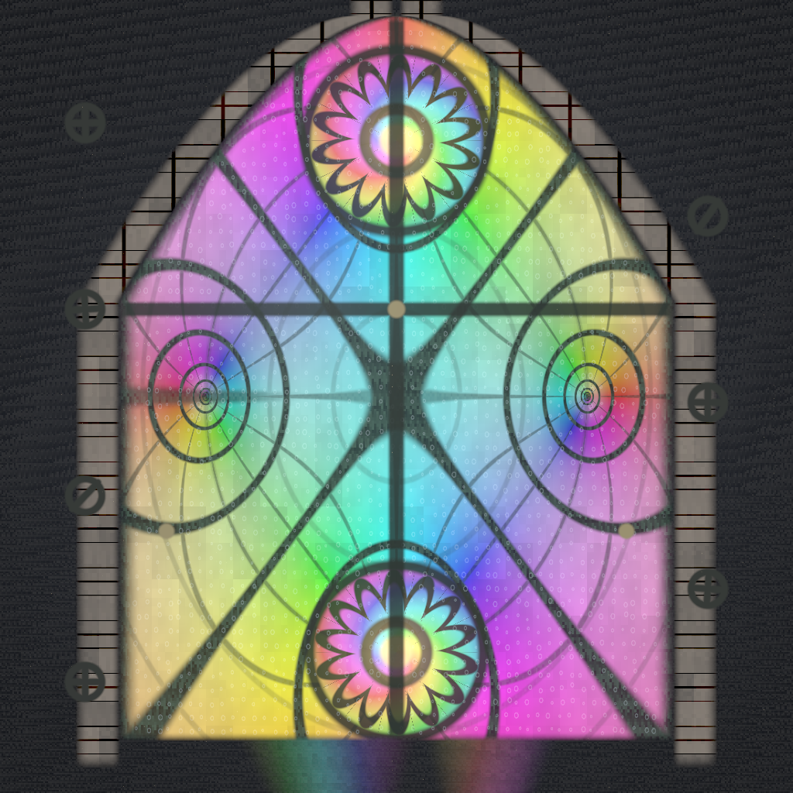

---

### Test 21: Compound Polyhedra Stella Octangula

**Test ID:** `021_compound_polyhedra_stella_octangula`
**Shader Files:** shader.wgsl
**Execution Status:** ✅ Success
**Image Generated:** ✅ Yes
**Judge Scores:** ✅ Available

#### Problem Prompt

> Create a stella octangula (compound of two interpenetrating tetrahedra) with edge length 2.0. Material: transparent crystal (IOR 1.5) with slight blue tint, 80% transparency. Include internal reflections and refractions. Lighting: dramatic spot from above. Background: black. Camera: angled to show interpenetration clearly.
>
> Outputs a single image.

#### Judge Scores

| Category | Score |
|----------|-------|
| Mathematical Accuracy | 70/100 |
| Visual Quality | 72/100 |
| Color Implementation | 62/100 |
| Geometric Completeness | 66/100 |
| Reference Elements | 64/100 |
| **Total** | **334/500** |
| **Average** | **66.8/100** |


#### Rendered Output

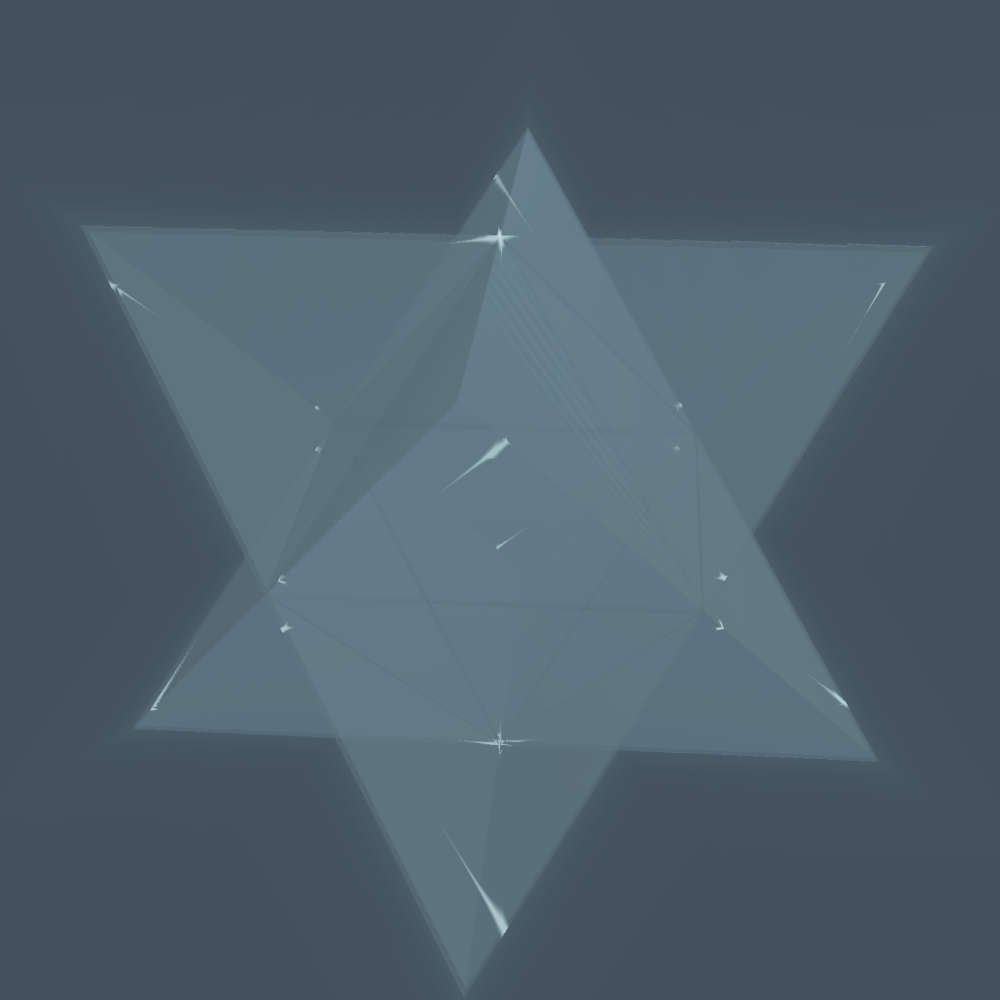

---

### Test 22: Conformal Spiral Mapping

**Test ID:** `022_conformal_spiral_mapping`
**Shader Files:** shader.wgsl
**Execution Status:** ✅ Success
**Image Generated:** ✅ Yes
**Judge Scores:** ✅ Available

#### Problem Prompt

> **Objective**
> Visualize **conformal spiral mapping** transforming a rectangular grid into an Archimedean spiral while preserving local angles and revealing the beauty of conformal geometry.
>
> **Mathematical recipe**
>
> 1. Start with rectangular grid in complex plane: -2 ≤ Re(z) ≤ 2, -2 ≤ Im(z) ≤ 2.
> 2. Apply conformal spiral map: w = exp(αz) where α = 0.2 + 0.3i.
>    - This combines scaling (e^(0.2Re(z))) with rotation (0.3Im(z)).
> 3. The transformation maps:
>    - Vertical lines → logarithmic spirals.
>    - Horizontal lines → radial rays from origin.
> 4. Grid: 41×41 lines (spacing 0.1).
> 5. Embed result in 3D with height based on |w|:
>    - h(w) = 0.5·log(1 + |w|) for smooth elevation.
>
> **Styling**
>
> * Grid lines: Thin tubes (radius 0.008) with glass-like material.
> * Color scheme: Vertical lines in blue-cyan gradient, horizontal in red-orange.
> * Height-based fog: Denser at higher elevations.
> * Central singularity marked with glowing white sphere.
> * Caustic lighting effects from refractive grid.
> * Dark background with subtle radial gradient.
> * Camera at (3, 3, 4), looking down at spiral; FOV 45°.
> * Resolution 2048 × 2048 px, 4× SSAA.
>
> **Deliverable** Single PNG showing the conformal transformation creating a beautiful spiral grid pattern.

#### Judge Scores

| Category | Score |
|----------|-------|
| Mathematical Accuracy | 76/100 |
| Visual Quality | 91/100 |
| Color Implementation | 70/100 |
| Geometric Completeness | 84/100 |
| Reference Elements | 80/100 |
| **Total** | **401/500** |
| **Average** | **80.2/100** |


#### Rendered Output

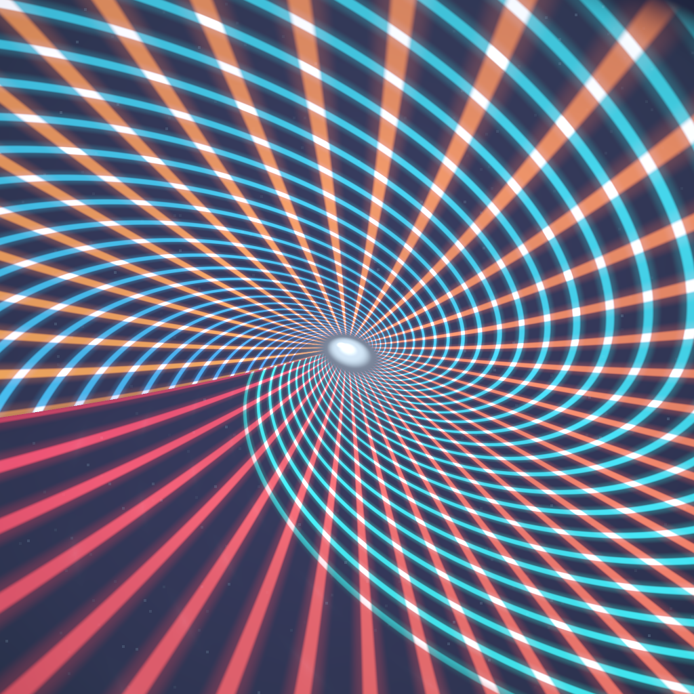

---

### Test 23: Costa Minimal Surface

**Test ID:** `023_costa_minimal_surface`
**Shader Files:** shader.wgsl
**Execution Status:** ✅ Success
**Image Generated:** ✅ Yes
**Judge Scores:** ✅ Available

#### Problem Prompt

> The Costa surface should appear like a delicate, three-winged glass sculpture suspended in mid-air. Viewers must immediately notice:
> 1. The vertical catenoidal neck shooting up/down
> 2. The two horizontal catenoidal ends
> 3. The saddle-like junction that hints at the single toroidal handle (genus 1)
>
> Mathematical data:
> - Weierstrass representation: g(z) = z, dh = λ*dz/(z³-1), λ = 0.252 (period-closing)
> - Parameter domain: hexagonally-fundamental region expressed by polar grid in the z-plane with 450 (radial) × 300 (angular) samples. Use conjugate pairing to close periods and tile just once.
> - Coordinate integration via Kummer surface tracking; step size adaptive to local curvature. Terminate when |z| > 4 or |Re ∫| > 5.
>
> Mesh & normals:
> - Weld identical boundary vertices to enforce genus 1 and Euler characteristic -2
> - Compute mean curvature H at each vertex; store in vertex attribute
>
> Shading:
> - Base material – frosted glass (IOR 1.5, roughness 0.2)
> - Curvature tint – mix 80% material colour with lime-green (#55FF88) where |H|<5×10^-4
> - Lighting – three-point studio rig: key (4,4,6), fill (-6,-2,5) intensity 0.5, rim (0,0,8) intensity 0.7, all pure white
>
> Camera & framing:
> - Perspective; focal length 35 mm, sensor 36 mm (true-to-life field)
> - Position (6,4,3), look-at (0,0,0). Orbit lines of sight by 5° downwards so the vertical neck is not foreshortened.
> - Depth-of-field: focus distance 5 units, f/2 blur for background only
>
> Extras:
> - Add invisible ground-plane with shadow-catcher for soft shadow
> - Transparent background (#00000000) – allows later compositing
> - PNG-32 (RGBA), 2600 × 1600 px
> Deliverable: Outputs a single image.

#### Judge Scores

| Category | Score |
|----------|-------|
| Mathematical Accuracy | 42/100 |
| Visual Quality | 74/100 |
| Color Implementation | 28/100 |
| Geometric Completeness | 54/100 |
| Reference Elements | 20/100 |
| **Total** | **218/500** |
| **Average** | **43.6/100** |


#### Rendered Output

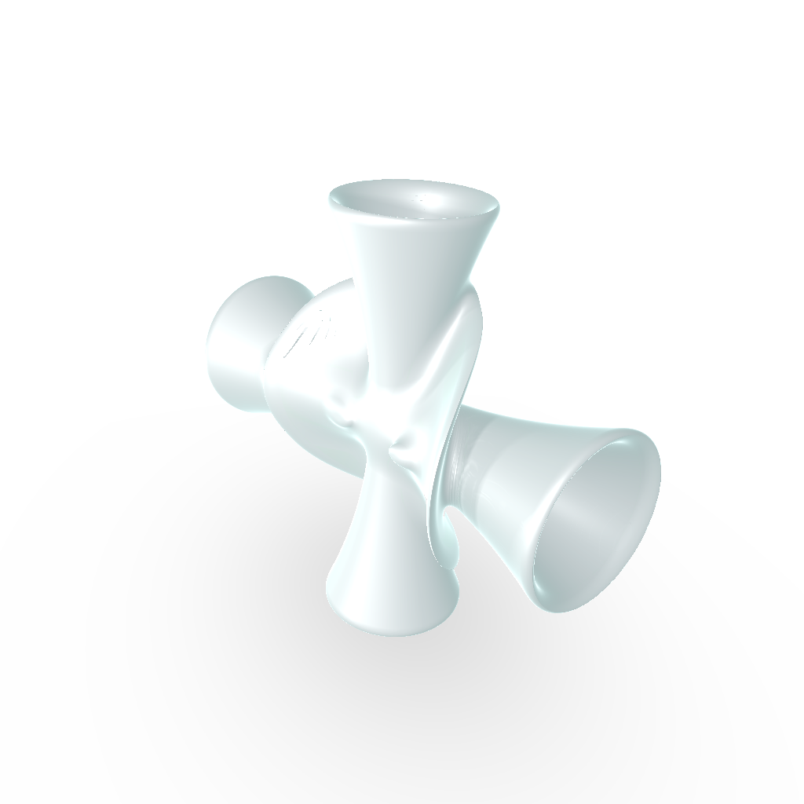

---

### Test 24: Coxeter Reflection Kaleidoscope

**Test ID:** `024_coxeter_reflection_kaleidoscope`
**Shader Files:** shader.wgsl
**Execution Status:** ✅ Success
**Image Generated:** ✅ Yes
**Judge Scores:** ✅ Available

#### Problem Prompt

> **Objective**
> Produce a single high-resolution Coxeter-group reflection kaleidoscope comparing spherical, Euclidean, and hyperbolic reflection tilings. The image should be a triptych with one panel for each geometry and a clearly marked fundamental triangle.
>
> **Mathematical specification**
> 1. Render three panels from left to right:
>    - Spherical Coxeter triangle with angles `(π/2, π/3, π/3)` on the unit sphere.
>    - Euclidean Coxeter triangle with angles `(π/2, π/3, π/6)` in the plane.
>    - Hyperbolic Coxeter triangle with angles `(π/2, π/3, π/7)` in the Poincare disk.
> 2. Reflection generators: each fundamental triangle has three mirror edges labeled or color-coded as `A`, `B`, and `C`.
> 3. Generate cells by reflecting the fundamental triangle across its edges up to visible depth:
>    - Spherical: enough reflections to tile the sphere with tetrahedral/octahedral-like symmetry patches.
>    - Euclidean: at least `8` reflection layers outward from the center triangle.
>    - Hyperbolic: at least `7` reflection layers in the Poincare disk, with cells shrinking toward the boundary.
> 4. Cell coloring: color by reflection word length modulo a palette cycle, e.g. `length mod 6`. Adjacent cells should generally have different colors.
> 5. The central fundamental triangle must be outlined in black in every panel.
>
> **Geometry to render**
> - Spherical panel: a shaded unit sphere with triangular geodesic arcs drawn on the surface.
> - Euclidean panel: flat triangular kaleidoscope tiling in a square or circular viewport.
> - Hyperbolic panel: Poincare disk with geodesic arcs drawn as circular arcs orthogonal to the disk boundary.
> - Mirror edges: three thicker lines in the fundamental triangle, with distinct colors or tiny labels.
>
> **Rendering style**
> - White background.
> - Clean high-contrast tiling lines, anti-aliased.
> - Use a restrained six-color palette for cells.
> - Spherical panel should have subtle lighting to show curvature; Euclidean and hyperbolic panels should be mostly flat but crisp.
>
> **Composition / overlays**
> - Arrange the three panels evenly with small captions or icon markers for spherical, Euclidean, and hyperbolic if text is available.
> - Add a small legend showing the three mirror generator colors `A/B/C`.
> - Hyperbolic disk boundary should be a dark circle; cells near the boundary should visibly shrink.
>
> **Technical specs**
> - Resolution at least `1600 × 1600` pixels.
> - Static frame only; no animation.
> - Output format: PNG.
>
> **Deliverable** A single PNG image satisfying the above.

#### Judge Scores

| Category | Score |
|----------|-------|
| Mathematical Accuracy | 82/100 |
| Visual Quality | 84/100 |
| Color Implementation | 80/100 |
| Geometric Completeness | 86/100 |
| Reference Elements | 76/100 |
| **Total** | **408/500** |
| **Average** | **81.6/100** |


#### Rendered Output

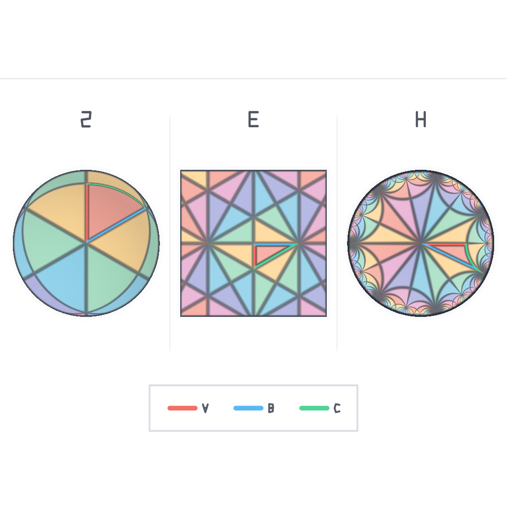

---

### Test 25: Crystal Dislocation Network

**Test ID:** `025_crystal_dislocation_network`
**Shader Files:** shader.wgsl
**Execution Status:** ✅ Success
**Image Generated:** ✅ Yes
**Judge Scores:** ✅ Available

#### Problem Prompt

> **Objective**
> Produce a single high-resolution PNG visualising a 3D crystal dislocation network under shear stress. The image should show screw, edge, bowed Frank–Read, and junction dislocation segments, along with Burgers vectors, slip planes, and a Burgers circuit closure failure.
>
> **Mathematical specification**
> Use a cubic crystal cell \([-1,1]^3\). Render a sparse FCC-like lattice for context, with lattice points at
> \[
> (i,j,k)/2,\quad (i,j,k)\in\{-2,-1,0,1,2\}^3,
> \]
> plus face-centered offsets where visually feasible. The lattice should be faint and secondary.
>
> Dislocation centerlines:
> 1. Screw helix, Burgers vector \(b_s=(0,0,1)\):
>    \[
>    \Gamma_s(t)=(0.28\cos t,\ 0.28\sin t,\ -0.85+1.70t/(4\pi)),\quad t\in[0,4\pi].
>    \]
> 2. Edge loop, Burgers vector \(b_e=(1,0,0)\):
>    \[
>    \Gamma_e(t)=(0.58\cos t,\ 0.58\sin t,\ 0.08\sin 2t),\quad t\in[0,2\pi].
>    \]
> 3. Bowed Frank–Read source, Burgers vector \(b_f=(0,1,0)\):
>    \[
>    \Gamma_f(s)=(s,\ -0.55,\ 0.18+0.42(1-s^2)),\quad s\in[-0.75,0.75].
>    \]
>    Mark its endpoints as pinned nodes.
> 4. Junction segment, Burgers vector \(b_j=(1,1,0)/\sqrt2\):
>    draw a straight segment connecting approximately \((0.28,0,-0.10)\) to \((0.58,0,0)\).
>
> Slip/stress geometry:
> - Slip plane for the edge loop: translucent plane \(z=0\).
> - Secondary \(\{111\}\)-like plane: translucent plane \(x+y+z=0.30\).
> - Applied shear stress \(\tau_{xy}\): draw opposing shear arrows on the \(z=\pm1\) faces of the cube.
>
> Burgers circuit:
> - Around one visible part of the edge loop, draw a square circuit on the \(z=0\) plane with a missing-closure vector parallel to \(b_e=(1,0,0)\).
>
> **Geometry to render**
> - Dislocations as glossy tubes of radius about 0.035–0.055.
> - Tube color by Burgers vector: screw blue, edge orange, Frank–Read green, junction purple.
> - Tangent arrows along each dislocation line and separate Burgers-vector arrows next to each segment.
> - Faint atom/lattice points and cube boundary rods.
> - Semi-transparent slip planes with subtle hatching.
> - Pinned endpoints on the Frank–Read segment as black or metallic spheres.
>
> **Rendering style**
> - Main dislocation tubes should be saturated and visually dominant.
> - Lattice and planes should be low opacity to avoid clutter.
> - Use soft Phong or physically inspired lighting with clear depth cues.
> - Background: white or light grey.
> - Avoid excessive labels; rely on color, arrow direction, and a small legend if possible.
>
> **Composition / overlays**
> - Camera: oblique 3D view that shows the helix, loop, bowed segment, junction, and shear arrows.
> - Put a small Burgers-vector color legend in one corner.
> - Keep the cube boundary visible but not heavy.
>
> **Technical specs**
> - Resolution at least 1600×1600 px.
> - Static frame only; no animation.
>
> **Deliverable** A single PNG image satisfying the above.

#### Judge Scores

| Category | Score |
|----------|-------|
| Mathematical Accuracy | 88/100 |
| Visual Quality | 91/100 |
| Color Implementation | 86/100 |
| Geometric Completeness | 88/100 |
| Reference Elements | 90/100 |
| **Total** | **443/500** |
| **Average** | **88.6/100** |


#### Rendered Output

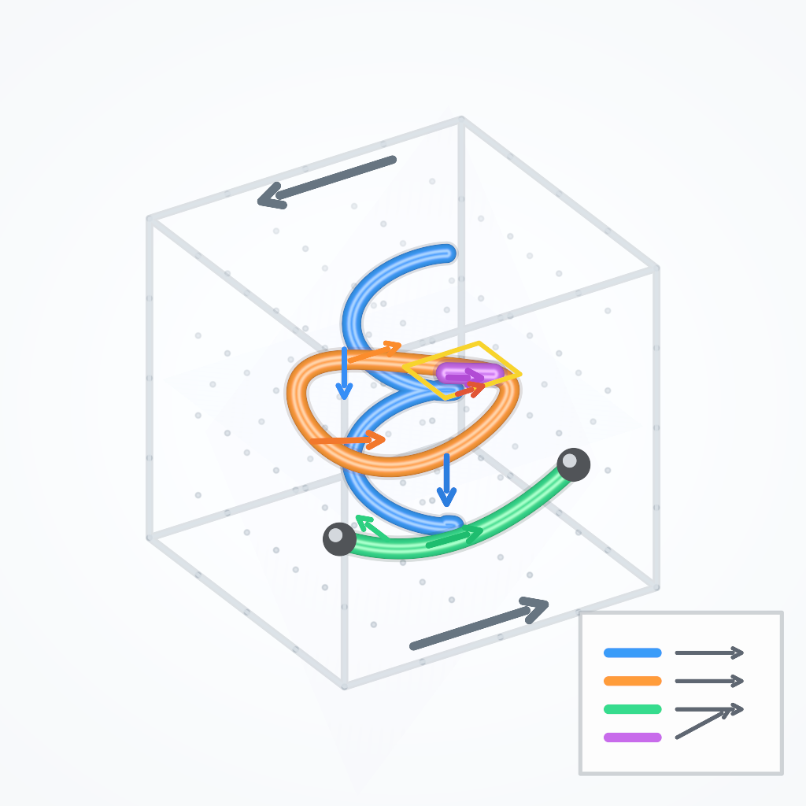

---

### Test 26: Crystal Lattice Diffraction

**Test ID:** `026_crystal_lattice_diffraction`
**Shader Files:** shader.wgsl
**Execution Status:** ✅ Success
**Image Generated:** ✅ Yes
**Judge Scores:** ✅ Available

#### Problem Prompt

> **Objective**
> Simulate and visualise the 2‑D X‑ray diffraction pattern of a perfect *face‑centred cubic* (FCC) crystal viewed down the ⟨001⟩ zone axis.
>
> **Physical model**
>
> 1. **Real‑space lattice** FCC with lattice constant $a=1$. Scatterers at fractional positions (0,0,0), (0,½,½), (½,0,½), (½,½,0).
> 2. **Scattering amplitude** Kinematic approximation; each scatterer contributes unit complex amplitude.
> 3. **Reciprocal lattice** Compute structure factors $F_{\mathbf G}$ for all integer Miller indices $(h,k,0)$ with $‖\mathbf G‖\le20\,(2\pi/a)$. Allowed reflections satisfy $h+k$ even. Intensity $I_{\mathbf G}=|F_{\mathbf G}|^{2}$.
> 4. **Detector plane** Normal to beam; place origin at transmitted beam (which may be suppressed for clarity). Pixel coordinates $q_x,q_y\propto h,k$.
>
> **Rendering instructions**
>
> * Canvas 1800 × 1800 px, black background.
> * Draw each reflection as a filled disk. Disk centre at $(h,k)$ scaled so that the (20,0) spot sits 90 % of radius from centre.
> * Disk radius = $4+‖(h,k)‖/6$ px (larger spots at higher order).
> * Intensity → greyscale: $I=0$ → #000000, max intensity → #FFFFFF, linear mapping.
> * Suppress the (0,0) direct beam.
> * No axes, text or borders.
>
> **Deliverable**
> 16‑bit PNG, gamma 2.2.

#### Judge Scores

| Category | Score |
|----------|-------|
| Mathematical Accuracy | 91/100 |
| Visual Quality | 84/100 |
| Color Implementation | 92/100 |
| Geometric Completeness | 86/100 |
| Reference Elements | 88/100 |
| **Total** | **441/500** |
| **Average** | **88.2/100** |


#### Rendered Output

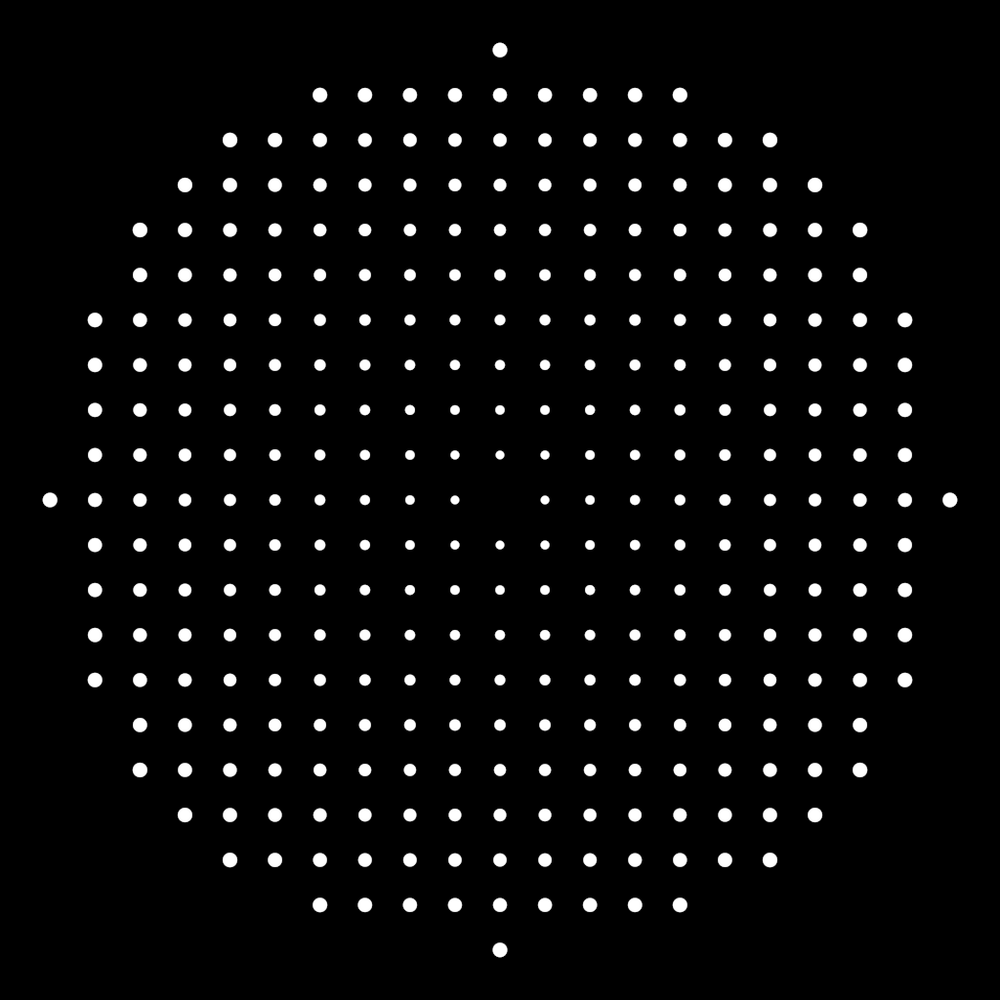

---

### Test 27: Cycloid Wave Patterns

**Test ID:** `027_cycloid_wave_patterns`
**Shader Files:** shader.wgsl
**Execution Status:** ✅ Success
**Image Generated:** ✅ Yes
**Judge Scores:** ✅ Available

#### Problem Prompt

> **Objective** – Visualise the classical cycloid produced by a circle of radius $r=1$ rolling along the x‑axis, then tile it to form a wave pattern.
>
> **Curve**
>
> $
>   x(θ)= θ - \sin θ,\qquad y(θ)= 1 - \cos θ,\quad θ∈[0,2π].
> $
>
> **Wave tiling**
>
> * Repeat the cycloid for 6 consecutive periods (θ ∈ [0,12π]); join end‑to‑end.
> * Mirror the entire wave about the x‑axis to produce a "trochoid trough" pattern.
>
> **Styling**
>
> * Positive‑y wave: stroke #ffaa00, 5 px.  Negative‑y mirror: stroke #0066ff, 5 px.
> * Thin grey baseline at y=0, 1 px.
> * Canvas 2600 × 800 px, 100 px margin left/right. White background.
>
> **Deliverable** – PNG.

#### Judge Scores

| Category | Score |
|----------|-------|
| Mathematical Accuracy | 90/100 |
| Visual Quality | 88/100 |
| Color Implementation | 92/100 |
| Geometric Completeness | 90/100 |
| Reference Elements | 82/100 |
| **Total** | **442/500** |
| **Average** | **88.4/100** |


#### Rendered Output

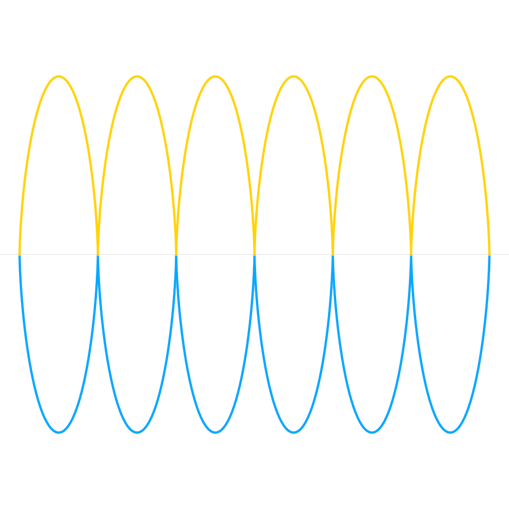

---

### Test 28: Cylindrical Bend Deformation

**Test ID:** `028_cylindrical_bend_deformation`
**Shader Files:** shader.wgsl
**Execution Status:** ✅ Success
**Image Generated:** ✅ Yes
**Judge Scores:** ✅ Available

#### Problem Prompt

> **Objective**
> Demonstrate **cylindrical bend deformation** by transforming a rectangular grid into a smoothly curved cylindrical surface, like bending a sheet of paper.
>
> **Mathematical recipe**
>
> 1. Start with flat rectangular grid (4×2 units) in XY plane, 40×20 segments.
> 2. Apply cylindrical bend transformation with radius R = 1.5:
>    - Bend angle θ = x / R (x-position determines angle).
>    - New position: x' = R·sin(θ), y' = y, z' = R·(1 - cos(θ)).
>    - Preserve y-coordinates (bend axis).
> 3. Add thickness (0.05 units) to create solid bent plate.
> 4. Maintain grid line structure for visual clarity.
> 5. Apply smooth shading with preserved surface normals.
>
> **Styling**
>
> * Material: Brushed metal with anisotropic highlights along bend direction.
> * Color: Gradient from cool steel blue (inner curve) to warm bronze (outer curve).
> * Grid lines: Subtle embossed effect, darker than base material.
> * Three-point lighting emphasizing curvature.
> * Soft shadows and ambient occlusion.
> * Camera at (2.5, 2, 3), looking at origin; FOV 40°.
> * Medium grey background (0.3, 0.3, 0.35).
> * Resolution 2048 × 2048 px, 4× SSAA.
>
> **Deliverable** Single PNG showing the bent rectangular grid with clear cylindrical curvature.

#### Judge Scores

| Category | Score |
|----------|-------|
| Mathematical Accuracy | 88/100 |
| Visual Quality | 86/100 |
| Color Implementation | 87/100 |
| Geometric Completeness | 78/100 |
| Reference Elements | 85/100 |
| **Total** | **424/500** |
| **Average** | **84.8/100** |


#### Rendered Output

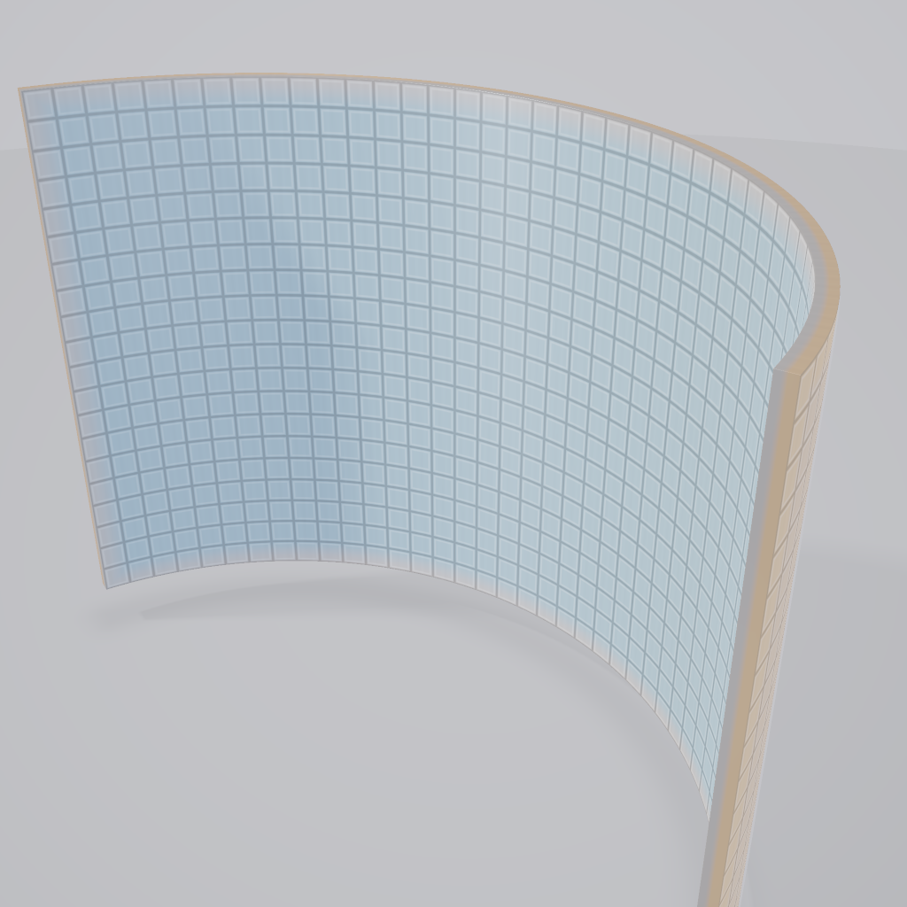

---

### Test 29: Differentiable Rendering Ambiguity Landscape

**Test ID:** `029_differentiable_rendering_ambiguity_landscape`
**Shader Files:** shader.wgsl
**Execution Status:** ✅ Success
**Image Generated:** ✅ Yes
**Judge Scores:** ✅ Available

#### Problem Prompt

> **Objective**
> Produce a single high-resolution PNG visualising ambiguity in a differentiable-rendering inverse problem. The main image should show a loss landscape where many different 3D sphere scenes produce nearly identical 2D silhouettes, forming a long shallow valley of equivalent solutions.
>
> **Mathematical specification**
> Use a pinhole camera with focal length \(f=1\), looking along positive \(z\). A Lambertian sphere with radius \(r\) and depth \(z\) has approximate projected silhouette radius
> \[
> \rho(r,z)=r/z.
> \]
> The target image is a centered circle of apparent radius
> \[
> \rho_*=0.42.
> \]
> Main parameter domain:
> \[
> z\in[1.0,5.0],\qquad r\in[0.25,2.25].
> \]
> Define the silhouette loss
> \[
> L(z,r)=\log\left(1+80( r/z-0.42)^2+0.05(z-3.0)^2\right).
> \]
> The exact silhouette-ambiguity curve is
> \[
> r=0.42z.
> \]
> This curve should be drawn explicitly as a glowing valley line on the loss surface.
>
> Secondary inset ambiguity:
> - Albedo/light ambiguity with albedo \(a\in[0.2,1.6]\), light intensity \(\ell\in[0.2,1.6]\).
> - Target brightness \(b_*=0.8\).
> - Inset loss:
>   \[
>   L_{a\ell}(a,\ell)=\log(1+50(a\ell-0.8)^2).
>   \]
> - Draw the hyperbola \(a\ell=0.8\) as the inset's ambiguity curve.
>
> **Geometry to render**
> - Main loss surface: a smooth height field over \((z,r)\), sampled at least \(220\times220\), with height proportional to normalised \(L(z,r)\).
> - Contour lines: at least 14 iso-loss contours on the surface.
> - Glowing ambiguity valley: tube or thick line along \(r=0.42z\), clipped to the domain.
> - Candidate scenes: place five small sphere-and-camera glyphs along the ambiguity curve at \(z=1.2,2.0,3.0,4.0,4.8\), with radius \(r=0.42z\). Each glyph should show a different physical radius/depth but the same projected silhouette size.
> - Target thumbnail: a small inset showing the observed centered circular silhouette of radius \(0.42\) in image coordinates.
> - Secondary inset: small height field or contour plot of \(L_{a\ell}\) with the hyperbola \(a\ell=0.8\).
>
> **Rendering style**
> - Main surface color: dark blue/purple for low loss, green/yellow/orange for high loss.
> - Valley line: bright gold or white glow.
> - Candidate scene glyphs: neutral grey spheres with camera rays drawn as thin lines to equal-size image-plane circles.
> - Use soft shadows and clear specular highlights on glyph spheres.
> - Background: white or very light grey.
>
> **Composition / overlays**
> - Camera: oblique view that makes the long valley and contour compression visible.
> - Main loss surface should occupy most of the canvas.
> - Place target thumbnail in the upper-left and albedo/light inset in the lower-right.
> - Add axis tick marks or minimal labels for \(z\), \(r\), \(a\), and \(\ell\) where possible; if text is unavailable, use arrows and tick marks.
>
> **Technical specs**
> - Resolution at least 1600×1600 px.
> - Static frame only; no animation.
>
> **Deliverable** A single PNG image satisfying the above.

#### Judge Scores

| Category | Score |
|----------|-------|
| Mathematical Accuracy | 88/100 |
| Visual Quality | 91/100 |
| Color Implementation | 89/100 |
| Geometric Completeness | 84/100 |
| Reference Elements | 86/100 |
| **Total** | **438/500** |
| **Average** | **87.6/100** |


#### Rendered Output

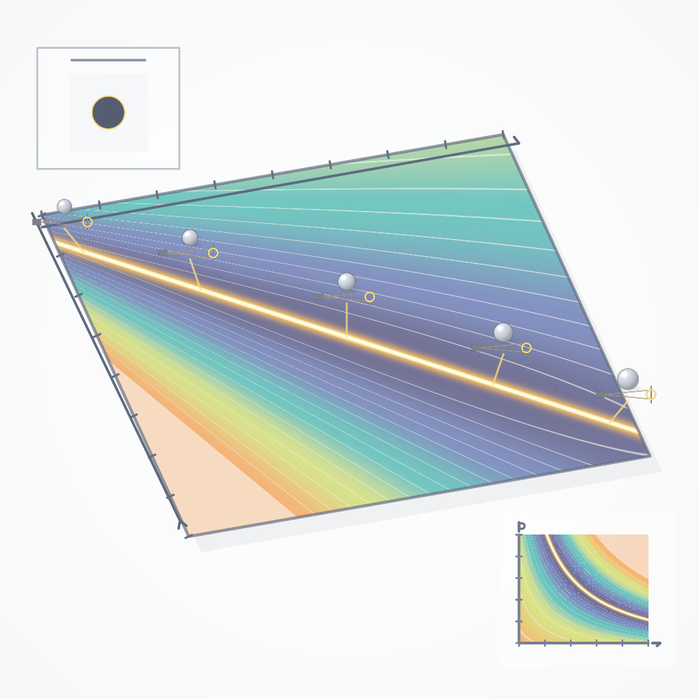

---

### Test 30: Differential Equations Water

**Test ID:** `030_differential_equations_water`
**Shader Files:** shader.wgsl
**Execution Status:** ✅ Success
**Image Generated:** ✅ Yes
**Judge Scores:** ✅ Available

#### Problem Prompt

> **Objective**
> Render **differential equations** as **living water surfaces**, where solutions manifest as fluid dynamics and wave patterns.
>
> **Mathematical recipe**
>
> 1. Base equation: ∂²u/∂t² = c²∇²u - γ∂u/∂t (damped wave equation)
> 2. Initial conditions create "equation signature":
>    - Linear DE: straight wave fronts
>    - Nonlinear DE: soliton formations
>    - Chaotic DE: turbulent mixing zones
> 3. Boundary conditions as shoreline geometries:
>    - Dirichlet: solid walls (perfect reflection)
>    - Neumann: gradual beaches (partial absorption)
>    - Periodic: infinite ocean illusion
> 4. Multiple equations interact as different "water types":
>    - Heat equation: viscous, honey-like flow
>    - Schrödinger: quantum probability mist
>    - Navier-Stokes: realistic water turbulence
>
> **Styling**
>
> * Photorealistic water rendering with caustics and subsurface scattering
> * Height field directly from solution u(x,y,t) at t=2.5
> * Color by equation type: clear (wave), blue-green (heat), violet (quantum)
> * Foam where |∇u| > threshold, indicating solution discontinuities
> * Underwater view showing solution history as sediment layers
> * Golden hour lighting: sun at 15° elevation, warm orange glow
> * Atmospheric perspective with distant mist
> * Camera at (0, 30, -50), looking at origin; FOV 60°
> * Resolution 2400 × 2400 px, ray-traced reflections
>
> **Deliverable** Single PNG showing multiple differential equations as interacting water bodies

#### Judge Scores

| Category | Score |
|----------|-------|
| Mathematical Accuracy | 74/100 |
| Visual Quality | 82/100 |
| Color Implementation | 68/100 |
| Geometric Completeness | 80/100 |
| Reference Elements | 76/100 |
| **Total** | **380/500** |
| **Average** | **76.0/100** |


#### Rendered Output

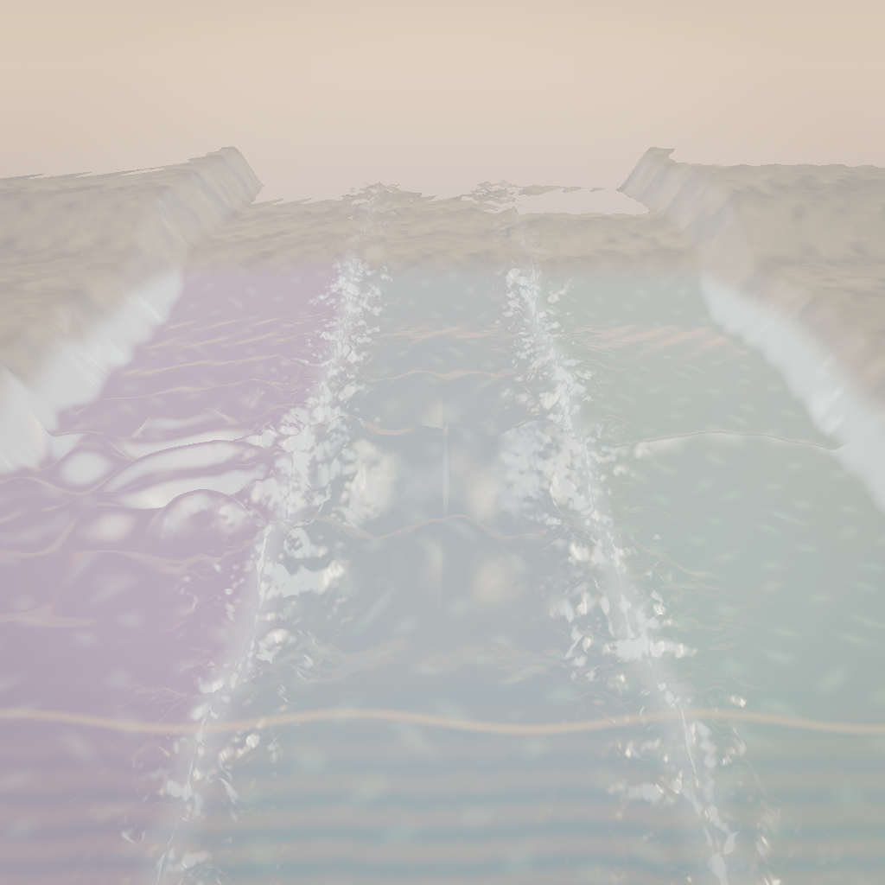

---

### Test 31: Dna Double Helix

**Test ID:** `031_dna_double_helix`
**Shader Files:** shader.wgsl
**Execution Status:** ✅ Success
**Image Generated:** ✅ Yes
**Judge Scores:** ✅ Available

#### Problem Prompt

> **Objective**
> Render two anti‑parallel helices (radius 1, pitch 3.4 Å per turn) with phase offset π (half‑turn).
>
> **Geometry**
>
> $
> \text{Helix}_1(t)=(\cos t,\; \sin t,\; 0.54\,t),\quad
> \text{Helix}_2(t)=(\cos(t+\pi),\; \sin(t+\pi),\; 0.54\,t)
> $
>
> for $t∈[0,12π]$ (≈ 6 full base‑pair turns).
> Ladder "rungs": cylinders radius 0.05 connecting helices every Δt = π (10 base pairs per turn).
>
> **Styling**
>
> * Strands: tube radius 0.12, colours #2e8bff & #ff5a5a.
> * Rungs: #dddddd cylinders.
> * Camera (5,0,2), look at centre, FOV 35°, black background with faint star‑field (for depth cue).
> * 2400 × 1800 px PNG, 4× SSAA.
>
> **Deliverable** PNG.

#### Judge Scores

| Category | Score |
|----------|-------|
| Mathematical Accuracy | 74/100 |
| Visual Quality | 88/100 |
| Color Implementation | 62/100 |
| Geometric Completeness | 82/100 |
| Reference Elements | 58/100 |
| **Total** | **364/500** |
| **Average** | **72.8/100** |


#### Rendered Output

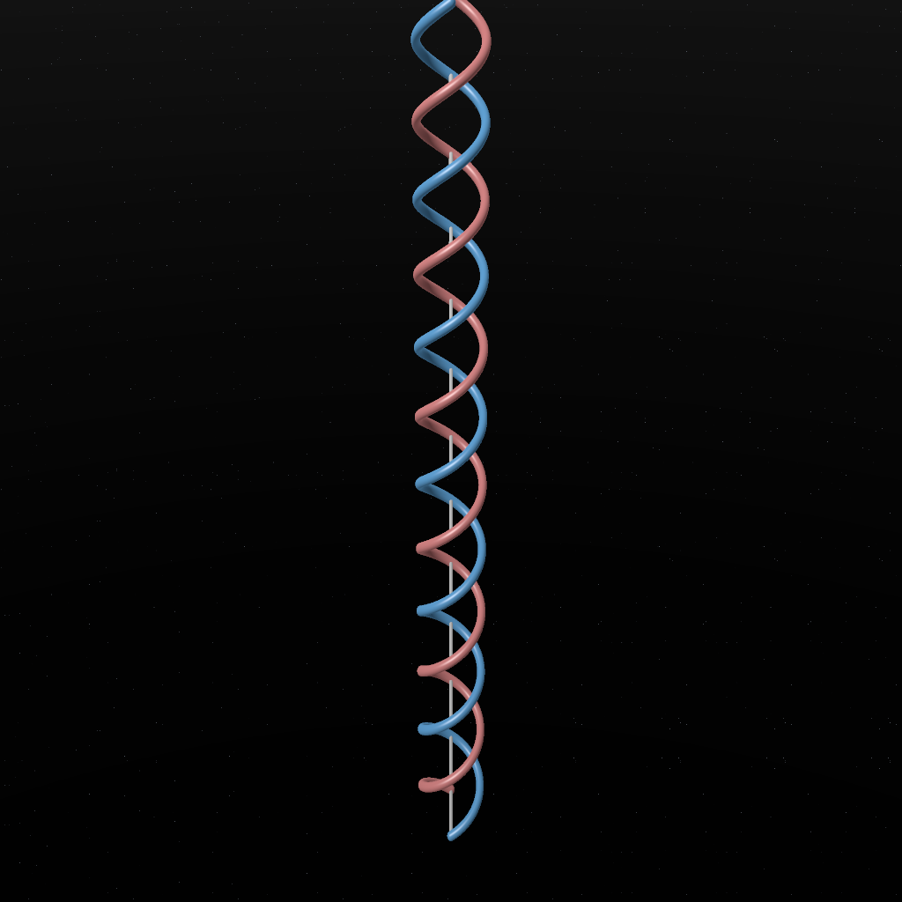

---

### Test 32: Earthquake Fault Slip Wavefronts

**Test ID:** `032_earthquake_fault_slip_wavefronts`
**Shader Files:** shader.wgsl
**Execution Status:** ✅ Success
**Image Generated:** ✅ Yes
**Judge Scores:** ✅ Available

#### Problem Prompt

> **Objective**
> Produce a single high-resolution 3D visualization of earthquake fault slip and seismic wavefronts. The image should show a dipping rectangular fault plane, rupture propagation, slip amplitude, displacement vectors, and P/S wavefront shells at a fixed time.
>
> **Mathematical specification**
> 1. Coordinate system: use kilometers. Let `X` be along strike, `Y` be horizontal across strike, and `Z` be depth, with `Z = 0` at the surface and positive downward.
> 2. Fault geometry: rectangular fault plane with strike length `60 km`, down-dip width `20 km`, and dip angle `35°`. Center it near `(X,Y,Z)=(0,0,10)`.
> 3. Fault-plane coordinates: `s ∈ [-30, 30] km` along strike and `q ∈ [0, 20] km` down dip.
> 4. Hypocenter: `(s0, q0) = (-18, 12) km` on the fault.
> 5. Static time: render `t = 8.0 s` after rupture initiation.
> 6. Rupture front speed: `v_r = 2.8 km/s`; draw the rupture front on the fault where `sqrt((s-s0)^2 + (q-q0)^2) = v_r t`, clipped to the rectangular fault.
> 7. Slip amplitude on the fault:
>    `D(s,q,t) = 3.0 exp(-((sqrt((s-s0)^2 + (q-q0)^2) - v_r t)^2)/(2*5.0^2)) exp(-((q-q0)^2)/(2*7.0^2))`, in meters, clipped to the fault plane.
> 8. Seismic wavefronts from the hypocenter:
>    - P wave radius `R_P = c_P t` with `c_P = 6.0 km/s`, so `R_P = 48 km`.
>    - S wave radius `R_S = c_S t` with `c_S = 3.5 km/s`, so `R_S = 28 km`.
>
> **Geometry to render**
> - Dipping rectangular fault plane with slip heatmap from blue/low to red/high.
> - Rupture front as a bright yellow curve on the fault plane.
> - Hypocenter as a glowing white/yellow point.
> - P-wave shell: large translucent blue spherical or ellipsoidal shell centered at the hypocenter.
> - S-wave shell: smaller translucent orange shell centered at the hypocenter.
> - Displacement vectors on the fault: short black or white arrows pointing approximately along rake direction, with length proportional to slip.
> - Surface plane `Z = 0` with faint grid lines and a surface trace of the fault.
>
> **Rendering style**
> - White or very light grey background.
> - Fault plane should be semi-opaque with a vivid slip heatmap.
> - Wavefront shells should be translucent enough not to hide the fault.
> - Use soft shadows, depth cues, and anti-aliasing.
>
> **Composition / overlays**
> - Camera: oblique view showing the surface plane, dipping fault, and both wavefront shells.
> - Add a small scale bar marked or ticked as `10 km` if text is available.
> - Add a compact colorbar swatch for slip amplitude from `0` to `3 m` if feasible.
> - Add small labels/ticks for P and S shells if text is available; otherwise make P shell blue and larger, S shell orange and smaller.
>
> **Technical specs**
> - Resolution at least `1600 × 1600` pixels.
> - Static frame only; no animation.
> - Output format: PNG.
>
> **Deliverable** A single PNG image satisfying the above.

#### Judge Scores

| Category | Score |
|----------|-------|
| Mathematical Accuracy | 88/100 |
| Visual Quality | 91/100 |
| Color Implementation | 87/100 |
| Geometric Completeness | 89/100 |
| Reference Elements | 93/100 |
| **Total** | **448/500** |
| **Average** | **89.6/100** |


#### Rendered Output

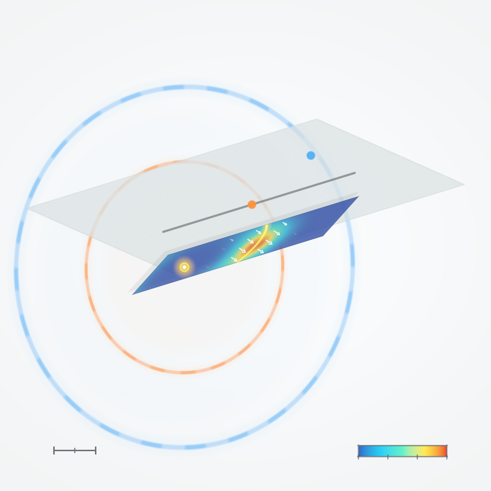

---

### Test 33: Epicycloids

**Test ID:** `033_epicycloids`
**Shader Files:** shader.wgsl
**Execution Status:** ✅ Success
**Image Generated:** ✅ Yes
**Judge Scores:** ✅ Available

#### Problem Prompt

> **Objective** – Draw the epicycloid traced by a point on a circle of radius $r=1$ rolling externally around a fixed circle of radius $R=4$.
>
> **Parametric form**
>
> $
>   x(θ)= (R+r)\cos θ - r\cos\!\bigl(\tfrac{R+r}{r}θ\bigr),\quad
>   y(θ)= (R+r)\sin θ - r\sin\!\bigl(\tfrac{R+r}{r}θ\bigr),
> $
>
> with θ ∈ [0,2πr/gcd(R,r)] ⇒ here θ ∈ [0,2π] (because R/r = 4 is integer).
>
> **Styling**
>
> * Stroke 5 px #00bbff; 2000 × 1600 px canvas.
> * Show small red dot for each of the **4 cusps** (radius 8 px).
> * Add faint grey dashed circle of radius R centred at origin as reference.
>
> **Deliverable** – PNG.

#### Judge Scores

| Category | Score |
|----------|-------|
| Mathematical Accuracy | 91/100 |
| Visual Quality | 96/100 |
| Color Implementation | 92/100 |
| Geometric Completeness | 97/100 |
| Reference Elements | 90/100 |
| **Total** | **466/500** |
| **Average** | **93.2/100** |


#### Rendered Output

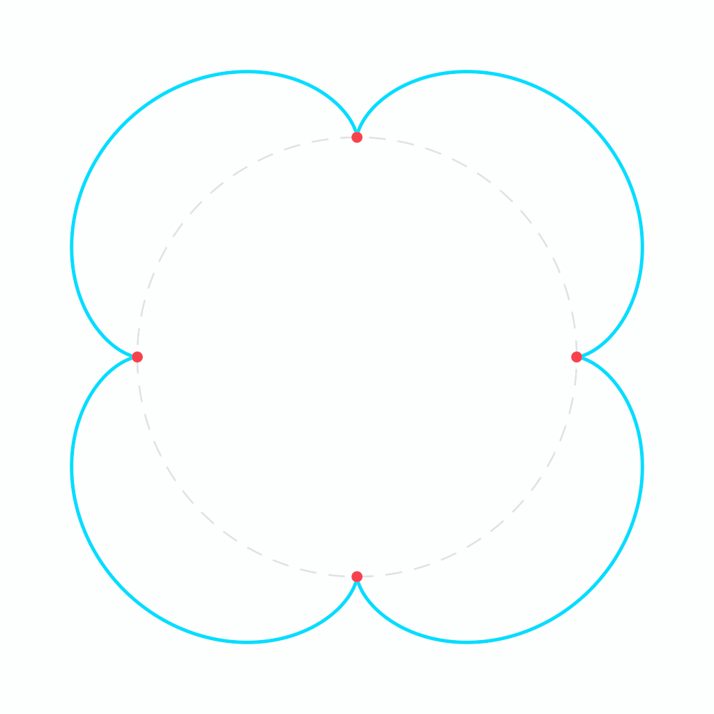

---

### Test 34: Error Correcting Code Decoding Landscape

**Test ID:** `034_error_correcting_code_decoding_landscape`
**Shader Files:** shader.wgsl
**Execution Status:** ✅ Success
**Image Generated:** ✅ Yes
**Judge Scores:** ✅ Available

#### Problem Prompt

> **Objective**
> Produce a single high-resolution PNG visualising the decoding landscape of the binary \([7,4,3]\) Hamming code. The image should connect algebraic code structure to geometry: error-pattern nodes, syndrome colors, coset leaders, decoding-flow arrows, and small codeword/trapping motifs.
>
> **Mathematical specification**
> Use the parity-check matrix
> \[
> H=\begin{bmatrix}
> 1&0&1&0&1&0&1\\
> 0&1&1&0&0&1&1\\
> 0&0&0&1&1&1&1
> \end{bmatrix},
> \]
> whose columns are the nonzero binary 3-vectors.
>
> For every error vector \(e=(e_1,\ldots,e_7)\in\{0,1\}^7\):
> 1. Syndrome: \(s(e)=He\bmod 2\in\{0,1\}^3\).
> 2. Hamming weight: \(w(e)=\sum_i e_i\).
> 3. Syndrome index: \(q(e)=s_1+2s_2+4s_3\).
> 4. Project the 7D error vector to 3D:
>    \[
>    x=0.18\sum_{i=1}^{7}e_i\cos(2\pi(i-1)/7),
>    \]
>    \[
>    y=0.18\sum_{i=1}^{7}e_i\sin(2\pi(i-1)/7),
>    \]
>    \[
>    z=0.16(w(e)-3.5)+0.055q(e).
>    \]
> 5. Draw an edge between two error nodes if they differ in exactly one bit.
> 6. Decoder score for visual flow:
>    \[
>    F(e)=w(e)+0.85\,\operatorname{popcount}(s(e)).
>    \]
>    From each nonzero node, draw a short arrow toward a neighbouring node with lower \(F\), preferring the neighbour with lowest weight. If no lower neighbour exists, draw a small ring around the node.
>
> Coset leaders:
> - The zero vector is the leader for syndrome 000.
> - For every nonzero syndrome, the leader is the single-bit error whose column of \(H\) equals that syndrome.
> - Render these eight leaders as larger bright spheres.
>
> Codeword/trapping motifs:
> - Highlight the three weight-3 zero-syndrome codewords \(\{1,2,3\}\), \(\{1,4,5\}\), and \(\{2,4,6\}\) as red triangular loops or red connected motifs.
>
> **Geometry to render**
> - A central projected Hamming graph with all 128 error-pattern nodes.
> - Thin translucent edges for the Hamming-neighbour graph; use low opacity so the cloud remains readable.
> - Node color by syndrome index \(q\) using 8 distinct hues. Node size should increase slightly with Hamming weight or use a consistent small size; coset leaders must be visibly larger.
> - Flow arrows should be short, black or white depending on background, and should not hide the node colors.
> - Right-side inset: an 8-node syndrome cube with corners \((s_1,s_2,s_3)\), colored with the same syndrome hues. Draw arrows from each syndrome corner to a small glyph of its coset leader.
> - Left-side inset: a Tanner graph of \(H\), with 7 variable nodes, 3 check nodes, and edges exactly where \(H_{ji}=1\).
>
> **Rendering style**
> - Background: white or very light grey.
> - Main graph edges: thin, semi-transparent grey.
> - Syndrome colors: saturated and clearly separated.
> - Highlighted coset leaders: larger spheres with bright rims or halos.
> - Highlighted weight-3 zero-syndrome motifs: red loops or red triangular link overlays.
>
> **Composition / overlays**
> - Place the projected 128-node decoding landscape in the center, syndrome cube on the right, Tanner graph on the left.
> - Use simple visual labels or binary tick marks if text is available; otherwise use consistent colors and layout.
> - Add a small legend strip of the 8 syndrome colors along the bottom.
>
> **Technical specs**
> - Resolution at least 1600×1600 px.
> - Static frame only; no animation.
>
> **Deliverable** A single PNG image satisfying the above.

#### Judge Scores

| Category | Score |
|----------|-------|
| Mathematical Accuracy | 78/100 |
| Visual Quality | 86/100 |
| Color Implementation | 72/100 |
| Geometric Completeness | 82/100 |
| Reference Elements | 88/100 |
| **Total** | **406/500** |
| **Average** | **81.2/100** |


#### Rendered Output

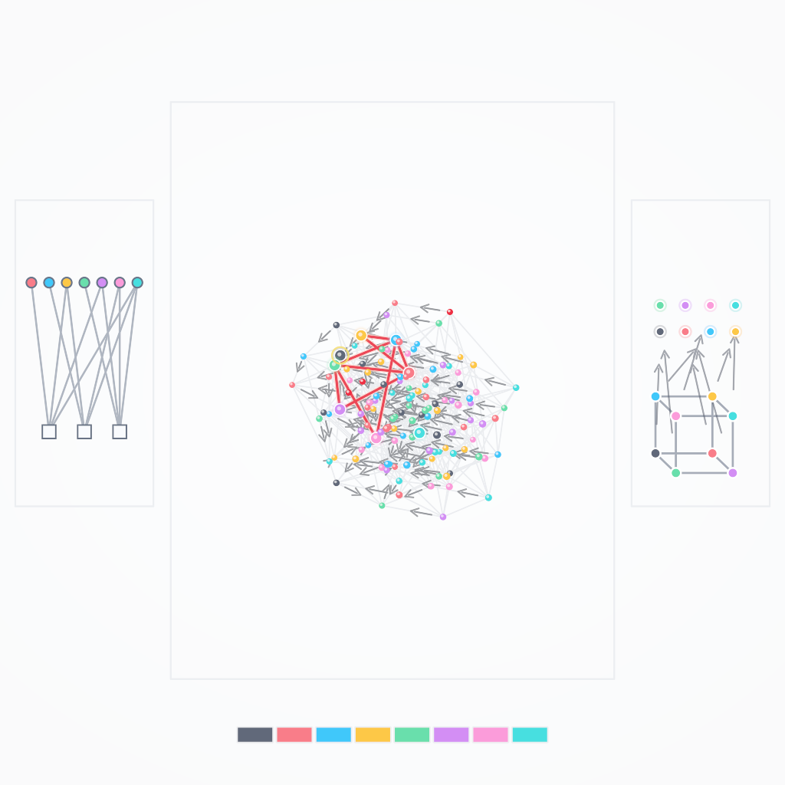

---

### Test 35: Euler Polyhedron Formula

**Test ID:** `035_euler_polyhedron_formula`
**Shader Files:** shader.wgsl
**Execution Status:** ✅ Success
**Image Generated:** ✅ Yes
**Judge Scores:** ✅ Available

#### Problem Prompt

> Create a single-file HTML shader that demonstrates Euler's Polyhedron Formula (V - E + F = 2) through an animated cube unfolding. The visualization should:
>
> 1. Start with a 3D wireframe cube that rotates slowly
> 2. Animate the cube unfolding into a flat net pattern over 5 seconds
> 3. Clearly annotate and count:
>    - Vertices (V = 8) with small colored dots
>    - Edges (E = 12) with distinct colored lines
>    - Faces (F = 6) with semi-transparent colored fills
> 4. Display the formula V - E + F = 2 with live updating numbers during the animation
> 5. Show the calculation: 8 - 12 + 6 = 2
> 6. Canvas size should be 2600×1600 pixels
> 7. Use a clean, educational style with clear labels
> 8. Include smooth transitions and easing for the unfolding animation
> 9. After unfolding, pause for 2 seconds, then reverse the animation to fold back into a cube
>
> The implementation should be a complete, self-contained HTML file with embedded WebGL shader code. The visualization should be both mathematically instructive and visually engaging.

#### Judge Scores

| Category | Score |
|----------|-------|
| Mathematical Accuracy | 76/100 |
| Visual Quality | 82/100 |
| Color Implementation | 70/100 |
| Geometric Completeness | 73/100 |
| Reference Elements | 75/100 |
| **Total** | **376/500** |
| **Average** | **75.2/100** |


#### Rendered Output

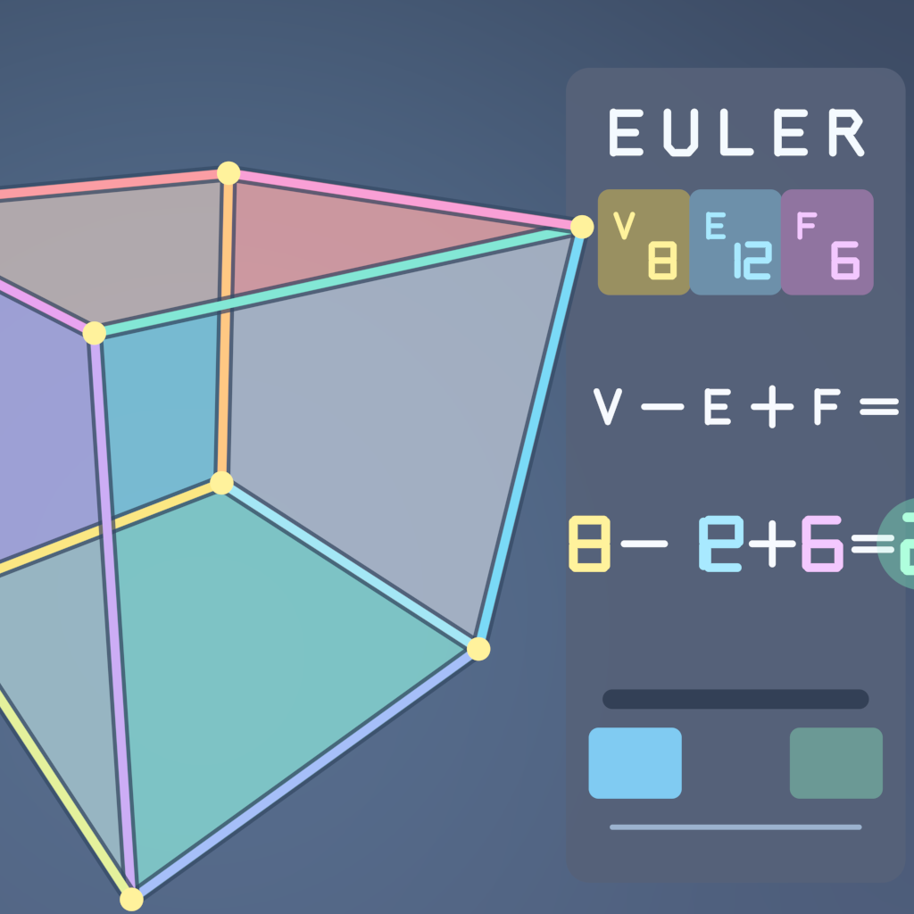

---

### Test 36: Fermat Parabolic Spiral

**Test ID:** `037_fermat_parabolic_spiral`
**Shader Files:** shader.wgsl
**Execution Status:** ✅ Success
**Image Generated:** ✅ Yes
**Judge Scores:** ✅ Available

#### Problem Prompt

> Create a single-file HTML shader that renders Fermat's Parabolic Spiral. The visualization should:
>
> 1. Use the parametric equations for Fermat's parabolic spiral where r² = a²θ
> 2. Set a = 0.5 and θ ranging from 0 to 8π
> 3. Render the spiral with a smooth, rainbow gradient stroke that transitions through the spectrum
> 4. Canvas size should be 2400×2400 pixels
> 5. Center the spiral in the canvas
> 6. Use a dark background to make the rainbow colors pop
> 7. Ensure smooth anti-aliased rendering of the curve
> 8. The line width should be appropriate for the canvas size (not too thin, not too thick)
>
> The implementation should be a complete, self-contained HTML file with embedded WebGL shader code. The spiral should be mathematically accurate and visually appealing with the rainbow gradient smoothly transitioning along the curve length.

#### Judge Scores

| Category | Score |
|----------|-------|
| Mathematical Accuracy | 86/100 |
| Visual Quality | 94/100 |
| Color Implementation | 78/100 |
| Geometric Completeness | 88/100 |
| Reference Elements | 82/100 |
| **Total** | **428/500** |
| **Average** | **85.6/100** |


#### Rendered Output

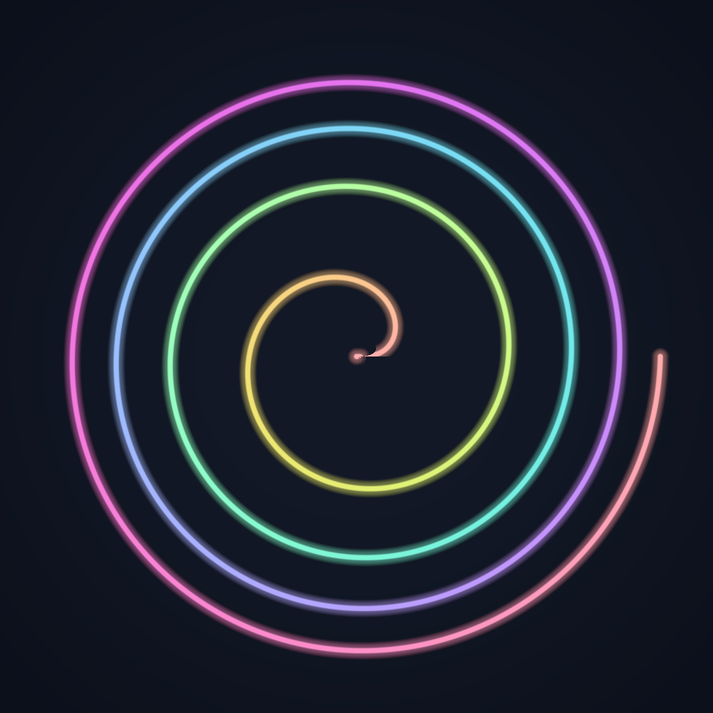

---

### Test 37: Five Pointed Star Polygon

**Test ID:** `038_five_pointed_star_polygon`
**Shader Files:** shader.wgsl
**Execution Status:** ✅ Success
**Image Generated:** ✅ Yes
**Judge Scores:** ✅ Available

#### Problem Prompt

> **Objective**
> Draw the regular pentagram inscribed in a circle of radius 1, centred on canvas.
>
> **Construction**
> * Connect vertices in order 1‑3‑5‑2‑4‑1.
> * Fill #ffcc33; 3‑px black outline.
> * Canvas 1600 × 1600 px, white background.
>
> **Deliverable** – PNG.

#### Judge Scores

| Category | Score |
|----------|-------|
| Mathematical Accuracy | 96/100 |
| Visual Quality | 94/100 |
| Color Implementation | 98/100 |
| Geometric Completeness | 93/100 |
| Reference Elements | 96/100 |
| **Total** | **477/500** |
| **Average** | **95.4/100** |


#### Rendered Output

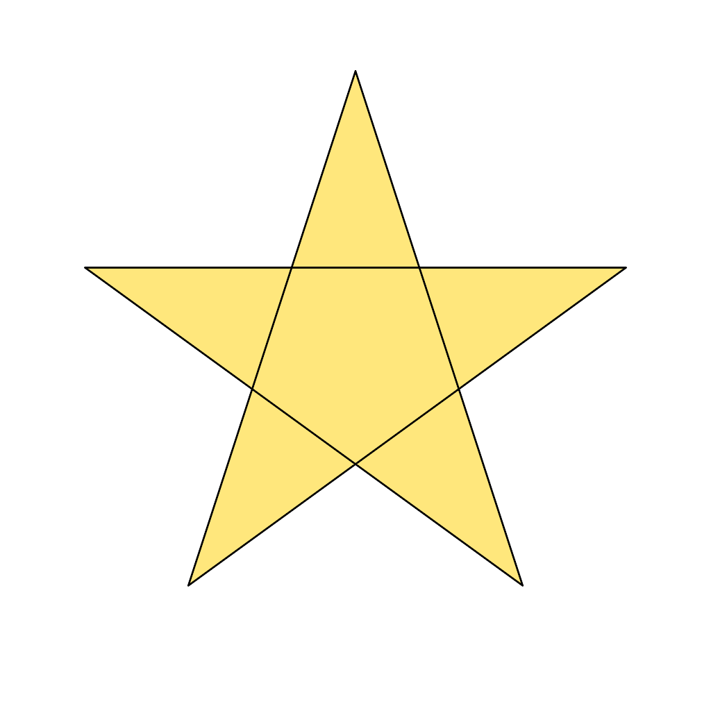

---

### Test 38: Fourier Architectural Blueprint

**Test ID:** `039_fourier_architectural_blueprint`
**Shader Files:** shader.wgsl
**Execution Status:** ✅ Success
**Image Generated:** ✅ Yes
**Judge Scores:** ✅ Available

#### Problem Prompt

> Translate a 64×64 frequency-domain image into a bird's-eye architectural floorplan where low frequencies extrude into tall perimeter walls and high frequencies become subtle interior bumps—echoing how gross structure dominates fine details.
>
> Algorithm:
> 1. Frequency grid: Indices u,v ∈ {−32...31}
> 2. Amplitude spectrum: A(u,v) = 1/(u²+v²+1)
> 3. iFFT: Compute spatial map s(x,y)=Re IFFT(A). Result is 64×64 real array.
> 4. Extrusion: For each cell extrude upward to height h=40·(s−s_min)/(s_max−s_min) mm
> 5. Geometry generation: Create 64² pillar blocks (1 mm² footprint) joined if adjacent heights differ ≤1 mm to form walls
> 6. Visual rendering:
>    - Orthographic top-down camera, z-axis up
>    - Walls coloured blueprint-blue (#0066CC); floor pure white
>    - Light ambient only (flat)
>    - Superpose faint (10%) grey grid at 1 mm spacing
> 7. Canvas 2000 × 2000 px, 80 px border
>
> Deliverable: Outputs a single image.

#### Judge Scores

| Category | Score |
|----------|-------|
| Mathematical Accuracy | 28/100 |
| Visual Quality | 72/100 |
| Color Implementation | 18/100 |
| Geometric Completeness | 60/100 |
| Reference Elements | 25/100 |
| **Total** | **203/500** |
| **Average** | **40.6/100** |


#### Rendered Output

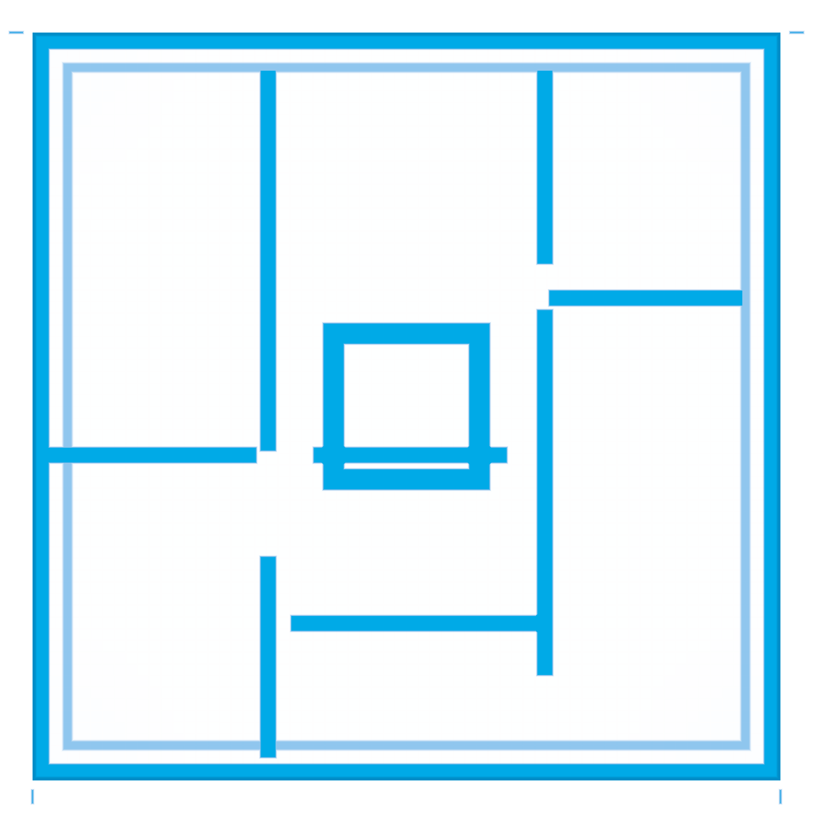

---

### Test 39: Fourier Epicycles Drawing

**Test ID:** `040_fourier_epicycles_drawing`
**Shader Files:** shader.wgsl
**Execution Status:** ✅ Success
**Image Generated:** ✅ Yes
**Judge Scores:** ✅ Available

#### Problem Prompt

> # Fourier Epicycles Drawing
>
> Create a WebGL animation that uses Fourier epicycles to draw complex shapes, showing how combinations of rotating circles can create any continuous path.
>
> ## Requirements:
>
> 1. Implement discrete Fourier transform to decompose a path
> 2. Visualize epicycles (rotating circles) with:
>    - At least 10 frequency components
>    - Circles of decreasing radius
>    - Connecting arms between circles
> 3. Draw multiple example shapes:
>    - Square wave approximation
>    - Heart shape
>    - Figure-8 pattern
>    - Custom logo or text
> 4. Show both the epicycles and the resulting traced path
> 5. Add trails showing the motion history
> 6. Color code different frequency components
> 7. Include options to show/hide:
>    - Individual epicycles
>    - Connecting arms
>    - Traced path
>    - Frequency spectrum

#### Judge Scores

| Category | Score |
|----------|-------|
| Mathematical Accuracy | 68/100 |
| Visual Quality | 86/100 |
| Color Implementation | 48/100 |
| Geometric Completeness | 78/100 |
| Reference Elements | 66/100 |
| **Total** | **346/500** |
| **Average** | **69.2/100** |


#### Rendered Output

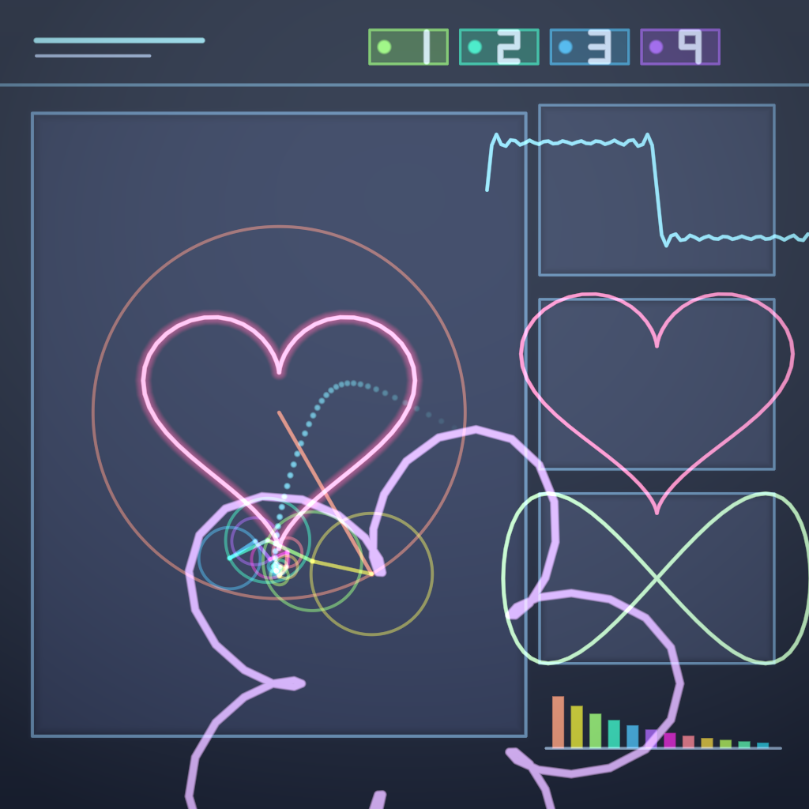

---

### Test 40: Fractal Drum Eigenfunctions

**Test ID:** `041_fractal_drum_eigenfunctions`
**Shader Files:** shader.wgsl
**Execution Status:** ✅ Success
**Image Generated:** ✅ Yes
**Judge Scores:** ✅ Available

#### Problem Prompt

> **Objective**
> Produce a single high-resolution PNG visualising an approximate Laplacian eigenfunction on a Sierpiński-carpet fractal drum. The result should show the fractal domain, punched-out holes, signed nodal domains, and nodal curves.
>
> **Mathematical specification**
> Use the order-5 Sierpiński carpet in the unit square. Let \(X,Y\in[0,1]\). A point is retained if, for every ternary digit level \(k=1,\ldots,5\), the \(k\)-th ternary digit of \(X\) and the \(k\)-th ternary digit of \(Y\) are not both equal to 1. Equivalently, recursively divide into \(3\times3\) blocks and remove every central block for 5 iterations.
>
> Define the retained-domain mask
> \[
> M_5(X,Y)=\begin{cases}
> 1, & \text{point retained in the order-5 carpet},\\
> 0, & \text{point lies in a removed square}.
> \end{cases}
> \]
>
> Use the following antisymmetric approximate eigenfunction on the retained set:
> \[
> u(X,Y)=M_5(X,Y)\left[
> \sin(\pi X)\sin(2\pi Y)-\sin(2\pi X)\sin(\pi Y)
> +0.25\sin(3\pi X)\sin(2\pi Y)-0.25\sin(2\pi X)\sin(3\pi Y)
> \right].
> \]
> The field must be zero inside removed holes and along the outside boundary.
>
> **Geometry to render**
> - Main object: a thin 3D fractal plate shaped like the order-5 Sierpiński carpet.
> - Plate elevation: \(z=0.22u(X,Y)\), with positive and negative eigenfunction domains raised/lowered.
> - Holes: all removed central squares from the 5 recursive levels should be punched through the plate, not merely colored.
> - Nodal set: draw the zero contour \(u=0\) as dark curves on the plate. Include the main diagonal antisymmetry nodal curve and smaller secondary nodal loops/branches introduced by the higher-frequency terms.
> - Boundary: draw a thin black outline around the outer square and around holes.
> - Spectral side strip: include a small vertical ladder of six eigenvalue bars labelled visually by height only; highlight the displayed mode as the fifth bar. Approximate bar heights proportional to \([5.8,14.4,14.4,27.0,30.2,37.1]\).
>
> **Rendering style**
> - Positive \(u\): warm orange/red.
> - Negative \(u\): cool blue/cyan.
> - Near zero: white or pale grey, with explicit dark nodal lines.
> - Holes: reveal the background through the plate; do not fill removed regions.
> - Use soft shadows cast into larger holes to make the fractal geometry apparent.
> - Background: pure white or very light grey.
>
> **Composition / overlays**
> - Camera: oblique top-down view so the Sierpiński holes, surface height, and nodal domains are all visible.
> - Place the spectral side strip to the right of the main fractal plate.
> - Include a small legend showing positive, zero, and negative field colors if space allows.
>
> **Technical specs**
> - Resolution at least 1600×1600 px.
> - Static frame only; no animation.
>
> **Deliverable** A single PNG image satisfying the above.

#### Judge Scores

| Category | Score |
|----------|-------|
| Mathematical Accuracy | 84/100 |
| Visual Quality | 78/100 |
| Color Implementation | 82/100 |
| Geometric Completeness | 80/100 |
| Reference Elements | 76/100 |
| **Total** | **400/500** |
| **Average** | **80.0/100** |


#### Rendered Output

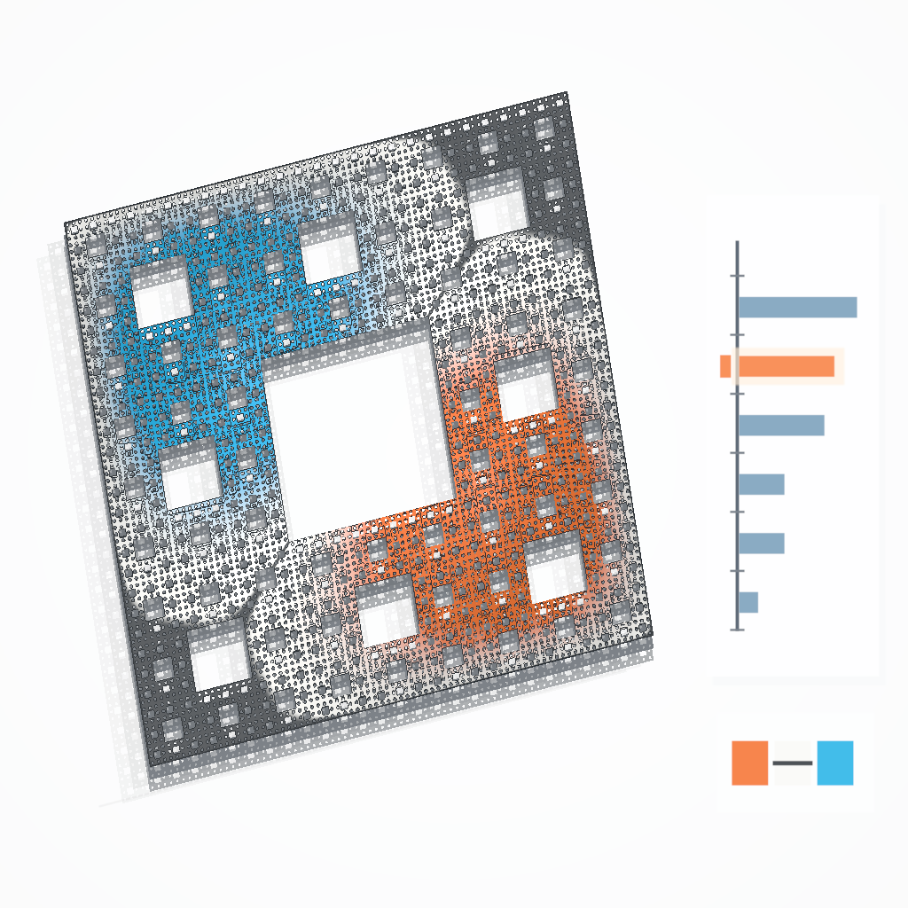

---

### Test 41: Fractal Loxodromic Patterns

**Test ID:** `042_fractal_loxodromic_patterns`
**Shader Files:** shader.wgsl
**Execution Status:** ✅ Success
**Image Generated:** ✅ Yes
**Judge Scores:** ✅ Available

#### Problem Prompt

> **Objective**
> Generate **fractal loxodromic patterns** by iterating complex Möbius transformations, creating self-similar spiral structures in 3D space.
>
> **Mathematical recipe**
>
> 1. Define loxodromic Möbius transformation: f(z) = (az+b)/(cz+d)
>    - Use a = 1.2·exp(iπ/6), b = 0.1, c = 0.1i, d = 1.
>    - Fixed points: z₁, z₂ with |f'(z₁)| > 1 (repelling), |f'(z₂)| < 1 (attracting).
> 2. Generate orbit for 200 initial points on circle |z| = 1.5:
>    - Iterate f(z) up to 50 times or until |z| > 10.
>    - Store full trajectory for each initial point.
> 3. Embed in 3D using stereographic projection:
>    - (x,y,z) = (2Re(z)/(1+|z|²), 2Im(z)/(1+|z|²), (|z|²-1)/(|z|²+1)).
> 4. Connect trajectory points to form spiral curves.
> 5. Add recursion: Apply transformation to smaller circles.
>
> **Styling**
>
> * Trajectories as glowing tubes, radius decreases with iteration.
> * Color by iteration count: Deep purple (early) to bright orange (late).
> * Emission intensity increases near fixed points.
> * Subtle particle effects at trajectory endpoints.
> * Black background with blue fog for depth.
> * HDR bloom for luminous spirals.
> * Camera at (2, 1.5, 2.5), looking at origin; FOV 55°.
> * Resolution 2048 × 2048 px, 4× SSAA.
>
> **Deliverable** Single PNG showing fractal spiral patterns from loxodromic iteration.

#### Judge Scores

| Category | Score |
|----------|-------|
| Mathematical Accuracy | 45/100 |
| Visual Quality | 76/100 |
| Color Implementation | 38/100 |
| Geometric Completeness | 52/100 |
| Reference Elements | 42/100 |
| **Total** | **253/500** |
| **Average** | **50.6/100** |


#### Rendered Output

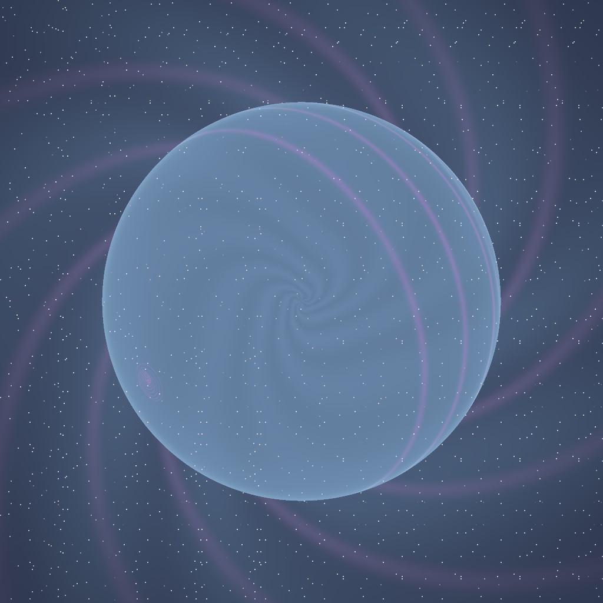

---

### Test 42: Fractal Tree 2D

**Test ID:** `043_fractal_tree_2d`
**Shader Files:** shader.wgsl
**Execution Status:** ✅ Success
**Image Generated:** ✅ Yes
**Judge Scores:** ✅ Available

#### Problem Prompt

> **Objective**
> Generate a symmetric 2D fractal tree through recursive branching.
>
> **Construction**
> Start trunk from (0,0) to (0,1). Each segment length scaled 0.7, split into two at ±45° from parent. Recurse 7 levels.
>
> **Styling**
> Stroke 2 px #006600. Canvas 1600 × 1800 px white.
>
> **Deliverable** – PNG.

#### Judge Scores

| Category | Score |
|----------|-------|
| Mathematical Accuracy | 78/100 |
| Visual Quality | 82/100 |
| Color Implementation | 74/100 |
| Geometric Completeness | 82/100 |
| Reference Elements | 72/100 |
| **Total** | **388/500** |
| **Average** | **77.6/100** |


#### Rendered Output

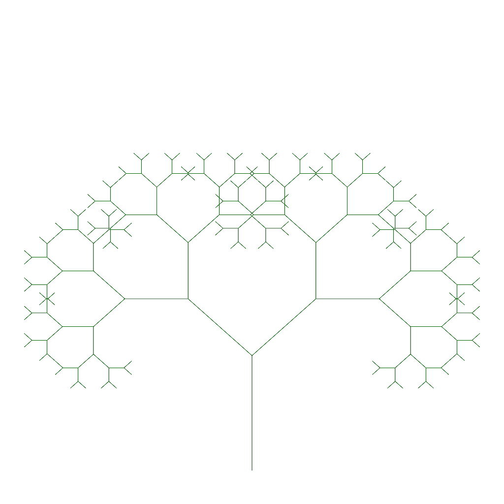

---

### Test 43: Gauss Complex Plane

**Test ID:** `044_gauss_complex_plane`
**Shader Files:** shader.wgsl
**Execution Status:** ✅ Success
**Image Generated:** ✅ Yes
**Judge Scores:** ✅ Available

#### Problem Prompt

> Create a single-file HTML shader that visualizes Gauss's Complex Plane with the 5th roots of unity. The visualization should:
>
> 1. Draw a complex plane with clearly labeled real and imaginary axes
> 2. Display the unit circle prominently
> 3. Plot the 5 fifth roots of unity as colored points:
>    - z₀ = 1
>    - z₁ = e^(2πi/5)
>    - z₂ = e^(4πi/5)
>    - z₃ = e^(6πi/5)
>    - z₄ = e^(8πi/5)
> 4. Connect the roots with lines to form a regular pentagon
> 5. Color each root with a distinct color from a harmonious palette
> 6. Add subtle animations:
>    - Roots should pulse gently in size
>    - Pentagon edges should have a subtle glow effect
> 7. Canvas size should be 1800×1800 pixels
> 8. Include grid lines for the complex plane
> 9. Label each root with its mathematical expression
> 10. Add a title "5th Roots of Unity in the Complex Plane"
>
> The implementation should be a complete, self-contained HTML file with embedded WebGL shader code. The visualization should clearly demonstrate the symmetry and beauty of roots of unity in the complex plane.

#### Judge Scores

| Category | Score |
|----------|-------|
| Mathematical Accuracy | 82/100 |
| Visual Quality | 76/100 |
| Color Implementation | 88/100 |
| Geometric Completeness | 74/100 |
| Reference Elements | 79/100 |
| **Total** | **399/500** |
| **Average** | **79.8/100** |


#### Rendered Output

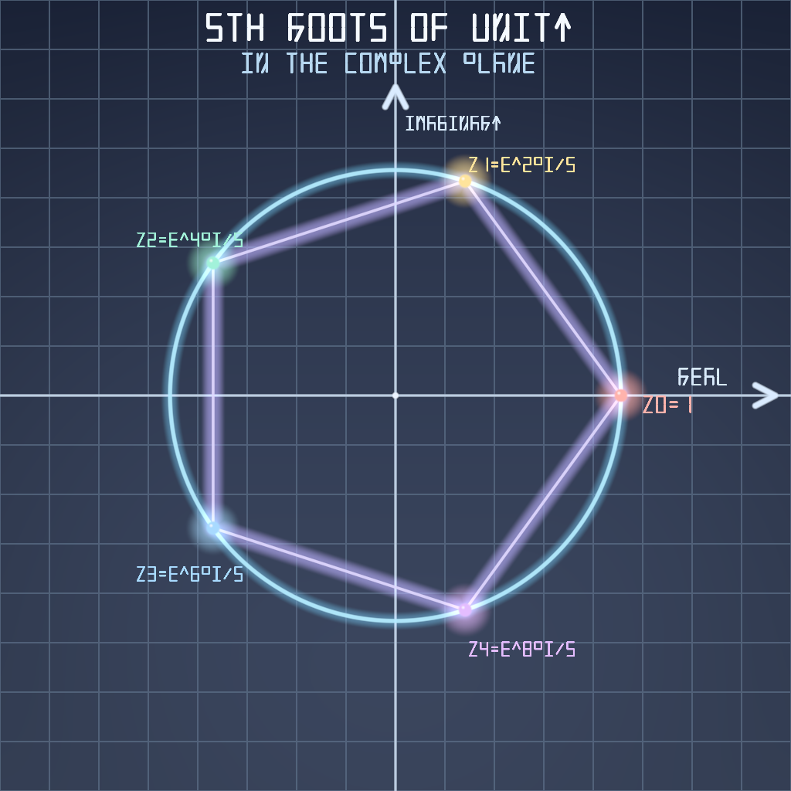

---

### Test 44: Geometric Cube

**Test ID:** `045_geometric_cube`
**Shader Files:** shader.wgsl
**Execution Status:** ✅ Success
**Image Generated:** ✅ Yes
**Judge Scores:** ✅ Available

#### Problem Prompt

> Axis-aligned cube, side = 2, centred at origin.
>
> Rendering:
> - Wireframe style: edges 3 px midnight-blue (#003366); transparent faces α = 0.1 sky-blue
> - Hidden edges dashed
> - Camera: Elevated view from upper-right, looking down at cube corner (approx 45° elevation, 30° azimuth)
> - Perspective: Orthographic projection. Canvas 1800×1800
>
> Deliverable: Outputs a single image.

#### Judge Scores

| Category | Score |
|----------|-------|
| Mathematical Accuracy | 74/100 |
| Visual Quality | 78/100 |
| Color Implementation | 70/100 |
| Geometric Completeness | 76/100 |
| Reference Elements | 64/100 |
| **Total** | **362/500** |
| **Average** | **72.4/100** |


#### Rendered Output

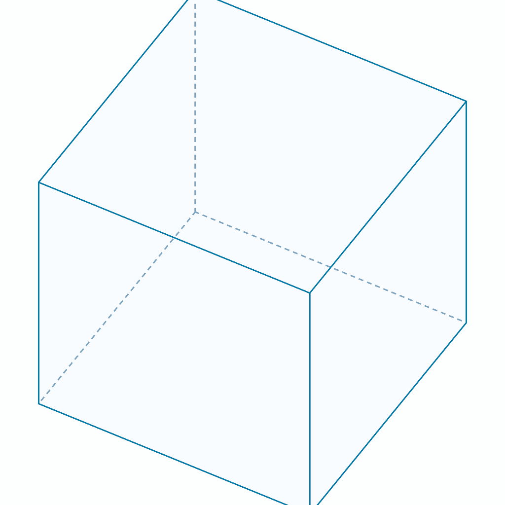

---

### Test 45: Glass Sphere Red Core

**Test ID:** `046_glass_sphere_red_core`
**Shader Files:** shader.wgsl
**Execution Status:** ✅ Success
**Image Generated:** ✅ Yes
**Judge Scores:** ✅ Available

#### Problem Prompt

> **Objective**
> Create a photorealistic ray-traced shader that renders a clear glass spherical shell containing a glowing red solid sphere inside. This classic ray tracing demonstration should showcase advanced optical effects including refraction, reflection, caustics, and volumetric lighting.
>
> **Geometric Specification**
>
> 1. **Outer Glass Shell**
>
>    * **Geometry**: Hollow sphere with outer radius R₁ = 1.0 and inner radius R₂ = 0.85
>    * **Center**: Origin (0, 0, 0)
>    * **Wall thickness**: 0.15 units
>    * **Surface quality**: Perfectly smooth with no imperfections
>
> 2. **Inner Solid Sphere**
>
>    * **Geometry**: Solid sphere with radius r = 0.6
>    * **Center**: Origin (0, 0, 0) - concentric with the glass shell
>    * **Material**: Emissive red material with internal glow
>    * **Clearance**: 0.25 units between inner sphere surface and glass shell inner surface
>
> **Material Properties**
>
> 1. **Glass Shell Material**
>
>    * **Refractive Index**: n = 1.52 (crown glass)
>    * **Transparency**: 95% transmission, 5% absorption
>    * **Color**: Clear with very slight blue tint (#fafcff)
>    * **Surface properties**:
>      - Fresnel reflections at both inner and outer surfaces
>      - No internal scattering (perfectly clear)
>      - Smooth surface (mirror-like when viewed at grazing angles)
>
> 2. **Inner Sphere Material**
>
>    * **Base Color**: Deep red (#cc0000)
>    * **Emission**: Bright red glow (#ff3333) with intensity 2.0
>    * **Surface**: Slightly rough (roughness = 0.1) to show surface detail
>    * **Subsurface scattering**: Subtle red subsurface glow to enhance volume appearance
>
> **Lighting and Environment**
>
> 1. **Primary Lighting**
>
>    * **Key Light**: Strong directional light from upper-left (45° elevation, 315° azimuth)
>    * **Intensity**: 3.0 units, color temperature 5500K (daylight)
>    * **Shadows**: Sharp shadows enabled to show glass refraction effects
>
> 2. **Environment**
>
>    * **Background**: Neutral gradient from light gray (#e0e0e0) at horizon to white (#ffffff) at zenith
>    * **Ground Plane**: Subtle reflective surface (10% reflectivity) positioned below the spheres
>    * **Ambient Light**: Low-level ambient illumination (0.1 intensity) to prevent pure black shadows
>
> **Ray Tracing Requirements**
>
> 1. **Optical Accuracy**
>
>    * **Refraction**: Proper Snell's law implementation at glass interfaces
>    * **Multiple refractions**: Handle ray paths through both glass surfaces
>    * **Total internal reflection**: Correct behavior at critical angles
>    * **Fresnel effects**: Accurate reflection/transmission ratios based on viewing angle
>
> 2. **Advanced Effects**
>
>    * **Caustics**: Light focusing effects from glass refraction (especially from inner sphere glow)
>    * **Multiple reflections**: Handle inter-reflections between glass surfaces
>    * **Chromatic dispersion**: Subtle spectral separation in glass refraction
>    * **Volumetric lighting**: Visible light rays/beams where appropriate
>
> 3. **Technical Parameters**
>
>    * **Ray depth**: Minimum 8 bounces to capture multiple glass interactions
>    * **Samples**: High sampling rate for smooth glass surfaces and soft shadows
>    * **Resolution**: 1600×1600 pixels minimum with anti-aliasing
>
> **Camera and Composition**
>
> * **Position**: Camera positioned at (2, 1, 2) looking toward origin
> * **Field of view**: 45° to provide natural perspective
> * **Focus**: Sharp focus on the spheres with slight depth of field on background
> * **Exposure**: Balanced to show both glass details and inner sphere glow without clipping
>
> **Quality Standards**
>
> * **Glass clarity**: No noise or artifacts in transparent surfaces
> * **Reflection accuracy**: Sharp, undistorted reflections of environment and inner sphere
> * **Glow rendering**: Smooth, realistic volumetric glow from inner sphere
> * **Caustic detail**: Visible light concentration patterns on ground plane and nearby surfaces
> * **Color accuracy**: Faithful reproduction of materials without oversaturation
>
> **Deliverable**
> A single high-resolution PNG image demonstrating advanced ray tracing techniques with photorealistic glass rendering, accurate optical physics, and beautiful caustic light effects.

#### Judge Scores

| Category | Score |
|----------|-------|
| Mathematical Accuracy | 55/100 |
| Visual Quality | 62/100 |
| Color Implementation | 60/100 |
| Geometric Completeness | 42/100 |
| Reference Elements | 55/100 |
| **Total** | **274/500** |
| **Average** | **54.8/100** |


#### Rendered Output

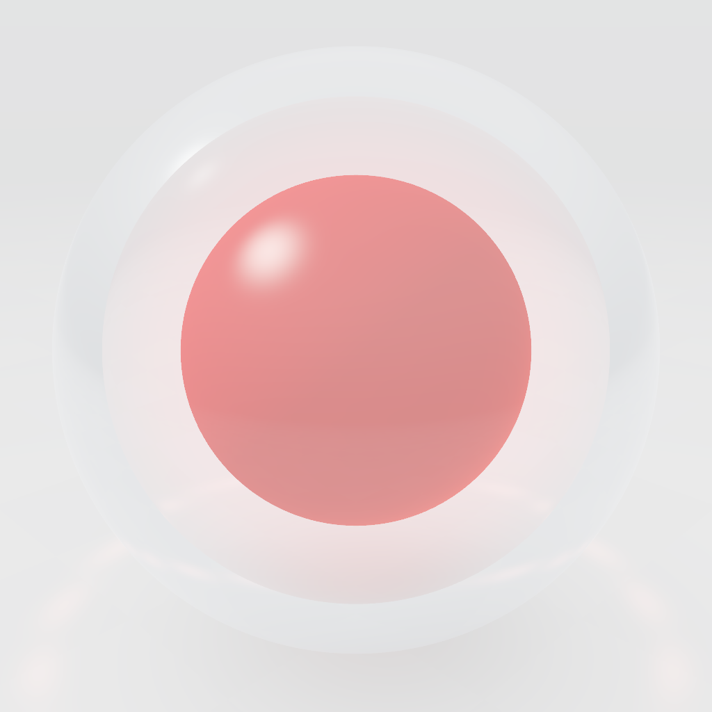

---

### Test 46: Group Theory Kaleidoscope

**Test ID:** `047_group_theory_kaleidoscope`
**Shader Files:** shader.wgsl
**Execution Status:** ✅ Success
**Image Generated:** ✅ Yes
**Judge Scores:** ✅ Available

#### Problem Prompt

> Forge a hypnotic hyperbolic kaleidoscope by reflecting a single (30°,60°,90°) triangle under the (2,3,∞) triangle group. The first-generation reflections should appear vivid and low-depth; deeper reflections progressively darken, giving a sense of plunging into hyperbolic infinity.
>
> Mathematics & tiling algorithm:
> 1. Fundamental triangle: Vertices (in Poincaré disk) at
>    - v₁ = (0, 0)
>    - v₂ = (0.6, 0)
>    - v₃ = (0.2, 0.55)
>    (Angles 90°,60°,30° validated via hyperbolic law of cosines)
> 2. Reflection group: Generate up to depth=4 using mirrors across triangle edges. Expect 1 + 3 + 6 + 12 + 24 = 46 triangles.
> 3. Colour coding: Assign depth d triangle luminosity L = 0.9·0.7^d, hue = 200°+10d (Shifts toward cyan)
> 4. Edge rendering: Edges are circle arcs orthogonal to disk boundary; stroke 1.5 px #222222
> 5. Canvas 2400 × 2400; disk radius fits 95% width. Background white outside disk after crop-mask.
>
> Deliverable: Outputs a single image.

#### Judge Scores

| Category | Score |
|----------|-------|
| Mathematical Accuracy | 62/100 |
| Visual Quality | 82/100 |
| Color Implementation | 48/100 |
| Geometric Completeness | 78/100 |
| Reference Elements | 55/100 |
| **Total** | **325/500** |
| **Average** | **65.0/100** |


#### Rendered Output

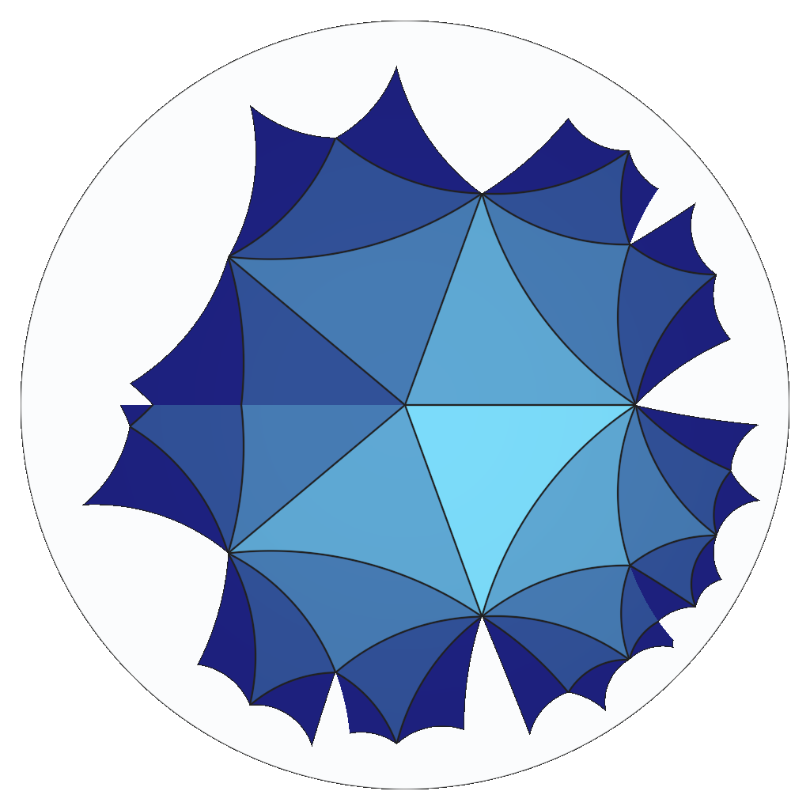

---

### Test 47: Gyroscopic Nested Rings

**Test ID:** `048_gyroscopic_nested_rings`
**Shader Files:** shader.wgsl
**Execution Status:** ✅ Success
**Image Generated:** ✅ Yes
**Judge Scores:** ✅ Available

#### Problem Prompt

> **Objective**
> Create three concentric rings representing a gyroscopic system with orthogonal rotation axes.
>
> **Construction**
> Three concentric rings radii 1, 1.5, 2. Each rotated 30° about mutually orthogonal x, y, z axes respectively. Show instantaneous orientation.
>
> **Styling**
> Colour rings #f66, #6f6, #66f. Camera (4,3,3). 2200×1600 PNG.
>
> **Deliverable** PNG.

#### Judge Scores

| Category | Score |
|----------|-------|
| Mathematical Accuracy | 88/100 |
| Visual Quality | 91/100 |
| Color Implementation | 94/100 |
| Geometric Completeness | 85/100 |
| Reference Elements | 82/100 |
| **Total** | **440/500** |
| **Average** | **88.0/100** |


#### Rendered Output

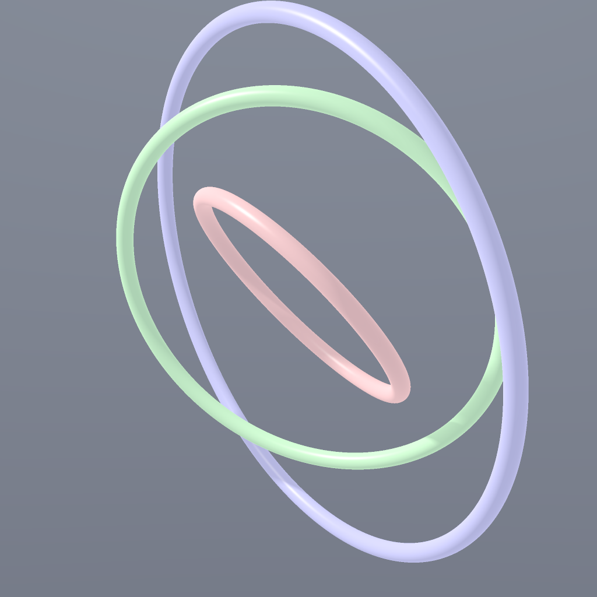

---

### Test 48: Helical Twist Deformation

**Test ID:** `049_helical_twist_deformation`
**Shader Files:** shader.wgsl
**Execution Status:** ✅ Success
**Image Generated:** ✅ Yes
**Judge Scores:** ✅ Available

#### Problem Prompt

> **Objective**
> Render a cube undergoing **helical twist deformation** where the amount of rotation varies linearly along the vertical axis, creating a DNA-like twisted structure.
>
> **Mathematical recipe**
>
> 1. Start with a unit cube centered at origin with vertices at (±1, ±1, ±1).
> 2. Apply helical twist transformation:
>    - For point (x, y, z), twist angle θ = k·z where k = 2π (full rotation over height).
>    - Rotated position: x' = x·cos(θ) - y·sin(θ), y' = x·sin(θ) + y·cos(θ), z' = z.
> 3. Use signed distance field for the twisted cube:
>    - Transform ray point inversely through the twist before evaluating cube SDF.
>    - Cube SDF: max(|x|, |y|, |z|) - 1.0.
> 4. Add edge beveling (radius 0.05) for visual clarity.
>
> **Styling**
>
> * Material: Metallic surface with Fresnel reflections.
> * Color gradient based on height: deep blue (bottom) to golden yellow (top).
> * Three-point lighting: key light from (2, 3, 1), fill from (-1, 1, 2), rim from (0, -2, -1).
> * Soft shadows using 32 shadow rays per point.
> * Camera at (3, 2, 4), looking at origin; FOV 35°.
> * Dark grey background (0.1, 0.1, 0.12).
> * Resolution 2048 × 2048 px, 4× SSAA.
>
> **Deliverable** Single PNG showing the twisted cube with clear helical deformation.

#### Judge Scores

| Category | Score |
|----------|-------|
| Mathematical Accuracy | 63/100 |
| Visual Quality | 34/100 |
| Color Implementation | 58/100 |
| Geometric Completeness | 47/100 |
| Reference Elements | 62/100 |
| **Total** | **264/500** |
| **Average** | **52.8/100** |


#### Rendered Output

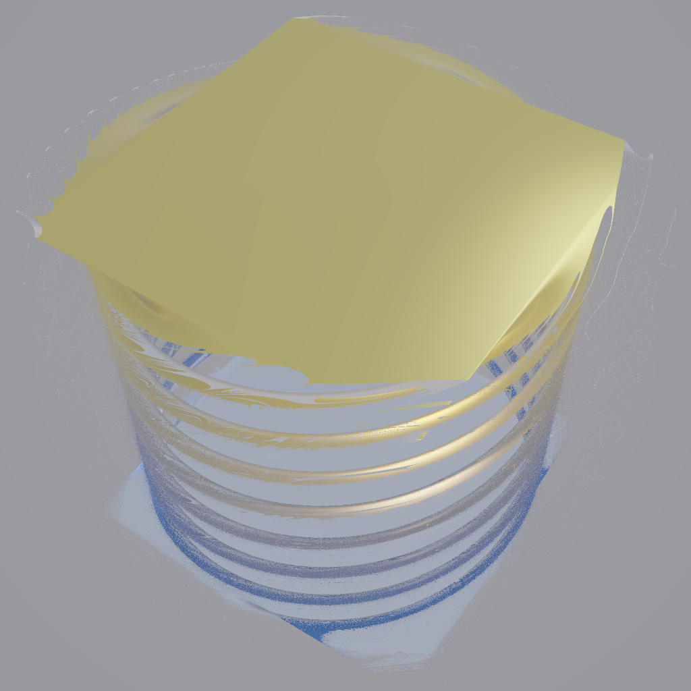

---

### Test 49: Helical Twisted Cube Advanced

**Test ID:** `050_helical_twisted_cube_advanced`
**Shader Files:** shader.wgsl
**Execution Status:** ✅ Success
**Image Generated:** ✅ Yes
**Judge Scores:** ✅ Available

#### Problem Prompt

> **Objective**
> Create a cube with edges following true helical paths during a 90° twist transformation.
>
> **Geometry**
> Same as previous twisted cube but edges must trace true helices: parametric equation for vertical edge
> $x=1,\;z=1,\;y∈[-1,1]$ → after twist:
> $\theta(y)=\frac{\pi}{2}\frac{y+1}{2},\;
> x'(y)=\cos\theta,\;z'(y)=\sin\theta.$
>
> **Styling**
> Render orange diffuse (#ffaa33) with black wire overlay (1 px). 2400×1600 PNG.
>
> **Deliverable** PNG.

#### Judge Scores

| Category | Score |
|----------|-------|
| Mathematical Accuracy | 52/100 |
| Visual Quality | 70/100 |
| Color Implementation | 48/100 |
| Geometric Completeness | 32/100 |
| Reference Elements | 45/100 |
| **Total** | **247/500** |
| **Average** | **49.4/100** |


#### Rendered Output

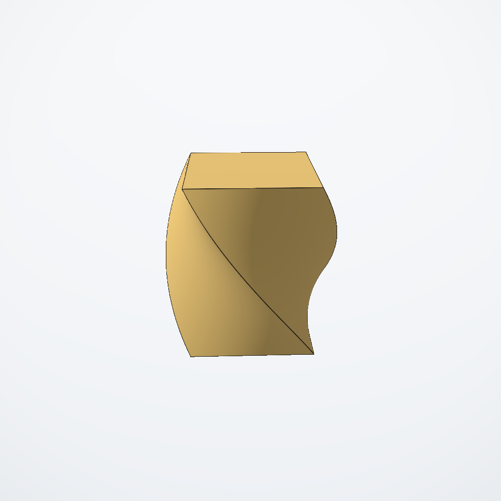

---

### Test 50: Holographic Interference

**Test ID:** `051_holographic_interference`
**Shader Files:** shader.wgsl
**Execution Status:** ✅ Success
**Image Generated:** ✅ Yes
**Judge Scores:** ✅ Available

#### Problem Prompt

> **Objective**
> Render the RGB interference pattern produced when two coherent plane waves of equal intensity intersect in free space at a $20^{\circ}$ angle.
>
> **Physical model**
>
> * ***Wave 1:*** $\mathbf k_{1}=(0,\,0,\,2\pi/\lambda)$.
> * ***Wave 2:*** $\mathbf k_{2}=(\sin10^{\circ},\,0,\,\cos10^{\circ})\,2\pi/\lambda$.
> * Wavelengths: $\lambda_{R}=650\,\text{nm},\;\lambda_{G}=510\,\text{nm},\;\lambda_{B}=460\,\text{nm}$.
> * Electric field at screen point $\mathbf r=(x,y,0)$: $E(\mathbf r)=\sum_{c\in\{R,G,B\}}\bigl[\exp(i\mathbf k_{1}\!\cdot\!\mathbf r)+\exp(i\mathbf k_{2}\!\cdot\!\mathbf r)\bigr]_c$.
> * Intensity $I_c(\mathbf r)=|E_c|^{2}$.
>
> **Image plane**
>
> * Domain $x,y\in[-5\lambda_G,+5\lambda_G]$.
> * Sample $4096\times4096$ grid; periodic boundary conditions not required.
>
> **Rendering**
>
> * Normalise each channel so its maximum intensity maps to value 1, then convert to sRGB.
> * Output 3000 × 3000 px 16‑bit PNG. Black background outside domain. No labels.
>
> **Deliverable**  One PNG file.

#### Judge Scores

| Category | Score |
|----------|-------|
| Mathematical Accuracy | 42/100 |
| Visual Quality | 68/100 |
| Color Implementation | 38/100 |
| Geometric Completeness | 35/100 |
| Reference Elements | 55/100 |
| **Total** | **238/500** |
| **Average** | **47.6/100** |


#### Rendered Output

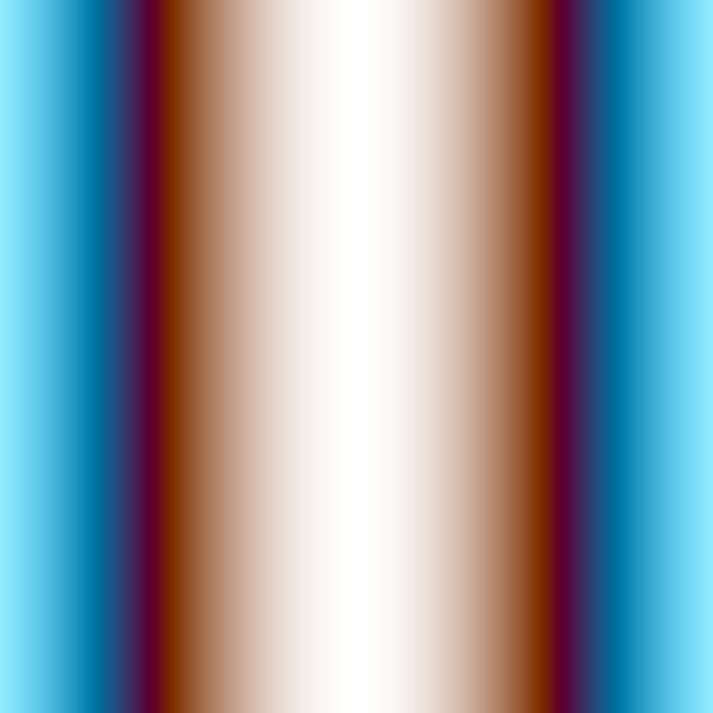

---

### Test 51: Hopf Fibration Base Loops

**Test ID:** `052_hopf_fibration_base_loops`
**Shader Files:** shader.wgsl
**Execution Status:** ✅ Success
**Image Generated:** ✅ Yes
**Judge Scores:** ✅ Available

#### Problem Prompt

> **Objective**
> Produce a single high‑resolution image that visualises the pre‑images (fibres) of three prescribed closed curves on the 2‑sphere under the classical Hopf fibration $p:S^{3}\to S^{2}$.  No copy of the target picture is provided – rely exclusively on the mathematical specification below.
>
> **Mathematical specification**
>
> 1. **Spaces and map**
>
>    * Identify $\mathbb R^{4}\cong\mathbb C^{2}$ by
>      $(x_{1},x_{2},x_{3},x_{4})\longleftrightarrow(z_{0},z_{1})=(x_{1}+i\,x_{2},\;x_{3}+i\,x_{4})$.
>    * The *total space* is the unit $3$-sphere
>
>      $$
>        S^{3}=\left\{(z_{0},z_{1})\in\mathbb C^{2}\;|\;|z_{0}|^{2}+|z_{1}|^{2}=1\right\}.
>      $$
>    * The *base space* is the unit $2$-sphere embedded in $\mathbb C\times\mathbb R\simeq\mathbb R^{3}$:
>
>      $$
>        S^{2}=\left\{(z,x)\;|\;z\in\mathbb C,\;x\in\mathbb R,\;|z|^{2}+x^{2}=1\right\}.
>      $$
>    * Hopf map
>
>      $$
>        p(z_{0},z_{1})=\bigl(2\,z_{0}\,\overline{z}_{1},\;|z_{0}|^{2}-|z_{1}|^{2}\bigr).
>      $$
>
> 2. **Chosen base loops on $S^{2}$**
>    Work in spherical coordinates $(\theta,\varphi)$ with the usual identification
>    $ (x,y,z)=\bigl(\sin\theta\cos\varphi,\,\sin\theta\sin\varphi,\,\cos\theta\bigr)$.
>
>    * **Loop A (upper)** latitude  $+\;60^{\circ}$: $\theta=\dfrac{\pi}{3},\;\varphi\in[0,2\pi)$
>    * **Loop B (equatorial)** latitude $0^{\circ}$: $\theta=\dfrac{\pi}{2},\;\varphi\in[0,2\pi)$
>    * **Loop C (lower)** latitude $-60^{\circ}$: $\theta=\dfrac{2\pi}{3},\;\varphi\in[0,2\pi)$
>
> 3. **Geometry to render**
>    For each base loop $\Gamma_{k}$ ($k\in\{A,B,C\}$) render the torus
>
>    $$
>       T_{k}=p^{-1}(\Gamma_{k})\subset S^{3}.
>    $$
>
>    Each point of $T_{k}$ is a *circle fibre*; the union of those fibres over the loop is a flat torus embedded in $S^{3}$.
>
> 4. **Projection to $\mathbb R^{3}$**
>    Use stereographic projection $\sigma:S^{3}\setminus\{(0,0,0,1)\}\to\mathbb R^{3}$ from the north‑pole $(0,0,0,1)$.  Compose $T_{k}$ with $\sigma$ to obtain three linked tori in $\mathbb R^{3}$.
>
> 5. **Rendering style**
>
>    * Draw every fibre as a smooth tube of constant radius (≈ 1 % of the circumscribed sphere diameter) and at least 500 points per fibre so that the surface looks continuous.
>    * Colour **continuously** with the HSV hue wheel according to the polar angle $\varphi$ on the base loop: $\text{Hue}= \varphi/(2\pi)$.  Apply identical colouring to fibre points originating from the same base point.
>    * Place a small translucent grey sphere at the lower‑right of the frame representing the base $S^{2}$; plot the three coloured base loops on it and include three thin axial rods (±x,±y,±z) for orientation.
>    * Use a white background, soft Phong shading, no outlines. Image should be at least 1600 × 1600 px, antialiased.
>
> **Deliverable**
> A single RGB image (PNG preferred) satisfying the above geometric and stylistic constraints.

#### Judge Scores

| Category | Score |
|----------|-------|
| Mathematical Accuracy | 68/100 |
| Visual Quality | 88/100 |
| Color Implementation | 58/100 |
| Geometric Completeness | 79/100 |
| Reference Elements | 70/100 |
| **Total** | **363/500** |
| **Average** | **72.6/100** |


#### Rendered Output

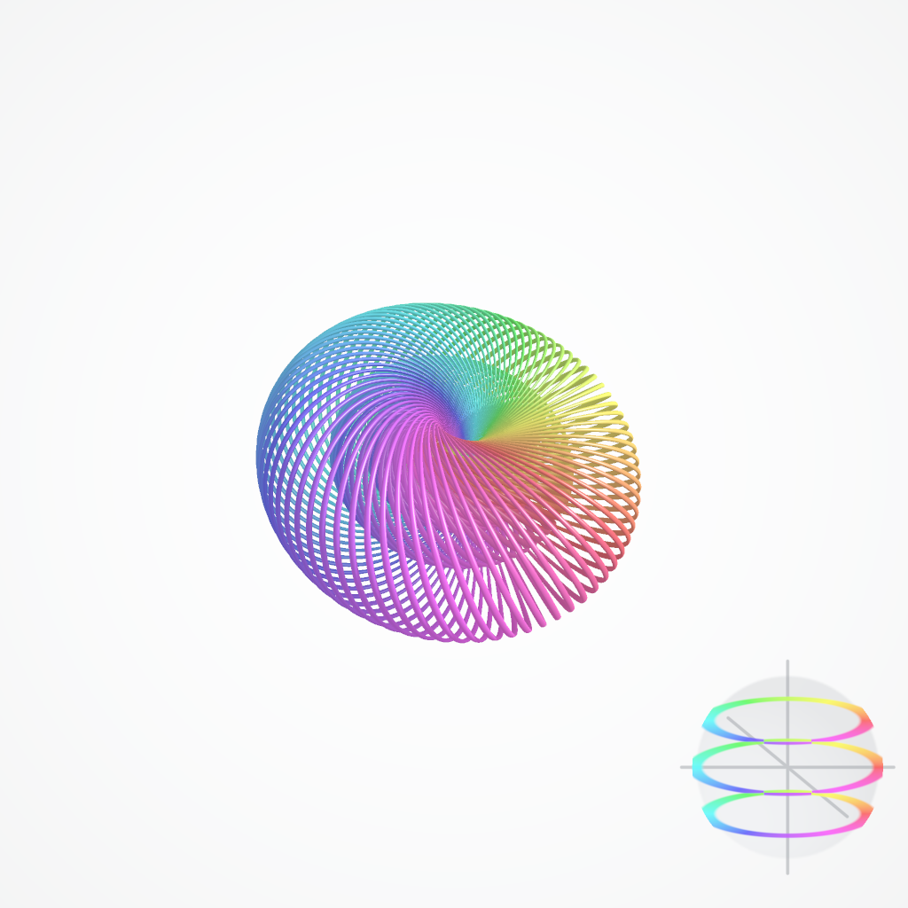

---

### Test 52: Hyper Menger Cube 3Sphere

**Test ID:** `053_hyper_menger_cube_3sphere`
**Shader Files:** shader.wgsl
**Execution Status:** ✅ Success
**Image Generated:** ✅ Yes
**Judge Scores:** ✅ Available

#### Problem Prompt

> **Objective**
> Generate a shader that renders the intersection of a 4D Hyper Menger Cube with the unit 3-sphere, projected into 3D space. This visualization should demonstrate both the 4D fractal geometry and the spherical intersection, creating a unique cross-section view of the 4D fractal structure.
>
> **Mathematical Specification**
>
> 1. **4D Hyper Menger Cube Construction**
>
>    The 4D Menger cube (Menger tesseract) is constructed by extending the 3D Menger cube construction to 4 dimensions:
>
>    * Start with a unit tesseract (4D hypercube) in [-1,1]⁴
>    * At each iteration, divide each face into a 3×3 grid
>    * Remove the center of each 3D face and the 4D "cross" passing through all centers
>    * For a point (x,y,z,w), apply the Menger construction rules to all 4 coordinates
>    * A point is kept if at most 2 of its coordinates have (coordinate mod 3ⁿ) = 1 at scale n
>
> 2. **3-Sphere Intersection**
>
>    The unit 3-sphere in 4D is defined as:
>    $$S^3 = \{(x,y,z,w) \in \mathbb{R}^4 : x^2 + y^2 + z^2 + w^2 = 1\}$$
>
>    The intersection is:
>    $$I = \{p \in S^3 : p \text{ belongs to the 4D Menger cube}\}$$
>
> 3. **Stereographic Projection to 3D**
>
>    Project the intersection from 4D to 3D using stereographic projection from the point (0,0,0,1):
>    $$\pi(x,y,z,w) = \frac{1}{1-w}(x,y,z) \text{ for } w \neq 1$$
>
>    Handle the singularity at w=1 by using a small offset or alternative projection method.
>
> 4. **Geometric Properties**
>
>    * **Iterations**: Implement at least 3 complete iterations of the 4D Menger construction
>    * **Cross-sections**: The result should show characteristic Menger cube cross-sections at different "depths" (w-values)
>    * **Connectivity**: Maintain the connected fractal structure throughout the intersection
>
> 5. **Rendering Specifications**
>
>    * **Resolution**: Minimum 1600×1600 pixels with anti-aliasing
>    * **Perspective**: Use a 3D camera positioned to reveal the complex structure
>    * **Rotation**: Apply gentle rotation to show multiple aspects of the intersection
>
>    **Material and Coloring**:
>    * Color based on the w-coordinate before projection:
>      - w ≈ 1.0 (north pole): Bright yellow (#ffeb3b)
>      - w ≈ 0.0 (equator): Deep orange (#ff5722)
>      - w ≈ -1.0 (south pole): Dark purple (#4a148c)
>    * Use smooth interpolation between these colors
>    * Apply a glossy, semi-transparent material (α = 0.8) to show internal structure
>
> 6. **Lighting and Environment**
>
>    * **Lighting**: Multiple light sources to illuminate the complex geometry:
>      - Primary light from upper-right
>      - Secondary light from lower-left
>      - Ambient lighting to prevent deep shadows
>    * **Background**: Deep space gradient from dark blue (#0d47a1) to black (#000000)
>    * **Effects**: Subtle subsurface scattering to enhance the semi-transparent appearance
>
> 7. **Mathematical Accuracy Requirements**
>
>    * Ensure proper 4D distance calculations for the Menger construction
>    * Correctly implement the sphere constraint x²+y²+z²+w²=1
>    * Accurate stereographic projection maintaining topological properties
>    * No geometric artifacts from improper 4D to 3D conversion
>
> **Deliverable**
> A single high-resolution PNG image showing the 3D projection of the 4D Menger cube intersected with the 3-sphere, with proper coloring, transparency, and lighting to reveal the intricate fractal cross-sectional structure.

#### Judge Scores

| Category | Score |
|----------|-------|
| Mathematical Accuracy | 48/100 |
| Visual Quality | 72/100 |
| Color Implementation | 42/100 |
| Geometric Completeness | 55/100 |
| Reference Elements | 58/100 |
| **Total** | **275/500** |
| **Average** | **55.0/100** |


#### Rendered Output

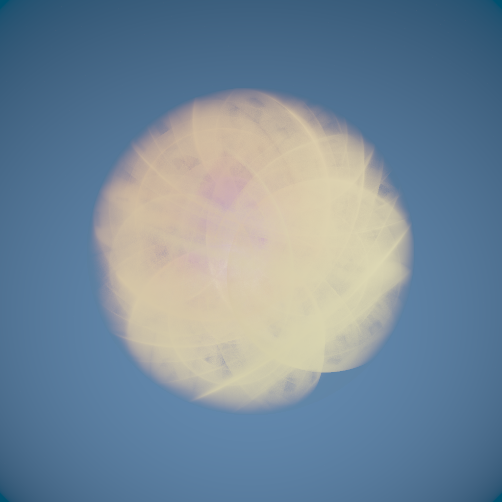

---

### Test 53: Hyperbolic Heat Kernel

**Test ID:** `054_hyperbolic_heat_kernel`
**Shader Files:** shader.wgsl
**Execution Status:** ✅ Success
**Image Generated:** ✅ Yes
**Judge Scores:** ✅ Available

#### Problem Prompt

> Imagine a thermogram on the Poincaré disk that visualises how heat pulses spread in negatively curved space. Colours must transition from white-hot at the centre to icy indigo at the frontier, emphasising the exponentially accelerated diffusion unique to hyperbolic geometry.
>
> Mathematics:
> - Heat kernel in 2-D hyperbolic space (curvature −1) for time t=0.2:
>   K(r,t) = (1/√(4πt)) * exp(-t) * exp(-r²/(4t))
>   where r is the hyperbolic distance from origin (on Poincaré disk r = 2 artanh ρ with ρ=|z|)
> - Compute K on 2048×2048 disk-centric grid
>
> Colour & geometry:
> - Map K linearly to "plasma" palette (Matplotlib); K_max≈1.2400 at centre
> - Cap outer 10 px ring to pure black to frame disk
> - Overlay geodesic circle of hyperbolic radius 1.5 (Euclidean radius ρ_c=tanh(1.5/2)=0.905); draw as 3 px gold (#ffcc33) dashed line (dash 12 px)
>
> Annotations:
> - Add a minuscule legend at bottom-left: colour bar 200 × 20 px, ticks at K=1.24, 0.5, 0.1
>
> File: PNG-24, sRGB, 2200 × 2200 px
> Deliverable: Outputs a single image.

#### Judge Scores

| Category | Score |
|----------|-------|
| Mathematical Accuracy | 82/100 |
| Visual Quality | 86/100 |
| Color Implementation | 78/100 |
| Geometric Completeness | 75/100 |
| Reference Elements | 79/100 |
| **Total** | **400/500** |
| **Average** | **80.0/100** |


#### Rendered Output

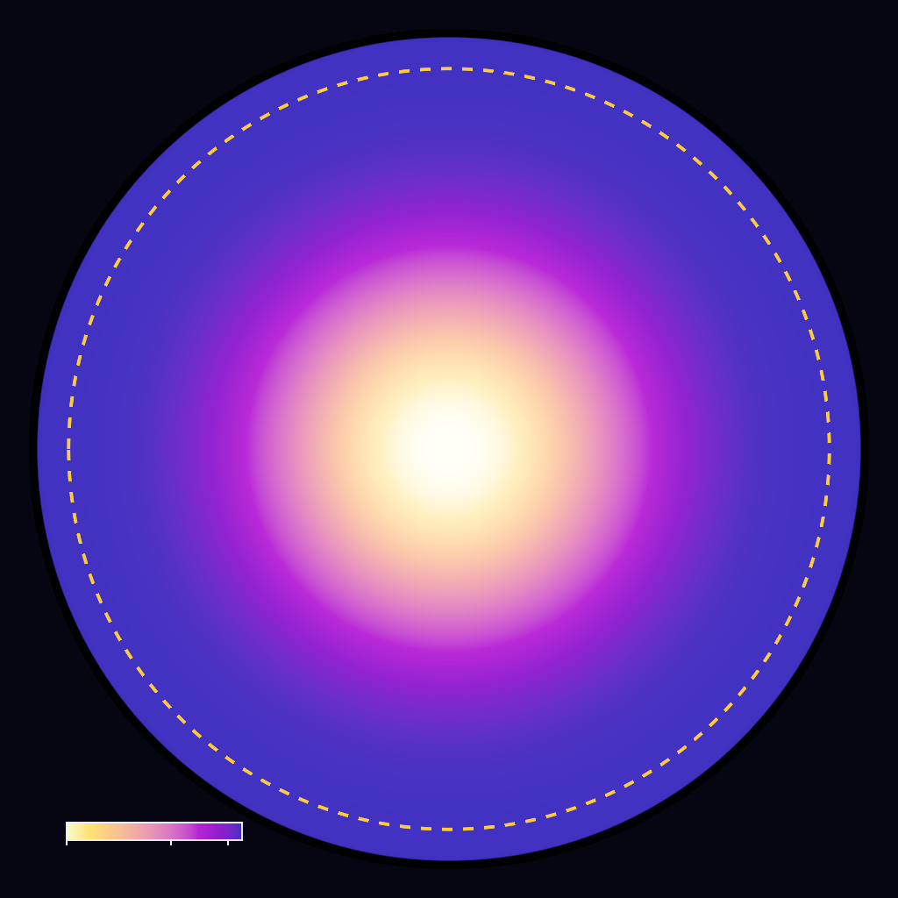

---

### Test 54: Icosahedron Wireframe

**Test ID:** `055_icosahedron_wireframe`
**Shader Files:** shader.wgsl
**Execution Status:** ✅ Success
**Image Generated:** ✅ Yes
**Judge Scores:** ✅ Available

#### Problem Prompt

> **Objective**
> Render a regular icosahedron in wireframe mode with proper edge and vertex visualization.
>
> **Construction**
> Build regular icosahedron edge 1. Perspective camera (3,2,2).
>
> **Styling**
> Render edges 2 px #0088ff, vertices small red points. 1800 × 1500 px white canvas.
>
> **Deliverable** – PNG.

#### Judge Scores

| Category | Score |
|----------|-------|
| Mathematical Accuracy | 76/100 |
| Visual Quality | 82/100 |
| Color Implementation | 78/100 |
| Geometric Completeness | 58/100 |
| Reference Elements | 66/100 |
| **Total** | **360/500** |
| **Average** | **72.0/100** |


#### Rendered Output

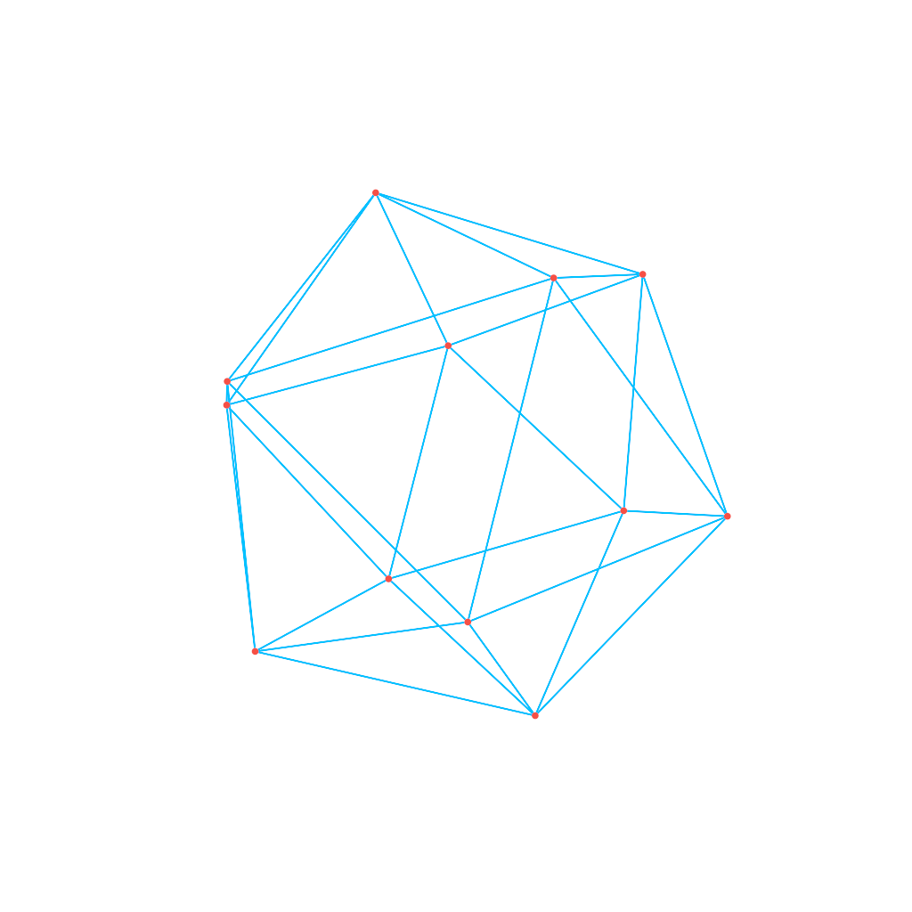

---

### Test 55: Klein Bottle

**Test ID:** `056_klein_bottle`
**Shader Files:** shader.wgsl
**Execution Status:** ✅ Success
**Image Generated:** ✅ Yes
**Judge Scores:** ✅ Available

#### Problem Prompt

> **Objective**
> Render a Klein bottle using the classical parametrization to visualize this non-orientable surface.
>
> **Parametric equations**
> Use classical parametrisation (radius 2):
>
> $
> \begin{aligned}
> x &=\bigl(R+\cos u/2\sin v - \sin u/2\sin 2v\bigr)\cos u,\\
> y &=\bigl(R+\cos u/2\sin v - \sin u/2\sin 2v\bigr)\sin u,\\
> z &=\sin u/2\sin v + \cos u/2\sin 2v,
> \end{aligned}
> $
>
> with $u∈[0,2π],\;v∈[0,2π],\;R=2$. Grid 600×120.
>
> **Styling**
>
> Back‑face culling **disabled** (visualise 1‑sidedness). Colour by Gaussian curvature (blue → 0, red → +). Phong light (4,5,8). Camera (6,3,1). BG #eefeff. 2600×1600 PNG.
>
> **Deliverable** PNG.

#### Judge Scores

| Category | Score |
|----------|-------|
| Mathematical Accuracy | 78/100 |
| Visual Quality | 87/100 |
| Color Implementation | 76/100 |
| Geometric Completeness | 72/100 |
| Reference Elements | 74/100 |
| **Total** | **387/500** |
| **Average** | **77.4/100** |


#### Rendered Output

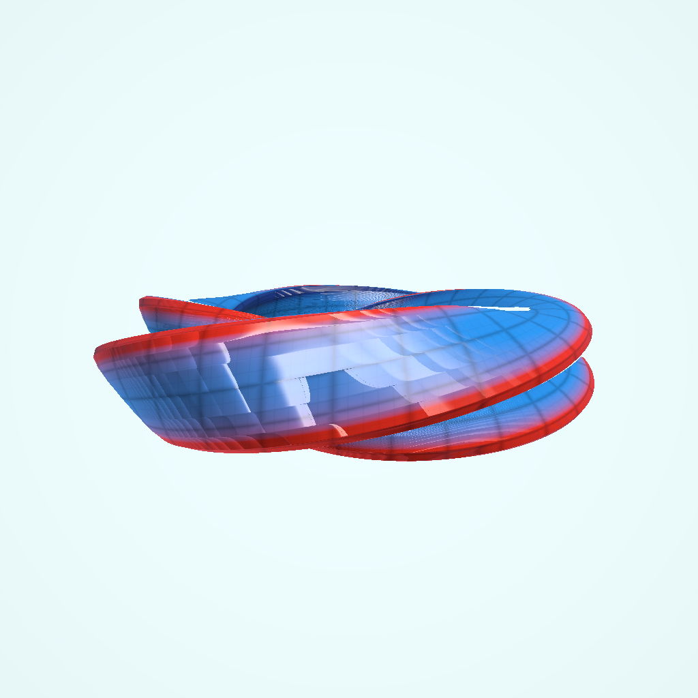

---

### Test 56: Lissajous Curve Garden

**Test ID:** `057_lissajous_curve_garden`
**Shader Files:** shader.wgsl
**Execution Status:** ✅ Success
**Image Generated:** ✅ Yes
**Judge Scores:** ✅ Available

#### Problem Prompt

> # Lissajous Curve Garden
>
> Create a dynamic WebGL scene featuring multiple Lissajous curves with different frequency ratios and phase shifts, arranged in a garden-like display.
>
> ## Requirements:
>
> 1. Display at least 5 different Lissajous curves simultaneously
> 2. Each curve should have:
>    - Different frequency ratios (e.g., 3:2, 4:3, 5:4)
>    - Different phase shifts
>    - Unique colors that smoothly blend along the curve
> 3. Animate the curves by slowly varying their phase shifts
> 4. Arrange curves in 3D space with proper depth perspective
> 5. Add subtle rotation to the entire scene for better viewing
> 6. Include smooth anti-aliasing for clean curve rendering
> 7. Implement a gradient background that complements the curves

#### Judge Scores

| Category | Score |
|----------|-------|
| Mathematical Accuracy | 72/100 |
| Visual Quality | 86/100 |
| Color Implementation | 34/100 |
| Geometric Completeness | 38/100 |
| Reference Elements | 68/100 |
| **Total** | **298/500** |
| **Average** | **59.6/100** |


#### Rendered Output

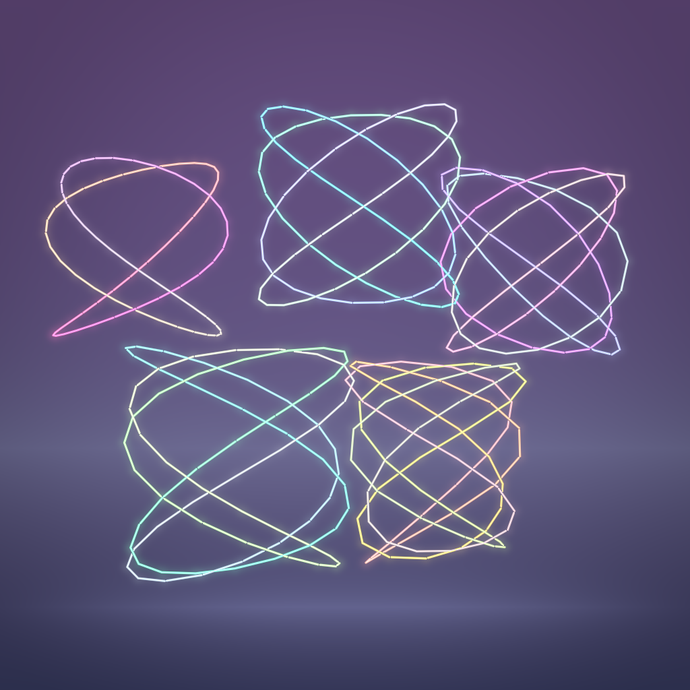

---

### Test 57: Logarithmic Spiral Motion

**Test ID:** `058_logarithmic_spiral_motion`
**Shader Files:** shader.wgsl
**Execution Status:** ✅ Success
**Image Generated:** ✅ Yes
**Judge Scores:** ✅ Available

#### Problem Prompt

> **Objective**
> Create a visualization of **logarithmic spiral motion** in 3D space, showing particles following exponential spiral trajectories with simultaneous rotation and scaling.
>
> **Mathematical recipe**
>
> 1. Generate 8 particle streams, each starting at different angles.
> 2. Logarithmic spiral in cylindrical coordinates:
>    - r(t) = r₀ · exp(k·t), where k = 0.15 (growth rate).
>    - θ(t) = θ₀ + ω·t, where ω = π/2 (angular velocity).
>    - z(t) = h₀ + v·t, where v = 0.3 (vertical velocity).
>    - t ∈ [0, 20] for full spiral development.
> 3. Each stream consists of 100 particles with time offset.
> 4. Particle size scales with exp(-k·t/2) (shrinks as it spirals out).
> 5. Add motion blur trails showing trajectory history.
>
> **Styling**
>
> * Particles: Glowing spheres with HDR emission.
> * Color by spiral arm: Full HSV spectrum distributed evenly.
> * Intensity fades exponentially with distance from center.
> * Motion trails: 20% opacity, length proportional to velocity.
> * Central attractor: Bright white emissive sphere (radius 0.1).
> * Dark background with radial gradient.
> * Bloom and glow post-processing.
> * Camera at (3, 4, 2), looking at origin; FOV 50°.
> * Resolution 2048 × 2048 px, 4× SSAA.
>
> **Deliverable** Single PNG capturing the dynamic logarithmic spiral motion pattern.

#### Judge Scores

| Category | Score |
|----------|-------|
| Mathematical Accuracy | 86/100 |
| Visual Quality | 88/100 |
| Color Implementation | 89/100 |
| Geometric Completeness | 84/100 |
| Reference Elements | 86/100 |
| **Total** | **433/500** |
| **Average** | **86.6/100** |


#### Rendered Output

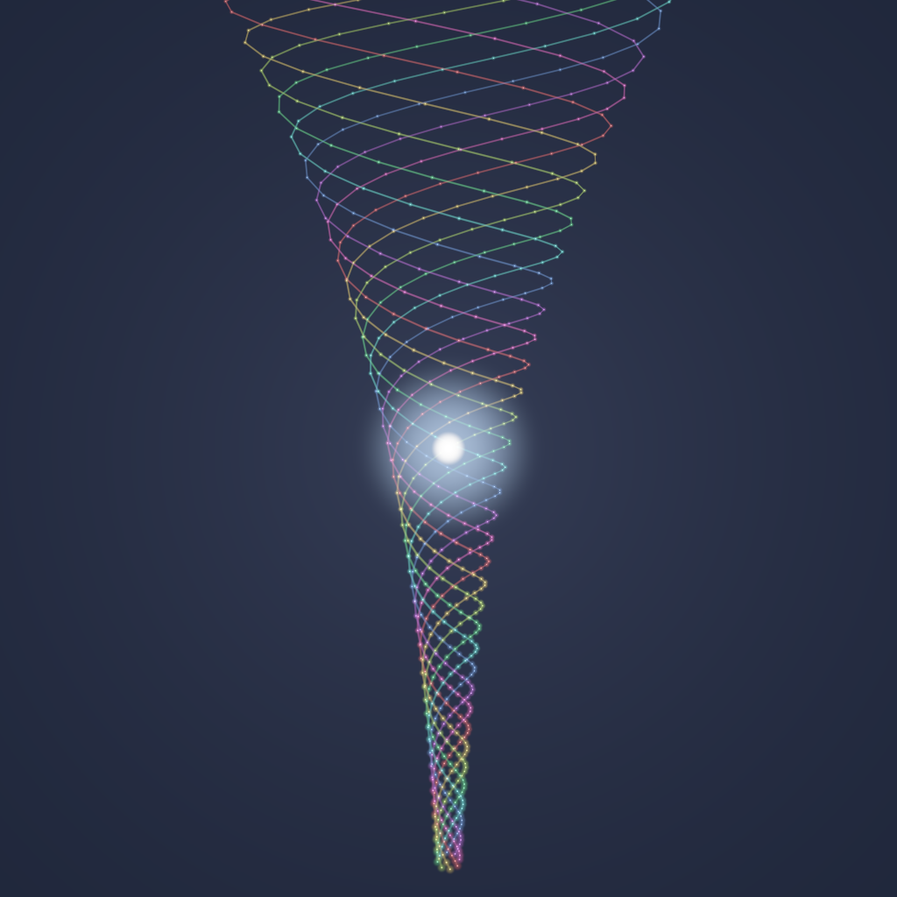

---

### Test 58: Lorenz Attractor Poincare

**Test ID:** `059_lorenz_attractor_poincare`
**Shader Files:** shader.wgsl
**Execution Status:** ✅ Success
**Image Generated:** ✅ Yes
**Judge Scores:** ✅ Available

#### Problem Prompt

> **Objective**
> Integrate the Lorenz system ($\sigma=10,\;\rho=28,\;\beta=8/3$) and visualise both the 3‑D trajectory and its Poincaré section at plane $z=\rho-1=27$.
>
> **Numerics**
>
> * Integrator: 4th‑order RK, $\Delta t=0.005$, total time 100 s.
> * Initial point (1,1,1).
> * Record intersections where trajectory crosses plane with $\dot z>0$; interpolate linearly for exact hit.
>
> **Rendering**
>
> * 3‑D curve: colour by time (HSV hue 0 → 360° over integration). Thickness 1 % of attractor diameter.
> * Poincaré points: 4‑px circles on the plane, coloured white.
> * Plane semi‑transparent (#444444, α 0.15).
> * Camera (40°,30°) spherical at radius 50; FOV 60°.  White background.
> * 2000 × 1600 px PNG, gamma 2.2.
>
> **Deliverable** PNG.

#### Judge Scores

| Category | Score |
|----------|-------|
| Mathematical Accuracy | 43/100 |
| Visual Quality | 66/100 |
| Color Implementation | 31/100 |
| Geometric Completeness | 58/100 |
| Reference Elements | 36/100 |
| **Total** | **234/500** |
| **Average** | **46.8/100** |


#### Rendered Output

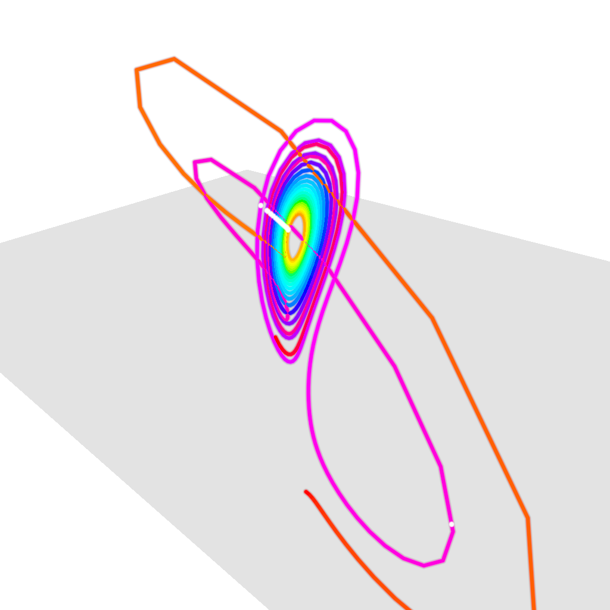

---

### Test 59: Loxodromic Sphere Spirals

**Test ID:** `060_loxodromic_sphere_spirals`
**Shader Files:** shader.wgsl
**Execution Status:** ✅ Success
**Image Generated:** ✅ Yes
**Judge Scores:** ✅ Available

#### Problem Prompt

> **Objective**
> Render **loxodromic spirals** on a sphere surface—curves that maintain constant angle with meridians, creating mesmerizing spiral patterns from pole to pole.
>
> **Mathematical recipe**
>
> 1. Generate 12 loxodromic curves on unit sphere, each with different starting longitude.
> 2. Loxodrome parameterization (angle α = 35° with meridians):
>    - θ(t) = 2·arctan(exp(t·cot(α))) - π/2 (latitude)
>    - φ(t) = φ₀ + t (longitude)
>    - t ∈ [-8, 8] to cover multiple spiral turns.
> 3. Convert to Cartesian: x = cos(θ)cos(φ), y = cos(θ)sin(φ), z = sin(θ).
> 4. Render each spiral as a tube (radius 0.02) with emissive material.
> 5. Add transparent sphere (radius 0.98) with subtle grid lines.
>
> **Styling**
>
> * Spiral colors: HSV gradient based on longitude φ₀, full spectrum.
> * Emissive intensity varies with latitude: brightest at equator.
> * Sphere: glass-like material, IOR 1.1, transparency 0.85.
> * Dark background with subtle star field.
> * Bloom post-processing for glowing spirals.
> * Camera at (2.5, 1.5, 2), looking at origin; FOV 45°.
> * Resolution 2048 × 2048 px, 4× SSAA.
>
> **Deliverable** Single PNG showing luminous loxodromic spirals wrapping the sphere.

#### Judge Scores

| Category | Score |
|----------|-------|
| Mathematical Accuracy | 88/100 |
| Visual Quality | 91/100 |
| Color Implementation | 87/100 |
| Geometric Completeness | 89/100 |
| Reference Elements | 86/100 |
| **Total** | **441/500** |
| **Average** | **88.2/100** |


#### Rendered Output

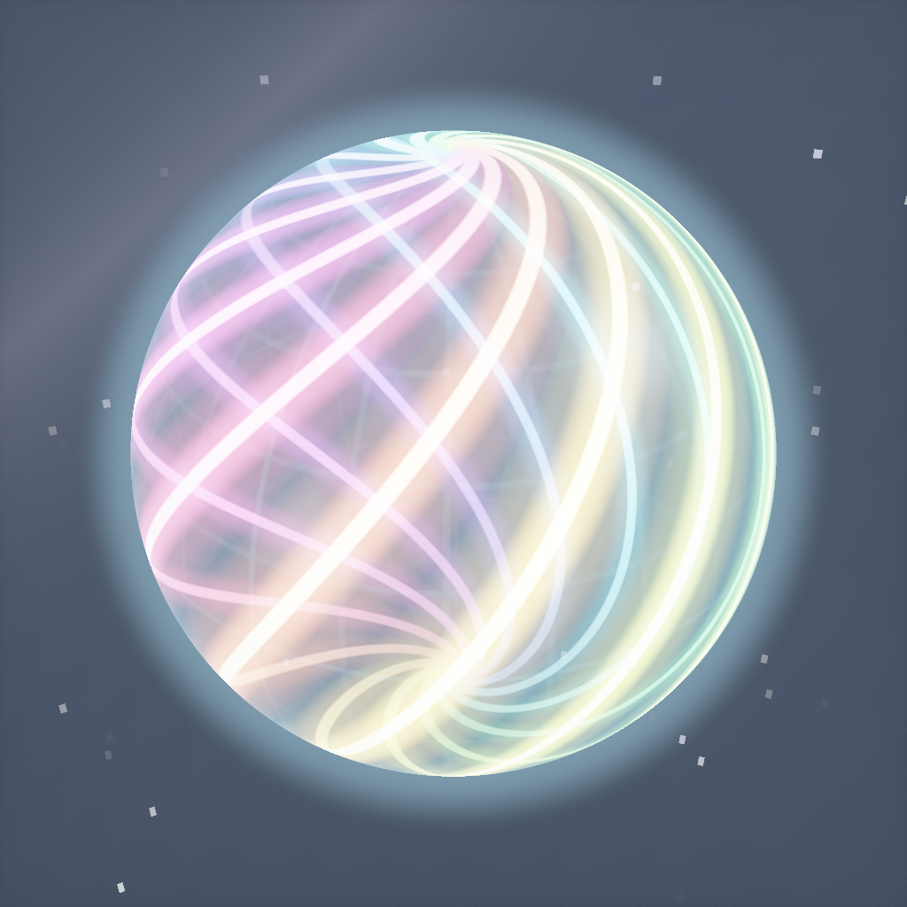

---

### Test 60: Mandala Circles

**Test ID:** `061_mandala_circles`
**Shader Files:** shader.wgsl
**Execution Status:** ✅ Success
**Image Generated:** ✅ Yes
**Judge Scores:** ✅ Available

#### Problem Prompt

> **Objective** – Draw a "sacred‑geometry" mandala with exact **12‑fold radial symmetry** composed solely of mutually tangent circles.
>
> **Geometry**
>
> 1. **Central circle** radius $R_{0}=0.30$; centre at origin.
> 2. **First ring** – 12 identical circles of radius
>
>    $
>      R_{1}=R_{0}\bigl(\csc{\tfrac{\pi}{12}}-1\bigr)^{-1}\approx0.10476,
>    $
>
>    centred on a circle of radius $C_{1}=R_{0}+R_{1}$ at polar angles $\theta_{n}=n\cdot30^{\circ}$.
>    (Each outer circle is tangent to the central circle and to its two immediate neighbours.)
> 3. **Bounding circle** of radius $1.00$ centred at origin, tangent to every first‑ring circle (the mandala fits exactly).
>
> **Styling**
>
> * Fill central circle #ffdd55; first‑ring circles alternate #66ccee / #ff7777 as $\theta_{n}$ increases; bounding circle transparent fill, 3‑px gold stroke.
> * All inner circles have 2‑px black stroke.
> * White background, 2000 × 2000 px PNG. No text.
>
> **Deliverable** – single PNG file.

#### Judge Scores

| Category | Score |
|----------|-------|
| Mathematical Accuracy | 84/100 |
| Visual Quality | 93/100 |
| Color Implementation | 86/100 |
| Geometric Completeness | 95/100 |
| Reference Elements | 82/100 |
| **Total** | **440/500** |
| **Average** | **88.0/100** |


#### Rendered Output

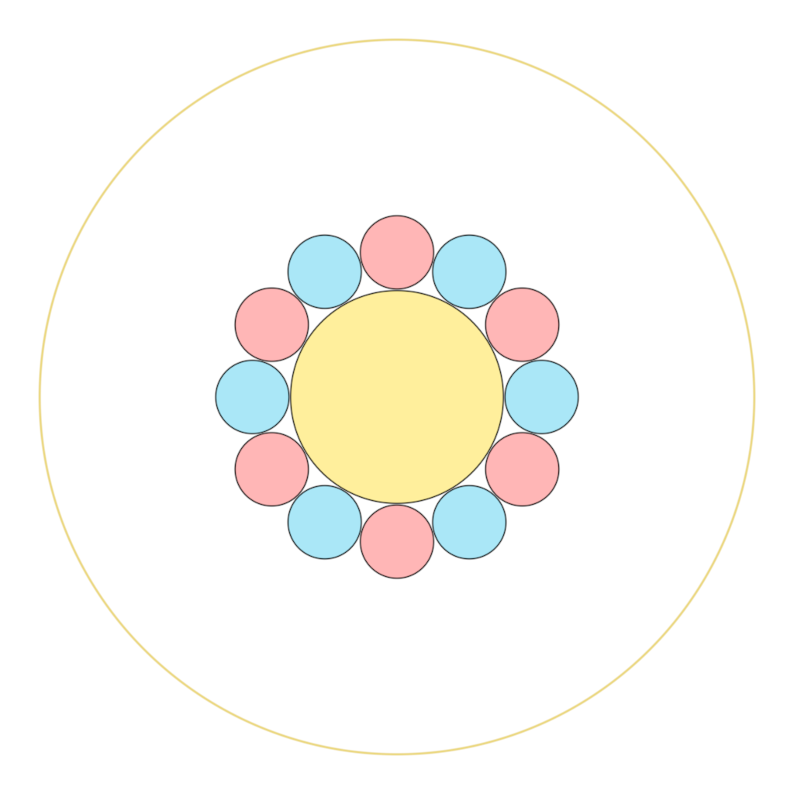

---

### Test 61: Mandelbulb Fractal

**Test ID:** `062_mandelbulb_fractal`
**Shader Files:** shader.wgsl
**Execution Status:** ✅ Success
**Image Generated:** ✅ Yes
**Judge Scores:** ✅ Available

#### Problem Prompt

> **Objective**
> Render a single, high‑resolution image of the order‑8 *Mandelbulb* fractal using ray‑marching with a distance estimator. No reference image is provided—follow the mathematical and stylistic requirements below.
>
> **Fractal definition**
>
> 1. **Iteration**   For a point **p** ∈ ℝ³ let
>
>    $
>      \mathbf z_{0}=\mathbf p,\qquad
>      \mathbf z_{k+1}=F(\mathbf z_{k})+ \mathbf p,
>    $
>
>    where
>    – write $\mathbf z_{k}$ in spherical co‑ordinates $(r,\theta,\phi)$ (with $r=‖\mathbf z_{k}‖$);
>    – apply the "power‑8 bulb" map
>
>    $
>      F(r,\theta,\phi)= r^{8}\bigl(\sin(8\theta)\cos(8\phi),\;\sin(8\theta)\sin(8\phi),\;\cos(8\theta)\bigr).
>    $
> 2. **Escape test**   Stop after $N_{\max}=18$ iterations or when $‖\mathbf z_{k}‖>4$.
>
> **Distance estimator**
> Use the analytic estimator
>
> $
>   d(\mathbf p)= \frac{‖\mathbf z_{n}‖\;\ln‖\mathbf z_{n}‖}{\bigl|\partial_r‖\mathbf z_{n}‖\bigr|},
> $
>
> accumulated alongside the iteration in standard fashion (analytic derivative chain‑rule). Terminate the ray when the accumulated distance to the surface falls below 0.001 of the scene radius or the ray exits a 5‑unit bounding sphere.
>
> **Camera & lighting**
>
> * Camera origin $(3,\,3,\,2)$ looking at the origin; right‑handed coordinate frame; 45° vertical FOV.
> * One white point light at $(4,\,4,\,4)$; Phong shading with ambient = 0.1, diffuse = 0.7, specular = 0.2, shininess = 32.
>
> **Colouring**
> Map the *smooth escape value*
>
> $
>   \nu = n + 1 - \frac{\ln\ln‖\mathbf z_{n}‖}{\ln 8}
> $
>
> to HSV hue = $\nu/18$, saturation = 1, value = 1, then convert to sRGB. Inside points (non‑escaped) are coloured #101010.
>
> **Rendering requirements**
>
> * Resolution ≥ 2000 × 2000 px, 4× SSAA.
> * Gamma‑correct output (γ = 2.2), saved as 16‑bit PNG.
> * White background for rays that miss the fractal. No text or overlays.
>
> **Deliverable**
> A single PNG file that meets all constraints.

#### Judge Scores

| Category | Score |
|----------|-------|
| Mathematical Accuracy | 78/100 |
| Visual Quality | 75/100 |
| Color Implementation | 80/100 |
| Geometric Completeness | 66/100 |
| Reference Elements | 73/100 |
| **Total** | **372/500** |
| **Average** | **74.4/100** |


#### Rendered Output

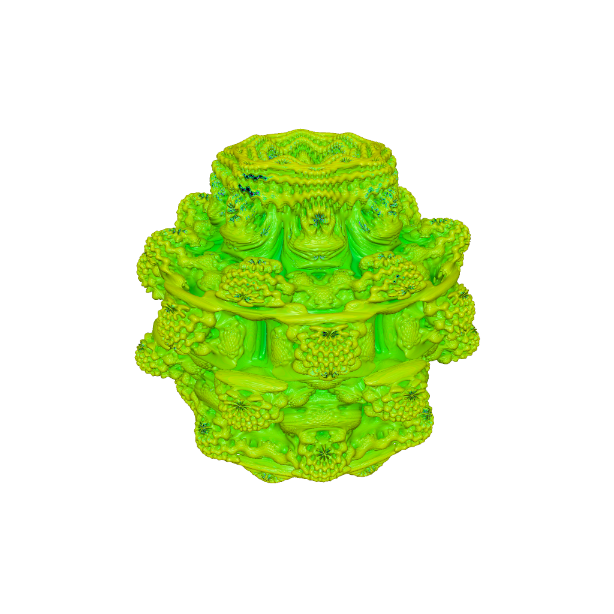

---

### Test 62: Mean Curvature Flow Surgery

**Test ID:** `063_mean_curvature_flow_surgery`
**Shader Files:** shader.wgsl
**Execution Status:** ✅ Success
**Image Generated:** ✅ Yes
**Judge Scores:** ✅ Available

#### Problem Prompt

> **Objective**
> Produce a single high-resolution image showing a representative frame of mean-curvature flow immediately after a neck-pinch surgery on a dumbbell-shaped surface. The visualization should make the geometric flow, high-curvature neck, and surgery caps visually explicit.
>
> **Mathematical specification**
> 1. Coordinate system: render a 3D surface in coordinates `(x, y, z)`, with the dumbbell axis along `z`.
> 2. Static time: render the post-surgery state at normalized time `t = 0.64`, just after the first neck-pinch event. Also include a faint ghost of the pre-surgery surface at `t = 0.60`.
> 3. Pre-surgery ghost surface: an axisymmetric dumbbell of revolution with radius
>    `ρ_pre(z) = 0.045 + 0.46 exp(-((z - 0.58)^2)/0.18) + 0.46 exp(-((z + 0.58)^2)/0.18)`, for `z ∈ [-1.15, 1.15]`.
> 4. Post-surgery visible surface: two separated capped components. Use the same bulb profile for `z ∈ [0.13, 1.15]` and `z ∈ [-1.15, -0.13]`, but close each cut at `z = ±0.13` with smooth convex caps of radius about `0.12`.
> 5. Mean-curvature encoding: color the post-surgery surface by qualitative mean curvature magnitude:
>    - deep blue on low-curvature outer bulb regions,
>    - white/yellow on moderate curvature,
>    - orange/red near the two new surgery caps and the vanished neck location.
> 6. Surgery markers: draw two thin red circular scar rings at `z = +0.13` and `z = -0.13`, where the neck was cut.
>
> **Geometry to render**
> - The two post-surgery components should be smooth closed surfaces, not open tubes.
> - The pre-surgery ghost should be a translucent grey wireframe or transparent surface showing the original continuous neck.
> - Add faint mean-curvature flow arrows normal to the ghost surface near the neck, pointing inward toward the pinching direction.
> - Add a small central gap between the two new caps so the topological separation is unambiguous.
>
> **Rendering style**
> - White background, soft Phong lighting, anti-aliased edges.
> - Main post-surgery surface: glossy but not mirror-like, with a curvature heatmap.
> - Ghost surface: light grey, 20–30% opacity.
> - Scar rings: saturated red, thin but clearly visible.
>
> **Composition / overlays**
> - Camera: oblique three-quarter view from above, with the `z` axis slightly diagonal in the frame.
> - Add a small vertical axis rod labeled or ticked as `z`.
> - Include a compact colorbar swatch from blue to red labeled/ticked as low to high curvature if text is available; otherwise use an unlabeled gradient strip.
>
> **Technical specs**
> - Resolution at least `1600 × 1600` pixels.
> - Static frame only; no animation.
> - Output format: PNG.
>
> **Deliverable** A single PNG image satisfying the above.

#### Judge Scores

| Category | Score |
|----------|-------|
| Mathematical Accuracy | 82/100 |
| Visual Quality | 88/100 |
| Color Implementation | 78/100 |
| Geometric Completeness | 84/100 |
| Reference Elements | 80/100 |
| **Total** | **412/500** |
| **Average** | **82.4/100** |


#### Rendered Output

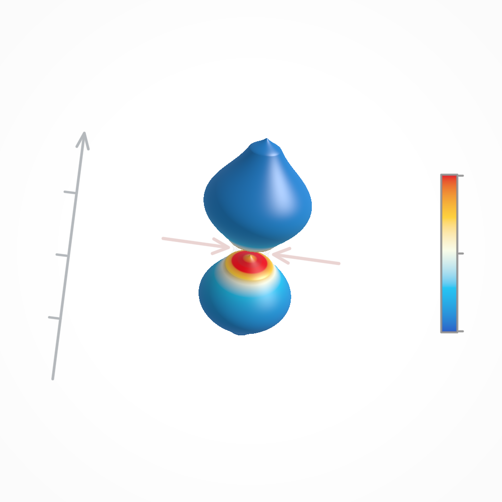

---

### Test 63: Menger Cube Fractal

**Test ID:** `064_menger_cube_fractal`
**Shader Files:** shader.wgsl
**Execution Status:** ✅ Success
**Image Generated:** ✅ Yes
**Judge Scores:** ✅ Available

#### Problem Prompt

> **Objective**
> Generate a shader that renders a high-quality 3D Menger cube fractal with at least 4 iterations of subdivision. The fractal should be rendered with proper depth, lighting, and material properties to clearly show the recursive cubic structure.
>
> **Mathematical Specification**
>
> 1. **Menger Cube Definition**
>
>    The Menger cube is constructed by starting with a solid cube and recursively removing smaller cubes:
>
>    * Start with a unit cube centered at origin
>    * Divide each face into a 3×3 grid (9 squares per face)
>    * Remove the center square from each face and the cube that passes through all centers
>    * This removes 7 cubes total from the original, leaving 20 smaller cubes
>    * Recursively apply this process to each remaining cube
>
> 2. **Geometric Construction**
>
>    For iteration n, the Menger cube can be defined mathematically as:
>    * Divide the unit cube [-1,1]³ into 3ⁿ × 3ⁿ × 3ⁿ subcubes
>    * A subcube at position (i,j,k) is kept if and only if:
>      - At most 2 of the coordinates i, j, k have (coordinate mod 3) = 1
>    * This ensures the cross-shaped holes are maintained at every scale
>
> 3. **Rendering Requirements**
>
>    * **Minimum Iterations**: 4 complete iterations of the fractal construction
>    * **Resolution**: Image should be at least 1600×1600 pixels
>    * **Viewing Angle**: Position camera to show the 3D structure clearly (avoid orthogonal views)
>    * **Rotation**: Apply a slight rotation to all three axes to reveal the fractal structure
>
> 4. **Material and Lighting**
>
>    * **Base Material**: Use a metallic or crystalline appearance
>    * **Color Scheme**: Gradient coloring based on iteration level or depth
>      - Level 0 (largest cubes): Deep blue (#1a237e)
>      - Level 1: Blue (#283593)
>      - Level 2: Light blue (#3949ab)
>      - Level 3: Cyan (#26c6da)
>      - Level 4+: White (#ffffff)
>    * **Lighting**: Three-point lighting setup with:
>      - Key light from upper-left-front
>      - Fill light from lower-right
>      - Rim light from behind for edge definition
>    * **Shadows**: Soft shadows enabled to enhance depth perception
>
> 5. **Technical Implementation**
>
>    * Use ray marching or ray tracing for accurate distance field rendering
>    * Implement proper anti-aliasing to avoid jagged edges
>    * Ensure no z-fighting between adjacent cube faces
>    * Optimize rendering to handle the geometric complexity efficiently
>
> 6. **Background and Composition**
>
>    * **Background**: Dark gradient from #0d1117 (top) to #21262d (bottom)
>    * **Camera Position**: Positioned to create dynamic perspective showing multiple faces
>    * **Post-processing**: Subtle bloom effect on bright edges to enhance the crystalline appearance
>
> **Deliverable**
> A single high-resolution PNG image (≥1600×1600) showing the complete Menger cube fractal with clear visibility of the recursive structure, proper lighting, and the specified color scheme.

#### Judge Scores

| Category | Score |
|----------|-------|
| Mathematical Accuracy | 68/100 |
| Visual Quality | 62/100 |
| Color Implementation | 66/100 |
| Geometric Completeness | 43/100 |
| Reference Elements | 60/100 |
| **Total** | **299/500** |
| **Average** | **59.8/100** |


#### Rendered Output

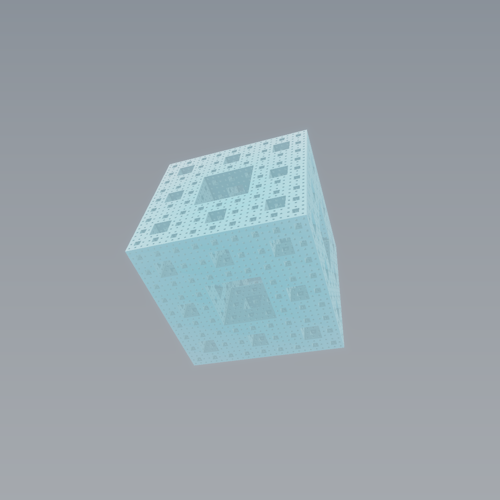

---

### Test 64: Menger Sponge Fractal

**Test ID:** `065_menger_sponge_fractal`
**Shader Files:** shader.wgsl
**Execution Status:** ✅ Success
**Image Generated:** ✅ Yes
**Judge Scores:** ✅ Available

#### Problem Prompt

> **Objective**
> Ray‑march an order‑4 Menger sponge implicit surface and produce a lit 3‑D render.
>
> **Signed‑distance function (SDF)**
> Recursively apply
>
> ```pseudo
> float menger(vec3 p){
>   p = abs(p);
>   for(i=0;i<4;i++){
>     if(p.x<p.y) swap(p.x,p.y);
>     if(p.x<p.z) swap(p.x,p.z);
>     p = p*3.0 - 2.0*floor(p*3.0);
>   }
>   return (length(p)-1.0)/pow(3.0,4);
> }
> ```
>
> where the base cube spans $[-1,1]^3$.
>
> **Camera & lighting**
>
> * Eye (4,3,2), target (0,0,0), FOV = 40°.
> * White point light at (8,5,6); Phong shading (ambient 0.05, diffuse 0.75, specular 0.2, shininess 64).
>
> **Rendering**
>
> * March step = signed‑distance × 0.8, max 256 steps, hit ε = 0.0005.
> * Shadows via secondary march, soft shadow factor with 32 samples.
> * Background: #e0f5ff.  Resolution 2200 × 1500 px, 4× SSAA.
>
> **Deliverable**  24‑bit PNG.

#### Judge Scores

| Category | Score |
|----------|-------|
| Mathematical Accuracy | 12/100 |
| Visual Quality | 48/100 |
| Color Implementation | 3/100 |
| Geometric Completeness | 28/100 |
| Reference Elements | 4/100 |
| **Total** | **95/500** |
| **Average** | **19.0/100** |


#### Rendered Output

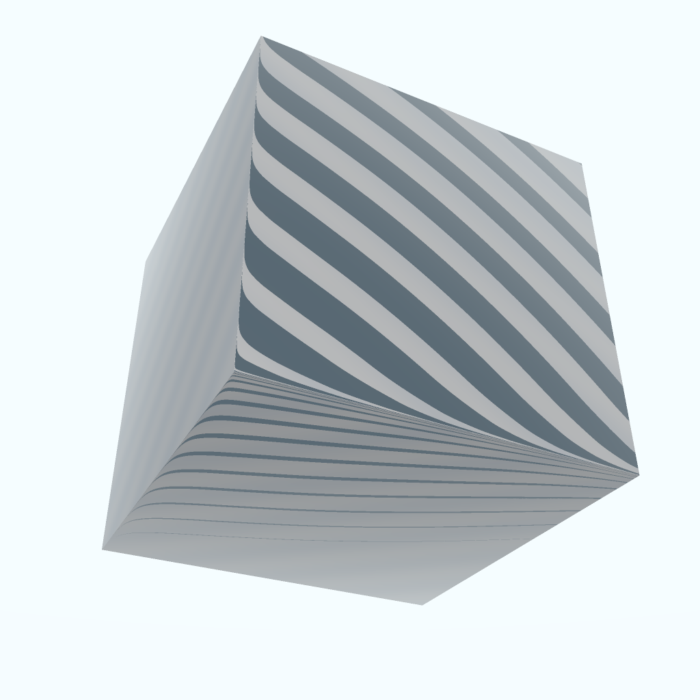

---

### Test 65: Minimal Surface Knot Boundaries

**Test ID:** `066_minimal_surface_knot_boundaries`
**Shader Files:** shader.wgsl
**Execution Status:** ✅ Success
**Image Generated:** ✅ Yes
**Judge Scores:** ✅ Available

#### Problem Prompt

> **Objective**
> Produce a single high-resolution image of a soap-film-like minimal surface spanning a changing knot boundary. The main object should be a triangulated approximate Plateau surface for the midpoint of a trefoil-to-figure-eight boundary morph, with boundary knots and curvature overlays.
>
> **Mathematical specification**
> 1. Parameter domain: use an annular/disk-like mesh with angular coordinate `u ∈ [0, 2π)` and radial coordinate `r ∈ [0, 1]`. Use at least `480` angular samples and `80` radial samples or an equivalent smooth representation.
> 2. Trefoil boundary curve:
>    `T(u) = ((2 + 0.55 cos 3u) cos 2u, (2 + 0.55 cos 3u) sin 2u, 0.55 sin 3u)`.
> 3. Figure-eight-style boundary curve:
>    `F(u) = ((2 + 0.55 cos 2u) cos 3u, (2 + 0.55 cos 2u) sin 3u, 0.55 sin 4u)`.
> 4. Midpoint boundary: set `λ = 0.5` and use `B(u) = normalize_scale((1 - λ)T(u) + λF(u))`, scaled so the maximum radius from the origin is about `1.0`.
> 5. Surface construction: approximate the minimal surface spanning `B(u)` by a relaxed triangular mesh whose interior vertices satisfy a discrete Laplace condition: each interior vertex is close to the average of its one-ring neighbors, with the boundary fixed to `B(u)`. A harmonic/radial initialization is acceptable, but the final surface should look area-minimized rather than a flat filled polygon.
> 6. Mean-curvature overlay: color by approximate residual mean curvature magnitude, using blue/white for near-zero interior residual and yellow/red near boundary strain or saddle concentration.
>
> **Geometry to render**
> - Main surface: a semi-translucent triangulated soap film bounded by the midpoint knot `B(u)`.
> - Boundary tube: render `B(u)` as a dark metallic tube of radius `0.025`.
> - Ghost boundary curves: render `T(u)` and `F(u)` as thin translucent tubes, one cyan and one magenta, slightly offset or shown around the main boundary so the morph is visible.
> - Mesh lines: show a subtle triangulation or radial/azimuthal grid on the surface.
>
> **Rendering style**
> - White background.
> - Soap film: translucent pearlescent material with curvature heatmap, 60–75% opacity.
> - Boundary tubes: crisp, opaque, and smooth.
> - Use soft area lighting and anti-aliasing; avoid heavy black outlines.
>
> **Composition / overlays**
> - Camera: oblique view that reveals the knot boundary crossing structure and the saddle-like surface interior.
> - Add a small inset showing the morph parameter: three small colored ticks labeled or positioned as `λ = 0`, `λ = 0.5`, `λ = 1` if labels are possible.
> - The main midpoint surface should occupy most of the frame.
>
> **Technical specs**
> - Resolution at least `1600 × 1600` pixels.
> - Static frame only; no animation.
> - Output format: PNG.
>
> **Deliverable** A single PNG image satisfying the above.

#### Judge Scores

| Category | Score |
|----------|-------|
| Mathematical Accuracy | 70/100 |
| Visual Quality | 86/100 |
| Color Implementation | 63/100 |
| Geometric Completeness | 82/100 |
| Reference Elements | 84/100 |
| **Total** | **385/500** |
| **Average** | **77.0/100** |


#### Rendered Output

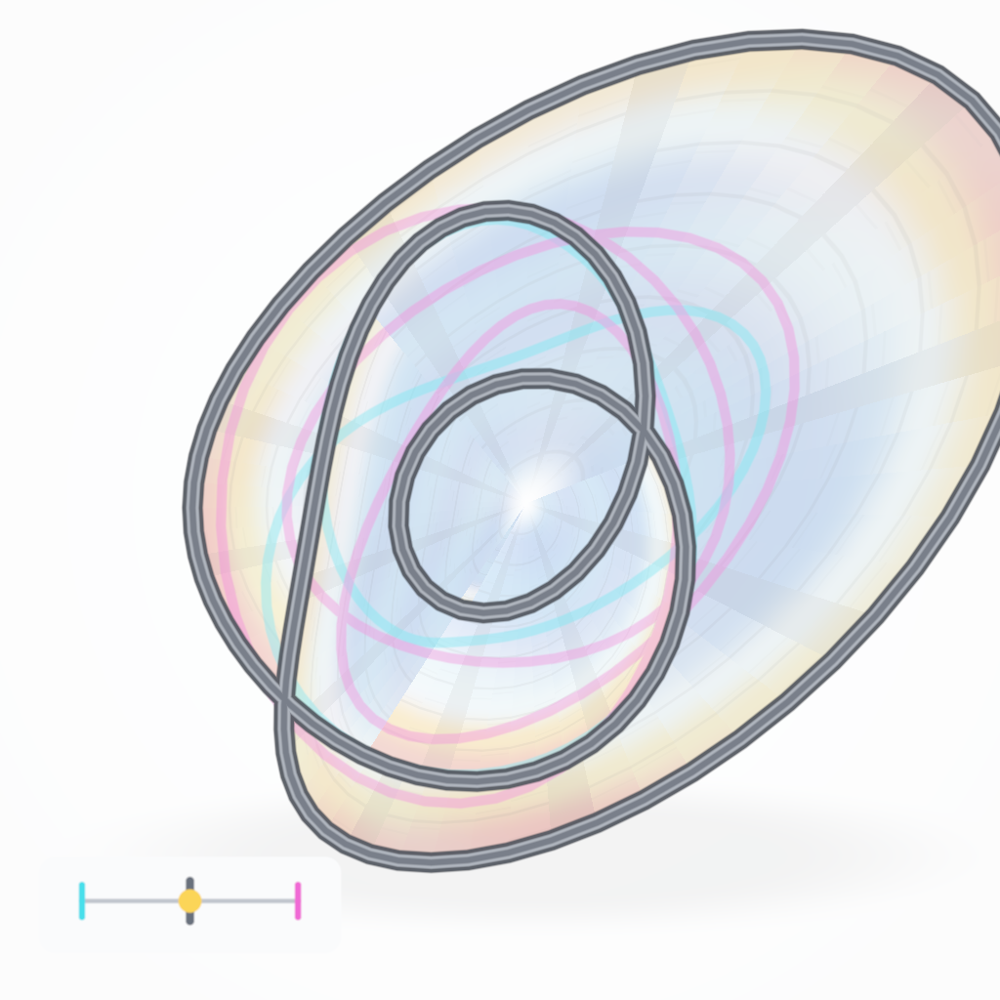

---

### Test 66: Mobius Strip Half Twist

**Test ID:** `067_mobius_strip_half_twist`
**Shader Files:** shader.wgsl
**Execution Status:** ✅ Success
**Image Generated:** ✅ Yes
**Judge Scores:** ✅ Available

#### Problem Prompt

> **Goal**
> Model a Möbius strip obtained by taking a rectangle $u∈[0,2π],\;v∈[-0.2,0.2]$ and applying a single half‑twist (180°) before gluing the ends.
>
> **Parametric surface**
>
> $
> \begin{aligned}
> x &=\Bigl(1+\tfrac{v}{2}\cos\tfrac{u}{2}\Bigr)\cos u,\\
> y &=\Bigl(1+\tfrac{v}{2}\cos\tfrac{u}{2}\Bigr)\sin u,\\
> z &=\frac{v}{2}\sin\tfrac{u}{2}.
> \end{aligned}
> $
>
> Sample grid 800 × 80 on $(u,v)$.
>
> **Rendering**
>
> * Front‑face colour #66ccff, back‑face colour #ff6699 (double‑sided material to emphasise single‑sidedness).
> * Blinn–Phong (amb 0.1, diff 0.7, spec 0.2, shin 64). Light (4,3,4).
> * Camera (4,3,2), FOV 40°, white background. 2200 × 1600 px PNG.
>
> **Deliverable** PNG.

#### Judge Scores

| Category | Score |
|----------|-------|
| Mathematical Accuracy | 78/100 |
| Visual Quality | 82/100 |
| Color Implementation | 74/100 |
| Geometric Completeness | 76/100 |
| Reference Elements | 70/100 |
| **Total** | **380/500** |
| **Average** | **76.0/100** |


#### Rendered Output


---

### Test 67: Mobius Strip Triple Twist

**Test ID:** `068_mobius_strip_triple_twist`
**Shader Files:** shader.wgsl
**Execution Status:** ✅ Success
**Image Generated:** ✅ Yes
**Judge Scores:** ✅ Available

#### Problem Prompt

> **Objective**
> Create a Möbius strip with 3 half-twists (540° total rotation) and color visualization.
>
> **Construction**
> Same rectangle as Problem 201 but **twist** angle $3π$:
> Replace param by $\tfrac{3u}{2}$ in cos/sin terms. Colour ramp along midline hue 0→360° once per full loop to show triple twist. 2600×1800 PNG.
>
> **Deliverable** PNG.

#### Judge Scores

| Category | Score |
|----------|-------|
| Mathematical Accuracy | 86/100 |
| Visual Quality | 88/100 |
| Color Implementation | 91/100 |
| Geometric Completeness | 72/100 |
| Reference Elements | 78/100 |
| **Total** | **415/500** |
| **Average** | **83.0/100** |


#### Rendered Output

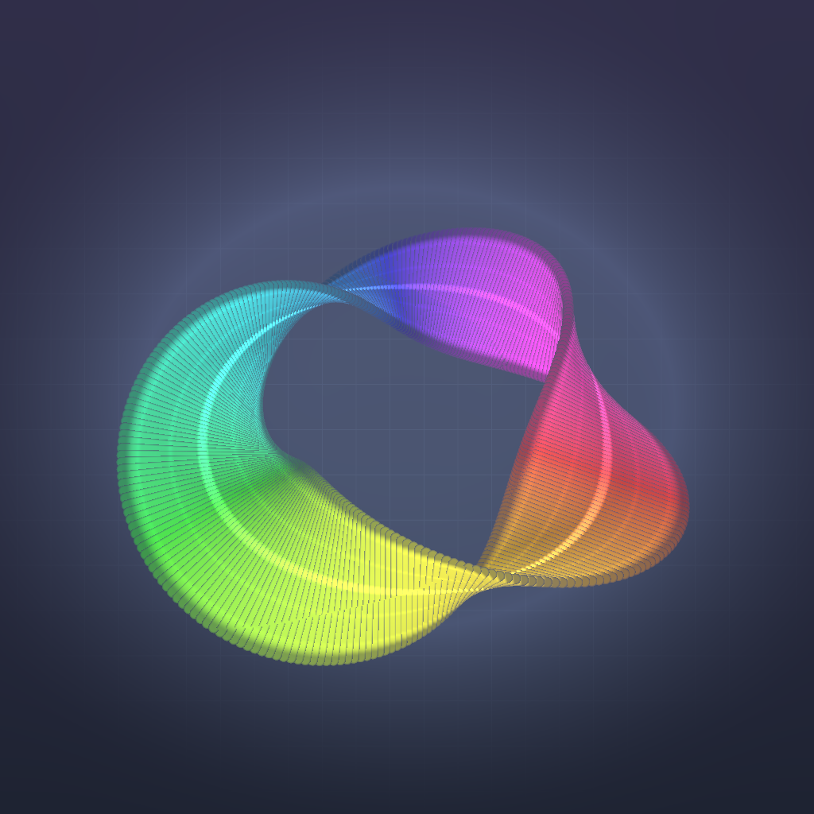

---

### Test 68: Mobius Transformation 3D

**Test ID:** `069_mobius_transformation_3d`
**Shader Files:** shader.wgsl
**Execution Status:** ✅ Success
**Image Generated:** ✅ Yes
**Judge Scores:** ✅ Available

#### Problem Prompt

> **Objective**
> Visualize a **3D Möbius transformation** applied to a cubic lattice, showing the conformal warping of space through complex inversion and rotation.
>
> **Mathematical recipe**
>
> 1. Create 3D cubic lattice (7×7×7 grid points, spacing 0.5).
> 2. Embed in complex projective space: (x,y,z) → w = x + iy, v = z.
> 3. Apply Möbius transformation: f(w,v) = ((aw+b)/(cw+d), v/|cw+d|²)
>    - Use a=1+i, b=0.5, c=0.5i, d=1 for interesting distortion.
> 4. Extract real 3D coordinates: (Re(w'), Im(w'), Re(v')).
> 5. Connect transformed points maintaining lattice topology.
> 6. Render both original (faded) and transformed lattice.
>
> **Styling**
>
> * Original lattice: thin grey lines (radius 0.01), alpha 0.3.
> * Transformed lattice: glowing tubes, radius varies with |cw+d|⁻¹.
> * Color by transformation magnitude: blue (small) to red (large distortion).
> * Add focal sphere at transformation singularity.
> * Dark background with subtle grid plane at z=0.
> * Volumetric glow for transformed elements.
> * Camera at (4, 3, 3.5), looking at origin; FOV 42°.
> * Resolution 2048 × 2048 px, 4× SSAA.
>
> **Deliverable** Single PNG showing the Möbius transformation's conformal warping effect.

#### Judge Scores

| Category | Score |
|----------|-------|
| Mathematical Accuracy | 78/100 |
| Visual Quality | 86/100 |
| Color Implementation | 72/100 |
| Geometric Completeness | 84/100 |
| Reference Elements | 80/100 |
| **Total** | **400/500** |
| **Average** | **80.0/100** |


#### Rendered Output

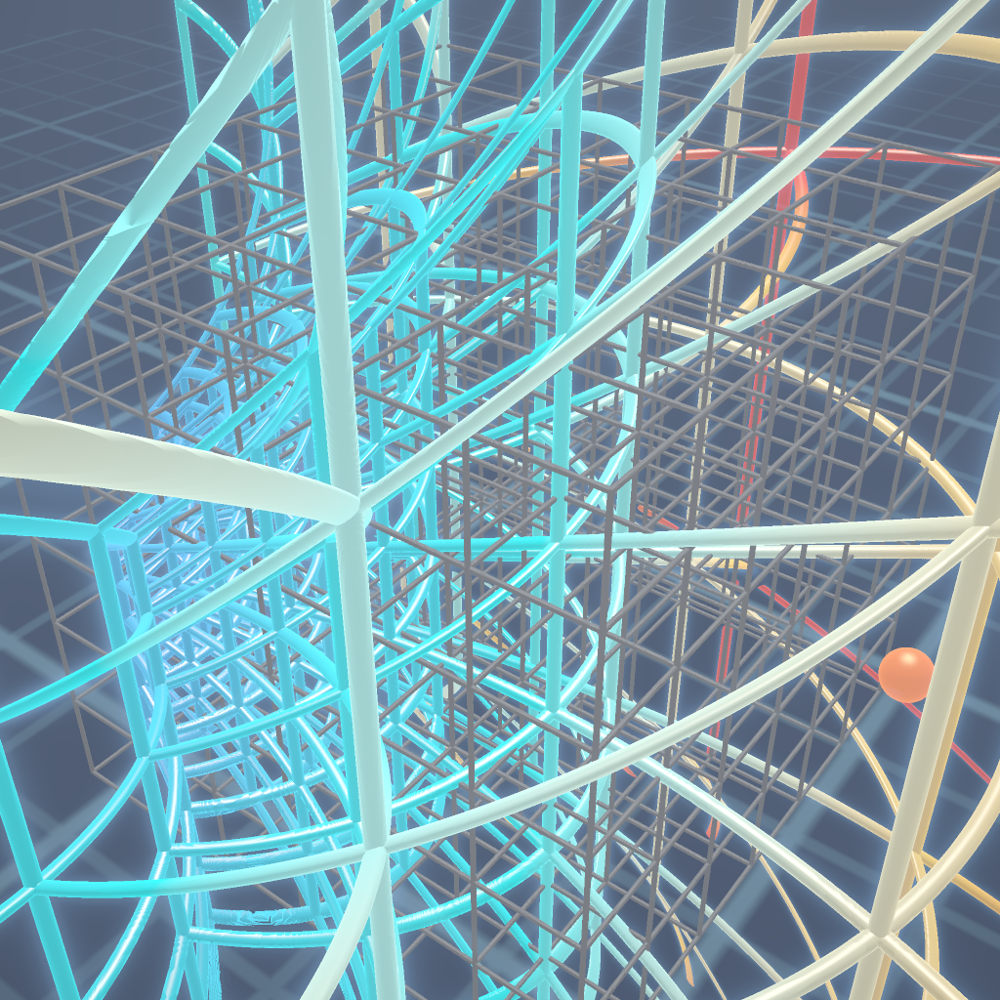

---

### Test 69: Navier Stokes Vortex Reconnection

**Test ID:** `070_navier_stokes_vortex_reconnection`
**Shader Files:** shader.wgsl
**Execution Status:** ✅ Success
**Image Generated:** ✅ Yes
**Judge Scores:** ✅ Available

#### Problem Prompt

> **Objective**
> Produce a single high-resolution PNG showing a representative static frame of vortex reconnection in a viscous incompressible flow. The image should make the topological reconnection event legible: two initially anti-parallel vortex tubes have pinched, exchanged partners, and formed two smooth reconnected bridges.
>
> **Mathematical specification**
> Render the frame at synthetic time \(t=0.68\) of the first reconnection event. Use the following explicit centerline geometry as a physically motivated proxy for the high-vorticity cores.
>
> Constants:
> \[
> L=2.2,\quad d=0.42,\quad h=0.34,\quad a=0.26.
> \]
> Two post-reconnection vortex tubes are assembled from the following centerline pieces.
>
> Tube A, connecting upper-left to lower-right:
> \[
> A_L(s)=(-a-(L-a)s,\ d,\ h(1-s)),\quad s\in[0,1],
> \]
> \[
> A_B(\theta)=(-a\cos\theta,\ d\cos\theta,\ h+0.12\sin\theta),\quad \theta\in[0,\pi],
> \]
> \[
> A_R(s)=(a+(L-a)s,\ -d,\ h(1-s)),\quad s\in[0,1].
> \]
> Tube B, connecting lower-left to upper-right:
> \[
> B_L(s)=(-a-(L-a)s,\ -d,\ -h(1-s)),\quad s\in[0,1],
> \]
> \[
> B_B(\theta)=(-a\cos\theta,\ -d\cos\theta,\ -h-0.12\sin\theta),\quad \theta\in[0,\pi],
> \]
> \[
> B_R(s)=(a+(L-a)s,\ d,\ -h(1-s)),\quad s\in[0,1].
> \]
> Tube radius:
> - Base radius \(r=0.075\).
> - Radius narrows to about \(0.045\) near the four bridge endpoints \((\pm a,\pm d,\pm h)\) to suggest viscous necking.
>
> Ghost pre-reconnection filaments:
> - Draw two thin translucent dashed centerlines \(G_+(x)=(x,d,0)\) and \(G_-(x)=(x,-d,0)\), \(x\in[-L,L]\), to show the original anti-parallel orientation.
>
> **Geometry to render**
> - Two smooth opaque vortex tubes following the assembled centerlines, with at least 300 samples per full tube.
> - Tangent arrow glyphs along each tube every 10–15% of arclength.
> - A faint translucent vorticity-magnitude cloud around the bridge region, shaped like overlapping Gaussian halos around the tubes.
> - A semi-transparent cutting plane through \(z=0\), colored by local vorticity magnitude, showing two bright lobes near the reconnection site.
> - Four small pinch collars/rings at the bridge endpoints.
>
> **Rendering style**
> - Color tube surface by tangent direction / helicity cue: blue-cyan where the tangent has positive \(x\)-component, orange-magenta where it has negative \(x\)-component, with smooth interpolation.
> - The ghost pre-reconnection filaments should be grey, dashed, and much thinner than the main tubes.
> - Use volumetric translucency for the vorticity cloud, but keep the two main tubes crisp.
> - Dark navy or black background is allowed if it improves contrast; otherwise use white. Avoid busy textures.
>
> **Composition / overlays**
> - Camera: three-quarter perspective looking down the approximate \(x\)-axis so both reconnected bridges and the anti-parallel ghost filaments are visible.
> - Add a small orientation triad in one corner labelled visually by red/green/blue rods if text is unavailable.
> - Include a subtle central glow at the reconnection region, but do not obscure the tube topology.
>
> **Technical specs**
> - Resolution at least 1600×1600 px.
> - Static frame only; no animation.
>
> **Deliverable** A single PNG image satisfying the above.

#### Judge Scores

| Category | Score |
|----------|-------|
| Mathematical Accuracy | 76/100 |
| Visual Quality | 85/100 |
| Color Implementation | 73/100 |
| Geometric Completeness | 82/100 |
| Reference Elements | 78/100 |
| **Total** | **394/500** |
| **Average** | **78.8/100** |


#### Rendered Output

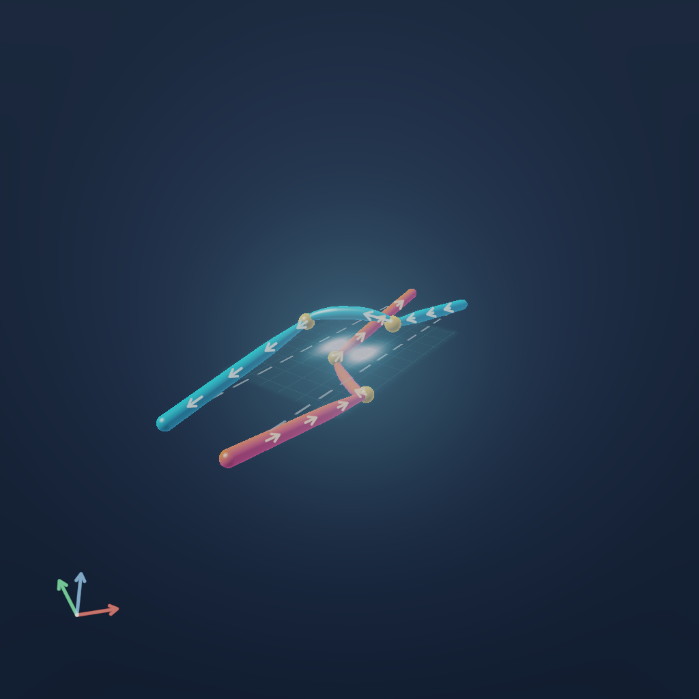

---

### Test 70: Number Theory Music

**Test ID:** `071_number_theory_music`
**Shader Files:** shader.wgsl
**Execution Status:** ✅ Success
**Image Generated:** ✅ Yes
**Judge Scores:** ✅ Available

#### Problem Prompt

> **Objective**
> Transform **number theory relationships** into a **3D musical score sculpture**, where mathematical properties become notes, rhythms, and harmonic structures.
>
> **Mathematical recipe**
>
> 1. Prime factorization creates base rhythm: n = 2^a × 3^b × 5^c × ...
>    - Each prime p gets its own "instrument track" at height z = log(p)
>    - Exponent a determines note duration: quarter note × 2^a
> 2. Modular arithmetic creates melodies:
>    - Notes from n mod 12 (chromatic scale)
>    - Octave from floor(log₂(n))
> 3. Number sequences as musical phrases:
>    - Fibonacci: ascending spiral melody
>    - Collatz: chaotic percussion patterns
>    - Perfect numbers: sustained harmonic chords
> 4. Euler's totient φ(n) determines volume/dynamics
> 5. Greatest common divisors create harmonic intervals
>
> **Styling**
>
> * 3D staff lines as glass tubes, glowing with soft internal light
> * Notes as crystalline polyhedra: shape determined by prime factors
> * Color by harmonic function: tonic (blue), dominant (yellow), subdominant (green)
> * Fibonacci spiral as golden ribbon weaving through the score
> * Collatz sequences as lightning-like percussion strikes
> * Time flows left to right, pitch increases vertically
> * Particle effects show "sound waves" emanating from active notes
> * Dark concert hall ambiance with spotlights on key sections
> * Camera at (40, 20, -30), looking at center; FOV 50°
> * Resolution 2400 × 2400 px, with depth of field
>
> **Deliverable** Single PNG showing number theory as 3D musical sculpture

#### Judge Scores

| Category | Score |
|----------|-------|
| Mathematical Accuracy | 61/100 |
| Visual Quality | 84/100 |
| Color Implementation | 45/100 |
| Geometric Completeness | 78/100 |
| Reference Elements | 63/100 |
| **Total** | **331/500** |
| **Average** | **66.2/100** |


#### Rendered Output

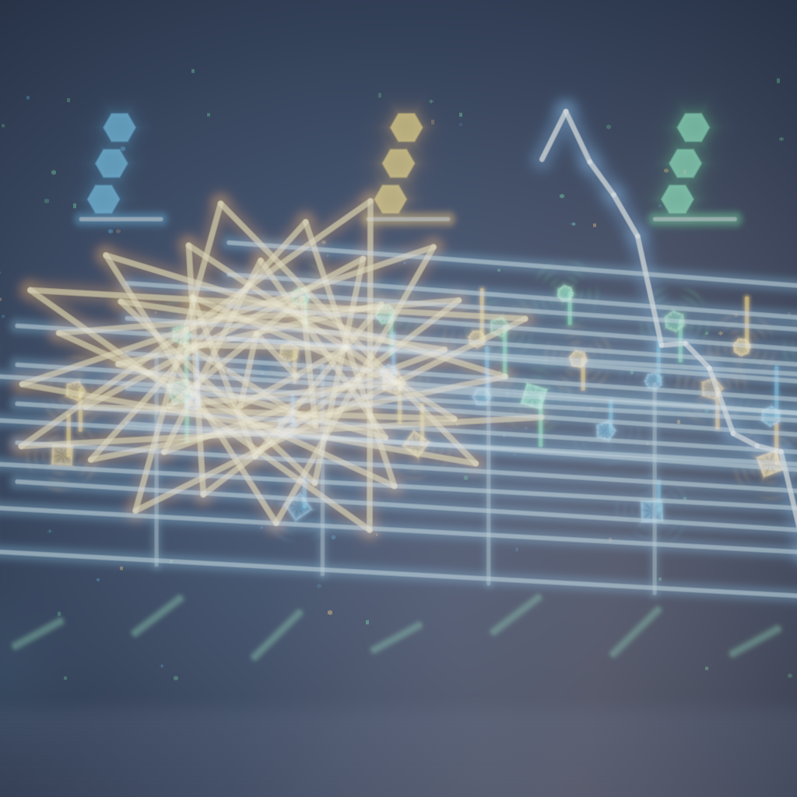

---

### Test 71: Ocean Eddy Lcs

**Test ID:** `072_ocean_eddy_lcs`
**Shader Files:** shader.wgsl
**Execution Status:** ✅ Success
**Image Generated:** ✅ Yes
**Judge Scores:** ✅ Available

#### Problem Prompt

> **Objective**
> Produce a single high-resolution image of ocean-eddy Lagrangian coherent structures using a synthetic time-dependent double-gyre flow. The image should show attracting and repelling material ridges, streamlines, and tracer trajectories in a physically interpretable flow domain.
>
> **Mathematical specification**
> 1. Flow domain: `x ∈ [0, 2]`, `y ∈ [0, 1]`; render as an ocean-like rectangular basin.
> 2. Velocity field: use the standard double-gyre model
>    `u(x,y,t) = -π A sin(π f(x,t)) cos(π y)`,
>    `v(x,y,t) =  π A cos(π f(x,t)) sin(π y) ∂f/∂x`,
>    where `f(x,t) = a(t)x² + b(t)x`, `a(t) = ε sin(ωt)`, `b(t) = 1 - 2ε sin(ωt)`.
> 3. Parameters: `A = 0.10`, `ε = 0.25`, `ω = 2π/10`.
> 4. Static analysis time: `t0 = 0`. Compute or approximate finite-time Lyapunov exponent ridges over integration time `τ = 10`.
> 5. Render repelling LCS ridges from forward-time FTLE in warm colors and attracting LCS ridges from backward-time FTLE in cool colors.
> 6. Add at least `60` tracer trajectories integrated from seed points over `t ∈ [0, 10]`, with fading tails.
>
> **Geometry to render**
> - A rectangular basin plane with a faint ocean-blue background.
> - FTLE height field or texture over the basin; ridges should be elevated or brightly highlighted.
> - Repelling LCS: orange/red material ribbons.
> - Attracting LCS: blue/cyan material ribbons.
> - Tracer paths: thin white or dark stream curves with fading opacity.
> - Optional: small arrows showing instantaneous velocity at sparse grid points.
>
> **Rendering style**
> - White page background outside the basin; basin itself may have a subtle blue tint.
> - LCS ridges should be crisp, continuous, and layered above the flow texture.
> - Use transparency for overlapping attracting/repelling structures.
> - Anti-aliased curves and soft lighting if height is used.
>
> **Composition / overlays**
> - Camera may be top-down or slightly oblique; if oblique, height should represent FTLE magnitude.
> - Add a compact legend: warm = repelling, cool = attracting, thin curves = tracers.
> - Include domain tick marks at `x = 0, 1, 2` and `y = 0, 0.5, 1` if possible.
>
> **Technical specs**
> - Resolution at least `1600 × 1600` pixels.
> - Static frame only; no animation.
> - Output format: PNG.
>
> **Deliverable** A single PNG image satisfying the above.

#### Judge Scores

| Category | Score |
|----------|-------|
| Mathematical Accuracy | 78/100 |
| Visual Quality | 74/100 |
| Color Implementation | 76/100 |
| Geometric Completeness | 72/100 |
| Reference Elements | 88/100 |
| **Total** | **388/500** |
| **Average** | **77.6/100** |


#### Rendered Output

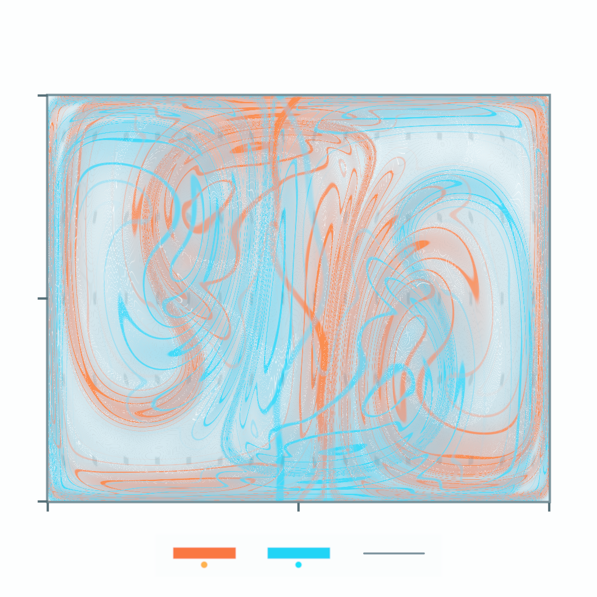

---

### Test 72: Octagram Star Polygon

**Test ID:** `073_octagram_star_polygon`
**Shader Files:** shader.wgsl
**Execution Status:** ✅ Success
**Image Generated:** ✅ Yes
**Judge Scores:** ✅ Available

#### Problem Prompt

> Construct a regular octagram {8/3} inscribed in a circle of radius 1. Outer vertices angle step 45°; connect every third vertex to produce eight spikes.
>
> Derived inner radius:
> r_in = cos(3π/8)/cos(π/8) ≈ 0.4142
>
> Visual style:
> - Fill solid royal-purple (#5A00FF)
> - 3-px black outline with miter-limit 2
> - Canvas 1800 × 1800, white background, star centred, outer tip 90% of canvas radius
> - Drop-shadow (0,0,15 px, 25% opacity) for depth
>
> Deliverable: Outputs a single image.

#### Judge Scores

| Category | Score |
|----------|-------|
| Mathematical Accuracy | 58/100 |
| Visual Quality | 88/100 |
| Color Implementation | 57/100 |
| Geometric Completeness | 62/100 |
| Reference Elements | 54/100 |
| **Total** | **319/500** |
| **Average** | **63.8/100** |


#### Rendered Output

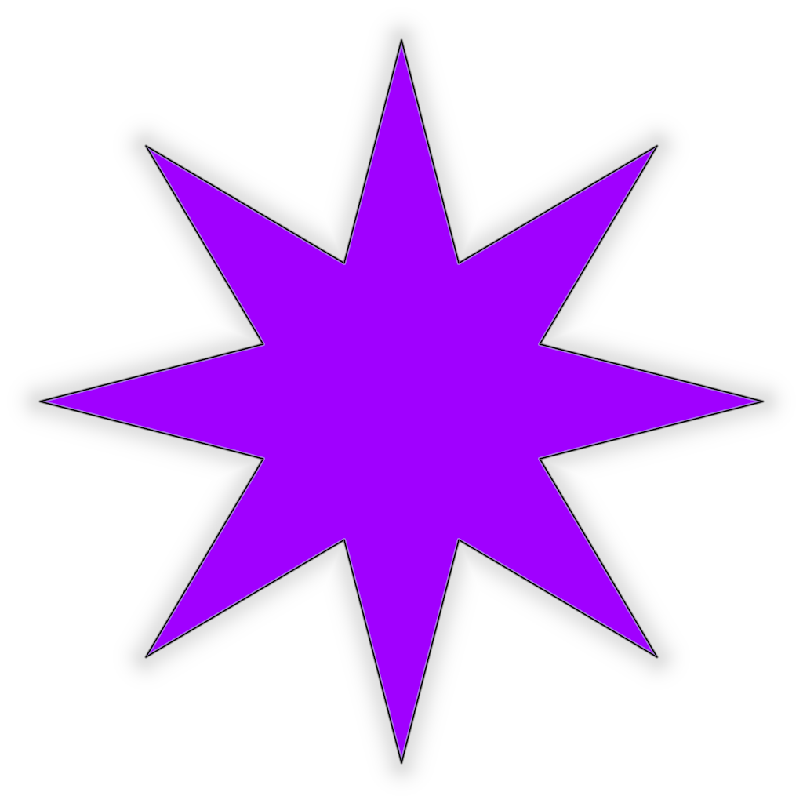

---

### Test 73: Optimal Transport Mass Flow Tubes

**Test ID:** `074_optimal_transport_mass_flow_tubes`
**Shader Files:** shader.wgsl
**Execution Status:** ✅ Success
**Image Generated:** ✅ Yes
**Judge Scores:** ✅ Available

#### Problem Prompt

> **Objective**
> Produce a single high-resolution image visualizing optimal transport from a uniform disk distribution to a uniform annulus distribution. The visualization should show straight-line displacement interpolation as mass-flow tubes and a highlighted intermediate time slice.
>
> **Mathematical specification**
> 1. Source distribution `μ`: uniform density on the unit disk `D = {x ∈ R² : ||x|| ≤ 1}`.
> 2. Target distribution `ν`: uniform density on the annulus `A = {y ∈ R² : r0 ≤ ||y|| ≤ 1}`, with inner radius `r0 = 0.45`.
> 3. Radial optimal map: for a source point `x` with radius `r = ||x||`, map it to
>    `T(x) = sqrt(r0² + (1 - r0²) r²) * x / max(r, ε)`, with the origin mapped to radius `r0` along a chosen sampled angle. This is the monotone radial transport map for disk-to-annulus mass rearrangement.
> 4. Displacement interpolation: render particle trajectories
>    `γ_x(s) = (1 - s) x + s T(x)` for `s ∈ [0, 1]`.
> 5. Static highlighted time: show the interpolated distribution at `s = 0.55` as a translucent mid-slice point cloud or ring of dots.
> 6. Sampling: use at least `320` equal-mass source samples arranged in radial rings. Ring radii should be proportional to `sqrt(k/N)` so mass density is approximately uniform.
>
> **Geometry to render**
> - Blue source disk at `s = 0`, shown as a flat translucent disk or dense point cloud at height `z = 0`.
> - Orange target annulus at `s = 1`, shown at height `z = 1`.
> - Flow tubes connecting each source sample to its target sample; use `z = s` as the vertical coordinate so each tube is a 3D spacetime path.
> - Mid-slice at `s = 0.55`: small white or bright dots on the interpolated positions, lying on a horizontal plane.
> - A transparent cylinder/shell marking the annulus inner hole at target time is helpful but optional.
>
> **Rendering style**
> - White background.
> - Flow tubes colored from blue at `s = 0` through white to orange at `s = 1`.
> - Tube radius should be small but visible, about `0.006` to `0.012` of scene diameter.
> - Use soft lighting and subtle shadows so tubes are distinguishable without clutter.
>
> **Composition / overlays**
> - Camera: oblique view showing the source disk below, target annulus above, and radial outward flow.
> - Add a faint vertical axis labeled/ticked as interpolation time `s` if possible.
> - Add small silhouettes of the source disk and target annulus beside the main flow as legend icons if space permits.
>
> **Technical specs**
> - Resolution at least `1600 × 1600` pixels.
> - Static frame only; no animation.
> - Output format: PNG.
>
> **Deliverable** A single PNG image satisfying the above.

#### Judge Scores

| Category | Score |
|----------|-------|
| Mathematical Accuracy | 84/100 |
| Visual Quality | 82/100 |
| Color Implementation | 86/100 |
| Geometric Completeness | 80/100 |
| Reference Elements | 76/100 |
| **Total** | **408/500** |
| **Average** | **81.6/100** |


#### Rendered Output

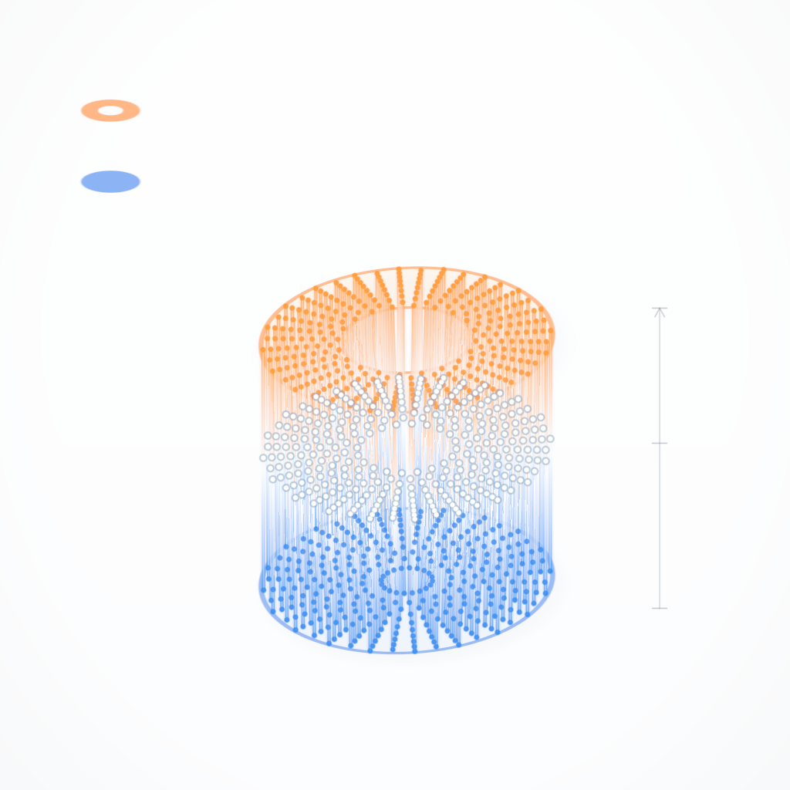

---

### Test 74: Parametric Gear Train

**Test ID:** `075_parametric_gear_train`
**Shader Files:** shader.wgsl
**Execution Status:** ✅ Success
**Image Generated:** ✅ Yes
**Judge Scores:** ✅ Available

#### Problem Prompt

> # Parametric Gear Train
>
> Create an animated gear train system with multiple interlocking gears of different sizes, all generated using parametric equations.
>
> ## Requirements:
>
> 1. Generate gear profiles using:
>    - Involute tooth profiles for realistic meshing
>    - Parametric equations for tooth geometry
>    - At least 4 gears with different tooth counts
> 2. Ensure proper gear ratios and meshing:
>    - Gears must rotate at correct relative speeds
>    - Teeth must interlock smoothly
>    - Include both driver and driven gears
> 3. Add metallic material properties:
>    - Brushed metal texture
>    - Appropriate reflections
>    - Subtle wear marks
> 4. Implement depth-based rendering for 3D effect
> 5. Add motion blur on fast-rotating gears
> 6. Include a mechanical/industrial background
> 7. Display rotation speeds as overlay text

#### Judge Scores

| Category | Score |
|----------|-------|
| Mathematical Accuracy | 72/100 |
| Visual Quality | 78/100 |
| Color Implementation | 62/100 |
| Geometric Completeness | 84/100 |
| Reference Elements | 76/100 |
| **Total** | **372/500** |
| **Average** | **74.4/100** |


#### Rendered Output

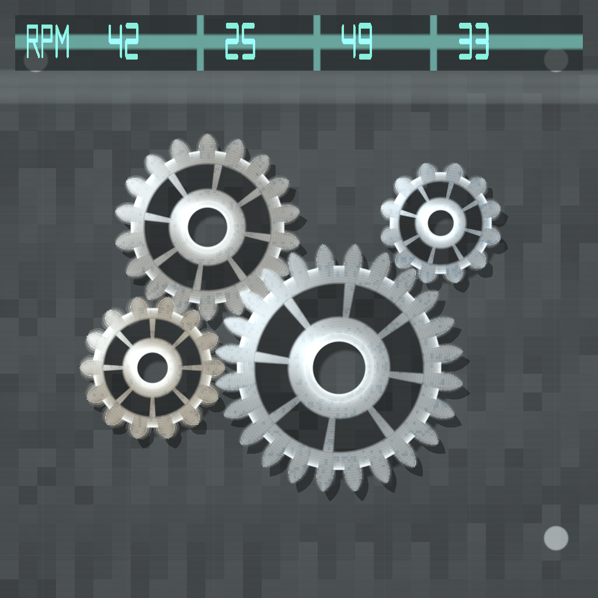

---

### Test 75: Parametric Seashell

**Test ID:** `076_parametric_seashell`
**Shader Files:** shader.wgsl
**Execution Status:** ✅ Success
**Image Generated:** ✅ Yes
**Judge Scores:** ✅ Available

#### Problem Prompt

> # Parametric Seashell
>
> Create a realistic 3D seashell using parametric equations, with pearl-like material properties and dynamic lighting.
>
> ## Requirements:
>
> 1. Implement parametric seashell equations:
>    - x = (1-v/(2π)) * cos(n*v) * (1+cos(u)) + c*cos(n*v)
>    - y = (1-v/(2π)) * sin(n*v) * (1+cos(u)) + c*sin(n*v)
>    - z = b*v/(2π) + a*(1-v/(2π)) * sin(u)
>    Where n controls coiling, a/b control shape, c controls radius
> 2. Apply pearl-like material with:
>    - Iridescent color shifting
>    - Subsurface scattering approximation
>    - Specular highlights
> 3. Implement dynamic lighting with moving light source
> 4. Add subtle surface texture details
> 5. Include slow rotation to show all angles
> 6. Create an ocean-themed background
> 7. Add depth of field effect for realism

#### Judge Scores

| Category | Score |
|----------|-------|
| Mathematical Accuracy | 84/100 |
| Visual Quality | 82/100 |
| Color Implementation | 86/100 |
| Geometric Completeness | 82/100 |
| Reference Elements | 78/100 |
| **Total** | **412/500** |
| **Average** | **82.4/100** |


#### Rendered Output

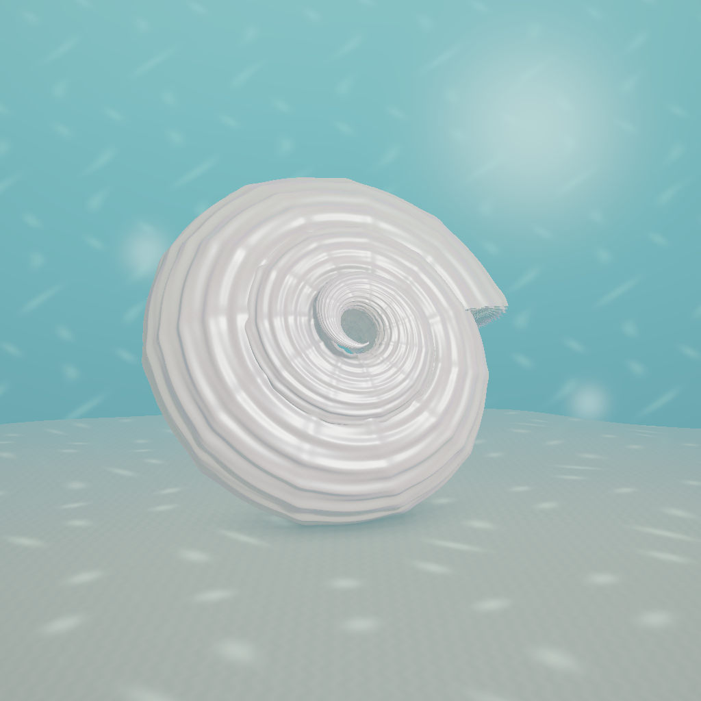

---

### Test 76: Penrose Tiling P3

**Test ID:** `077_penrose_tiling_p3`
**Shader Files:** shader.wgsl
**Execution Status:** ✅ Success
**Image Generated:** ✅ Yes
**Judge Scores:** ✅ Available

#### Problem Prompt

> **Objective**
> Generate a finite patch of the rhombic Penrose tiling (P3) by **three deflation steps** starting from a single thick rhombus.
>
> **Algorithm**
>
> 1. Thick rhombus edge length = 1, angle 72°.
> 2. Apply the standard deflation rules (inflate by τ = (1+√5)/2, subdivide into thick + thin rhombi) three times.
> 3. Retain tiles whose centroids lie within radius 8 of the origin.
>
> **Styling**
>
> * Thick rhombi: fill #ffcc66; thin rhombi: #66aaff.
> * Draw arrow matching rules: short red arrow centred on each edge, oriented inward for thick, outward for thin.
> * Edge stroke 1.5 px black.
> * Canvas 2500 × 2500 px, white background.
>
> **Deliverable** PNG.

#### Judge Scores

| Category | Score |
|----------|-------|
| Mathematical Accuracy | 34/100 |
| Visual Quality | 68/100 |
| Color Implementation | 22/100 |
| Geometric Completeness | 49/100 |
| Reference Elements | 31/100 |
| **Total** | **204/500** |
| **Average** | **40.8/100** |


#### Rendered Output

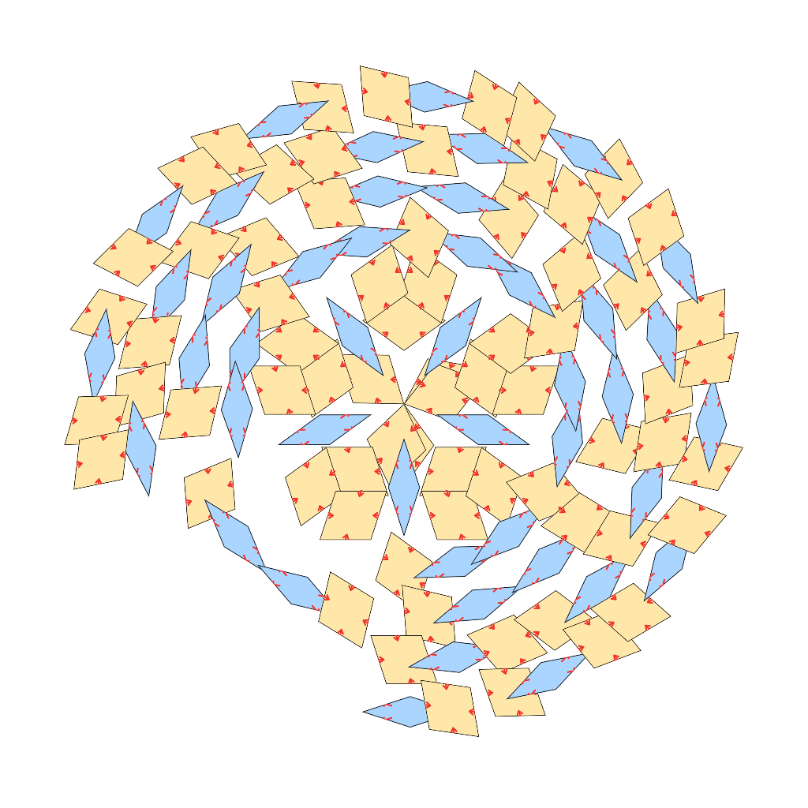

---

### Test 77: Phyllotaxis Spiral

**Test ID:** `078_phyllotaxis_spiral`
**Shader Files:** shader.wgsl
**Execution Status:** ✅ Success
**Image Generated:** ✅ Yes
**Judge Scores:** ✅ Available

#### Problem Prompt

> **Objective**
> Generate a phyllotactic spiral pattern showing the golden angle arrangement found in sunflowers and pinecones, with color-coded Fibonacci spiral arms.
>
> **Mathematical Foundation**
>
> $
> \begin{aligned}
> \theta_n &= n \times 137.5° \text{ (golden angle)}\\
> r_n &= c\sqrt{n} \text{ (Fermat's spiral)}\\
> x_n &= r_n \cos(\theta_n)\\
> y_n &= r_n \sin(\theta_n)
> \end{aligned}
> $
>
> where $n$ is the seed index, $c = 0.15$ is the scaling factor.
>
> **Implementation**
>
> * Generate 500 seeds using the above equations
> * Each seed rendered as a circle with radius $0.02 + 0.01\sqrt{n/500}$ (growth effect)
> * Color seeds by their spiral arm membership:
>   - Identify which Fibonacci spiral (8, 13, 21, 34, 55) the seed belongs to
>   - Use distinct colors: #FF6B6B, #4ECDC4, #45B7D1, #F7DC6F, #BB8FCE
> * Background: radial gradient from #2C3E50 (center) to #1A252F (edge)
>
> **Styling**
>
> * Canvas: 2048 × 2048 px
> * Anti-aliasing: 4× SSAA
> * Add subtle glow effect to seeds (soft Gaussian blur)
> * Center spiral at canvas center
>
> **Deliverable** PNG showing the complete phyllotactic pattern with clearly visible Fibonacci spirals.

#### Judge Scores

| Category | Score |
|----------|-------|
| Mathematical Accuracy | 84/100 |
| Visual Quality | 88/100 |
| Color Implementation | 78/100 |
| Geometric Completeness | 74/100 |
| Reference Elements | 82/100 |
| **Total** | **406/500** |
| **Average** | **81.2/100** |


#### Rendered Output

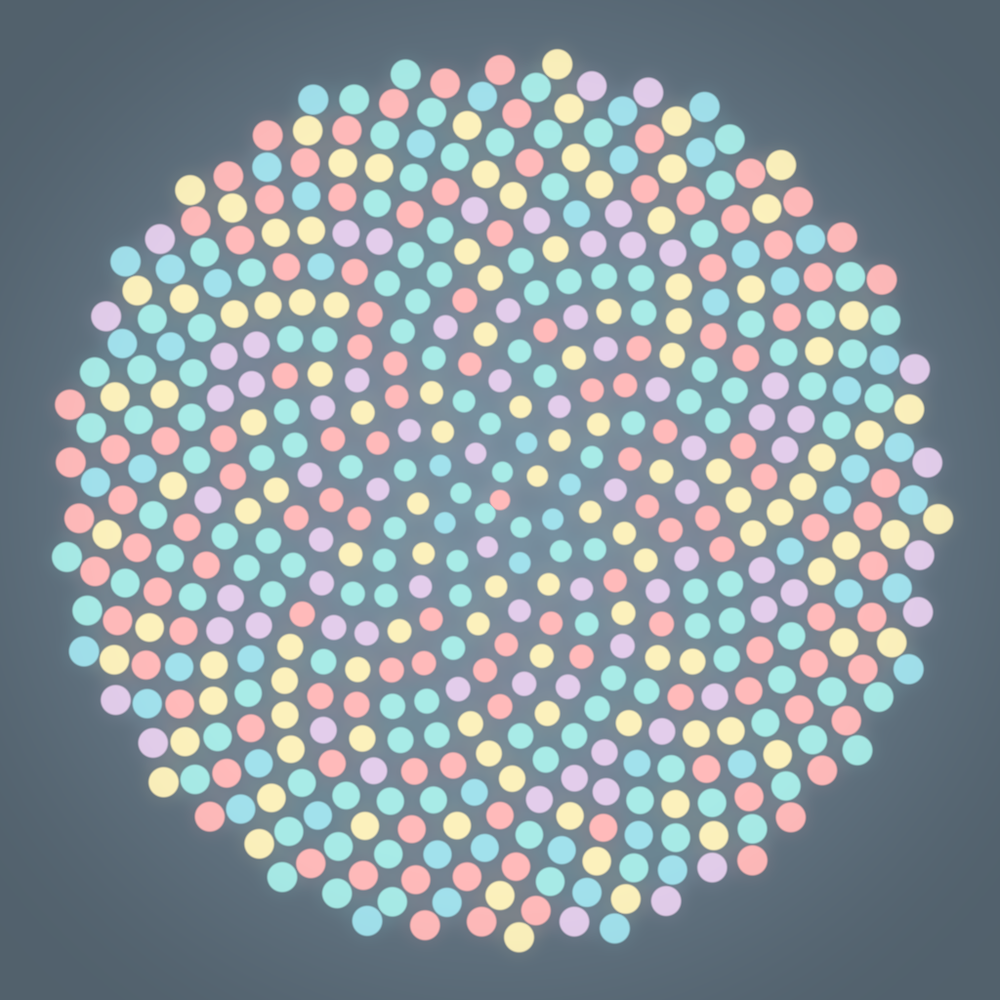

---

### Test 78: Poincare Disc

**Test ID:** `079_poincare_disc`
**Shader Files:** shader.wgsl
**Execution Status:** ✅ Success
**Image Generated:** ✅ Yes
**Judge Scores:** ✅ Available

#### Problem Prompt

> **Objective**
> Create a single high‑resolution image that shows the *regular hyperbolic triangle tessellation* $\{3,8\}$ (eight equilateral triangles meet at every vertex) in the *Poincaré disk model*.  No reference image is provided; rely exclusively on the specification below.
>
> **Mathematical specification**
>
> 1. **Model** Represent the hyperbolic plane as the open unit disk
>
>    $
>      \mathbb D=\{(x,y)\in\mathbb R^{2}\mid x^{2}+y^{2}<1\},
>    $
>
>    endowed with the Poincaré metric.  Geodesics are Euclidean straight lines through the origin or circle arcs orthogonal to the unit circle $\partial\mathbb D$.
> 2. **Tessellation** Use the regular tiling with Schläfli symbol $\{3,8\}$: each face is a geodesic triangle; exactly eight triangles meet at every vertex.  Begin with one triangle whose vertices lie on rays separated by angle $45^{\circ}$ and whose hyperbolic edge lengths are all equal; repeat by reflections in its edges until the disk is filled.
> 3. **Checkerboard colouring**
>
>    * Assign *black* to the central seed triangle.
>    * Colour the tessellation by parity of edge distance: adjacent triangles must have opposite colours, yielding a black‑white checkerboard.
> 4. **Rendering requirements**
>
>    * Resolution ≥ 1600 × 1600 px, antialiased.
>    * Draw the Euclidean boundary circle of $\mathbb D$ with a 4‑px solid black stroke; nothing is drawn outside the circle (pure white).
>    * Faces are filled *flat* (no gradients) in pure black or pure white; edges are 1‑px black lines.
>    * No labels, no title, no additional decoration.
>
> **Deliverable**
> A single PNG image that meets all geometric and stylistic constraints.

#### Judge Scores

| Category | Score |
|----------|-------|
| Mathematical Accuracy | 92/100 |
| Visual Quality | 91/100 |
| Color Implementation | 94/100 |
| Geometric Completeness | 93/100 |
| Reference Elements | 94/100 |
| **Total** | **464/500** |
| **Average** | **92.8/100** |


#### Rendered Output

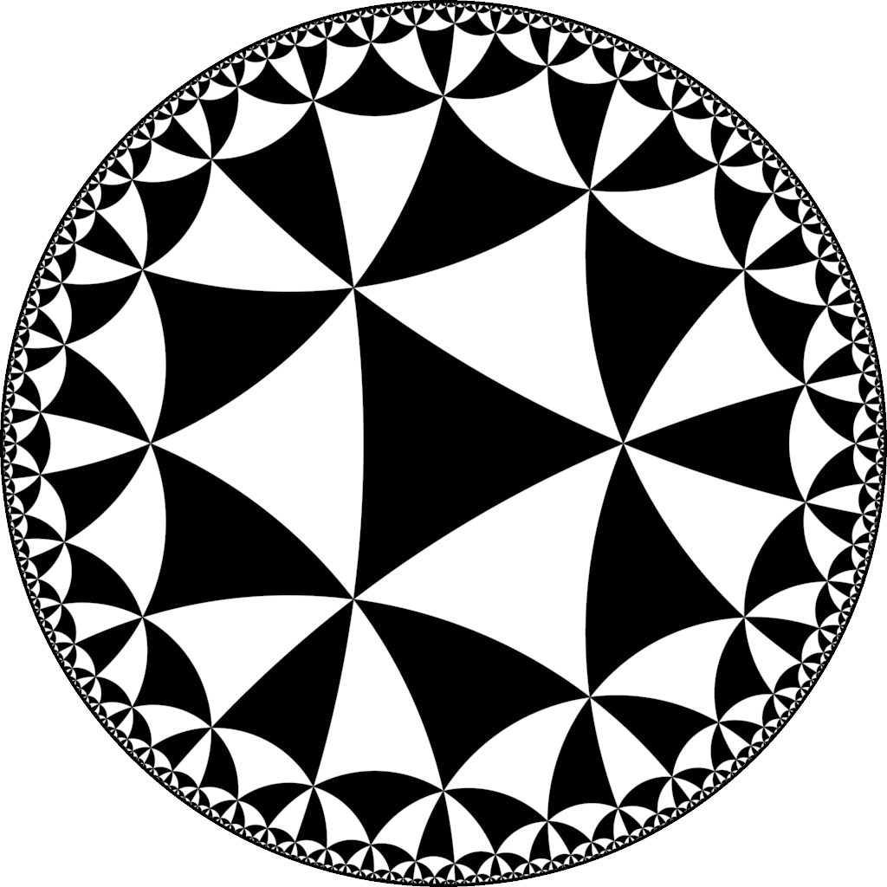

---

### Test 79: Polyrhythm Phase Torus

**Test ID:** `080_polyrhythm_phase_torus`
**Shader Files:** shader.wgsl
**Execution Status:** ✅ Success
**Image Generated:** ✅ Yes
**Judge Scores:** ✅ Available

#### Problem Prompt

> **Objective**
> Produce a single high-resolution PNG visualising a \(5{:}7{:}11\) polyrhythm as a trajectory on a projected phase torus. The image should show winding numbers, beat-alignment events, and the extra 11-phase modulation.
>
> **Mathematical specification**
> Let \(\tau\in[0,2\pi]\) be one full common cycle and define phases
> \[
> \theta_5=5\tau,
> \qquad
> \theta_7=7\tau,
> \qquad
> \theta_{11}=11\tau.
> \]
> Use the torus projection
> \[
> X(\tau)=\left((2.0+0.55\cos\theta_5)\cos\theta_7,\ (2.0+0.55\cos\theta_5)\sin\theta_7,
> \ 0.55\sin\theta_5+0.22\sin\theta_{11}\right).
> \]
> The transparent reference torus is the same embedding without the \(0.22\sin\theta_{11}\) vertical modulation:
> \[
> T(\theta_5,\theta_7)=\left((2.0+0.55\cos\theta_5)\cos\theta_7,\ (2.0+0.55\cos\theta_5)\sin\theta_7,
> \ 0.55\sin\theta_5\right).
> \]
>
> Beat-alignment events:
> - All three beats align at \(\tau=0\) and \(\tau=2\pi\); mark these with the largest gold/white spheres.
> - Pair alignments:
>   - \(5\) and \(7\): \((5-7)\tau=2\pi k\), giving \(\tau=\pi k\), \(k=0,1,2\).
>   - \(5\) and \(11\): \((5-11)\tau=2\pi k\), giving \(\tau=2\pi k/6\), \(k=0,\ldots,6\).
>   - \(7\) and \(11\): \((7-11)\tau=2\pi k\), giving \(\tau=2\pi k/4\), \(k=0,\ldots,4\).
> Use smaller distinct marker shapes or rings for pair alignments.
>
> **Geometry to render**
> - Transparent reference torus \(T(\theta_5,\theta_7)\) with faint grid lines: 5 minor-cycle guide rings and 7 major-cycle guide rings should be visually countable.
> - Main trajectory tube \(X(\tau)\), sampled at least 1400 points, with tube radius about 1% of torus major radius.
> - Color trajectory hue by \(\theta_{11}\bmod2\pi\), so it cycles 11 times along the full path.
> - Alignment markers at the specified \(\tau\) values, using three marker types: all-beat, 5–7, 5–11, 7–11.
> - Three small clock rings or beat wheels in a corner with exactly 5, 7, and 11 tick marks respectively.
>
> **Rendering style**
> - Reference torus: translucent pale grey or blue with thin grid curves.
> - Trajectory: saturated rainbow/HSV phase color, smooth and glossy.
> - Alignment markers: high-contrast spheres/rings, not hidden by the torus.
> - Background: black, navy, white, or light grey; choose for maximum trajectory contrast.
> - Use soft bloom only on all-beat alignment markers.
>
> **Composition / overlays**
> - Camera: oblique view showing the torus hole and enough of the path to count windings.
> - Avoid a camera angle where the torus collapses to a circle.
> - Put the 5/7/11 beat wheels in one unobtrusive corner.
> - Include a small phase-color strip if possible.
>
> **Technical specs**
> - Resolution at least 1600×1600 px.
> - Static frame only; no animation.
>
> **Deliverable** A single PNG image satisfying the above.

#### Judge Scores

| Category | Score |
|----------|-------|
| Mathematical Accuracy | 86/100 |
| Visual Quality | 91/100 |
| Color Implementation | 84/100 |
| Geometric Completeness | 89/100 |
| Reference Elements | 86/100 |
| **Total** | **436/500** |
| **Average** | **87.2/100** |


#### Rendered Output

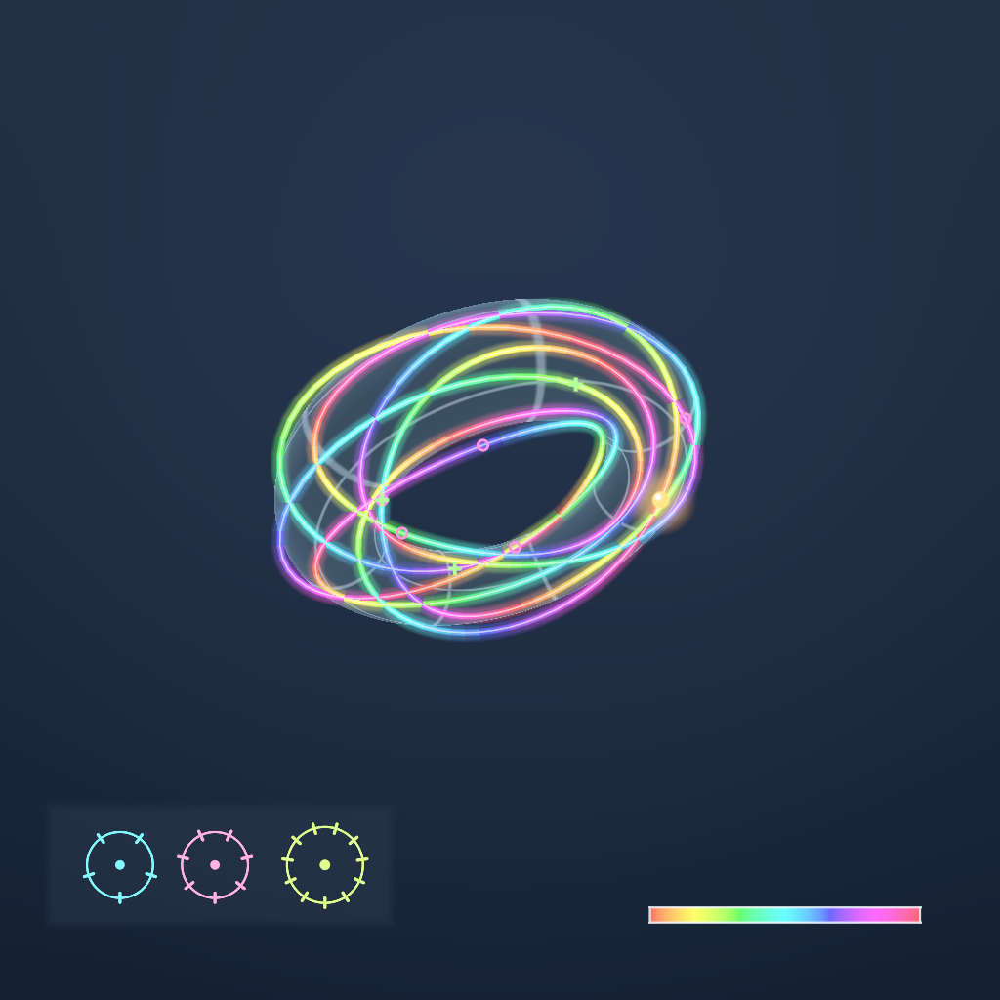

---

### Test 80: Prime Crystal Lattice

**Test ID:** `081_prime_crystal_lattice`
**Shader Files:** shader.wgsl
**Execution Status:** ✅ Success
**Image Generated:** ✅ Yes
**Judge Scores:** ✅ Available

#### Problem Prompt

> Depict the 2-D integer lattice as a perfect crystal where sites with prime-number x-coordinates act as edge dislocations, creating a vivid strain-field hologram. The final heat-map should resemble a materials-science micrograph with glowing stress bands emanating from each prime column.
>
> Construction steps:
> 1. Lattice domain: Points (x,y) with x,y∈{−100,...,100}
> 2. Vacancy mask: Mark lattice sites where x is prime and y=0 as vacancies (remove them). There are 25 primes ≤100.
> 3. Discrete displacement field: Define displacement u(x,y) solving discrete Laplace equation Δu = 0 with boundary u=0 and vacancy nodes forced u=−1. Use Gauss-Seidel until max change <10^-6.
> 4. Strain magnitude: ε=|∇u| computed via central differences
> 5. Render:
>    - Normalise ε so 99th percentile maps to value 1
>    - Colour map "inferno"; show ε=0 as deep violet
>    - Vacancies drawn solid black disks radius 4 px
>    - Pixel size 4 px → resulting bitmap 1600×1600. Add 100 px white frame.
>
> Deliverable: Outputs a single image.

#### Judge Scores

| Category | Score |
|----------|-------|
| Mathematical Accuracy | 55/100 |
| Visual Quality | 82/100 |
| Color Implementation | 47/100 |
| Geometric Completeness | 79/100 |
| Reference Elements | 76/100 |
| **Total** | **339/500** |
| **Average** | **67.8/100** |


#### Rendered Output

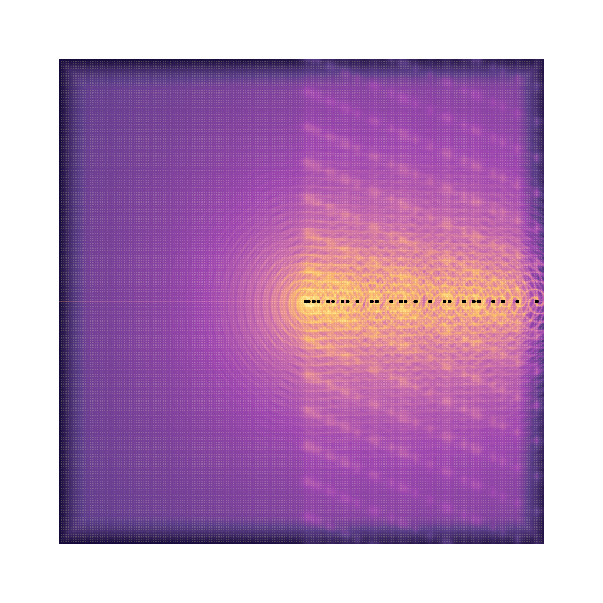

---

### Test 81: Probability Weather Patterns

**Test ID:** `082_probability_weather_patterns`
**Shader Files:** shader.wgsl
**Execution Status:** ✅ Success
**Image Generated:** ✅ Yes
**Judge Scores:** ✅ Available

#### Problem Prompt

> **Objective**
> Transform **probability distributions** into **dynamic weather systems**, where statistical properties manifest as atmospheric phenomena.
>
> **Mathematical recipe**
>
> 1. Normal distribution N(μ,σ²): stable high-pressure systems
>    - Mean μ determines center location
>    - Variance σ² creates pressure gradient (storm size)
>    - Multiple normals create weather fronts
> 2. Exponential distribution: rain intensity patterns
>    - λ parameter controls precipitation rate
>    - Memoryless property creates sudden downpours
> 3. Cauchy distribution: extreme weather events
>    - Heavy tails generate tornadoes at outliers
>    - Undefined variance causes chaotic wind patterns
> 4. Beta distribution: cloud coverage
>    - α,β parameters shape cloud density gradients
>    - Bimodal beta creates cumulonimbus formations
> 5. Multivariate correlations: jet streams connecting systems
>
> **Styling**
>
> * Volumetric cloud rendering with multiple scattering
> * Pressure systems as swirling atmospheric spirals
> * Rain rendered as refractive droplet sheets
> * Lightning bolts at Cauchy tail events (>3σ)
> * Wind flow lines colored by velocity (blue=calm, red=hurricane)
> * Ground view: rolling hills with weather shadows
> * Time-lapse feel: blurred cloud movement trails
> * Atmospheric perspective with realistic haze
> * Crepuscular rays through cloud breaks
> * Camera at (0, 5, -100), tilted up 10°; FOV 70°
> * Resolution 2400 × 2400 px, HDR lighting
>
> **Deliverable** Single PNG showing probability distributions as weather map

#### Judge Scores

| Category | Score |
|----------|-------|
| Mathematical Accuracy | 70/100 |
| Visual Quality | 86/100 |
| Color Implementation | 66/100 |
| Geometric Completeness | 82/100 |
| Reference Elements | 72/100 |
| **Total** | **376/500** |
| **Average** | **75.2/100** |


#### Rendered Output

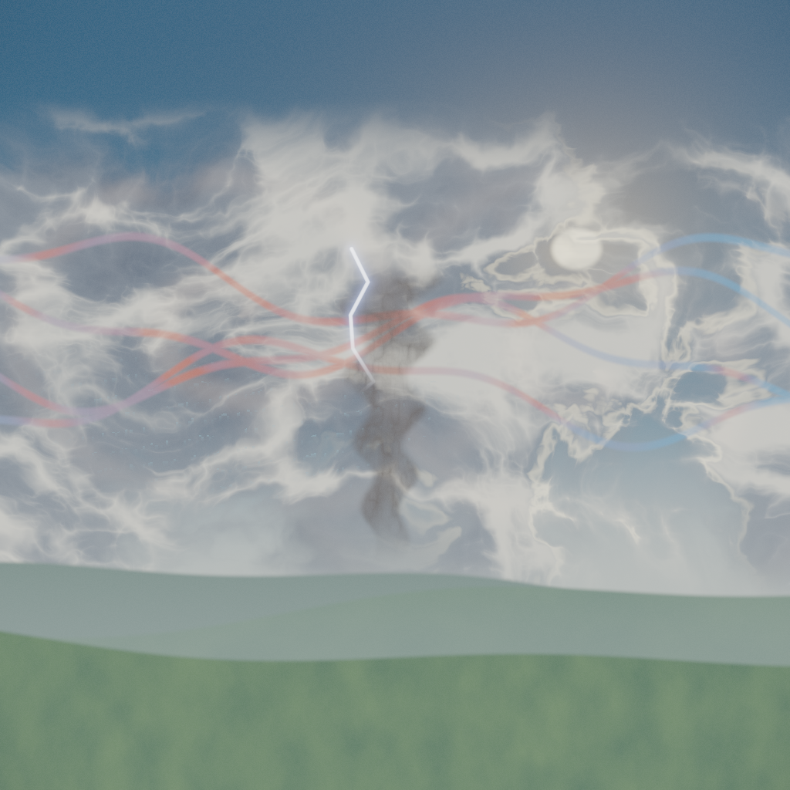

---

### Test 82: Protein Folding Energy Landscape

**Test ID:** `083_protein_folding_energy_landscape`
**Shader Files:** shader.wgsl
**Execution Status:** ✅ Success
**Image Generated:** ✅ Yes
**Judge Scores:** ✅ Available

#### Problem Prompt

> **Objective**
> Produce a single high-resolution PNG visualising a toy protein-folding energy landscape over periodic Ramachandran-style coordinates. The image should show the energy surface, major basins, saddle ridges, and three folding trajectories descending toward a native basin.
>
> **Mathematical specification**
> 1. Domain: angles \(\phi,\psi \in [-\pi,\pi]\). Treat both coordinates as periodic.
> 2. Periodic angular difference:
>    \[
>    \delta(a,b)=\operatorname{atan2}(\sin(a-b),\cos(a-b)).
>    \]
> 3. Energy function:
>    \[
>    \begin{aligned}
>    E(\phi,\psi)=&\ 4.0
>    -3.2\exp\left[-\left({\delta(\phi,-1.20)^2\over0.18}+{\delta(\psi,0.85)^2\over0.12}\right)\right]\\
>    &-2.1\exp\left[-\left({\delta(\phi,1.05)^2\over0.22}+{\delta(\psi,-0.75)^2\over0.18}\right)\right]\\
>    &-1.4\exp\left[-\left({\delta(\phi,2.35)^2\over0.28}+{\delta(\psi,2.10)^2\over0.24}\right)\right]\\
>    &+1.1\exp\left[-\left({\delta(\phi,0.05)^2\over0.10}+{\delta(\psi,0.05)^2\over0.10}\right)\right]
>    +0.35(1+
>    \cos 3\phi)(1+0.5\cos2\psi).
>    \end{aligned}
>    \]
> 4. Normalise \(E\) linearly over the sampled domain to \(E_n\in[0,1]\).
> 5. Mark three named basins with distinct glyphs: native \(N=(-1.20,0.85)\), misfolded \(M=(1.05,-0.75)\), and intermediate \(I=(2.35,2.10)\). Mark the high saddle/ridge near \((0.05,0.05)\).
> 6. Render three gradient-descent trajectories using \(d(\phi,\psi)/d\tau=-\nabla E\), with periodic wrapping, starting at:
>    - \(U_1=(2.70,-2.50)\)
>    - \(U_2=(-2.70,-1.90)\)
>    - \(U_3=(0.90,2.70)\)
>    Use approximately 200 small integration steps per trajectory, stopping visually in a basin.
>
> **Geometry to render**
> - Main surface: a square height field over \((\phi/\pi,\psi/\pi)\in[-1,1]^2\), with height \(z=0.55E_n\), sampled at least \(220\times220\).
> - Contours: 12 thin iso-energy contour lines projected slightly above the surface.
> - Trajectories: three smooth tubes following the negative-gradient paths, radius about 1.5% of the domain width, with arrowheads indicating descent direction.
> - Basin glyphs: small spheres or discs at \(N,M,I\), plus a distinct red/orange ridge marker near \((0.05,0.05)\).
> - Periodic seam cues: faint translucent curtains or paired arrows along all four boundaries showing that left/right and top/bottom edges wrap.
>
> **Rendering style**
> - Energy color map: low energy deep blue/purple, mid energy green/cyan, high energy orange/red.
> - Trajectories: three contrasting bright colors; each remains visually separate from the surface colormap.
> - Use soft Phong lighting, ambient occlusion if available, and anti-aliased edges.
> - Background: pure white or very light grey.
>
> **Composition / overlays**
> - Camera: oblique 3D view where height, contour rings, and trajectories are all visible.
> - Include a small inset in the lower-right showing the periodic square domain as a flat map with the same basin markers and wrapped edges.
> - Optional labels may be drawn, but marker shapes/colors must make the roles clear even if text rendering is unavailable.
>
> **Technical specs**
> - Resolution at least 1600×1600 px.
> - Static frame only; no animation.
>
> **Deliverable** A single PNG image satisfying the above.

#### Judge Scores

| Category | Score |
|----------|-------|
| Mathematical Accuracy | 82/100 |
| Visual Quality | 86/100 |
| Color Implementation | 78/100 |
| Geometric Completeness | 85/100 |
| Reference Elements | 83/100 |
| **Total** | **414/500** |
| **Average** | **82.8/100** |


#### Rendered Output

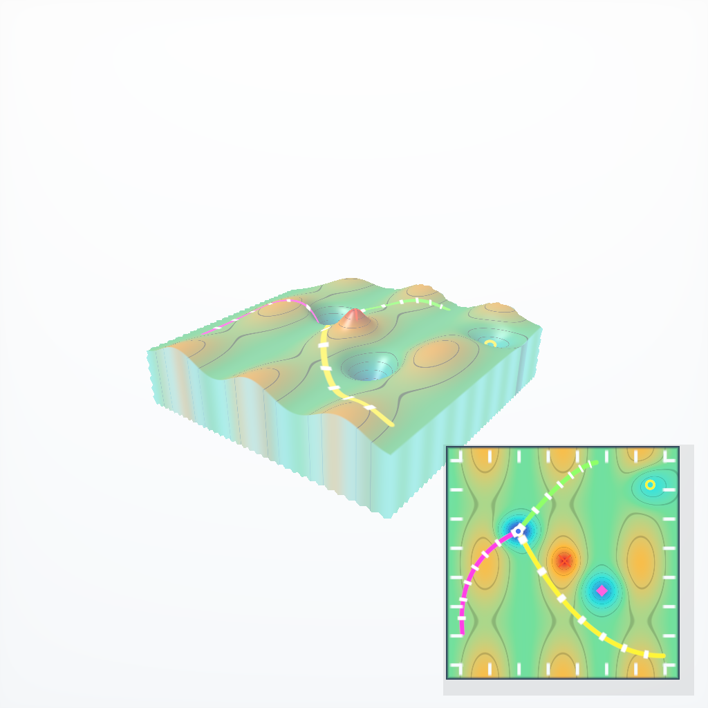

---

### Test 83: Qec Threshold Phase Diagram

**Test ID:** `084_qec_threshold_phase_diagram`
**Shader Files:** shader.wgsl
**Execution Status:** ✅ Success
**Image Generated:** ✅ Yes
**Judge Scores:** ✅ Available

#### Problem Prompt

> **Objective**
> Produce a single high-resolution visualization of a quantum error-correction threshold phase diagram. The image should compare two toy surface-code decoders by showing logical error probability as a function of physical error rate and code distance.
>
> **Mathematical specification**
> 1. Variables:
>    - Physical error rate `p ∈ [0.001, 0.04]`.
>    - Code distances `d ∈ {3, 5, 7, 9, 11, 13}`.
>    - Two decoders: `A = MWPM-like` and `B = union-find-like`.
> 2. Thresholds and scaling:
>    - Decoder A threshold: `p_th,A = 0.0105`.
>    - Decoder B threshold: `p_th,B = 0.0088`.
>    - Critical exponent parameter: `ν = 1.35`.
> 3. Logical error model: for decoder `j`, plot
>    `P_L,j(p,d) = sigmoid(β_j (p - p_th,j) d^(1/ν))`, where `sigmoid(x) = 1/(1 + exp(-x))`, `β_A = 360`, and `β_B = 330`.
> 4. For each decoder, draw six curves `P_L,j(p,d)` over `p`, one per distance. The curves should cross near `P_L = 0.5` at the decoder's threshold.
> 5. Also render a semi-transparent surface or ribbon field over `(p, d, log10(P_L + 1e-4))` for each decoder.
>
> **Geometry to render**
> - Use two side-by-side 3D panels or two clearly separated surfaces in one scene.
> - Horizontal axis: `p`, with ticks at approximately `0.005`, `0.01`, `0.02`, `0.03`, `0.04`.
> - Depth axis: code distance `d` with six discrete tracks.
> - Vertical axis or color dimension: `log10(P_L + 1e-4)` or `P_L`; include a visible scale.
> - Draw a translucent vertical threshold plane at `p = p_th,A` in the A panel and at `p = p_th,B` in the B panel.
> - Mark the crossing ridge near `P_L = 0.5` with a bright line.
>
> **Rendering style**
> - White background.
> - Decoder A: blue/cyan curves and surface.
> - Decoder B: orange/red curves and surface.
> - Use a monotone light-to-dark color gradient along `log10(P_L + 1e-4)`.
> - Curves should be thick enough to distinguish individual code distances.
>
> **Composition / overlays**
> - Add compact axis labels or tick-mark legends for `p`, `d`, and `logical error` if text is supported; otherwise use clear tick marks and color/height cues.
> - Add a small legend distinguishing decoder A and decoder B.
> - The threshold planes should be labeled/ticked or otherwise visually tied to their crossing locations.
>
> **Technical specs**
> - Resolution at least `1600 × 1600` pixels.
> - Static frame only; no animation.
> - Output format: PNG.
>
> **Deliverable** A single PNG image satisfying the above.

#### Judge Scores

| Category | Score |
|----------|-------|
| Mathematical Accuracy | 86/100 |
| Visual Quality | 82/100 |
| Color Implementation | 90/100 |
| Geometric Completeness | 86/100 |
| Reference Elements | 78/100 |
| **Total** | **422/500** |
| **Average** | **84.4/100** |


#### Rendered Output

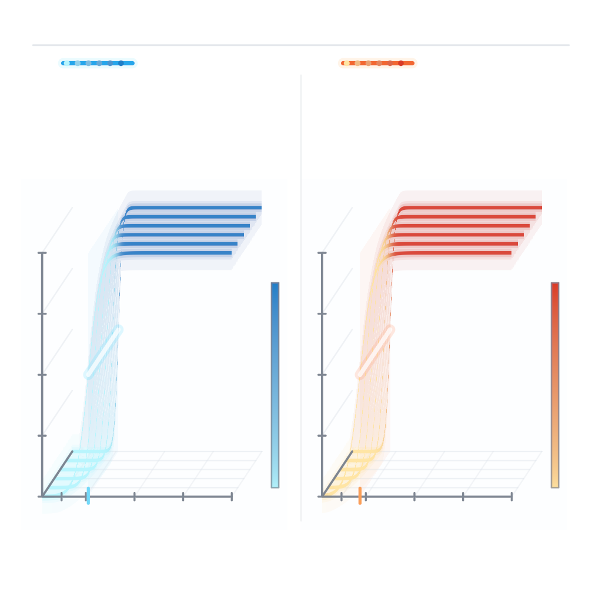

---

### Test 84: Quantum Probability Waves

**Test ID:** `085_quantum_probability_waves`
**Shader Files:** shader.wgsl
**Execution Status:** ✅ Success
**Image Generated:** ✅ Yes
**Judge Scores:** ✅ Available

#### Problem Prompt

> **Objective**
> Visualise the probability density of a 2‑D infinite square‑well eigenstate superposition.
>
> **Quantum system**
>
> * Potential $V(x,y)=0$ for $x,y\in[0,L]$ and $+\infty$ elsewhere; take $L=1$.
> * Eigenfunctions: $\psi_{n,m}(x,y)=2\sin(n\pi x/L)\sin(m\pi y/L)$.
> * Superposed state
>
>   $
>     \Psi(x,y)=\tfrac{1}{\sqrt3}\bigl[\psi_{1,1}+e^{i\pi/3}\psi_{2,3}+e^{-i\pi/4}\psi_{3,2}\bigr].
>   $
> * Probability density $P=|\Psi|^{2}$.
>
> **Rendering**
>
> * Sample $1024\times1024$ grid on domain; compute $P$.
> * Colour with perceptually uniform "magma" palette (black→bright yellow).
> * Display isolines for $P=0.2,0.4,0.6$ as 1‑px white curves.
> * 1600 × 1600 px PNG, 60‑px pure‑black frame around plot. No axes, no text.
>
> **Deliverable**  One PNG.

#### Judge Scores

| Category | Score |
|----------|-------|
| Mathematical Accuracy | 82/100 |
| Visual Quality | 86/100 |
| Color Implementation | 70/100 |
| Geometric Completeness | 76/100 |
| Reference Elements | 80/100 |
| **Total** | **394/500** |
| **Average** | **78.8/100** |


#### Rendered Output

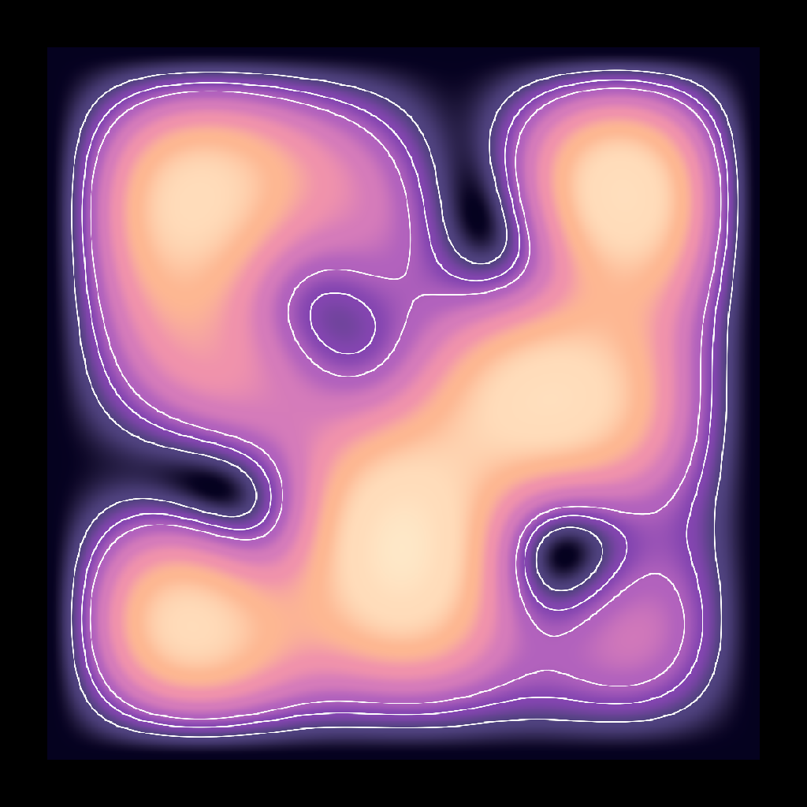

---

### Test 85: Ramanujan Mock Theta

**Test ID:** `086_ramanujan_mock_theta`
**Shader Files:** shader.wgsl
**Execution Status:** ✅ Success
**Image Generated:** ✅ Yes
**Judge Scores:** ✅ Available

#### Problem Prompt

> Present a glowing annular "heat-disk" that lets the viewer viscerally experience how Ramanujan's third-order mock-theta function f(q) blossoms near the unit circle and attenuates radially. The final image should resemble a celestial nebula with fiery inner corona fading to dusk blues.
>
> Mathematics:
> - Define f(q) = 1 + Σ(n=1 to 50) q^(n²) / [(1+q)²(1+q²)²...(1+q^n)²]
> - Complex argument parameterisation: q(t,θ) = e^(-t) * e^(iθ), t ∈ [0,2], θ ∈ [0,2π]
> - Pre-compute magnitude |f(q)| on a polar grid 2048 × 2048 (radial samples 1024, angular 1024)
>
> Colour transfer function:
> - Use "magma" perceptual palette (Matplotlib implementation) mapped linearly:
>   - |f| = 1 → palette index 0.15 (deep purple)
>   - |f| = 2.3 → palette index 0.85 (white-yellow)
>   - Clamp outside range
> - Overlay faint concentric gold rings at t = 0.5, 1.0, 1.5 (guides to show decay)
>
> Display geometry:
> - Canvas 2048 × 2048 px, black outside annulus
> - Polar origin at centre; outer radius corresponds to t=2.0
> - Radial ticks labelled with τ font (optional: small sans-serif)
>
> File: PNG-24
> Deliverable: Outputs a single image.

#### Judge Scores

| Category | Score |
|----------|-------|
| Mathematical Accuracy | 63/100 |
| Visual Quality | 84/100 |
| Color Implementation | 52/100 |
| Geometric Completeness | 76/100 |
| Reference Elements | 58/100 |
| **Total** | **333/500** |
| **Average** | **66.6/100** |


#### Rendered Output

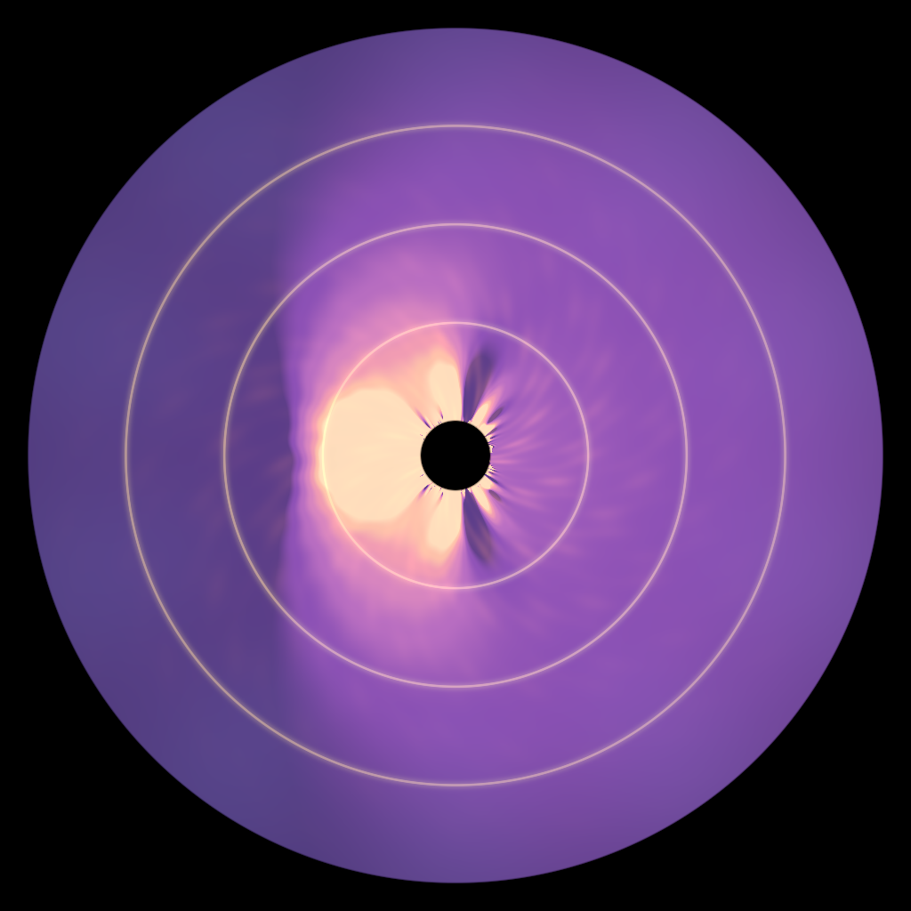

---

### Test 86: Reaction Diffusion Nonorientable Surfaces

**Test ID:** `087_reaction_diffusion_nonorientable_surfaces`
**Shader Files:** shader.wgsl
**Execution Status:** ✅ Success
**Image Generated:** ✅ Yes
**Judge Scores:** ✅ Available

#### Problem Prompt

> **Objective**
> Produce a single high-resolution PNG showing a Gray–Scott reaction–diffusion pattern living on a nonorientable Klein bottle. The visualization should make both the surface topology and the twisted-boundary continuity of the pattern clear.
>
> **Mathematical specification**
> Use the standard immersed Klein bottle parameterisation with \(u,v\in[0,2\pi]\):
> \[
> \begin{aligned}
> x(u,v)&=\left(2+\cos(u/2)\sin v-\sin(u/2)\sin(2v)\right)\cos u,\\
> y(u,v)&=\left(2+\cos(u/2)\sin v-\sin(u/2)\sin(2v)\right)\sin u,\\
> z(u,v)&=\sin(u/2)\sin v+\cos(u/2)\sin(2v).
> \end{aligned}
> \]
> Normalize the final geometry to fit comfortably in the image.
>
> Nonorientable identification:
> \[
> (u=0,v)\sim(u=2\pi,2\pi-v).
> \]
> The pattern must be continuous under this twisted seam identification.
>
> Gray–Scott equations on the parameter domain:
> \[
> \partial_t A=D_A\Delta A-AB^2+F(1-A),
> \]
> \[
> \partial_t B=D_B\Delta B+AB^2-(F+k)B,
> \]
> with
> \[
> D_A=0.16,
> \quad D_B=0.08,
> \quad F=0.036,
> \quad k=0.064.
> \]
> Render a representative frame near \(t=650\) after pattern formation.
>
> Initial seeds for \(B\): five Gaussian spots in the fundamental square at
> \[(u,v)/(2\pi)=(0.18,0.27),(0.35,0.72),(0.52,0.43),(0.74,0.61),(0.88,0.30),\]
> with twisted copies implied by the seam. Start \(A\approx1\), \(B\approx0\) away from seeds.
>
> **Geometry to render**
> - Main Klein bottle mesh: at least \(320\times160\) samples in \((u,v)\).
> - Surface color: concentration \(B(u,v,t)\), using a high-contrast reaction–diffusion palette.
> - Draw the seam \(u=0/2\pi\) as a subtle dashed curve and show that the pattern matches after reversing \(v\).
> - Add small tangent arrows along the seam indicating the twist \(v\mapsto2\pi-v\).
> - Include an inset fundamental square showing the same pattern with edge-identification arrows: horizontal edges periodic, vertical edges twisted.
>
> **Rendering style**
> - Surface pattern should be organic spots/stripes, not random noise.
> - Use smooth shading on the Klein bottle geometry while keeping the scalar pattern crisp.
> - The self-intersection of the standard immersion may be visible, but the pattern should continue through the mathematical surface rather than stopping at the visual crossing.
> - Background: white, pale grey, or dark neutral; choose whichever gives the clearest pattern.
>
> **Composition / overlays**
> - Camera: three-quarter view that reveals the bottle neck, body, and self-intersection region.
> - Place the fundamental-square inset in the lower-right corner.
> - Add a tiny color bar for \(B\) concentration if text rendering is available; otherwise use a simple gradient strip.
>
> **Technical specs**
> - Resolution at least 1600×1600 px.
> - Static frame only; no animation.
>
> **Deliverable** A single PNG image satisfying the above.

#### Judge Scores

| Category | Score |
|----------|-------|
| Mathematical Accuracy | 52/100 |
| Visual Quality | 78/100 |
| Color Implementation | 46/100 |
| Geometric Completeness | 69/100 |
| Reference Elements | 72/100 |
| **Total** | **317/500** |
| **Average** | **63.4/100** |


#### Rendered Output

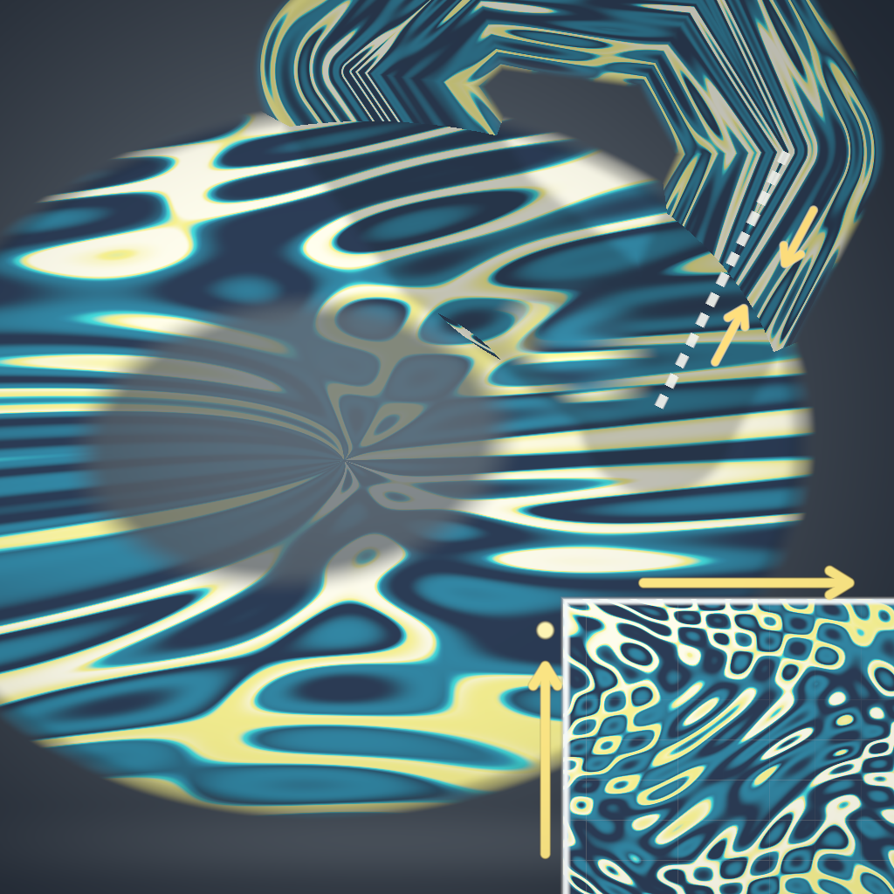

---

### Test 87: Reaction Diffusion Patterns

**Test ID:** `088_reaction_diffusion_patterns`
**Shader Files:** shader.wgsl
**Execution Status:** ✅ Success
**Image Generated:** ✅ Yes
**Judge Scores:** ✅ Available

#### Problem Prompt

> **Objective**
> Simulate the Gray–Scott reaction–diffusion system on a square domain until visually stable patterns emerge; output a single coloured image of the $u$-field.
>
> **Model**
>
> $
> \begin{aligned}
> \partial_t u &= D_u\nabla^{2}u - uv^{2} + F(1-u),\\
> \partial_t v &= D_v\nabla^{2}v + uv^{2} - (F+k)v,
> \end{aligned}
> $
>
> with parameters $D_u=0.14,\;D_v=0.06,\;F=0.035,\;k=0.065$ (classic "zebra / spot" regime).
>
> **Numerics**
>
> * Grid $512\times512$, spacing $h=1$.
> * Time‑step $\Delta t=1.0$, explicit Euler, 20 000 steps.
> * Laplacian via 5‑point stencil, periodic boundaries.
> * Initial condition: $u\equiv1,\;v\equiv0$ plus a $20\times20$ square in centre where $u=0.5,\;v=0.25$ plus 2 % uniform noise.
>
> **Visualisation**
>
> * Map $u(x,y,T)$ to colour with "turbo" palette (0 → dark blue, 1 → yellow‑white).
> * 2048 × 2048 px PNG, no axes, pure white 40‑px margin.
>
> **Deliverable**  One PNG adhering to the above.

#### Judge Scores

| Category | Score |
|----------|-------|
| Mathematical Accuracy | 38/100 |
| Visual Quality | 72/100 |
| Color Implementation | 30/100 |
| Geometric Completeness | 55/100 |
| Reference Elements | 36/100 |
| **Total** | **231/500** |
| **Average** | **46.2/100** |


#### Rendered Output

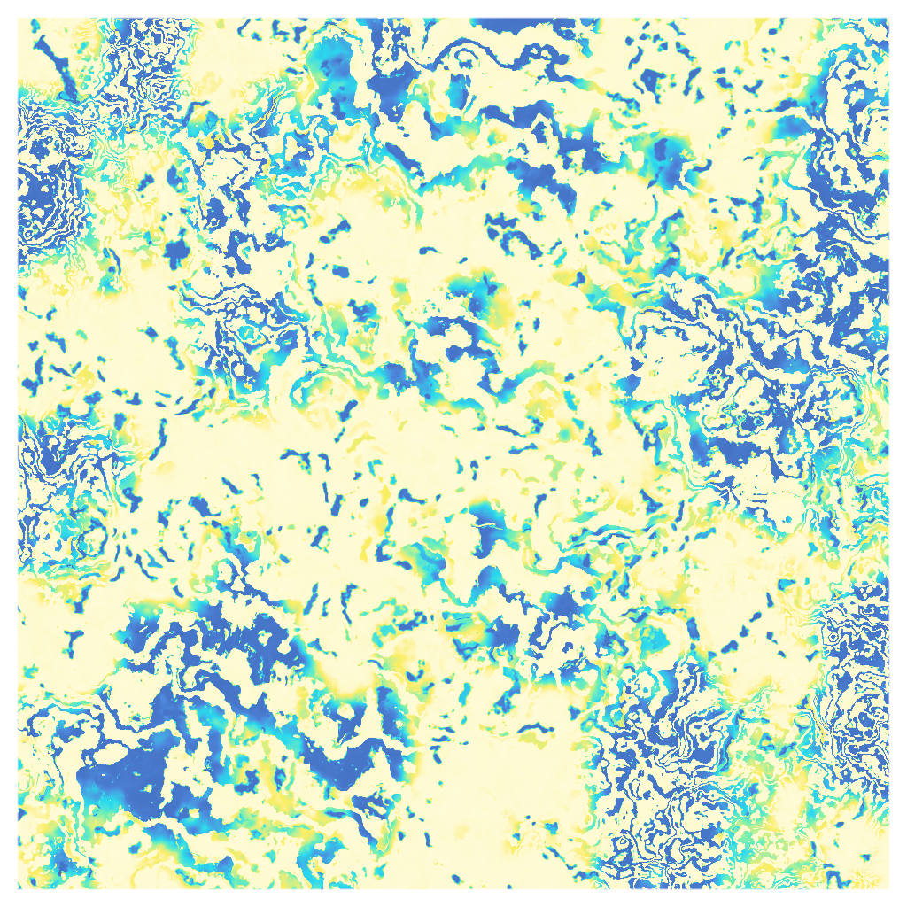

---

### Test 88: Regular Dodecahedron

**Test ID:** `089_regular_dodecahedron`
**Shader Files:** shader.wgsl
**Execution Status:** ✅ Success
**Image Generated:** ✅ Yes
**Judge Scores:** ✅ Available

#### Problem Prompt

> Regular dodecahedron circumscribed sphere radius = 1. Use golden ratio φ=(1+√5)/2.
>
> Material & lighting:
> - Bronze (#b57b33) metallic, roughness 0.25
> - HDR "studio soft" light, key from (4,4,6)
> - Camera (4,-3,2.5), FOV 30°
>
> File: 2600×2000
> Deliverable: Outputs a single image.

#### Judge Scores

| Category | Score |
|----------|-------|
| Mathematical Accuracy | 91/100 |
| Visual Quality | 86/100 |
| Color Implementation | 92/100 |
| Geometric Completeness | 85/100 |
| Reference Elements | 90/100 |
| **Total** | **444/500** |
| **Average** | **88.8/100** |


#### Rendered Output

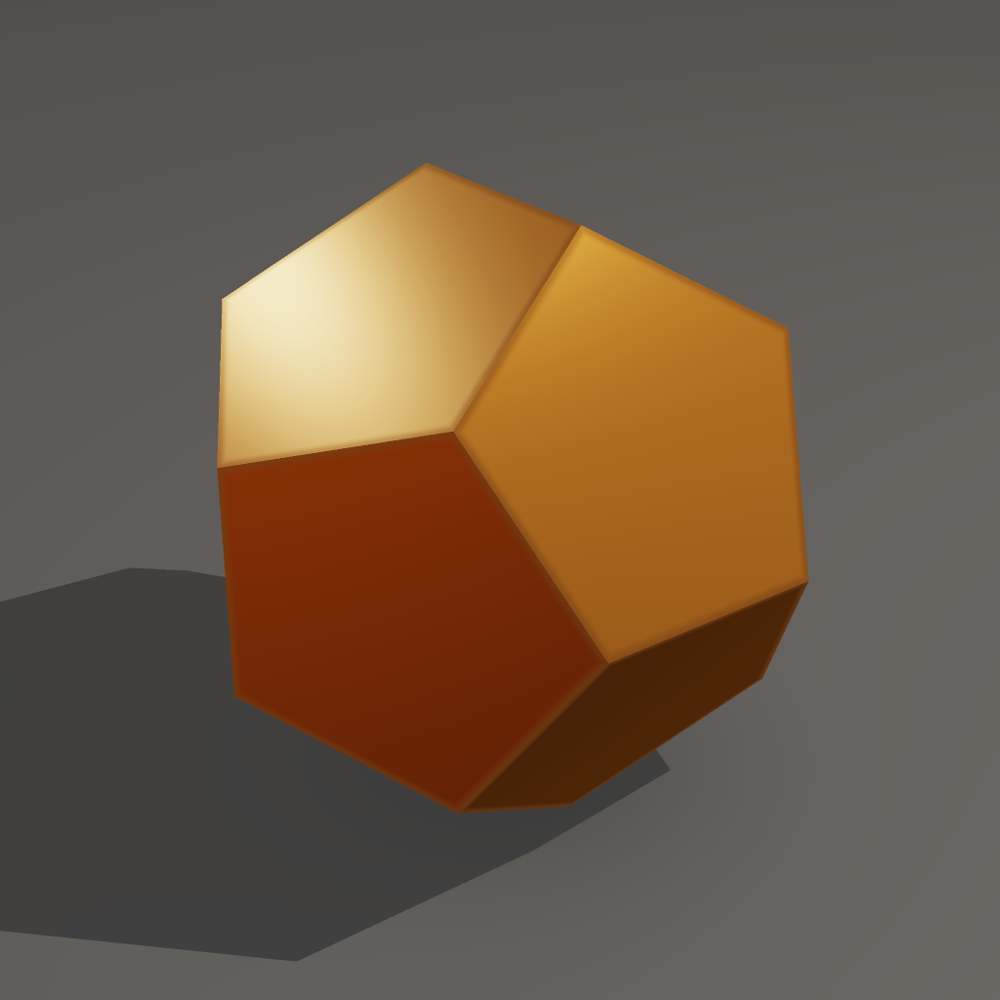

---

### Test 89: Regular Icosahedron

**Test ID:** `090_regular_icosahedron`
**Shader Files:** shader.wgsl
**Execution Status:** ✅ Success
**Image Generated:** ✅ Yes
**Judge Scores:** ✅ Available

#### Problem Prompt

> **Objective**
> Create a high-resolution visualization of a regular icosahedron, one of the five Platonic solids. The icosahedron should be rendered with precise geometric accuracy and aesthetic appeal.
>
> **Mathematical Specification**
>
> 1. **Geometric Definition**
>    - A regular icosahedron has 20 equilateral triangular faces, 12 vertices, and 30 edges
>    - Vertex coordinates (assuming unit circumradius):
>      * (0, ±1, ±φ)/√(φ²+1) where φ = (1+√5)/2 (golden ratio)
>      * (±1, ±φ, 0)/√(φ²+1)
>      * (±φ, 0, ±1)/√(φ²+1)
>    - All vertices lie on a unit sphere
>
> 2. **Face Structure**
>    - 20 triangular faces, each an equilateral triangle
>    - Each vertex connects to exactly 5 edges
>    - Dihedral angle between adjacent faces: arccos(-√5/3) ≈ 138.19°
>
> 3. **Rendering Requirements**
>    - Display as a solid object with visible face boundaries
>    - Orient with one vertex pointing upward along the +y axis
>    - Apply rotation: slow continuous rotation around the y-axis (1 revolution per 8 seconds)
>
> 4. **Visual Style**
>    - Face coloring: Use a gradient based on face normal direction
>      * Hue = atan2(ny, nx) mapped to [0, 360°]
>      * Saturation = 0.7
>      * Value = 0.5 + 0.5 * nz (where n is the face normal)
>    - Edge rendering: Dark grey lines (RGB: 0.2, 0.2, 0.2) with width ≈ 2 pixels
>    - Vertices: Small spheres at each vertex (radius ≈ 0.02), colored white
>
> 5. **Lighting and Shading**
>    - Use Phong shading with:
>      * Ambient: 0.3
>      * Diffuse: 0.6
>      * Specular: 0.1 (shininess: 32)
>    - Light source at position (2, 3, 2)
>    - Background: Gradient from light blue (top) to white (bottom)
>
> 6. **Camera and Output**
>    - Perspective projection with 45° field of view
>    - Camera positioned at (0, 0, 4) looking at origin
>    - Output resolution: 1600 × 1600 pixels
>    - Enable 4× antialiasing
>
> Deliverable: Outputs a single image.

#### Judge Scores

| Category | Score |
|----------|-------|
| Mathematical Accuracy | 84/100 |
| Visual Quality | 83/100 |
| Color Implementation | 87/100 |
| Geometric Completeness | 74/100 |
| Reference Elements | 80/100 |
| **Total** | **408/500** |
| **Average** | **81.6/100** |


#### Rendered Output

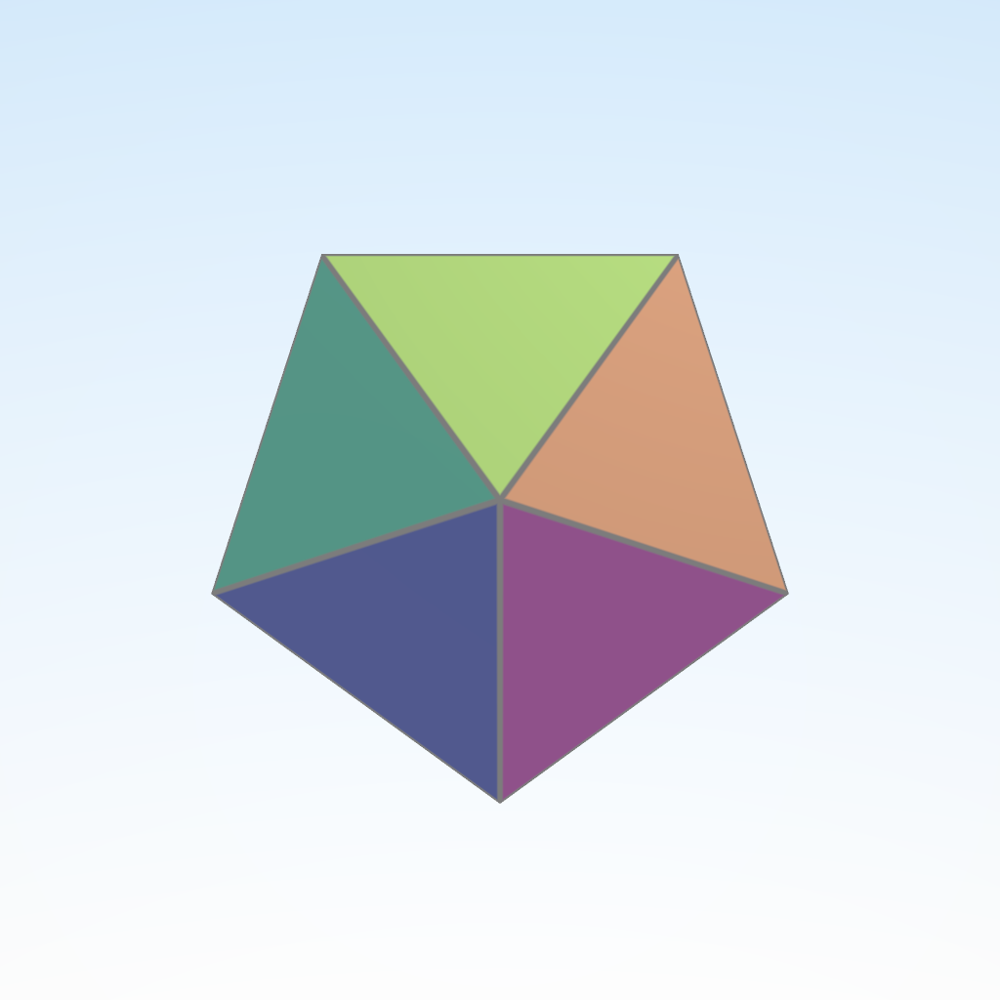

---

### Test 90: Regular Octahedron

**Test ID:** `091_regular_octahedron`
**Shader Files:** shader.wgsl
**Execution Status:** ✅ Success
**Image Generated:** ✅ Yes
**Judge Scores:** ✅ Available

#### Problem Prompt

> Regular octahedron edge = 2. Position one vertex up (0,0,√2).
>
> Rendering:
> - Solid slate-gray faces (#666d78), glossy; edge bevel 0.05
> - Key light (5,3,6). White BG. 2000×1600
>
> Deliverable: Outputs a single image.

#### Judge Scores

| Category | Score |
|----------|-------|
| Mathematical Accuracy | 86/100 |
| Visual Quality | 84/100 |
| Color Implementation | 91/100 |
| Geometric Completeness | 82/100 |
| Reference Elements | 84/100 |
| **Total** | **427/500** |
| **Average** | **85.4/100** |


#### Rendered Output

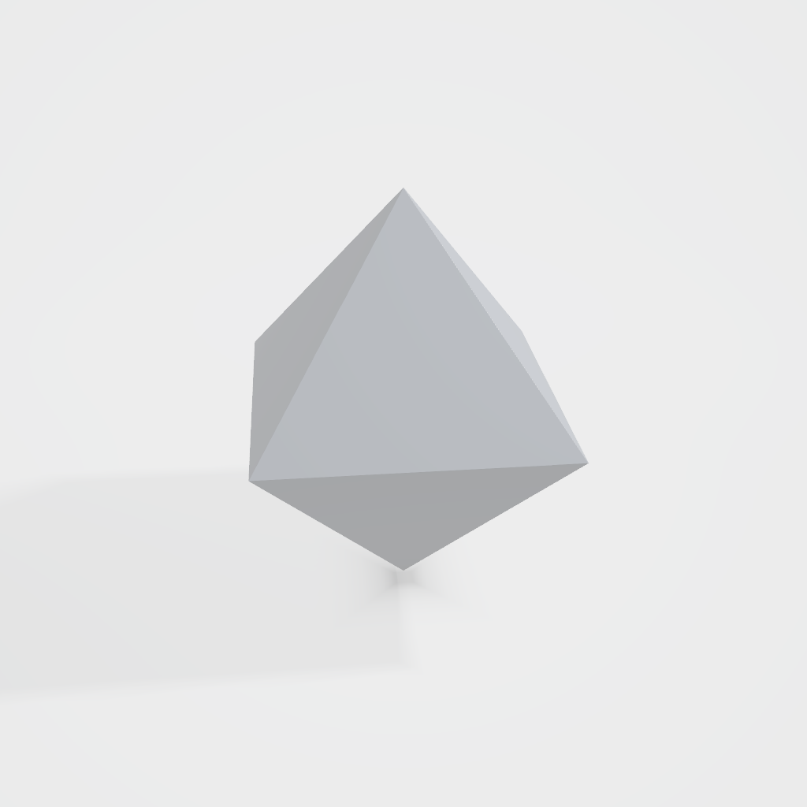

---

### Test 91: Regular Tetrahedron

**Test ID:** `092_regular_tetrahedron`
**Shader Files:** shader.wgsl
**Execution Status:** ✅ Success
**Image Generated:** ✅ Yes
**Judge Scores:** ✅ Available

#### Problem Prompt

> Regular tetrahedron edge = 2. Vertices: (1,1,1), (-1,-1,1), (-1,1,-1), (1,-1,-1) divided by √3 to keep circumsphere radius 1.
>
> Visuals:
> - Matte golden material (#ffcc55) with anisotropic highlights
> - Softbox light (-4,4,6)
> - Ground plane mirror 30% reflective
> - Camera (3,-4,2.5), FOV 35°
>
> File: 2200×1600
> Deliverable: Outputs a single image.

#### Judge Scores

| Category | Score |
|----------|-------|
| Mathematical Accuracy | 68/100 |
| Visual Quality | 45/100 |
| Color Implementation | 86/100 |
| Geometric Completeness | 42/100 |
| Reference Elements | 70/100 |
| **Total** | **311/500** |
| **Average** | **62.2/100** |


#### Rendered Output

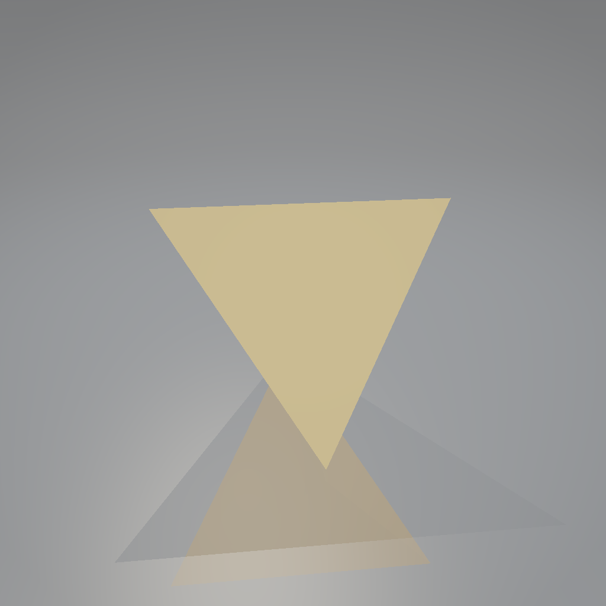

---

### Test 92: Reproduce Image

**Test ID:** `093_reproduce_image`
**Shader Files:** shader.wgsl
**Execution Status:** ✅ Success
**Image Generated:** ✅ Yes
**Judge Scores:** ✅ Available

#### Problem Prompt

> Reproduce the provided reference image using a shader.
> Your shader must analytically or mathematically recreate the scene.
> CRITICAL: Do NOT just read the actual image pixels or hardcode pixel arrays. If you do this, you will receive a 0% score. You must re-create the underlying procedural shapes, colors, and patterns.
>
> Deliverable: Outputs a single image that matches the reference image as closely as possible.

#### Judge Scores

| Category | Score |
|----------|-------|
| Mathematical Accuracy | 64/100 |
| Visual Quality | 58/100 |
| Color Implementation | 66/100 |
| Geometric Completeness | 60/100 |
| Reference Elements | 63/100 |
| **Total** | **311/500** |
| **Average** | **62.2/100** |


#### Rendered Output

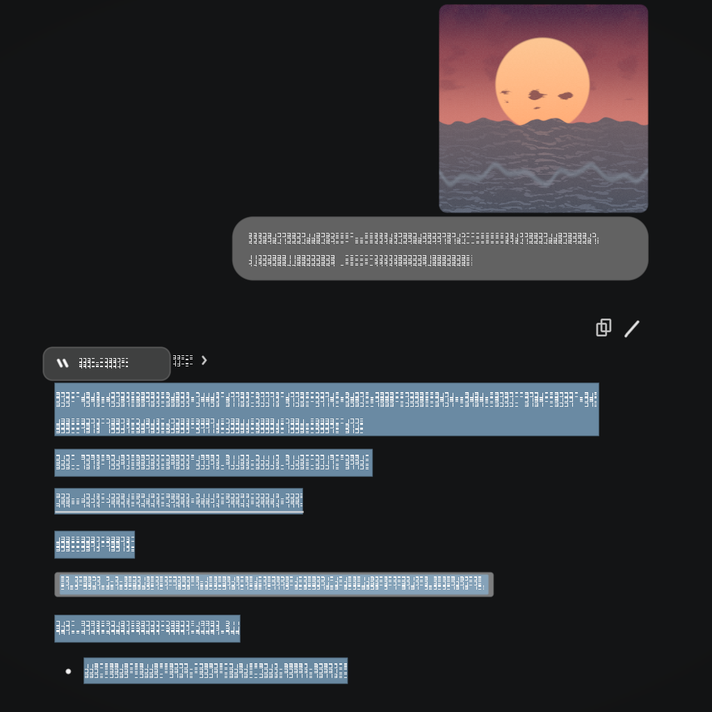

---

### Test 93: Reproduce Image Andrew Pons

**Test ID:** `094_reproduce_image_andrew_pons`
**Shader Files:** shader.wgsl
**Execution Status:** ✅ Success
**Image Generated:** ✅ Yes
**Judge Scores:** ✅ Available

#### Problem Prompt

> Reproduce the provided reference image using a shader.
> Your shader must analytically or mathematically recreate the scene.
> CRITICAL: Do NOT just read the actual image pixels or hardcode pixel arrays. If you do this, you will receive a 0% score. You must re-create the underlying procedural shapes, colors, and patterns.
>
> Deliverable: Outputs a single image that matches the reference image as closely as possible.

#### Judge Scores

| Category | Score |
|----------|-------|
| Mathematical Accuracy | 58/100 |
| Visual Quality | 68/100 |
| Color Implementation | 60/100 |
| Geometric Completeness | 70/100 |
| Reference Elements | 55/100 |
| **Total** | **311/500** |
| **Average** | **62.2/100** |


#### Rendered Output

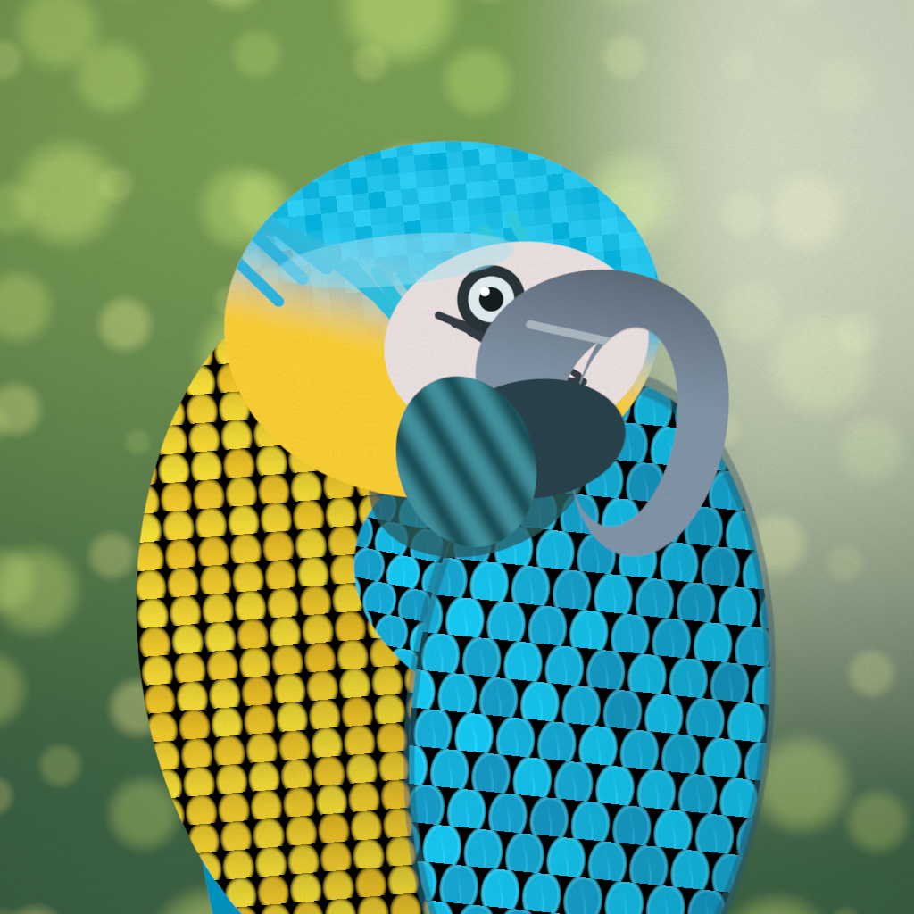

---

### Test 94: Reproduce Image Fabrice Villard

**Test ID:** `095_reproduce_image_fabrice_villard`
**Shader Files:** shader.wgsl
**Execution Status:** ✅ Success
**Image Generated:** ✅ Yes
**Judge Scores:** ✅ Available

#### Problem Prompt

> Reproduce the provided reference image using a shader.
> Your shader must analytically or mathematically recreate the scene.
> CRITICAL: Do NOT just read the actual image pixels or hardcode pixel arrays. If you do this, you will receive a 0% score. You must re-create the underlying procedural shapes, colors, and patterns.
>
> Deliverable: Outputs a single image that matches the reference image as closely as possible.

#### Judge Scores

| Category | Score |
|----------|-------|
| Mathematical Accuracy | 58/100 |
| Visual Quality | 64/100 |
| Color Implementation | 55/100 |
| Geometric Completeness | 66/100 |
| Reference Elements | 57/100 |
| **Total** | **300/500** |
| **Average** | **60.0/100** |


#### Rendered Output

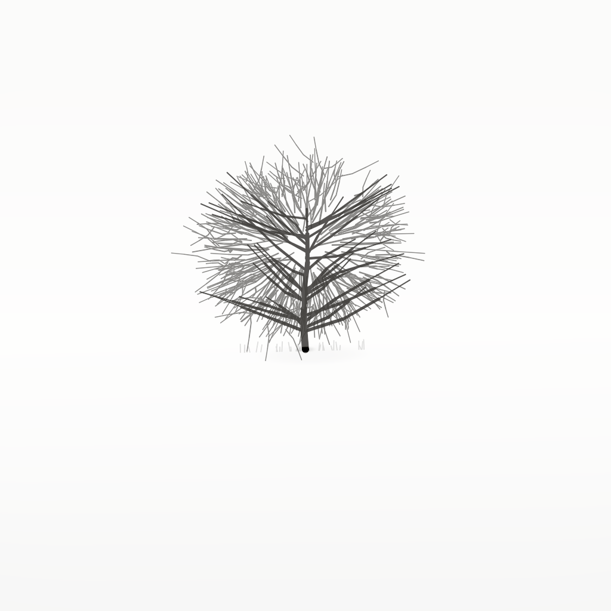

---

### Test 95: Reproduce Image Jason Leung

**Test ID:** `096_reproduce_image_jason_leung`
**Shader Files:** shader.wgsl
**Execution Status:** ✅ Success
**Image Generated:** ✅ Yes
**Judge Scores:** ✅ Available

#### Problem Prompt

> Reproduce the provided reference image using a shader.
> Your shader must analytically or mathematically recreate the scene.
> CRITICAL: Do NOT just read the actual image pixels or hardcode pixel arrays. If you do this, you will receive a 0% score. You must re-create the underlying procedural shapes, colors, and patterns.
>
> Deliverable: Outputs a single image that matches the reference image as closely as possible.

#### Judge Scores

| Category | Score |
|----------|-------|
| Mathematical Accuracy | 34/100 |
| Visual Quality | 55/100 |
| Color Implementation | 42/100 |
| Geometric Completeness | 58/100 |
| Reference Elements | 30/100 |
| **Total** | **219/500** |
| **Average** | **43.8/100** |


#### Rendered Output

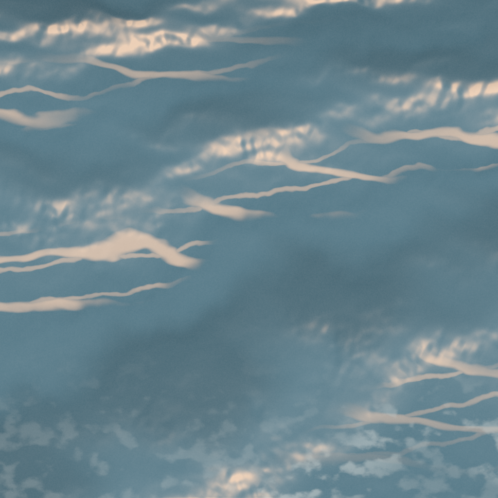

---

### Test 96: Reproduce Image Javier Penas

**Test ID:** `097_reproduce_image_javier_penas`
**Shader Files:** shader.wgsl
**Execution Status:** ✅ Success
**Image Generated:** ✅ Yes
**Judge Scores:** ✅ Available

#### Problem Prompt

> Reproduce the provided reference image using a shader.
> Your shader must analytically or mathematically recreate the scene.
> CRITICAL: Do NOT just read the actual image pixels or hardcode pixel arrays. If you do this, you will receive a 0% score. You must re-create the underlying procedural shapes, colors, and patterns.
>
> Deliverable: Outputs a single image that matches the reference image as closely as possible.

#### Judge Scores

| Category | Score |
|----------|-------|
| Mathematical Accuracy | 34/100 |
| Visual Quality | 42/100 |
| Color Implementation | 36/100 |
| Geometric Completeness | 43/100 |
| Reference Elements | 32/100 |
| **Total** | **187/500** |
| **Average** | **37.4/100** |


#### Rendered Output

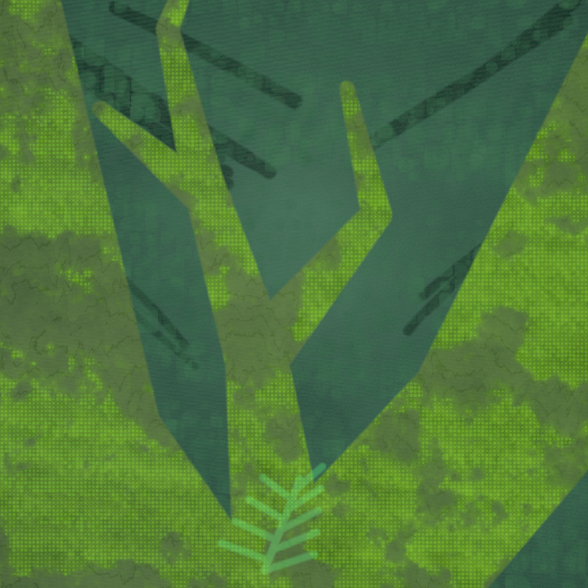

---

### Test 97: Reproduce Image Mark Basarab

**Test ID:** `098_reproduce_image_mark_basarab`
**Shader Files:** shader.wgsl
**Execution Status:** ✅ Success
**Image Generated:** ✅ Yes
**Judge Scores:** ✅ Available

#### Problem Prompt

> Reproduce the provided reference image using a shader.
> Your shader must analytically or mathematically recreate the scene.
> CRITICAL: Do NOT just read the actual image pixels or hardcode pixel arrays. If you do this, you will receive a 0% score. You must re-create the underlying procedural shapes, colors, and patterns.
>
> Deliverable: Outputs a single image that matches the reference image as closely as possible.

#### Judge Scores

| Category | Score |
|----------|-------|
| Mathematical Accuracy | 62/100 |
| Visual Quality | 56/100 |
| Color Implementation | 64/100 |
| Geometric Completeness | 55/100 |
| Reference Elements | 68/100 |
| **Total** | **305/500** |
| **Average** | **61.0/100** |


#### Rendered Output

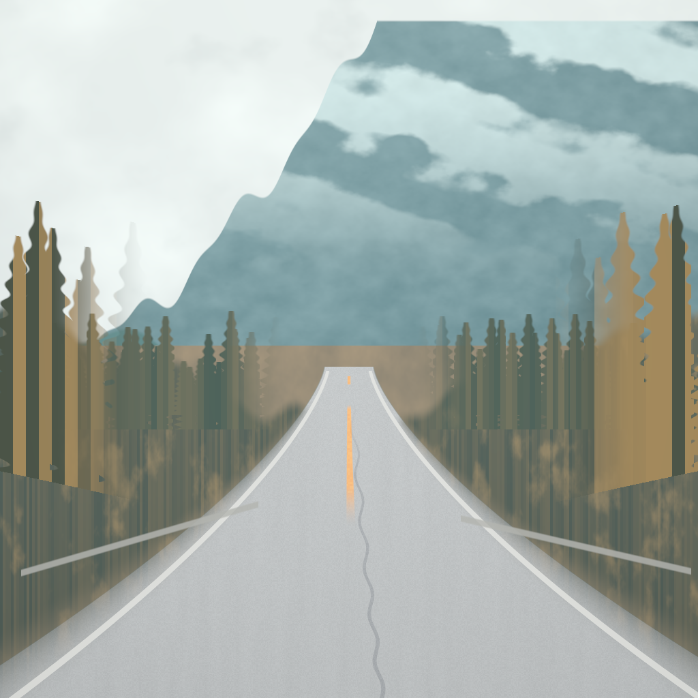

---

### Test 98: Reproduce Image Photoholgic

**Test ID:** `099_reproduce_image_photoholgic`
**Shader Files:** shader.wgsl
**Execution Status:** ✅ Success
**Image Generated:** ✅ Yes
**Judge Scores:** ✅ Available

#### Problem Prompt

> Reproduce the provided reference image using a shader.
> Your shader must analytically or mathematically recreate the scene.
> CRITICAL: Do NOT just read the actual image pixels or hardcode pixel arrays. If you do this, you will receive a 0% score. You must re-create the underlying procedural shapes, colors, and patterns.
>
> Deliverable: Outputs a single image that matches the reference image as closely as possible.

#### Judge Scores

| Category | Score |
|----------|-------|
| Mathematical Accuracy | 58/100 |
| Visual Quality | 62/100 |
| Color Implementation | 63/100 |
| Geometric Completeness | 61/100 |
| Reference Elements | 56/100 |
| **Total** | **300/500** |
| **Average** | **60.0/100** |


#### Rendered Output

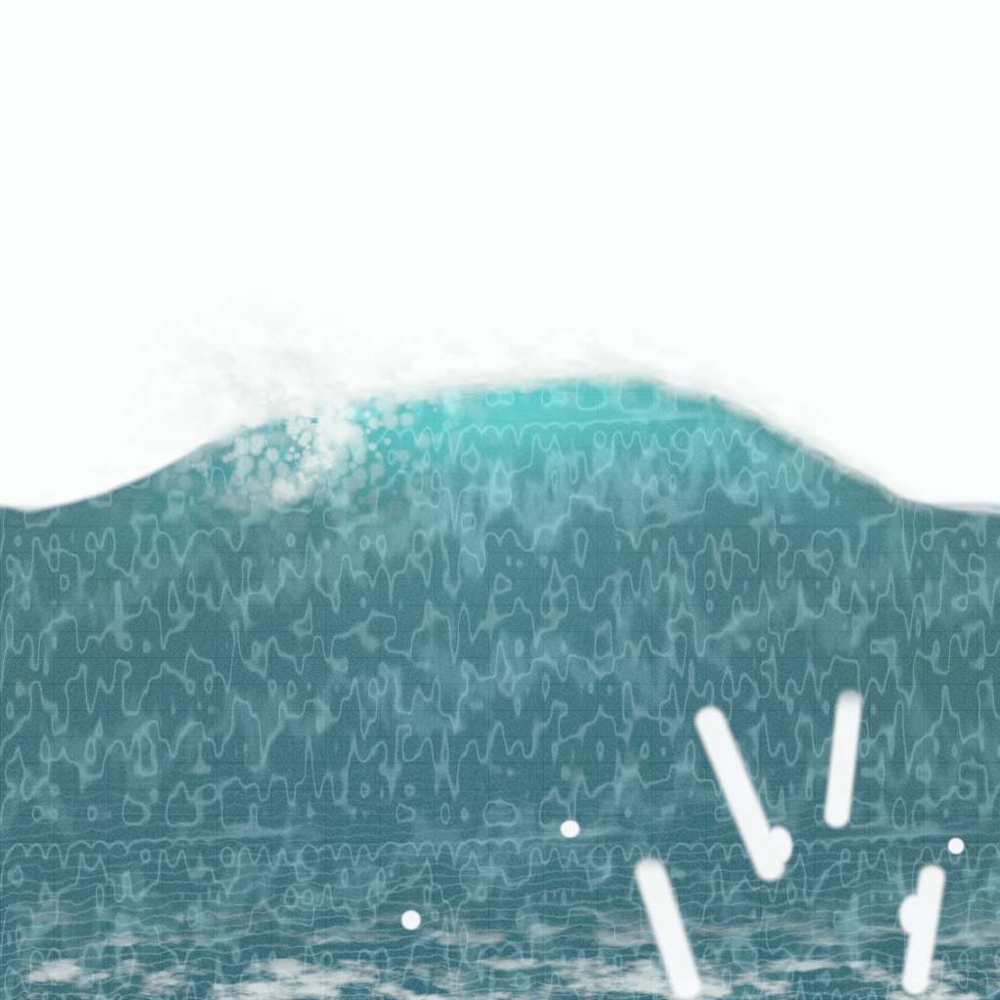

---

### Test 99: Reproduce Image Rayul

**Test ID:** `100_reproduce_image_rayul`
**Shader Files:** shader.wgsl
**Execution Status:** ✅ Success
**Image Generated:** ✅ Yes
**Judge Scores:** ✅ Available

#### Problem Prompt

> Reproduce the provided reference image using a shader.
> Your shader must analytically or mathematically recreate the scene.
> CRITICAL: Do NOT just read the actual image pixels or hardcode pixel arrays. If you do this, you will receive a 0% score. You must re-create the underlying procedural shapes, colors, and patterns.
>
> Deliverable: Outputs a single image that matches the reference image as closely as possible.

#### Judge Scores

| Category | Score |
|----------|-------|
| Mathematical Accuracy | 72/100 |
| Visual Quality | 78/100 |
| Color Implementation | 76/100 |
| Geometric Completeness | 82/100 |
| Reference Elements | 74/100 |
| **Total** | **382/500** |
| **Average** | **76.4/100** |


#### Rendered Output

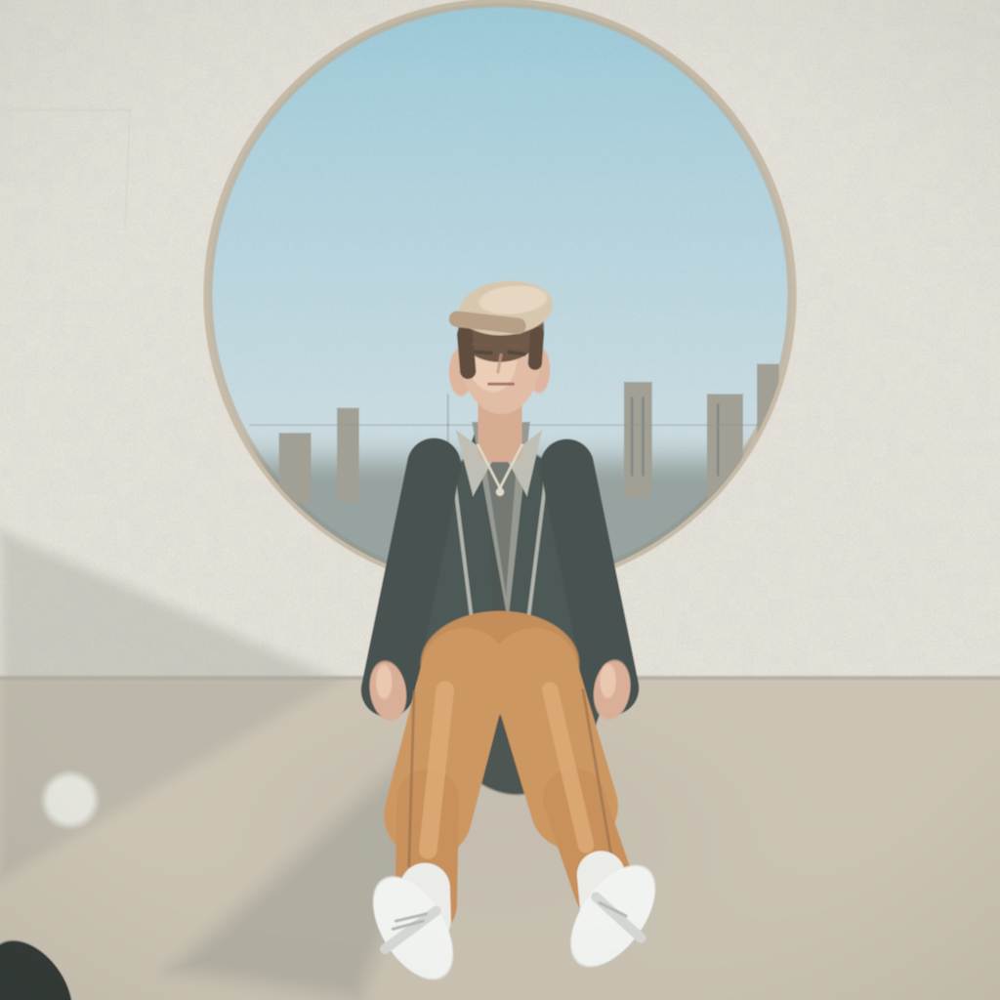

---

### Test 100: Reproduce Image Sebastien Gabriel

**Test ID:** `101_reproduce_image_sebastien_gabriel`
**Shader Files:** shader.wgsl
**Execution Status:** ✅ Success
**Image Generated:** ✅ Yes
**Judge Scores:** ✅ Available

#### Problem Prompt

> Reproduce the provided reference image using a shader.
> Your shader must analytically or mathematically recreate the scene.
> CRITICAL: Do NOT just read the actual image pixels or hardcode pixel arrays. If you do this, you will receive a 0% score. You must re-create the underlying procedural shapes, colors, and patterns.
>
> Deliverable: Outputs a single image that matches the reference image as closely as possible.

#### Judge Scores

| Category | Score |
|----------|-------|
| Mathematical Accuracy | 58/100 |
| Visual Quality | 66/100 |
| Color Implementation | 64/100 |
| Geometric Completeness | 63/100 |
| Reference Elements | 57/100 |
| **Total** | **308/500** |
| **Average** | **61.6/100** |


#### Rendered Output

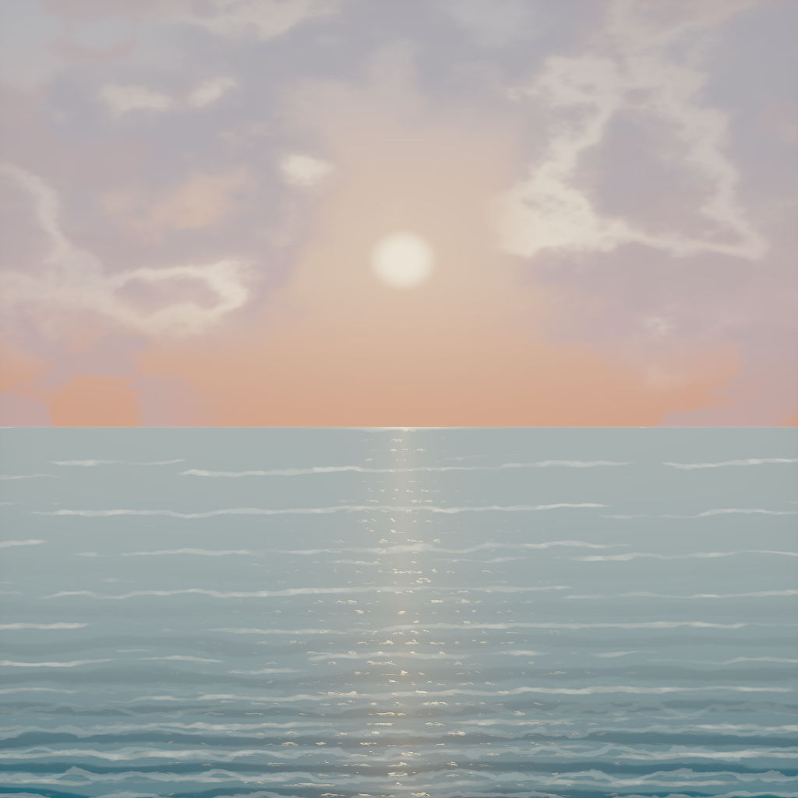

---

### Test 101: Reproduce Image Tim Stief

**Test ID:** `102_reproduce_image_tim_stief`
**Shader Files:** shader.wgsl
**Execution Status:** ✅ Success
**Image Generated:** ✅ Yes
**Judge Scores:** ✅ Available

#### Problem Prompt

> Reproduce the provided reference image using a shader.
> Your shader must analytically or mathematically recreate the scene.
> CRITICAL: Do NOT just read the actual image pixels or hardcode pixel arrays. If you do this, you will receive a 0% score. You must re-create the underlying procedural shapes, colors, and patterns.
>
> Deliverable: Outputs a single image that matches the reference image as closely as possible.

#### Judge Scores

| Category | Score |
|----------|-------|
| Mathematical Accuracy | 63/100 |
| Visual Quality | 70/100 |
| Color Implementation | 68/100 |
| Geometric Completeness | 71/100 |
| Reference Elements | 61/100 |
| **Total** | **333/500** |
| **Average** | **66.6/100** |


#### Rendered Output

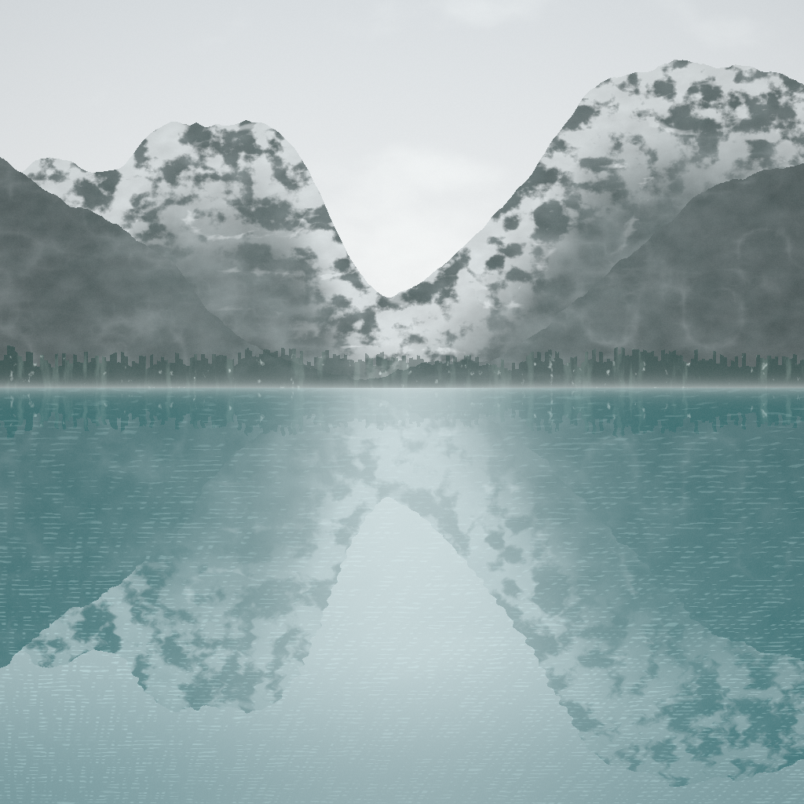

---

### Test 102: Riemann Surface Branch Cuts

**Test ID:** `103_riemann_surface_branch_cuts`
**Shader Files:** shader.wgsl
**Execution Status:** ✅ Success
**Image Generated:** ✅ Yes
**Judge Scores:** ✅ Available

#### Problem Prompt

> **Objective**
> Render the two‑sheet Riemann surface of $w=\sqrt{z}$ above the complex plane, using height = $\Re w$ and colour = $\operatorname{arg}w$.
>
> **Construction**
>
> * Domain: $z=re^{i\phi}$ with $r\in[0,4],\;\phi\in(-\pi,\pi]$.
> * Two sheets: choose signs $+\sqrt{r}$ and $-\sqrt{r}$.
> * Introduce **branch cut** along negative real axis: join sheets there.
> * Triangulate with polar grid 800 × 800, map to $(x,y,\Re w)$.
>
> **Styling**
>
> * Colour via HSV: hue = $\phi/2\pi$ (wrap‑around), sat = 1, val = 1; upper sheet full opacity, lower sheet 70 % opacity.
> * Edge outlines 1‑px black; hide underside faces.
> * Camera at $(7,0,5)$ looking at origin; 30° FOV, perspective.
> * Lighting: ambient 0.2 + white directional (−0.3,−0.4,−1).
> * 2200 × 1600 px PNG, white background.
>
> **Deliverable** One PNG.

#### Judge Scores

| Category | Score |
|----------|-------|
| Mathematical Accuracy | 76/100 |
| Visual Quality | 86/100 |
| Color Implementation | 72/100 |
| Geometric Completeness | 82/100 |
| Reference Elements | 74/100 |
| **Total** | **390/500** |
| **Average** | **78.0/100** |


#### Rendered Output

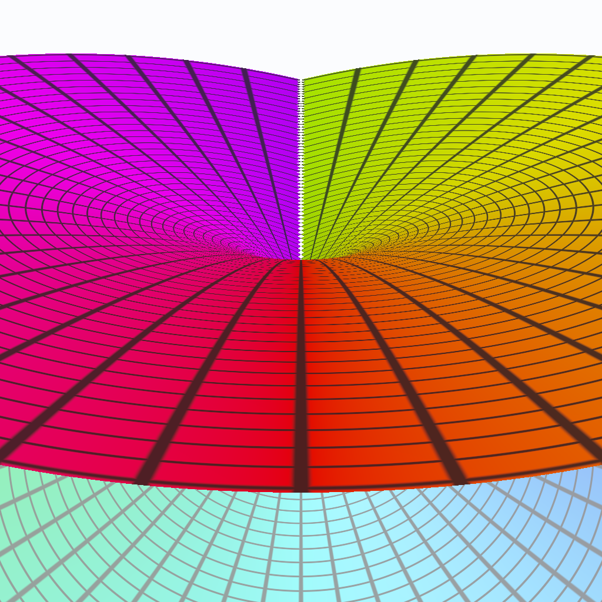

---

### Test 103: Riemann Surface Covering Sheets

**Test ID:** `104_riemann_surface_covering_sheets`
**Shader Files:** shader.wgsl
**Execution Status:** ✅ Success
**Image Generated:** ✅ Yes
**Judge Scores:** ✅ Available

#### Problem Prompt

> **Objective**
> Produce a single high-resolution PNG visualising the two-sheeted Riemann surface of a square-root function with four branch points. The image should show both covering sheets, branch cuts, sheet exchange, and monodromy trails.
>
> **Mathematical specification**
> Let \(z=x+iy\) over the base square \((x,y)\in[-1.6,1.6]^2\). Define
> \[
> P(z)=(z^2-1)(z^2+0.36),
> \]
> with branch points
> \[
> z=-1,\quad z=1,\quad z=-0.6i,\quad z=0.6i.
> \]
> The two sheets are
> \[
> w_+(z)=+\sqrt{P(z)},\qquad w_-(z)=-\sqrt{P(z)}.
> \]
> Use principal square root locally, but visualise sheet exchange across branch cuts.
>
> Branch cuts:
> - Draw one cut along the real segment from \(-1\) to \(1\).
> - Draw one cut along the imaginary segment from \(-0.6i\) to \(0.6i\).
>
> Surface embedding:
> - Base coordinates are \((x,y)\).
> - Height for a sheet is \(h=0.55\tanh(\operatorname{Re} w_\pm)\).
> - Color hue is \((\arg w_\pm+\pi)/(2\pi)\), with saturation high and value adjusted by height.
> - Make the two sheets semi-transparent where they overlap, but keep branch-cut seams and branch points crisp.
>
> **Geometry to render**
> - Two translucent surface sheets over the base square, one for \(w_+\), one for \(w_-\), with a small vertical separation or opacity difference only if needed for readability.
> - Four branch points as small black or gold spheres on the base plane and on the sheet junctions.
> - Two branch cuts as thick dark curves on the base plane and highlighted seams on the sheets.
> - Monodromy trails:
>   1. A small loop around \(z=1\), with arrows showing that a traveller switches sheets after one loop.
>   2. A small loop around \(z=0.6i\), also showing sheet switch.
>   3. A larger loop enclosing both real branch points \(-1,1\), showing return to the starting sheet.
> - Base plane: translucent grid in the \(z\)-plane with real and imaginary axes emphasized.
>
> **Rendering style**
> - Sheet colors should vary continuously by complex phase \(\arg w\), with no random patch coloring.
> - Use transparency to show both sheets and their crossings.
> - Branch cuts should be dark or saturated enough to be unambiguous.
> - Background: white or light grey.
> - Use anti-aliased curves and soft lighting; avoid heavy outlines except for cuts and monodromy trails.
>
> **Composition / overlays**
> - Camera: oblique 3D view from above, centered on the four branch points.
> - Keep the base grid visible underneath the sheets.
> - Place a tiny two-color legend showing “sheet +” and “sheet −” if text or simple symbols are possible.
>
> **Technical specs**
> - Resolution at least 1600×1600 px.
> - Static frame only; no animation.
>
> **Deliverable** A single PNG image satisfying the above.

#### Judge Scores

| Category | Score |
|----------|-------|
| Mathematical Accuracy | 82/100 |
| Visual Quality | 78/100 |
| Color Implementation | 80/100 |
| Geometric Completeness | 76/100 |
| Reference Elements | 86/100 |
| **Total** | **402/500** |
| **Average** | **80.4/100** |


#### Rendered Output

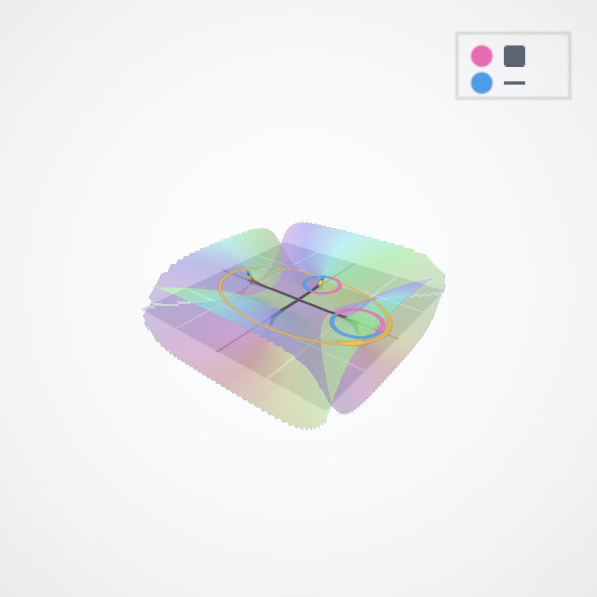

---

### Test 104: Riemann Zeta Zeros

**Test ID:** `105_riemann_zeta_zeros`
**Shader Files:** shader.wgsl
**Execution Status:** ✅ Success
**Image Generated:** ✅ Yes
**Judge Scores:** ✅ Available

#### Problem Prompt

> Depict the elusive non-trivial zeros as shimmering sapphire-blue orbs piercing an amber waveform of |ζ(½+it)|. The viewer should instantly see that every zero corresponds to a local minimum touching the x-axis in the magnitude plot—an echo of the famous "critical-line" mystery.
>
> Data & sampling:
> - Retrieve first 40 ordinates t_k via high-precision library (MPFR, 100 bit)
> - Sample |ζ| on t-axis 0→50 with 10,001 points; use mpmath.zeta
>
> Plot design:
> - Canvas 2200×1600 px
> - Coordinate system – x = t (scaled full width minus 100 px margins), y = |ζ| (log scale log₁₀(|ζ|+1), plotting range 0→log₁₀(20))
> - Magnitude curve – 4 px stroke, amber (#FFB000), 60% opacity, slight Gaussian blur σ=0.8 px
> - Zero markers – solid circles radius 7 px, royal-blue (#004CFF), positioned at y=0 baseline
> - Horizontal baseline (grey 50% intensity)
> - Subtitle small font: "First forty non-trivial zeros of ζ(s) on Re(s)=½"
>
> Deliverable: Outputs a single image.

#### Judge Scores

| Category | Score |
|----------|-------|
| Mathematical Accuracy | 36/100 |
| Visual Quality | 74/100 |
| Color Implementation | 24/100 |
| Geometric Completeness | 68/100 |
| Reference Elements | 26/100 |
| **Total** | **228/500** |
| **Average** | **45.6/100** |


#### Rendered Output

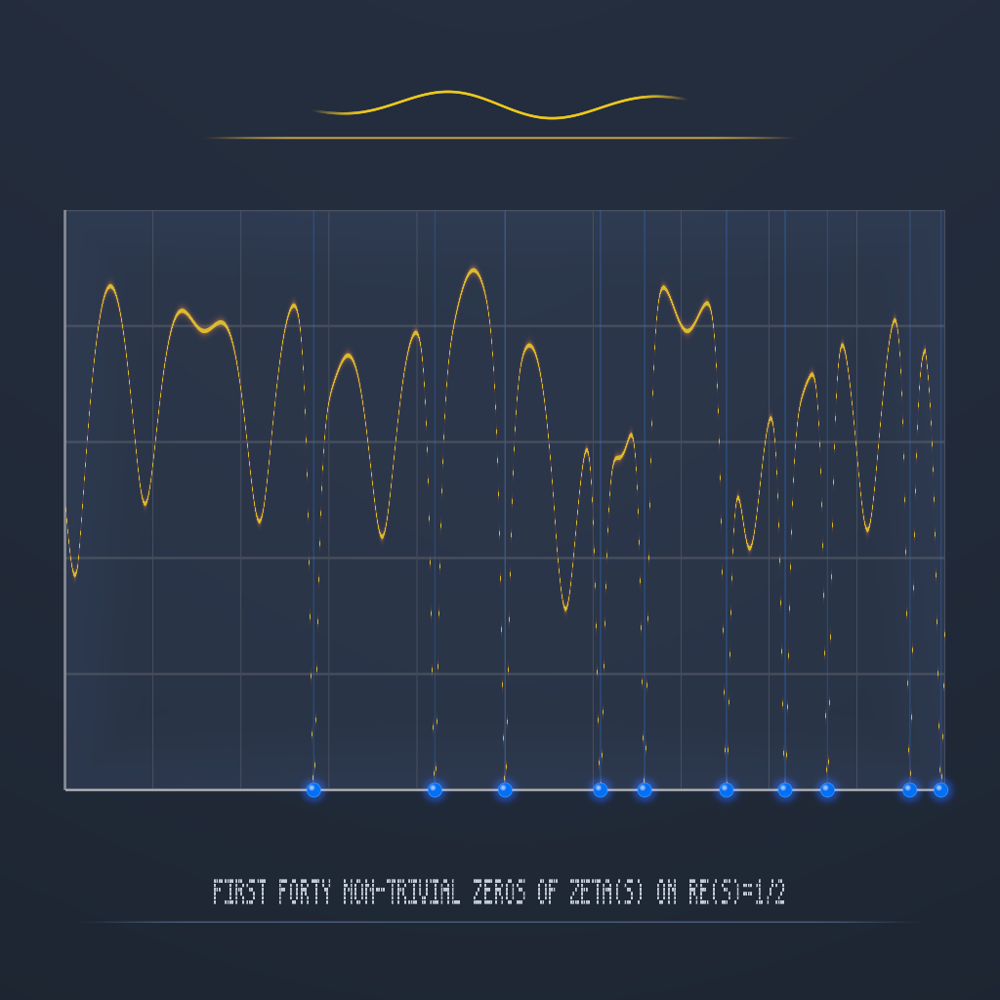

---

### Test 105: Rose Curves

**Test ID:** `106_rose_curves`
**Shader Files:** shader.wgsl
**Execution Status:** ✅ Success
**Image Generated:** ✅ Yes
**Judge Scores:** ✅ Available

#### Problem Prompt

> **Objective** – Plot the polar curve $r = \cos(k\theta)$ for **k = 7** on θ ∈ [0,2π].
>
> **Rendering rules**
>
> * Use 8000 uniformly spaced θ‑samples; connect with Catmull–Rom spline for smoothness.
> * Stroke width 6 px, colour #ff55aa, opacity 0.9.
> * Place on 1800 × 1800 px white canvas; origin centred; radial scale so outer petal tip touches 90 % of canvas radius.
> * Add thin (#444444, 1 px) polar grid: circles at radii 0.25, 0.5, 0.75, 1.0 and radial spokes every 15°.
>
> **Deliverable** – PNG.

#### Judge Scores

| Category | Score |
|----------|-------|
| Mathematical Accuracy | 93/100 |
| Visual Quality | 91/100 |
| Color Implementation | 94/100 |
| Geometric Completeness | 90/100 |
| Reference Elements | 92/100 |
| **Total** | **460/500** |
| **Average** | **92.0/100** |


#### Rendered Output

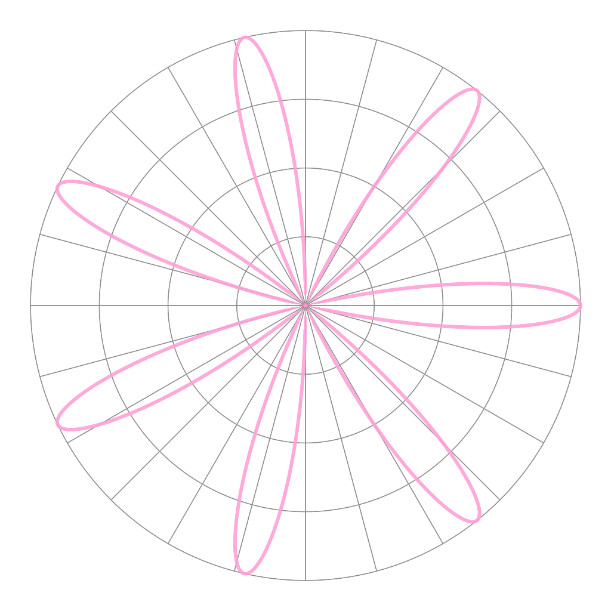

---

### Test 106: Rotating Hypercube Projection

**Test ID:** `107_rotating_hypercube_projection`
**Shader Files:** shader.wgsl
**Execution Status:** ✅ Success
**Image Generated:** ✅ Yes
**Judge Scores:** ✅ Available

#### Problem Prompt

> **Objective**
> Visualize a 4D hypercube (tesseract) through rotation and projection to 2D.
>
> **Construction**
> Generate tesseract vertices (±1,±1,±1,±1). Apply 4‑D rotation
> $R_{xy}(θ)\,R_{zw}(θ)$ with θ=45°. Orthographic project to 3‑D by dropping w then to 2‑D via perspective camera (3,2,2).
>
> **Styling**
> Draw edges 3 px #00aaff, hidden edges 1 px dashed grey. 2400×1800 PNG.
>
> **Deliverable** PNG.

#### Judge Scores

| Category | Score |
|----------|-------|
| Mathematical Accuracy | 72/100 |
| Visual Quality | 82/100 |
| Color Implementation | 74/100 |
| Geometric Completeness | 58/100 |
| Reference Elements | 64/100 |
| **Total** | **350/500** |
| **Average** | **70.0/100** |


#### Rendered Output

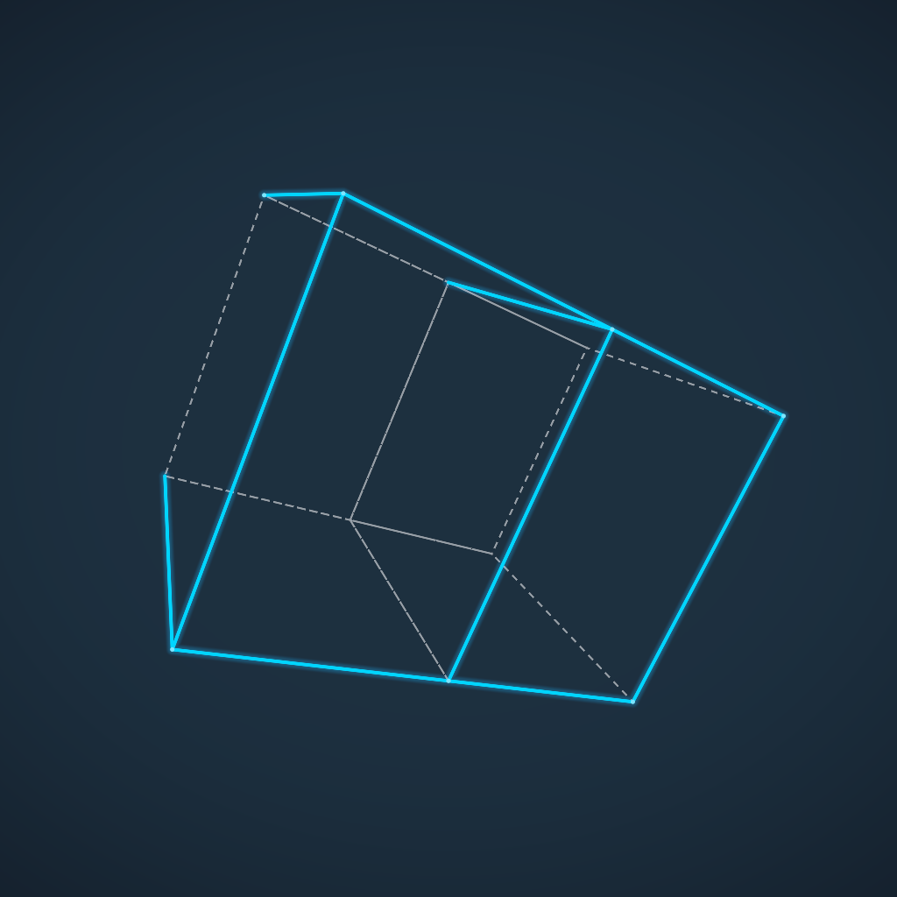

---

### Test 107: Rounded Box

**Test ID:** `108_rounded_box`
**Shader Files:** shader.wgsl
**Execution Status:** ✅ Success
**Image Generated:** ✅ Yes
**Judge Scores:** ✅ Available

#### Problem Prompt

> Create a 3D rounded box (dimensions 2x3x1.5) with rounded edges (radius 0.3) centered at origin. Material: matte mint green plastic (RGB 0.3, 0.8, 0.6). Lighting: soft ambient (0.3) plus key light from top-right. Background: light gray gradient. Camera: perspective view at (4, 3, 5) looking at origin.
>
> Outputs a single image.

#### Judge Scores

| Category | Score |
|----------|-------|
| Mathematical Accuracy | 91/100 |
| Visual Quality | 88/100 |
| Color Implementation | 92/100 |
| Geometric Completeness | 84/100 |
| Reference Elements | 87/100 |
| **Total** | **442/500** |
| **Average** | **88.4/100** |


#### Rendered Output

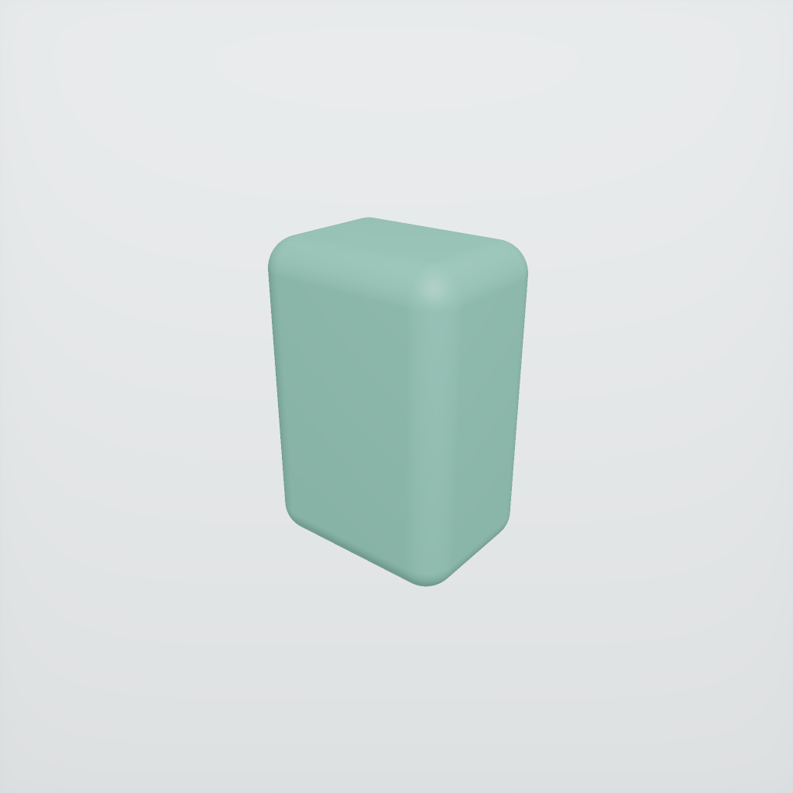

---

### Test 108: Schwarzschild Black Hole

**Test ID:** `109_schwarzschild_black_hole`
**Shader Files:** shader.wgsl
**Execution Status:** ✅ Success
**Image Generated:** ✅ Yes
**Judge Scores:** ✅ Available

#### Problem Prompt

> **Objective**
> Produce a physically motivated single‑frame visualisation of a non‑rotating (Schwarzschild) black hole with background starfield distorted by gravitational lensing.
>
> **Physical specification**
>
> 1. **Metric** Schwarzschild in geometric units $c=G=1$:
>    $\displaystyle ds^{2}=-(1-\tfrac{2M}{r})\,dt^{2}+\frac{dr^{2}}{1-\tfrac{2M}{r}}+r^{2}(d\theta^{2}+\sin^{2}\theta\,d\phi^{2}).$
> 2. **Camera** Static observer at $r=10M,\;\theta=\pi/2$, facing inward ($-\hat r$). Horizontal FOV = 100°.
> 3. **Background** Uniform starfield: 10 000 point sources randomly distributed over celestial sphere, visual magnitude uniform. Stars are white.
> 4. **Ray tracing** Integrate null geodesics backwards from camera through the metric until (a) $r≤2M$ (ray captured) or (b) $r≥1000M$ (ray escapes to starfield). Use fourth‑order Runge‑Kutta with adaptive step; absolute error ≤ 10⁻⁶ M.
> 5. **Photon ring** Rays with impact parameter $b$ within 1 % of the critical value $b_{\mathrm crit}=3\sqrt{3}M$ are coloured bright amber (#ffaa33) to highlight the ring.
>
> **Image construction**
>
> * Resolution = 1920 × 1080 px.
> * Captured rays → pure black. Escaping rays → colour of intersected star (white); if no star hit within 0.2° of ray, colour deep navy #000020.
> * Apply 0.8‑px Gaussian blur to stars for finite PSF.
> * No accretion disc, no text, no lens flare.
>
> **Deliverable**
> 24‑bit PNG, sRGB.

#### Judge Scores

| Category | Score |
|----------|-------|
| Mathematical Accuracy | 32/100 |
| Visual Quality | 48/100 |
| Color Implementation | 28/100 |
| Geometric Completeness | 42/100 |
| Reference Elements | 30/100 |
| **Total** | **180/500** |
| **Average** | **36.0/100** |


#### Rendered Output

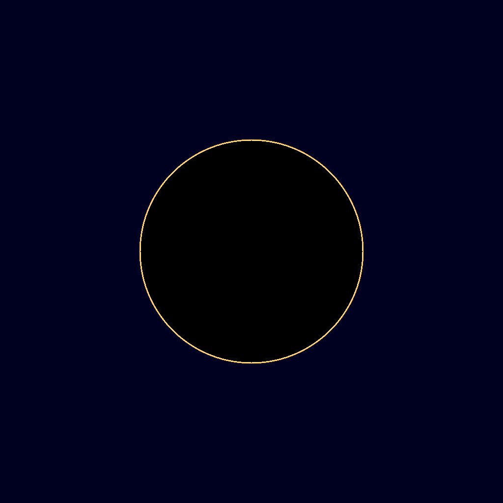

---

### Test 109: Sierpinski Tetrahedron

**Test ID:** `110_sierpinski_tetrahedron`
**Shader Files:** shader.wgsl
**Execution Status:** ✅ Success
**Image Generated:** ✅ Yes
**Judge Scores:** ✅ Available

#### Problem Prompt

> Create a crystalline Sierpinski tetrahedron that looks as if it were carved from icy quartz. Recursion depth must be high enough that the viewer sees the self-similar voids repeat at least four scales.
>
> Mathematics:
> - Start with a regular tetrahedron of edge length 2, centred at origin, one face parallel to the ground (z = -0.408)
> - Recursive rule (depth d): subdivide parent into four child tetrahedra of half edge-length, one at each vertex
> - Use depth 4 → total tetrahedra count 1 + 4 + 4² + 4³ + 4⁴ = 341
>
> Mesh assembly:
> - Generate explicit triangle mesh for each child; de-duplicate coincident faces to keep only the outer hull
> - Assign depth-mapped glass-blue tint:
>   - depth 0 → #cce6ff, ... depth 4 → #0040ff
> - Vertex normals averaged for smooth refraction look
>
> Lighting & camera:
> - HDRI sky light (even cloudy mid-tone) plus white key at (6,4,9)
> - Camera position (4,4,3), focal length 50 mm, FOV ≈ 39°
> - Transparent ground shadow catcher
>
> Output: PNG-32 (RGBA), 2600 × 2000 px
> Deliverable: Outputs a single image.

#### Judge Scores

| Category | Score |
|----------|-------|
| Mathematical Accuracy | 72/100 |
| Visual Quality | 76/100 |
| Color Implementation | 68/100 |
| Geometric Completeness | 73/100 |
| Reference Elements | 55/100 |
| **Total** | **344/500** |
| **Average** | **68.8/100** |


#### Rendered Output

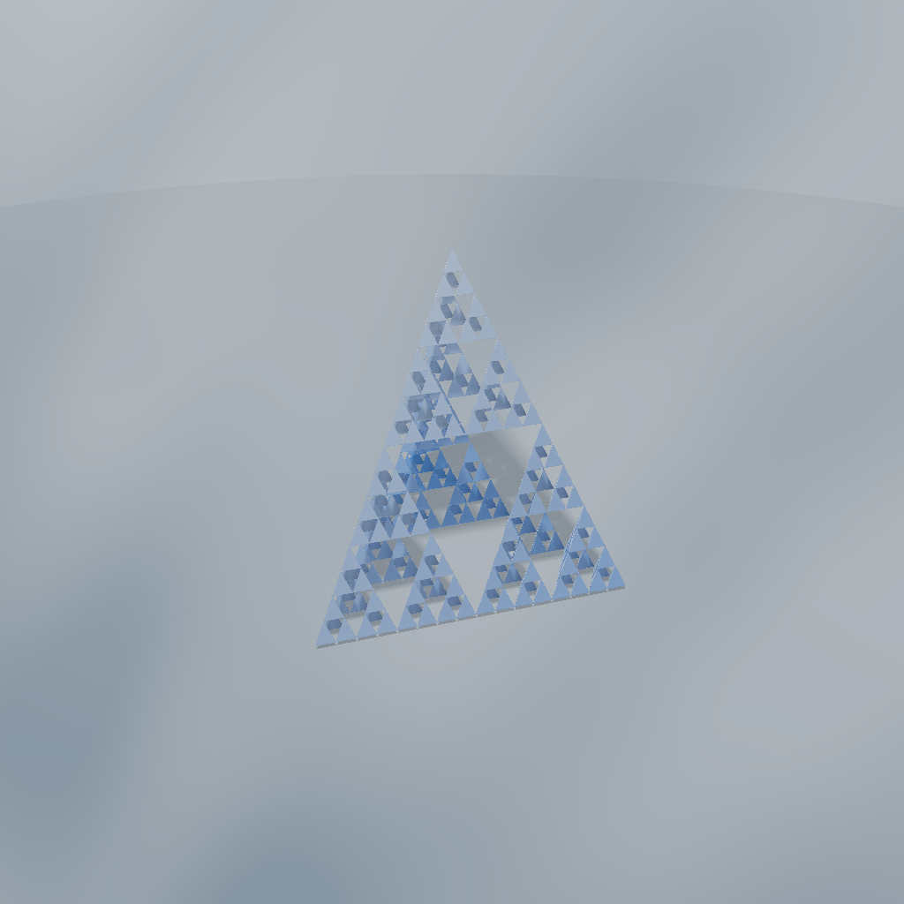

---

### Test 110: Sierpinski Triangle 6 Iterations

**Test ID:** `111_sierpinski_triangle_6_iterations`
**Shader Files:** shader.wgsl
**Execution Status:** ✅ Success
**Image Generated:** ✅ Yes
**Judge Scores:** ✅ Available

#### Problem Prompt

> **Objective**
> Generate the Sierpinski triangle fractal through recursive subdivision.
>
> **Construction**
> * Start with upright equilateral triangle side = 1.
> * Remove central inverted triangle recursively 6 levels.
> * Stroke 1 px black; fills white. 2400 × 2080 px PNG.
>
> **Deliverable** – PNG.

#### Judge Scores

| Category | Score |
|----------|-------|
| Mathematical Accuracy | 91/100 |
| Visual Quality | 86/100 |
| Color Implementation | 94/100 |
| Geometric Completeness | 87/100 |
| Reference Elements | 82/100 |
| **Total** | **440/500** |
| **Average** | **88.0/100** |


#### Rendered Output

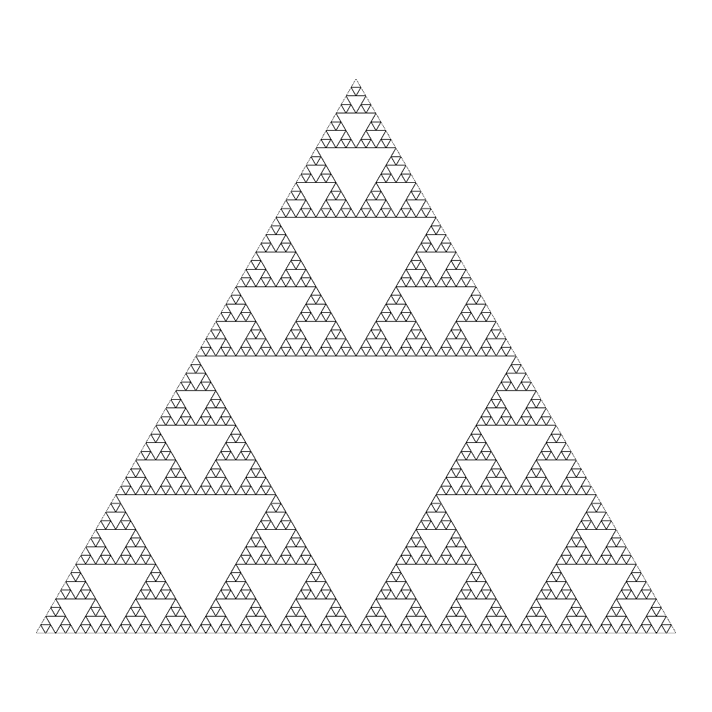

---

### Test 111: Spherical Inversion Mapping

**Test ID:** `112_spherical_inversion_mapping`
**Shader Files:** shader.wgsl
**Execution Status:** ✅ Success
**Image Generated:** ✅ Yes
**Judge Scores:** ✅ Available

#### Problem Prompt

> **Objective**
> Visualize **spherical inversion** transformation applied to a 3D grid structure, showing how space is turned inside-out through a reference sphere.
>
> **Mathematical recipe**
>
> 1. Create a 3D grid of thin cylinders (11×11×11 grid, spacing 0.4 units).
> 2. Apply spherical inversion with center at origin and radius R = 2.0:
>    - For point p with |p| > 0: p' = (R²/|p|²) · p.
>    - Points inside sphere move outside, points outside move inside.
> 3. Render both original grid (semi-transparent) and inverted grid.
> 4. Add reference inversion sphere (radius 2.0) as wireframe.
> 5. Color code by distance from origin:
>    - Original grid: fade from white (center) to blue (edges).
>    - Inverted grid: fade from red (was center) to yellow (was edges).
>
> **Styling**
>
> * Grid cylinders: radius 0.015, semi-transparent (alpha 0.6).
> * Inversion sphere: wireframe only, white color, alpha 0.3.
> * Background: deep black with subtle blue gradient.
> * Ambient occlusion for depth perception.
> * Camera at (5, 4, 3), looking at origin; FOV 40°.
> * Add glow effect to inverted grid elements.
> * Resolution 2048 × 2048 px, 4× SSAA.
>
> **Deliverable** Single PNG showing the spatial inversion transformation clearly.

#### Judge Scores

| Category | Score |
|----------|-------|
| Mathematical Accuracy | 72/100 |
| Visual Quality | 58/100 |
| Color Implementation | 76/100 |
| Geometric Completeness | 54/100 |
| Reference Elements | 70/100 |
| **Total** | **330/500** |
| **Average** | **66.0/100** |


#### Rendered Output

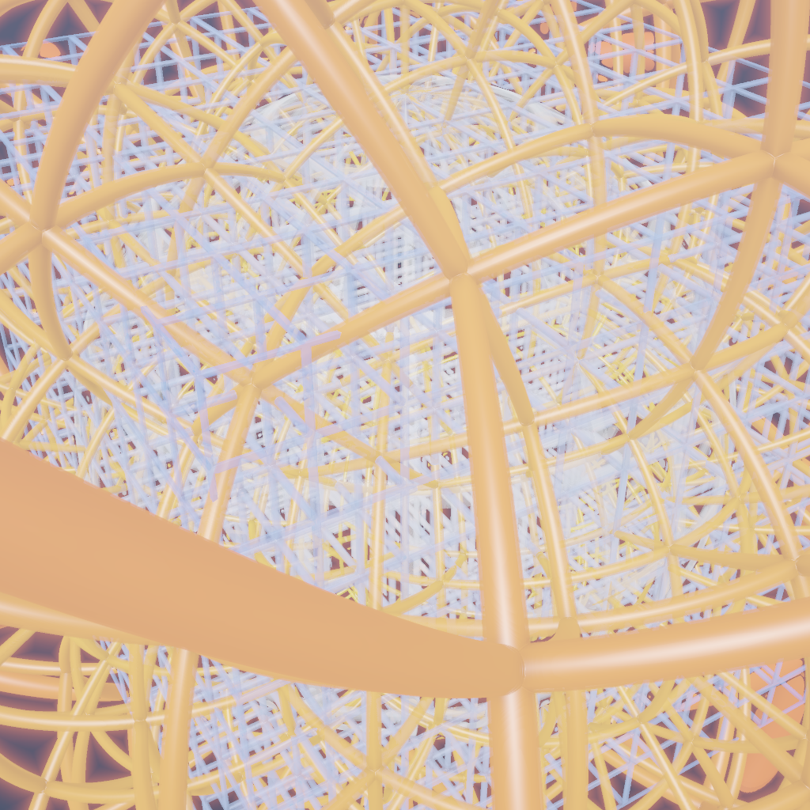

---

### Test 112: Spinning Gear Assembly

**Test ID:** `113_spinning_gear_assembly`
**Shader Files:** shader.wgsl
**Execution Status:** ✅ Success
**Image Generated:** ✅ Yes
**Judge Scores:** ✅ Available

#### Problem Prompt

> **Objective**
> Create a mechanical gear assembly with proper kinematic relationships and angular velocity visualization.
>
> **Gears**
>
> * Gear A: 24 teeth, radius 2.
> * Gear B: 16 teeth, radius 1.4 (meshes with A).
> * Gear C: 12 teeth, radius 1.0 (meshes with B).
>
> Module = 0.26 rad per tooth (involute profiles optional). Place centres along x‑axis with proper centre distances. Initial angular positions so teeth engage.
>
> **Spin animation** not required; instead show instantaneous state with angular velocities vector glyphs: size ∝ ω (ω_A = 1, ω_B = −1.5, ω_C = 1.333).
>
> **Styling**
> Orthographic view, top‑down slight tilt 15°, grey metal. 2200×1600 PNG.
>
> **Deliverable** PNG.

#### Judge Scores

| Category | Score |
|----------|-------|
| Mathematical Accuracy | 78/100 |
| Visual Quality | 88/100 |
| Color Implementation | 70/100 |
| Geometric Completeness | 84/100 |
| Reference Elements | 86/100 |
| **Total** | **406/500** |
| **Average** | **81.2/100** |


#### Rendered Output

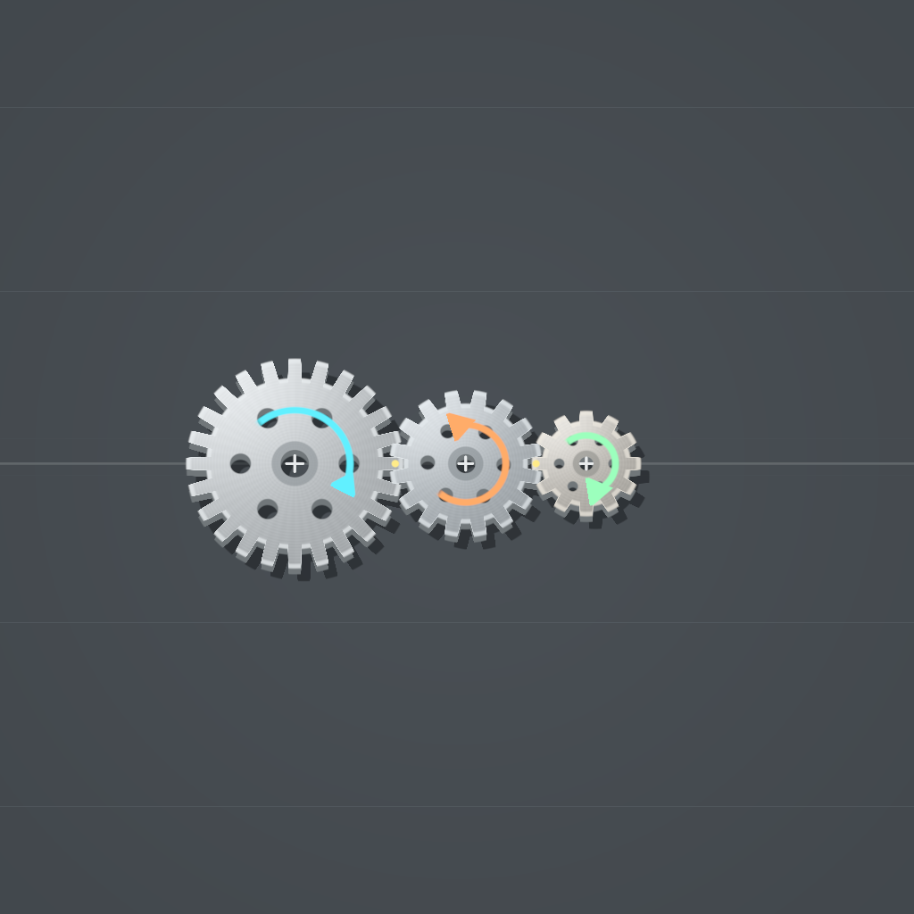

---

### Test 113: Spinning Vortex Funnel

**Test ID:** `114_spinning_vortex_funnel`
**Shader Files:** shader.wgsl
**Execution Status:** ✅ Success
**Image Generated:** ✅ Yes
**Judge Scores:** ✅ Available

#### Problem Prompt

> **Objective**
> Visualize fluid flow in a vortex funnel using scalar fields and streamlines.
>
> **Physics**
> Scalar field $ρ(r,z)=\exp[-(r/2)^{2}]\,\exp[-(z/6)^{2}]$. Flow lines tangential velocity $v_θ=4/r$.
> Plot 150 streamlines starting radii 0.5–3, z=0 to z=‑6.
>
> **Styling**
> Funnel surface semi‑transparent blue. 2400×2000 PNG.
>
> **Deliverable** PNG.

#### Judge Scores

| Category | Score |
|----------|-------|
| Mathematical Accuracy | 66/100 |
| Visual Quality | 88/100 |
| Color Implementation | 52/100 |
| Geometric Completeness | 74/100 |
| Reference Elements | 78/100 |
| **Total** | **358/500** |
| **Average** | **71.6/100** |


#### Rendered Output

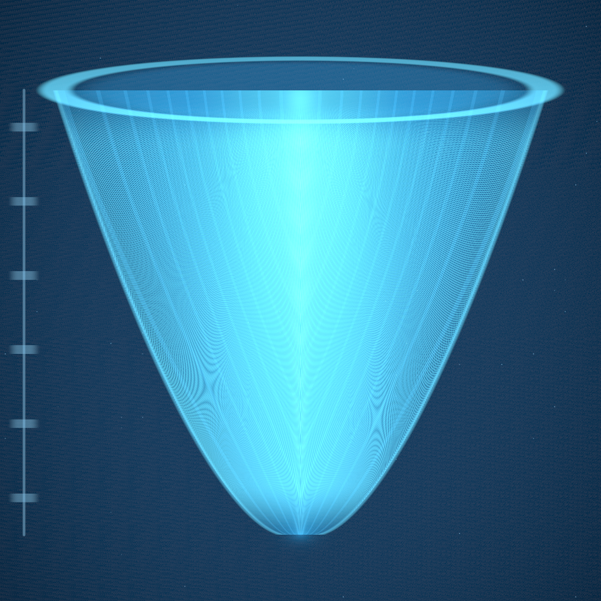

---

### Test 114: Spinodal Decomposition 3D

**Test ID:** `115_spinodal_decomposition_3d`
**Shader Files:** shader.wgsl
**Execution Status:** ✅ Success
**Image Generated:** ✅ Yes
**Judge Scores:** ✅ Available

#### Problem Prompt

> **Objective**
> Produce a single high-resolution 3D visualization of spinodal decomposition in a binary mixture. The image should show bicontinuous phase separation, an interface isosurface, curvature coloring, and a diagnostic slice through the volume.
>
> **Mathematical specification**
> 1. Domain: periodic cube `Ω = [-π, π]^3`.
> 2. Static time: render a representative mid-stage decomposition at normalized time `t = 0.45`.
> 3. Order parameter field: use a smooth scalar field approximating Cahn-Hilliard spinodal growth:
>    `φ(x,y,z) = tanh(1.8 * Σ_m a_m cos(k_m · r + ψ_m))`, where `r = (x,y,z)`.
> 4. Use at least these wavevectors and coefficients:
>    - `k1=(3,2,1), a1=0.85, ψ1=0.2`
>    - `k2=(2,-3,2), a2=0.75, ψ2=1.1`
>    - `k3=(-2,1,3), a3=0.70, ψ3=2.4`
>    - `k4=(4,1,-2), a4=0.45, ψ4=0.7`
>    - `k5=(1,4,3), a5=0.40, ψ5=1.8`
>    - `k6=(-3,2,4), a6=0.35, ψ6=2.9`
> 5. Interface: render the isosurface `φ(x,y,z) = 0` inside the cube. This should form a bicontinuous labyrinth, not isolated droplets.
> 6. Curvature coloring: color the interface by an approximate mean-curvature proxy based on local gradient/divergence. Use blue for negative curvature, white for near-zero curvature, and red for positive curvature.
>
> **Geometry to render**
> - Main object: semi-opaque interface surface `φ = 0` inside a transparent bounding cube.
> - Show two phases: optionally render one phase as translucent blue volume fog where `φ < 0` and the other as faint orange volume fog where `φ > 0`.
> - Add a central cut plane, e.g. `z = 0`, showing a 2D black/white or blue/orange phase map of `sign(φ)`.
> - Add a small inset histogram or bar pair indicating approximately balanced volume fractions near 50/50.
>
> **Rendering style**
> - White background.
> - Interface: smooth, glossy, curvature-colored surface.
> - Bounding cube: thin grey wireframe, transparent faces.
> - Cut plane: semi-transparent and slightly offset so it does not hide the entire isosurface.
> - Use soft shadows and anti-aliasing.
>
> **Composition / overlays**
> - Camera: three-quarter perspective showing the cube interior and the `z = 0` slice.
> - Include a small colorbar swatch for curvature blue-white-red.
> - The bicontinuous interface should occupy most of the cube, with tunnels visible in multiple directions.
>
> **Technical specs**
> - Resolution at least `1600 × 1600` pixels.
> - Static frame only; no animation.
> - Output format: PNG.
>
> **Deliverable** A single PNG image satisfying the above.

#### Judge Scores

| Category | Score |
|----------|-------|
| Mathematical Accuracy | 88/100 |
| Visual Quality | 90/100 |
| Color Implementation | 86/100 |
| Geometric Completeness | 84/100 |
| Reference Elements | 88/100 |
| **Total** | **436/500** |
| **Average** | **87.2/100** |


#### Rendered Output

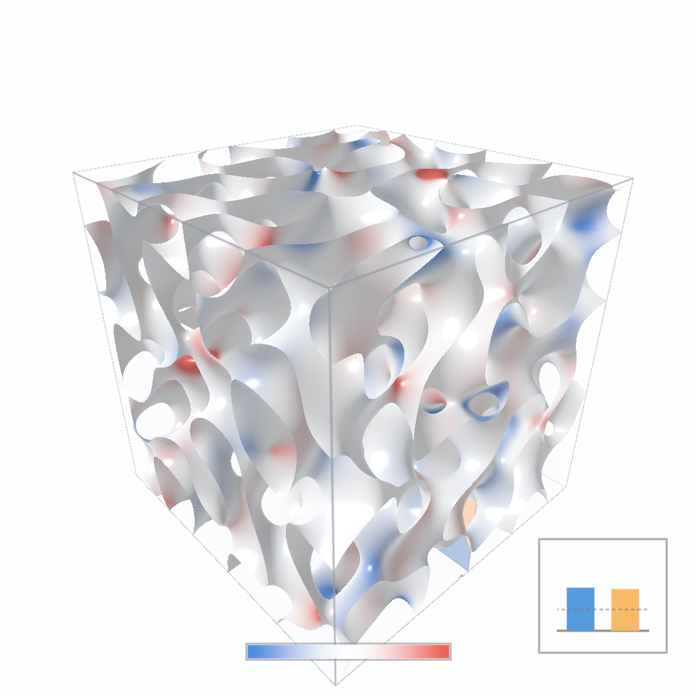

---

### Test 115: Spiral Staircase Tower

**Test ID:** `116_spiral_staircase_tower`
**Shader Files:** shader.wgsl
**Execution Status:** ✅ Success
**Image Generated:** ✅ Yes
**Judge Scores:** ✅ Available

#### Problem Prompt

> **Objective**
> Create a tower with twin helical staircases wrapped around a central column.
>
> **Construction**
> **Central column** radius 0.4, height 8.
> **Twin helices (stairs)** – two staircases 180° apart: step depth 0.3, rise 0.2, width 1.2. Pitch 1 turn per 1.6 height (5 turns). 160 steps each. Railings optional.
>
> **Styling**
> Camera (6,4,6). 2600×2600 PNG.
>
> **Deliverable** PNG.

#### Judge Scores

| Category | Score |
|----------|-------|
| Mathematical Accuracy | 72/100 |
| Visual Quality | 58/100 |
| Color Implementation | 66/100 |
| Geometric Completeness | 68/100 |
| Reference Elements | 70/100 |
| **Total** | **334/500** |
| **Average** | **66.8/100** |


#### Rendered Output

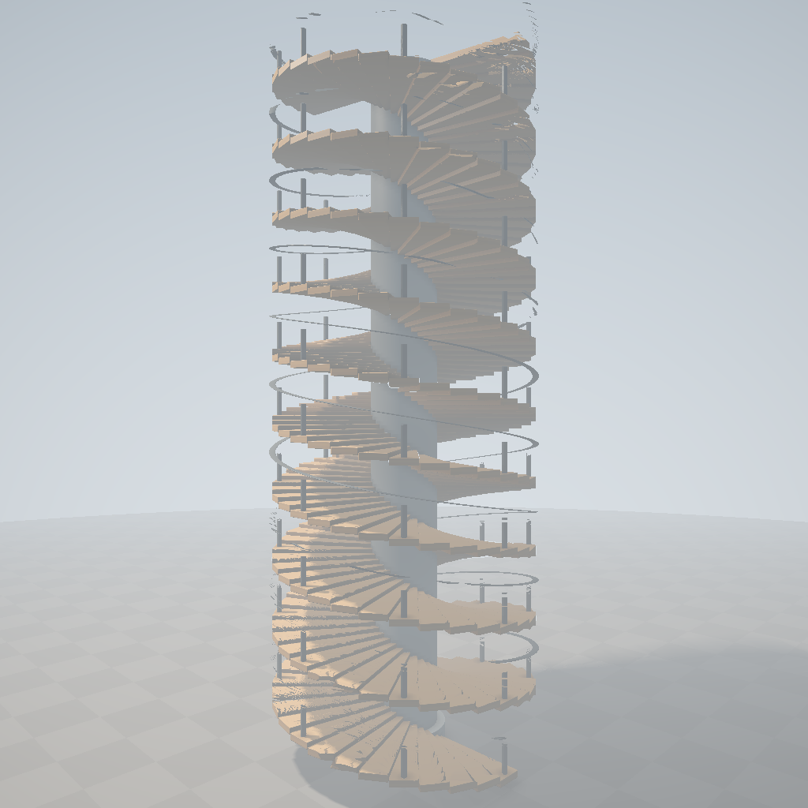

---

### Test 116: Stella Octangula

**Test ID:** `117_stella_octangula`
**Shader Files:** shader.wgsl
**Execution Status:** ✅ Success
**Image Generated:** ✅ Yes
**Judge Scores:** ✅ Available

#### Problem Prompt

> Superpose two congruent regular tetrahedra so that their vertices lie on a common cube of side 2 centred at origin:
> - Tetra A vertices (1,1,1), (-1,-1,1), (-1,1,-1), (1,-1,-1)
> - Tetra B vertices (1,1,-1), (-1,-1,-1), (-1,1,1), (1,-1,1)
> Combined hull is a regular octahedron's stellation.
>
> Rendering:
> - Solid faces, semi-transparent glass (α 0.6) coloured cyan (#00ccee) for Tetra A, magenta (#cc00ee) for Tetra B
> - Edge stroke overlay 2 px black
> - Camera (4,3,3), FOV 30°, white BG. 2000 × 1600 PNG
>
> Deliverable: Outputs a single image.

#### Judge Scores

| Category | Score |
|----------|-------|
| Mathematical Accuracy | 90/100 |
| Visual Quality | 88/100 |
| Color Implementation | 91/100 |
| Geometric Completeness | 86/100 |
| Reference Elements | 90/100 |
| **Total** | **445/500** |
| **Average** | **89.0/100** |


#### Rendered Output

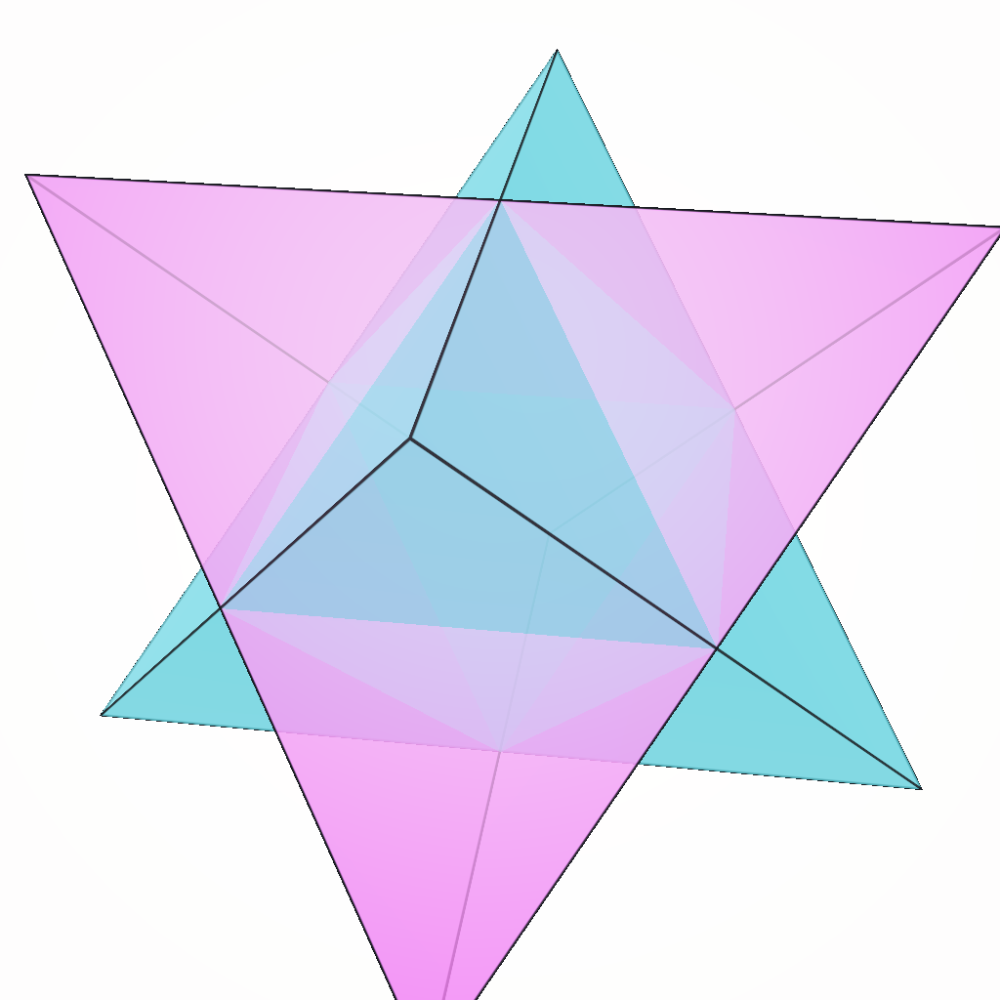

---

### Test 117: Superformula Explorer

**Test ID:** `118_superformula_explorer`
**Shader Files:** shader.wgsl
**Execution Status:** ✅ Success
**Image Generated:** ✅ Yes
**Judge Scores:** ✅ Available

#### Problem Prompt

> # Superformula Explorer
>
> Create an interactive WebGL visualization of Gielis' superformula, showing how parameter changes create diverse natural and abstract shapes.
>
> ## Requirements:
>
> 1. Implement the superformula:
>    r(θ) = (|cos(m*θ/4)/a|^n2 + |sin(m*θ/4)/b|^n3)^(-1/n1)
> 2. Display multiple shapes simultaneously showing:
>    - Star-like forms (varying m)
>    - Flower-like patterns (specific n values)
>    - Polygonal shapes
>    - Asymmetric forms
> 3. Animate smooth transitions between parameter sets
> 4. Use HSL color mapping based on:
>    - Angle (hue)
>    - Radius (lightness)
>    - Parameter values (saturation)
> 5. Add 3D extrusion option for selected shapes
> 6. Include parameter value display
> 7. Create organic particle effects around shapes

#### Judge Scores

| Category | Score |
|----------|-------|
| Mathematical Accuracy | 57/100 |
| Visual Quality | 61/100 |
| Color Implementation | 66/100 |
| Geometric Completeness | 58/100 |
| Reference Elements | 42/100 |
| **Total** | **284/500** |
| **Average** | **56.8/100** |


#### Rendered Output

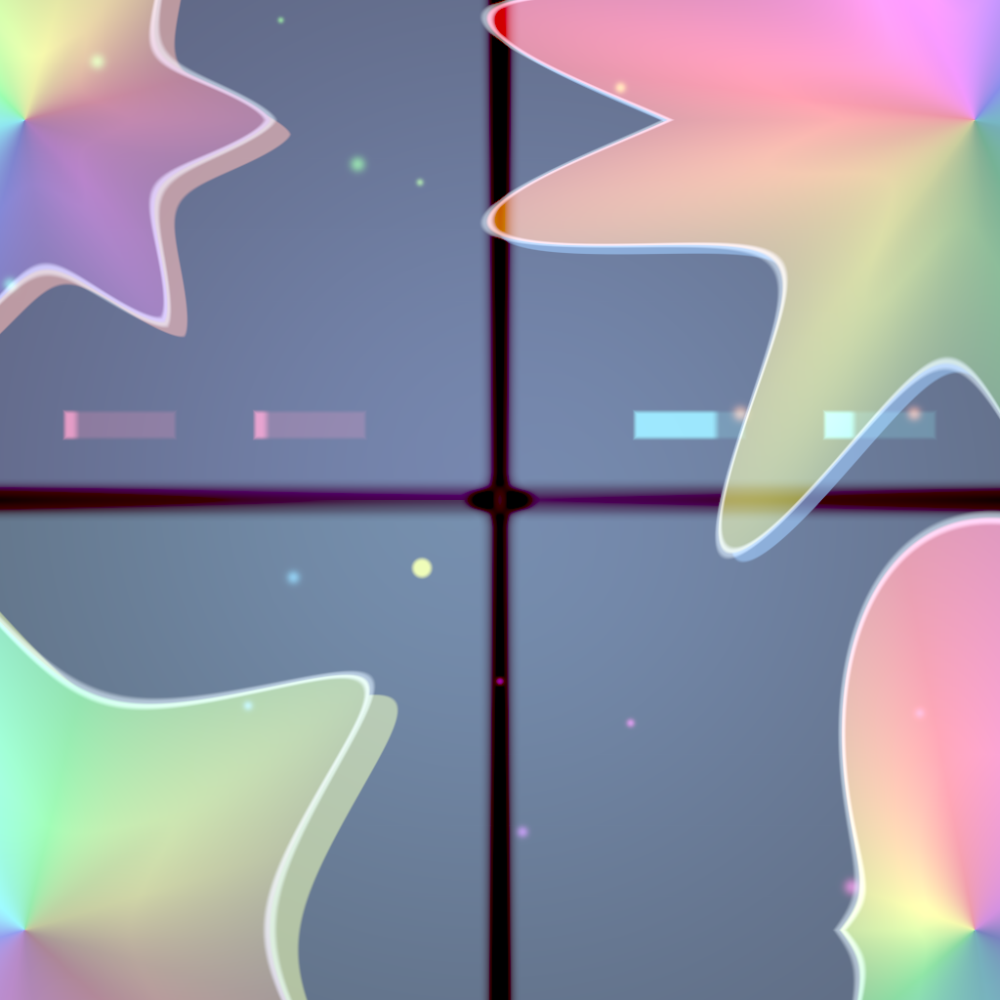

---

### Test 118: Taper Shear Transformation

**Test ID:** `119_taper_shear_transformation`
**Shader Files:** shader.wgsl
**Execution Status:** ✅ Success
**Image Generated:** ✅ Yes
**Judge Scores:** ✅ Available

#### Problem Prompt

> **Objective**
> Demonstrate combined **taper and shear transformations** on a cylindrical tower, creating a leaning, tapered structure like a stylized skyscraper.
>
> **Mathematical recipe**
>
> 1. Start with cylinder: radius 0.8, height 4.0, centered at origin.
> 2. Apply taper transformation (narrowing toward top):
>    - Scale factor: s(z) = 1.0 - 0.6·(z/4.0)² (quadratic taper).
>    - New radius: r'(z) = r · s(z).
> 3. Apply shear transformation (leaning):
>    - Shear vector: (0.3, 0.1) per unit height.
>    - Displacement: x' = x + 0.3·z, y' = y + 0.1·z, z' = z.
> 4. Add architectural details: 20 floor divisions with slight indentations.
> 5. Include corner edge beveling for realism.
>
> **Styling**
>
> * Material: Glass and steel composite with reflective properties.
> * Vertical gradient: Dark blue glass (bottom) to silver metal (top).
> * Window grid texture with emissive office lights (random distribution).
> * Environment mapping for realistic reflections.
> * Ground plane with subtle reflection at z = 0.
> * Dramatic lighting: Sun from (5, 3, 8), ambient skylight.
> * Camera at (4, -3, 1.5), looking up at building; FOV 40°.
> * Sky gradient background (horizon to zenith).
> * Resolution 2048 × 2048 px, 4× SSAA.
>
> **Deliverable** Single PNG showing the tapered, sheared tower with architectural realism.

#### Judge Scores

| Category | Score |
|----------|-------|
| Mathematical Accuracy | 86/100 |
| Visual Quality | 88/100 |
| Color Implementation | 90/100 |
| Geometric Completeness | 78/100 |
| Reference Elements | 82/100 |
| **Total** | **424/500** |
| **Average** | **84.8/100** |


#### Rendered Output

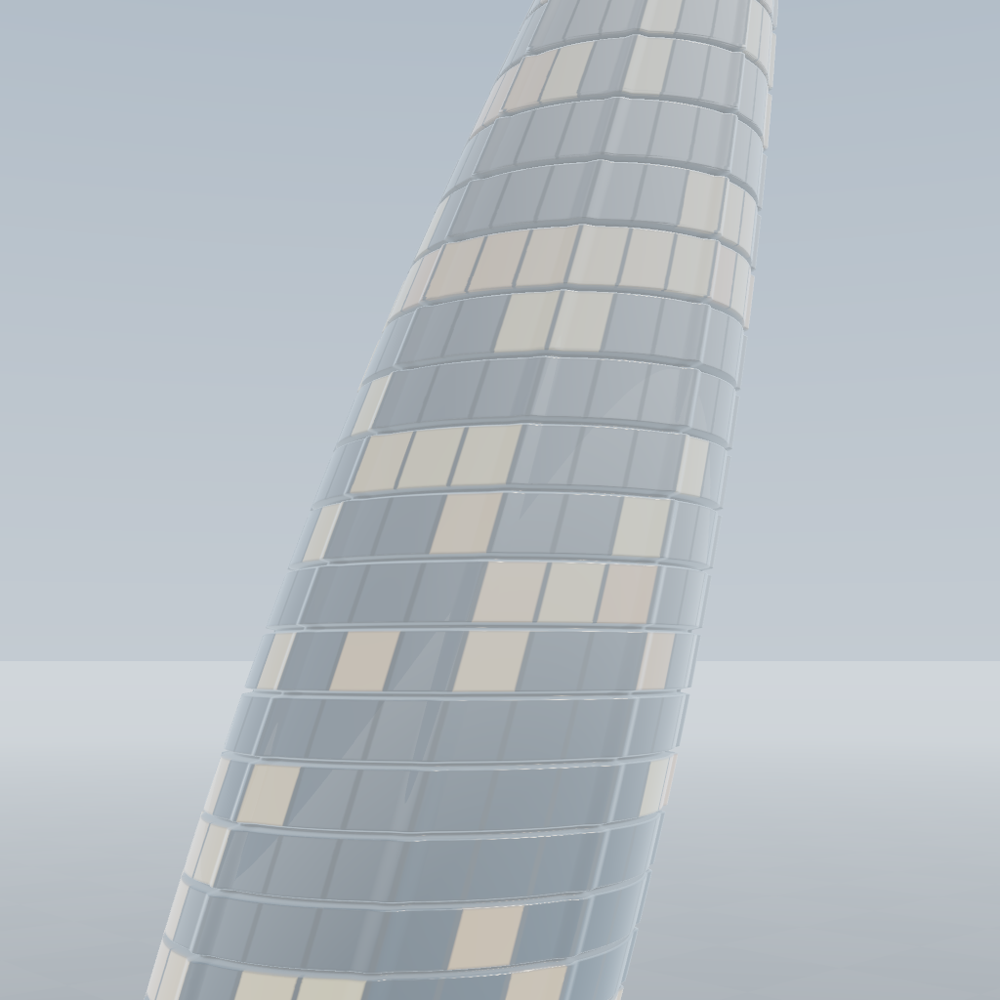

---

### Test 119: Topological Quantum Code Defect Braiding

**Test ID:** `120_topological_quantum_code_defect_braiding`
**Shader Files:** shader.wgsl
**Execution Status:** ✅ Success
**Image Generated:** ✅ Yes
**Judge Scores:** ✅ Available

#### Problem Prompt

> **Objective**
> Produce a single high-resolution static spacetime diagram of defect braiding in a topological quantum error-correcting code. The image should read as a 3D surface-code lattice through time, with defect world-tubes, logical operators, and visible braid/linking structure.
>
> **Mathematical specification**
> 1. Coordinate system: use 3D spacetime coordinates `(x, y, t)` with `x, y ∈ [-1, 1]` and `t ∈ [0, 1]`. Render `t` as the vertical axis.
> 2. Base code lattice: draw square lattice time-slices at `t_k = k/6` for `k = 0, ..., 6`. Each slice contains grid lines at `x, y ∈ {-0.8, -0.6, ..., 0.8}`.
> 3. Defect world-tubes: render four cylindrical tubes of radius `r = 0.075`:
>    - Blue smooth defect `S0(t) = (0, 0, t)`.
>    - Blue smooth defect `S1(t) = (0.72, -0.55, t)`.
>    - Red rough defect `R0(t) = (0.42 cos(2πt), 0.42 sin(2πt), t)`, which winds once counter-clockwise around `S0`.
>    - Red rough defect `R1(t) = (-0.72, 0.55, t)`.
> 4. Topological invariant to show: `R0` must have linking/winding number `+1` around the vertical `S0` tube and must not intersect it. All other tubes are unlinked vertical references.
> 5. Logical operators:
>    - A translucent green loop at `t = 0.58` encircling the linked pair `S0/R0` with radius about `0.58` in the `x-y` plane.
>    - A translucent purple sheet/ribbon connecting the two blue smooth defects over `t ∈ [0.18, 0.82]`.
>    - A thin yellow error chain crossing the green loop once, ending on the red rough defect `R0`.
>
> **Geometry to render**
> - Smooth cylindrical world-tubes with rounded caps; sample each tube with at least 300 longitudinal samples or equivalent smooth analytic geometry.
> - Semi-transparent lattice slabs at seven `t` values, with thin grey grid lines.
> - The helical red tube should visibly pass in front of and behind the central blue tube as it winds.
> - The green loop, purple sheet, and yellow error chain should be distinct overlay primitives, not just color changes on the tubes.
>
> **Rendering style**
> - White background.
> - Blue smooth defects, red rough defects, green logical loop, purple logical sheet, yellow error chain, grey lattice.
> - Use soft Phong lighting, ambient occlusion or contact shadows, and anti-aliasing.
> - Defect tubes should be opaque or nearly opaque; lattice slabs and logical sheets should be translucent.
>
> **Composition / overlays**
> - Camera: three-quarter view looking down from positive `t`, so the helical winding is visible.
> - Add small arrow rods for `x`, `y`, and `t` in a corner; `t` must point upward.
> - Add a small legend made of colored swatches for smooth defect, rough defect, logical loop, logical sheet, and error chain.
>
> **Technical specs**
> - Resolution at least `1600 × 1600` pixels.
> - Static frame only; no animation.
> - Output format: PNG.
>
> **Deliverable** A single PNG image satisfying the above.

#### Judge Scores

| Category | Score |
|----------|-------|
| Mathematical Accuracy | 86/100 |
| Visual Quality | 82/100 |
| Color Implementation | 84/100 |
| Geometric Completeness | 81/100 |
| Reference Elements | 82/100 |
| **Total** | **415/500** |
| **Average** | **83.0/100** |


#### Rendered Output

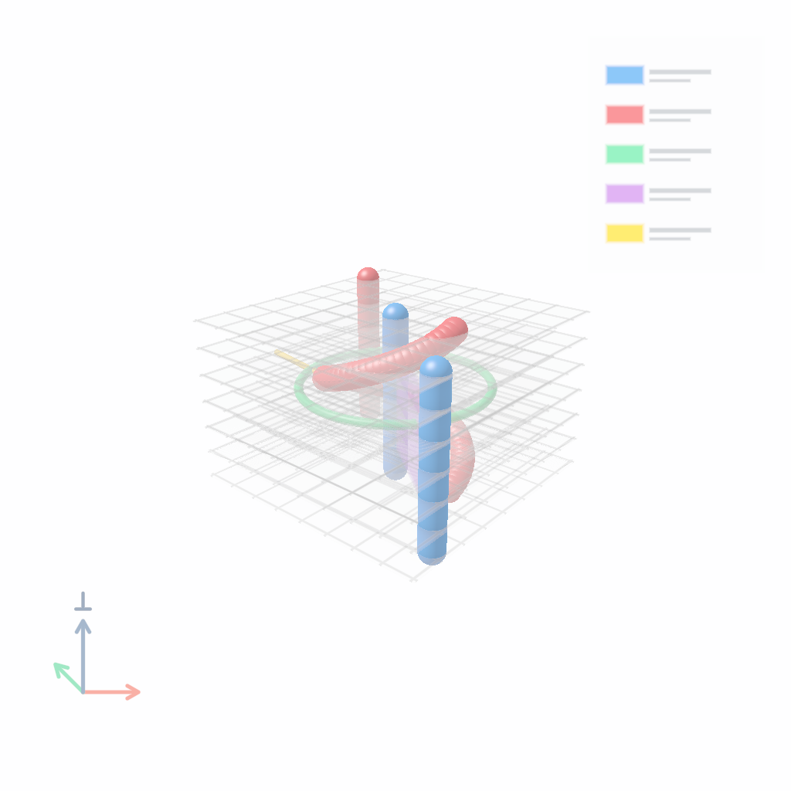

---

### Test 120: Topology Fabric Texture

**Test ID:** `121_topology_fabric_texture`
**Shader Files:** shader.wgsl
**Execution Status:** ✅ Success
**Image Generated:** ✅ Yes
**Judge Scores:** ✅ Available

#### Problem Prompt

> **Objective**
> Visualize **topological invariants** as **woven fabric textures**, where mathematical properties manifest as thread patterns, weave structures, and material behaviors.
>
> **Mathematical recipe**
>
> 1. Base surface: Klein bottle parameterization in 4D
> 2. Fundamental group π₁ determines weave pattern:
>    - Generators become primary thread directions
>    - Relations create over/under crossing rules
> 3. Homology groups as thread colors:
>    - H₀: connectivity threads (white)
>    - H₁: loop threads (spectrum colors by generator)
>    - H₂: surface threads (metallic gold)
> 4. Euler characteristic χ affects fabric density: thread count = 100/|χ-2|
> 5. Orientability determines thread twist:
>    - Orientable: consistent S-twist
>    - Non-orientable: alternating S/Z twist creating Möbius bands
>
> **Styling**
>
> * Photorealistic fabric rendering with individual thread fibers visible
> * Subsurface scattering for translucent silk-like appearance
> * Thread thickness varies with homology dimension (H₀ thin, H₂ thick)
> * Iridescent sheen on non-orientable regions
> * Fabric draped over invisible Klein bottle form
> * Macro photography aesthetic: extreme close-up with shallow depth
> * Key light from upper left, fill light from below
> * Visible fabric imperfections where topology forces thread stress
> * Camera at (2, 1.5, -3), looking at origin; FOV 25° (telephoto)
> * Resolution 2400 × 2400 px, with fabric texture details
>
> **Deliverable** Single PNG showing topology as woven fabric structure

#### Judge Scores

| Category | Score |
|----------|-------|
| Mathematical Accuracy | 42/100 |
| Visual Quality | 61/100 |
| Color Implementation | 34/100 |
| Geometric Completeness | 50/100 |
| Reference Elements | 39/100 |
| **Total** | **226/500** |
| **Average** | **45.2/100** |


#### Rendered Output

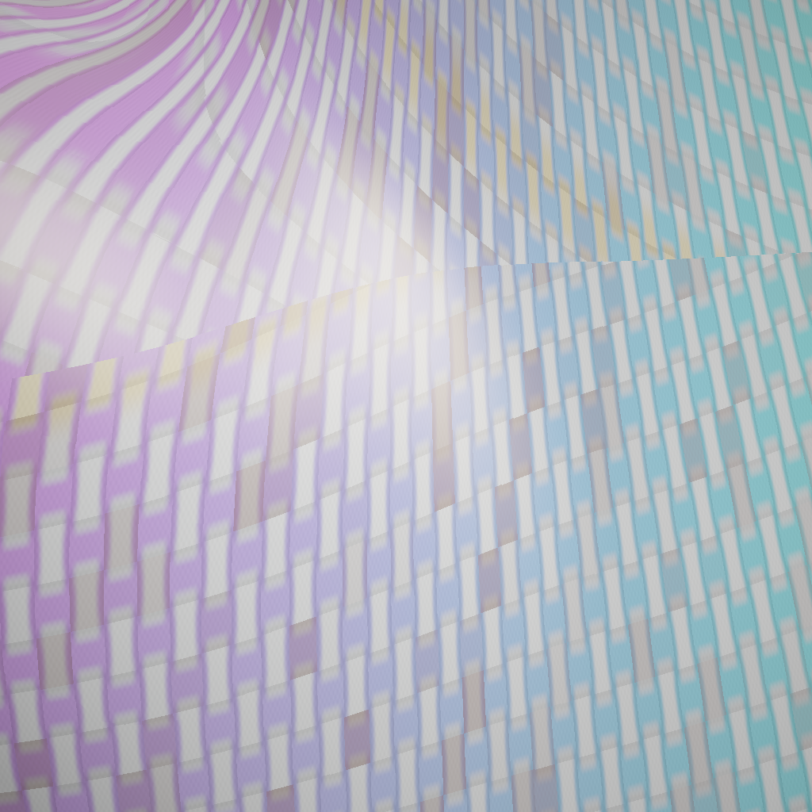

---

### Test 121: Torus Donut Parametric

**Test ID:** `122_torus_donut_parametric`
**Shader Files:** shader.wgsl
**Execution Status:** ✅ Success
**Image Generated:** ✅ Yes
**Judge Scores:** ✅ Available

#### Problem Prompt

> **Objective**
> Create a mathematically precise visualization of a torus (donut shape) with parametric surface coloring and advanced rendering techniques.
>
> **Mathematical Specification**
>
> 1. **Parametric Definition**
>    - Torus parameters:
>      * Major radius (R): 2.0 units
>      * Minor radius (r): 0.7 units
>    - Parametric equations (u, v ∈ [0, 2π]):
>      * x = (R + r cos(v)) cos(u)
>      * y = (R + r cos(v)) sin(u)
>      * z = r sin(v)
>
> 2. **Surface Properties**
>    - Generate smooth normals from parametric derivatives
>    - Calculate Gaussian curvature K = cos(v) / (r(R + r cos(v)))
>    - Calculate mean curvature H = (R + 2r cos(v)) / (2r(R + r cos(v)))
>
> 3. **Coloring Scheme**
>    - Base color mapping using parametric coordinates:
>      * Hue: H = u / (2π) × 360°
>      * Saturation: S = 0.5 + 0.5 × sin(v)
>      * Value: V = 0.7 + 0.3 × cos(v)
>    - Overlay Gaussian curvature visualization:
>      * Positive curvature regions: Subtle red tint
>      * Negative curvature regions: Subtle blue tint
>      * Zero curvature: Neutral
>
> 4. **Material and Texture**
>    - Base material: Glossy ceramic
>      * Diffuse: 0.8
>      * Specular: 0.3
>      * Shininess: 64
>    - Surface texture: Subtle parametric grid lines
>      * Grid spacing: π/8 in both u and v directions
>      * Line color: 20% darker than surface color
>      * Line width: 0.5 pixels
>
> 5. **Animation and Transformation**
>    - Primary rotation: Around y-axis at 0.1 rad/s
>    - Secondary rotation: Around its own major axis at 0.05 rad/s
>    - Gentle oscillation: Minor radius varies as r = 0.7 + 0.1 × sin(2πt/3)
>
> 6. **Lighting and Environment**
>    - Three-point lighting:
>      * Key light: Position (3, 4, 2), warm white, intensity 0.7
>      * Fill light: Position (-2, 1, 3), cool white, intensity 0.4
>      * Back light: Position (0, -2, -4), white, intensity 0.3
>    - Ambient occlusion for enhanced depth
>    - Environment: Subtle gradient (dark blue top to light blue bottom)
>
> 7. **Output Specifications**
>    - Resolution: 1600 × 1600 pixels
>    - Antialiasing: 4× SSAA
>    - Depth of field: Slight blur at edges (focal distance: 5 units)
>    - Camera: Position (4, 3, 5), looking at origin, FOV 40°
>
> Deliverable: Outputs a single image.

#### Judge Scores

| Category | Score |
|----------|-------|
| Mathematical Accuracy | 88/100 |
| Visual Quality | 84/100 |
| Color Implementation | 91/100 |
| Geometric Completeness | 82/100 |
| Reference Elements | 85/100 |
| **Total** | **430/500** |
| **Average** | **86.0/100** |


#### Rendered Output

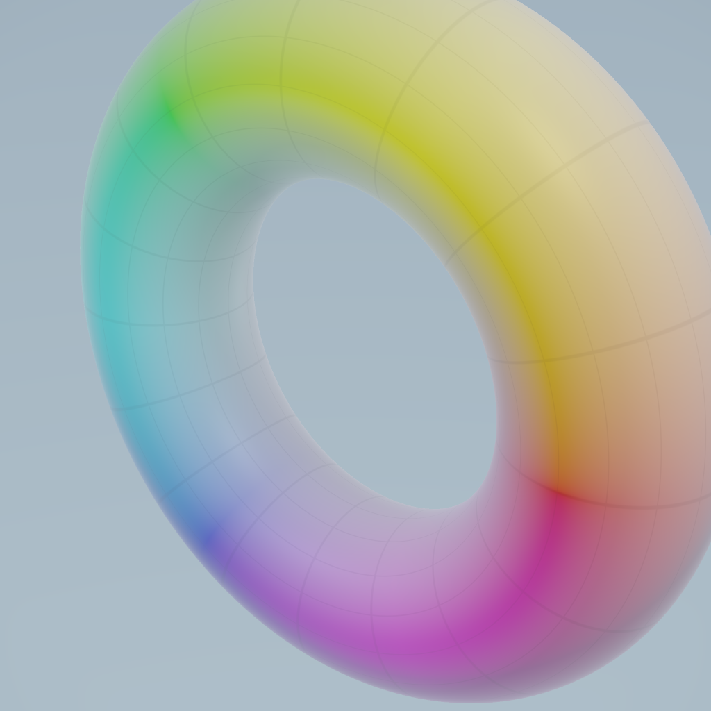

---

### Test 122: Trefoil Alexander Polynomial

**Test ID:** `123_trefoil_alexander_polynomial`
**Shader Files:** shader.wgsl
**Execution Status:** ✅ Success
**Image Generated:** ✅ Yes
**Judge Scores:** ✅ Available

#### Problem Prompt

> Produce a radar-petal polar chart of the trefoil's Alexander polynomial Δ(t) = t² - t + 1, evaluated on the unit circle t = e^(iθ). The magnitude curve should form a symmetric six-petal flower that glows like neon tubing against a midnight background.
>
> Mathematics:
> - Evaluate r(θ) = |Δ(e^(iθ))| = √((1-cos θ)² + sin² θ). Closed-form simplifies to 2sin(θ/2).
> - Because r(θ+π) = r(θ), six peaks occur at θ = 0, ±2π/3, ±4π/3, π.
>
> Plot specs:
> - Domain θ ∈ [0,2π] sampled 12,000 points
> - Radial scale: max radius = 1.414 units maps to 90% of 1800 × 1800 canvas
> - Curve stroke: hot-pink (#FF0088) 6 px; outer glow (duplicate stroke blurred σ = 3 px, opacity 20%)
> - Background nearly-black navy (#040418)
> - Polar grid (thin dashed #555555) with five concentric circles and 30° spokes
>
> Deliverable: Outputs a single image.

#### Judge Scores

| Category | Score |
|----------|-------|
| Mathematical Accuracy | 62/100 |
| Visual Quality | 89/100 |
| Color Implementation | 52/100 |
| Geometric Completeness | 84/100 |
| Reference Elements | 68/100 |
| **Total** | **355/500** |
| **Average** | **71.0/100** |


#### Rendered Output

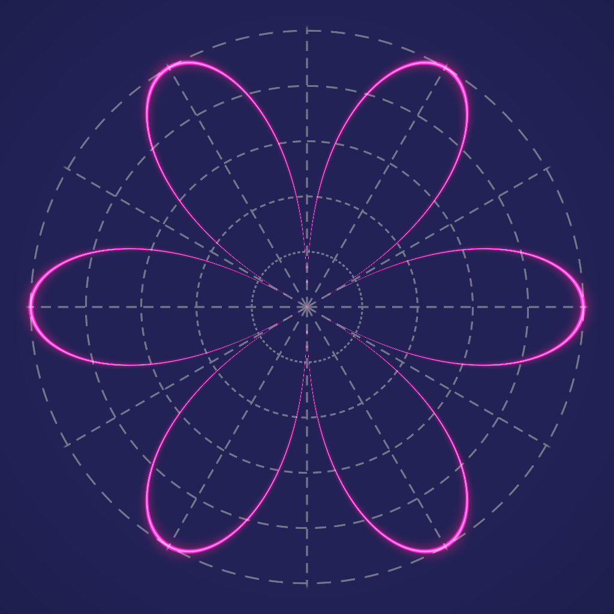

---

### Test 123: Trigonometric Mandalas

**Test ID:** `124_trigonometric_mandalas`
**Shader Files:** shader.wgsl
**Execution Status:** ✅ Success
**Image Generated:** ✅ Yes
**Judge Scores:** ✅ Available

#### Problem Prompt

> **Objective** – Create a "harmonic mandala" defined by radial modulation
>
> $
>   r(θ)=1+0.15\sin(6θ)+0.10\sin(12θ)+0.06\sin(18θ),\qquad θ∈[0,2π].
> $
>
> **Rendering directives**
>
> * Plot polar curve with 10 000 samples; convert to Cartesian.
> * Fill interior with gradient: centre #001133 → edge #55ffee (radial linear gamma 2.2).
> * Outline 3‑px #ffffff.
> * Add semi‑transparent (α 0.3) duplicate of the curve scaled 0.7×, filled #ff66cc.
> * Canvas 1800 × 1800 px black.
>
> **Deliverable** – PNG.

#### Judge Scores

| Category | Score |
|----------|-------|
| Mathematical Accuracy | 72/100 |
| Visual Quality | 84/100 |
| Color Implementation | 76/100 |
| Geometric Completeness | 73/100 |
| Reference Elements | 75/100 |
| **Total** | **380/500** |
| **Average** | **76.0/100** |


#### Rendered Output

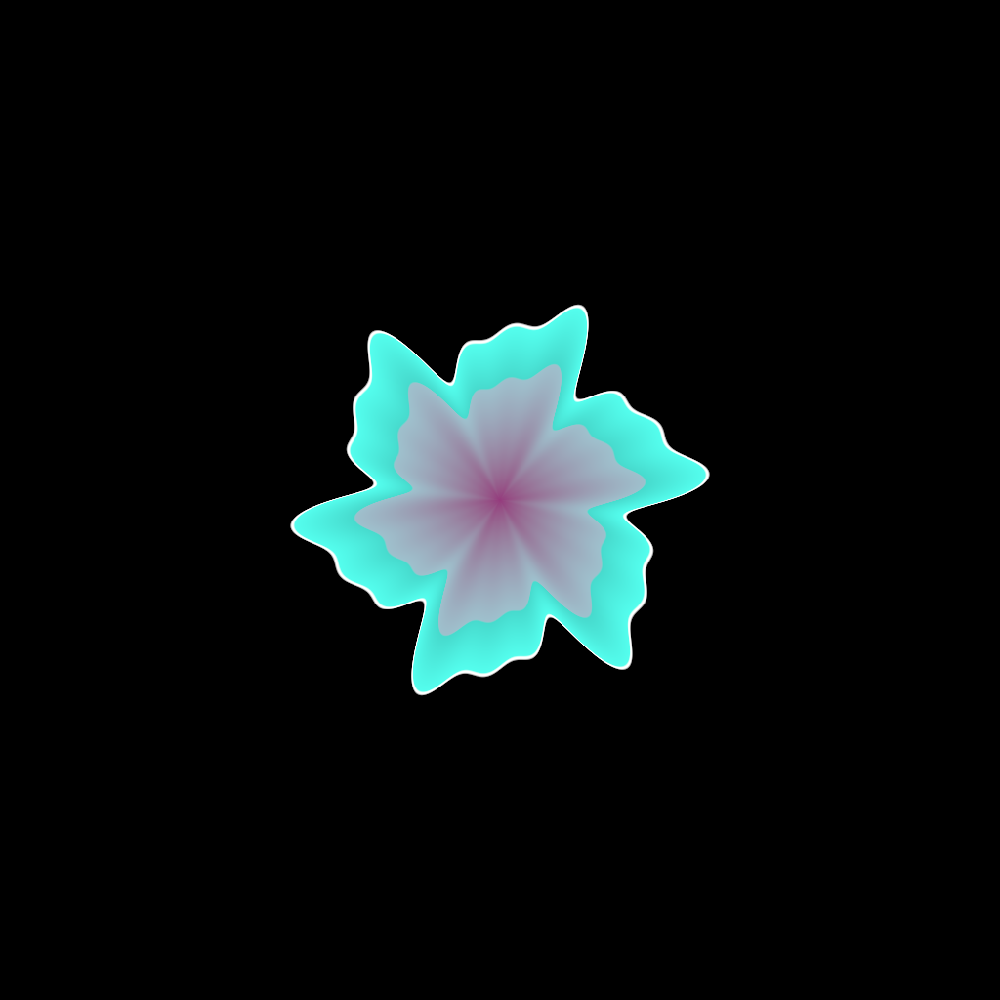

---

### Test 124: Truncated Icosahedron

**Test ID:** `125_truncated_icosahedron`
**Shader Files:** shader.wgsl
**Execution Status:** ✅ Success
**Image Generated:** ✅ Yes
**Judge Scores:** ✅ Available

#### Problem Prompt

> Create a truncated icosahedron (soccer ball shape) with 12 pentagonal faces (black) and 20 hexagonal faces (white). Edge length 1.0. Material: slightly glossy with subtle leather texture. Lighting: outdoor daylight. Background: grass green gradient. Camera: classic 3/4 view showing multiple face types.
>
> Outputs a single image.

#### Judge Scores

| Category | Score |
|----------|-------|
| Mathematical Accuracy | 43/100 |
| Visual Quality | 58/100 |
| Color Implementation | 34/100 |
| Geometric Completeness | 52/100 |
| Reference Elements | 46/100 |
| **Total** | **233/500** |
| **Average** | **46.6/100** |


#### Rendered Output

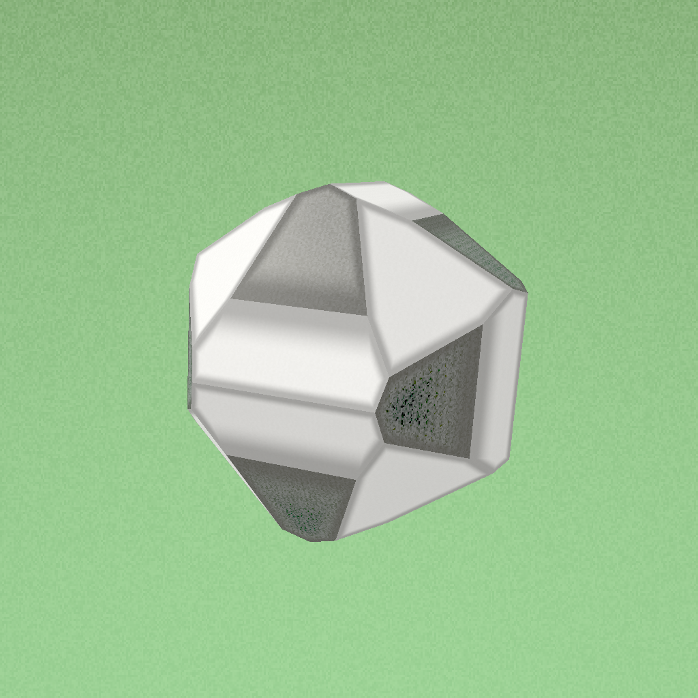

---

### Test 125: Twisted Stellated Polyhedron

**Test ID:** `126_twisted_stellated_polyhedron`
**Shader Files:** shader.wgsl
**Execution Status:** ✅ Success
**Image Generated:** ✅ Yes
**Judge Scores:** ✅ Available

#### Problem Prompt

> **Objective**
> Create a stellated dodecahedron with twisted spikes to simulate drill-flute geometry.
>
> **Construction**
> Start with dodecahedron (edge 1). Attach spike (pyramid) on each face: height 0.6. Rotate each spike about its face normal by ψ=20° (like drill flutes).
>
> **Styling**
> Material chrome. 2500×2000 PNG, BG #e0e0ff.
>
> **Deliverable** PNG.

#### Judge Scores

| Category | Score |
|----------|-------|
| Mathematical Accuracy | 58/100 |
| Visual Quality | 68/100 |
| Color Implementation | 45/100 |
| Geometric Completeness | 50/100 |
| Reference Elements | 48/100 |
| **Total** | **269/500** |
| **Average** | **53.8/100** |


#### Rendered Output

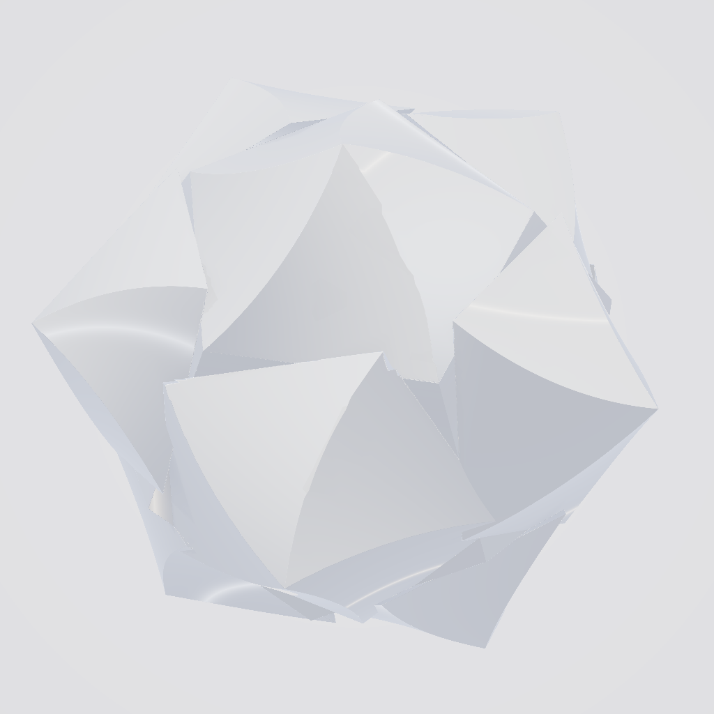

---

### Test 126: Voronoi Diagram

**Test ID:** `127_voronoi_diagram`
**Shader Files:** shader.wgsl
**Execution Status:** ✅ Success
**Image Generated:** ✅ Yes
**Judge Scores:** ✅ Available

#### Problem Prompt

> **Objective**
> Produce a planar Voronoi diagram of 30 seeds with distinct coloured cells, adhering to the mathematical and visual rules below.
>
> **Seed generation**
>
> * Domain: closed unit square $[0,1]^{2}$.
> * Seeds $\{s_i\}_{i=1}^{30}$ are generated with jittered Poisson‑disk sampling: minimum Euclidean separation ≥ 0.07.
> * Use *fixed* RNG seed 2025 to ensure reproducibility.
>
> **Voronoi construction**
>
> * Cell $V_i=\{\mathbf x:‖\mathbf x-s_i‖\le‖\mathbf x-s_j‖\;\forall j\}$.
> * Clip cells to the unit square; render edges as straight line segments.
> * Optional: compute by Fortune sweep or Delaunay dual—algorithm is not graded, result is.
>
> **Styling**
>
> * Assign each cell a unique colour picked by evenly sampling the *Tableau‑20* palette, cyclically if needed.
> * Cells: solid fill; edges: 2‑px black stroke.
> * Draw seeds as 6‑px black circles.
> * Margin outside square: pure white. No text.
>
> **Output**
> 1600 × 1600 px PNG, linear RGB, no transparency.

#### Judge Scores

| Category | Score |
|----------|-------|
| Mathematical Accuracy | 91/100 |
| Visual Quality | 94/100 |
| Color Implementation | 92/100 |
| Geometric Completeness | 94/100 |
| Reference Elements | 90/100 |
| **Total** | **461/500** |
| **Average** | **92.2/100** |


#### Rendered Output

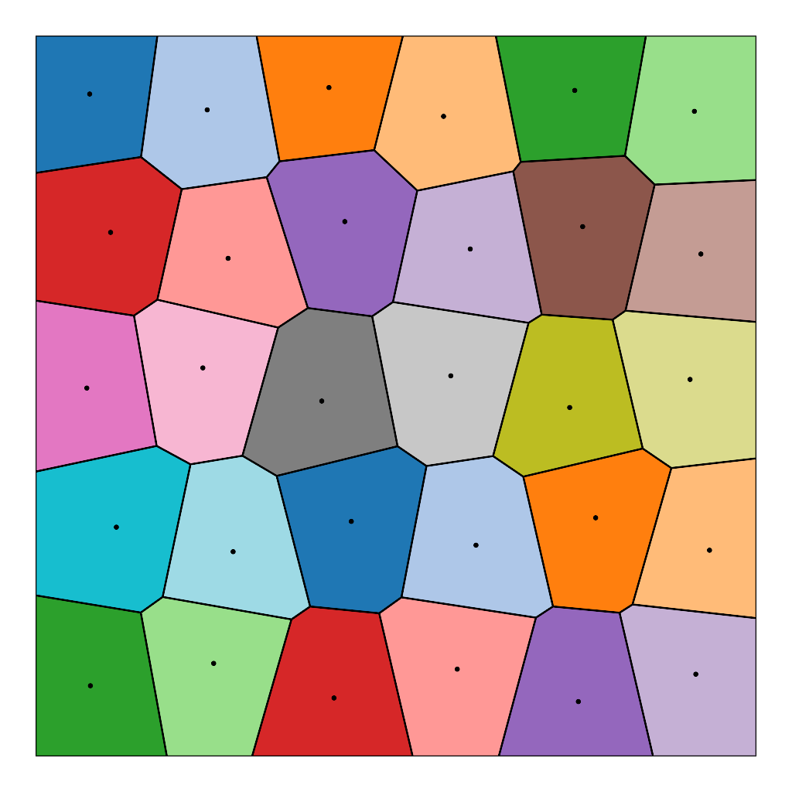

---

### Test 127: Wave Deformation Field

**Test ID:** `128_wave_deformation_field`
**Shader Files:** shader.wgsl
**Execution Status:** ✅ Success
**Image Generated:** ✅ Yes
**Judge Scores:** ✅ Available

#### Problem Prompt

> **Objective**
> Visualize a **3D wave deformation field** applied to a planar mesh, creating complex interference patterns from multiple wave sources.
>
> **Mathematical recipe**
>
> 1. Create high-resolution plane mesh (100×100 vertices, 5×5 units).
> 2. Place 3 wave sources at: (-1.5, 0), (1.5, 0), (0, 1.5).
> 3. Wave deformation for each source i:
>    - Height: h_i(x,y,t) = A_i · sin(k|r-r_i| - ωt + φ_i) / (1 + |r-r_i|)
>    - A_i = [0.4, 0.3, 0.5], k = 2π, ω = 0, φ_i = [0, π/3, 2π/3].
> 4. Total deformation: z = Σh_i(x,y,0) (static snapshot).
> 5. Apply smooth normal recalculation for proper shading.
> 6. Add edge clamping to prevent boundary artifacts.
>
> **Styling**
>
> * Surface material: Iridescent shader based on view angle and height.
> * Color mapping: Deep blue (troughs) through cyan, green, yellow to white (peaks).
> * Rim lighting to emphasize wave crests.
> * Subtle displacement texture for water-like microdetail.
> * Fog effect increasing with distance.
> * Camera at (4, -3, 2.5), looking at origin; FOV 35°.
> * Dark blue-black gradient background.
> * Resolution 2048 × 2048 px, 4× SSAA.
>
> **Deliverable** Single PNG showing the complex wave interference pattern with realistic water-like appearance.

#### Judge Scores

| Category | Score |
|----------|-------|
| Mathematical Accuracy | 86/100 |
| Visual Quality | 78/100 |
| Color Implementation | 88/100 |
| Geometric Completeness | 76/100 |
| Reference Elements | 83/100 |
| **Total** | **411/500** |
| **Average** | **82.2/100** |


#### Rendered Output

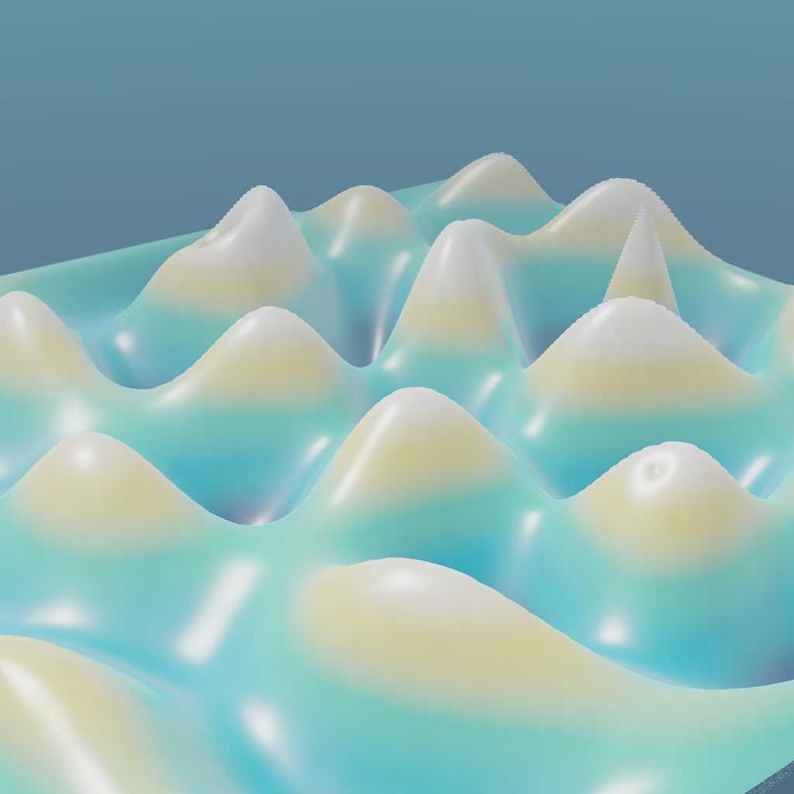

---

### Test 128: Weierstrass Function

**Test ID:** `129_weierstrass_function`
**Shader Files:** shader.wgsl
**Execution Status:** ✅ Success
**Image Generated:** ✅ Yes
**Judge Scores:** ✅ Available

#### Problem Prompt

> Create a wide panoramic "mathematical seismograph" that vividly conveys how the Weierstrass function oscillates at every spatial scale. The viewer should feel the relentless, jagged "crackle" of a curve that is continuous everywhere yet differentiable nowhere.
>
> Exact analytic definition:
> W(x) = Σ(n=0 to 50) a^n * cos(b^n * π * x), with a = 1/2, b = 3.
>
> - 51 terms guarantee visual convergence while still showing high-frequency grit.
> - 50th term wavelength ≈ π / 3^50 ~ 10^-24 – far below pixel scale, ensuring apparent fractality even at max zoom.
>
> Sampling & anti-alias:
> - Domain x ∈ [-2, 2].
> - Uniform sample 8,192 points (2^13) – a power of two convenient for FFT post-checks.
> - Resample to screen with Catmull-Rom spline so stroke remains smooth between vertices.
>
> Visual styling:
> - Canvas 2400 px wide × 1200 px high (2-to-1 cinema aspect).
> - Background pure white (#FFFFFF).
> - Curve stroke bright mandarin-orange (#FF6600) width = 3 px; round end-caps, round joins (avoid mitre spikes).
> - Axes:
>   - Grey (#909090) horizontal line at y = 0; thin 1 px.
>   - Tick marks every 0.5 units on x-axis; omit labels (visual cleanliness).
> - Subtle drop-shadow under the orange stroke (1 px, 20% opacity, 90° offset) gives depth but must never blur the high-frequency corners.
>
> File & colour space:
> - PNG-24, sRGB, gamma 2.2.
> - Compression level "fast" is fine – no perceptible artefacts on a pure vector plot.
>
> Deliverable: Outputs a single image.

#### Judge Scores

| Category | Score |
|----------|-------|
| Mathematical Accuracy | 72/100 |
| Visual Quality | 63/100 |
| Color Implementation | 58/100 |
| Geometric Completeness | 61/100 |
| Reference Elements | 60/100 |
| **Total** | **314/500** |
| **Average** | **62.8/100** |


#### Rendered Output

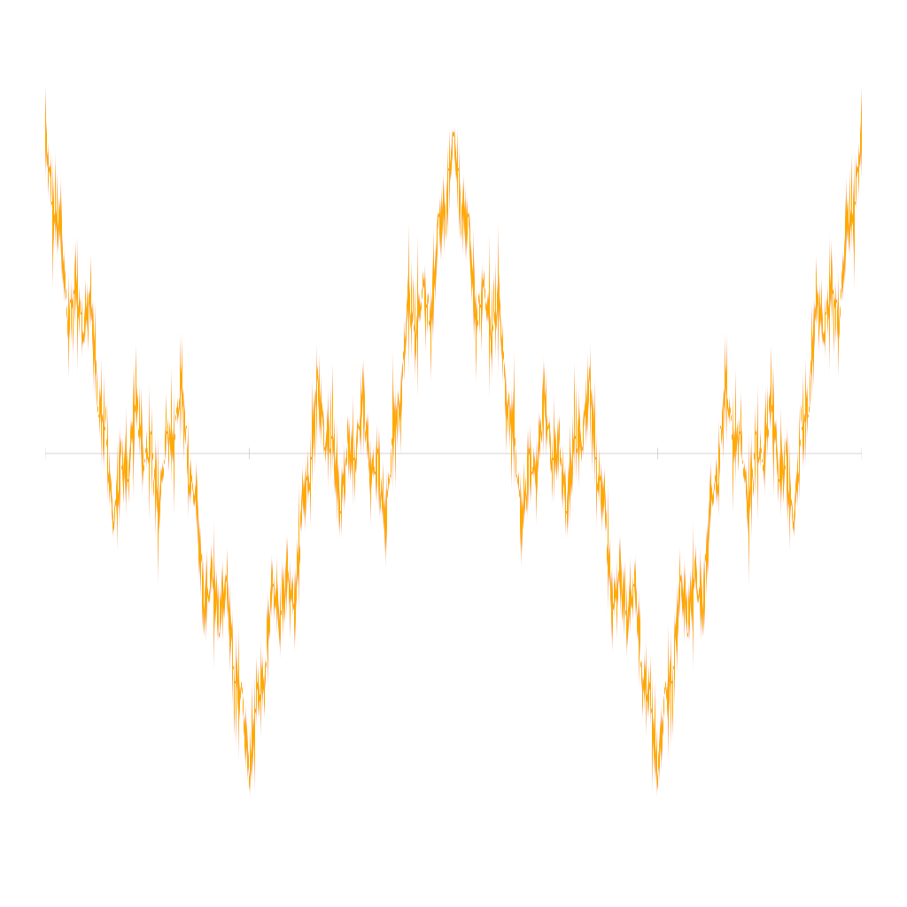

---

