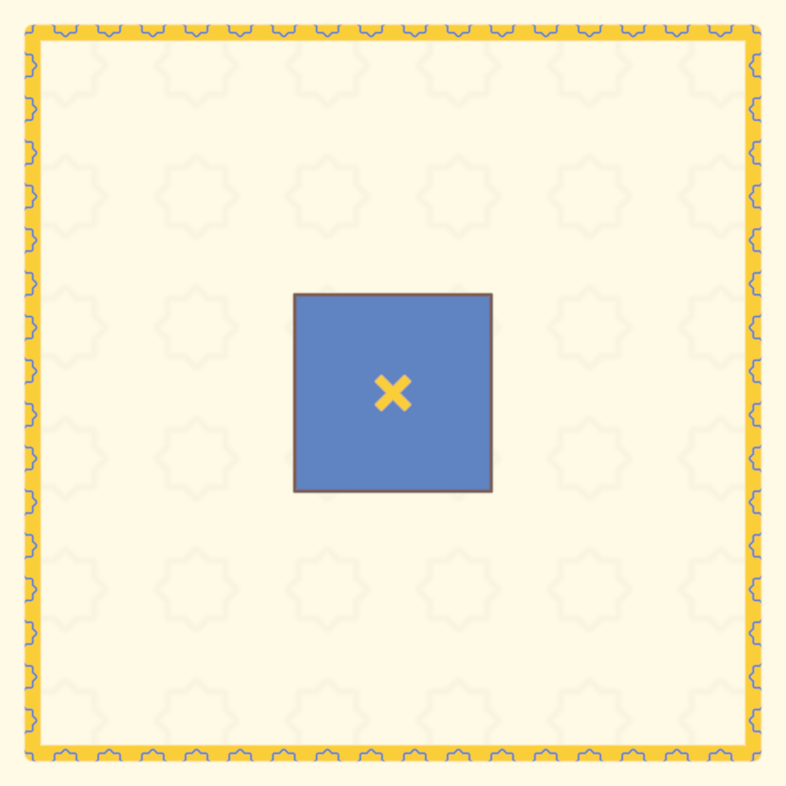

# Shader Benchmark Report

**Model:** google/gemini-3-pro-preview
**Generated:** 2025-12-29 16:48:45
**Total Tests:** 1
**Successful Renders:** 1
**Success Rate:** 1/1 (100.0%)
**Scored Tests:** 1  

---

## Summary Statistics

### Average Scores by Category

| Category | Average Score |
|----------|---------------|
| Mathematical Accuracy | 15.0/100 |
| Visual Quality | 40.0/100 |
| Color Implementation | 5.0/100 |
| Geometric Completeness | 20.0/100 |
| Reference Elements | 10.0/100 |
| **Overall Average** | **18.0/100** |

### Performance Highlights

**Best Test:** Shader (Total: 90/500)  
**Worst Test:** Shader (Total: 90/500)  

---

## Detailed Test Results

### Test 1: Shader

**Test ID:** `001_al_khwarizmi_geometric_algebra`  
**Shader Files:** shader.wgsl  
**Execution Status:** ✅ Success  
**Image Generated:** ✅ Yes  
**Judge Scores:** ✅ Available  

#### Problem Prompt

> **Objective**
> Create a shader visualization of Al-Khwarizmi's geometric solution to quadratic equations, showing how Islamic mathematicians in the 9th century used geometric algebra to solve x² + 10x = 39, bringing the birth of algebra to visual life.
> 
> **Historical Context**
> Muhammad ibn Musa al-Khwarizmi (c. 780-850 CE), working at the House of Wisdom in Baghdad, wrote "Al-Kitab al-Mukhtasar fi Hisab al-Jabr wal-Muqabala" (The Compendious Book on Calculation by Completion and Balancing), from which we derive the word "algebra." His geometric method for solving quadratics predates symbolic notation by centuries.
> 
> **Mathematical Specification**
> 
> 1. **The Classic Problem: x² + 10x = 39**
>    - Al-Khwarizmi's geometric interpretation:
>    - Start with a square of side x (representing x²)
>    - Add four rectangles of dimensions x × 2.5 to the sides
>    - This creates a larger square of side (x + 5)
> 
> 2. **Geometric Construction Steps**
>    Animate the following sequence:
>    - **Step 1**: Draw initial square of side x
>    - **Step 2**: Attach four rectangles (x × 2.5) to each side
>    - **Step 3**: Complete the figure with four corner squares (2.5 × 2.5)
>    - **Step 4**: Show that total area = x² + 10x + 25 = 39 + 25 = 64
>    - **Step 5**: Therefore (x + 5)² = 64, so x + 5 = 8, thus x = 3
> 
> 3. **Islamic Geometric Styling**
>    - Use traditional Islamic color palette:
>      * Deep blue (#1E3A8A) for the original square
>      * Gold (#F59E0B) for the added rectangles
>      * White with blue outline for corner squares
>    - Add geometric Islamic patterns in margins:
>      * 8-fold star-and-polygon tessellation
>      * Arabesque vine patterns in corners
>    - Include Arabic calligraphy styling for numbers
> 
> 4. **Visual Annotations**
>    - Label each area with both symbolic (x², 10x, 25) and numeric values
>    - Show running calculation: x² + 10x + 25 = 64
>    - Highlight the final solution x = 3 in ornate frame
>    - Add construction lines showing the completion process
> 
> 5. **Rendering Requirements**
>    - Background: Traditional Islamic manuscript color (#FEF3C7)
>    - Use parallel projection (no perspective) as in historical diagrams
>    - Include decorative border with Islamic geometric patterns
>    - Smooth animation between construction steps (5 seconds total)
>    - Resolution: 1600×1600 pixels
> 
> **Educational Goals**
> - Demonstrate the geometric origins of algebraic manipulation
> - Show how "completing the square" literally meant completing a geometric square
> - Honor Al-Khwarizmi's revolutionary contribution to mathematics
> - Connect Islamic Golden Age mathematics to modern algebra
> 
> **Deliverable**
> An animated shader that visually demonstrates Al-Khwarizmi's geometric algebra method, showing how abstract algebraic concepts emerged from concrete geometric constructions in 9th century Baghdad.

#### Judge Scores

| Category | Score |
|----------|-------|
| Mathematical Accuracy | 15/100 |
| Visual Quality | 40/100 |
| Color Implementation | 5/100 |
| Geometric Completeness | 20/100 |
| Reference Elements | 10/100 |
| **Total** | **90/500** |
| **Average** | **18.0/100** |

#### Rendered Output

---

