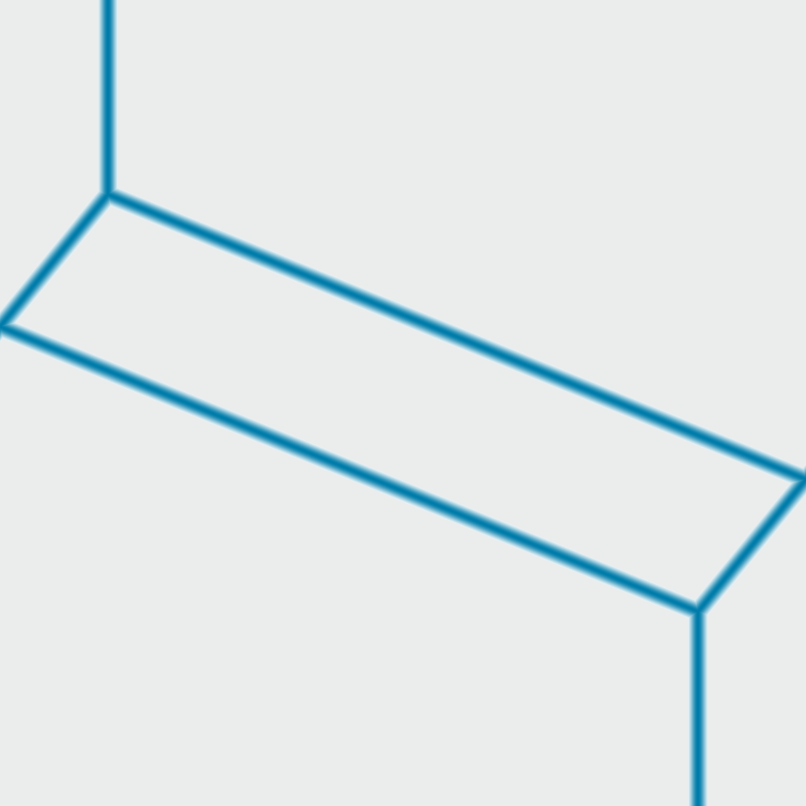

# Shader Benchmark Report

**Model:** anthropic/claude-haiku-4.5  
**Generated:** 2025-10-26 15:46:54  
**Total Tests:** 1  
**Successful Renders:** 1  
**Scored Tests:** 1  

---

## Summary Statistics

### Average Scores by Category

| Category | Average Score |
|----------|---------------|
| Mathematical Accuracy | 28.0/100 |
| Visual Quality | 78.0/100 |
| Color Implementation | 33.0/100 |
| Geometric Completeness | 62.0/100 |
| Reference Elements | 32.0/100 |
| **Overall Average** | **46.6/100** |

### Performance Highlights

**Best Test:** Shader 0 (Total: 233/500)  
**Worst Test:** Shader 0 (Total: 233/500)  

---

## Detailed Test Results

### Test 1: Shader 0

**Test ID:** `000_geometric_cube`  
**Shader Files:** shader_0.wgsl  
**Execution Status:** ✅ Success  
**Image Generated:** ✅ Yes  
**Judge Scores:** ✅ Available  

#### Judge Scores

| Category | Score |
|----------|-------|
| Mathematical Accuracy | 28/100 |
| Visual Quality | 78/100 |
| Color Implementation | 33/100 |
| Geometric Completeness | 62/100 |
| Reference Elements | 32/100 |
| **Total** | **233/500** |
| **Average** | **46.6/100** |

#### Rendered Output

---

