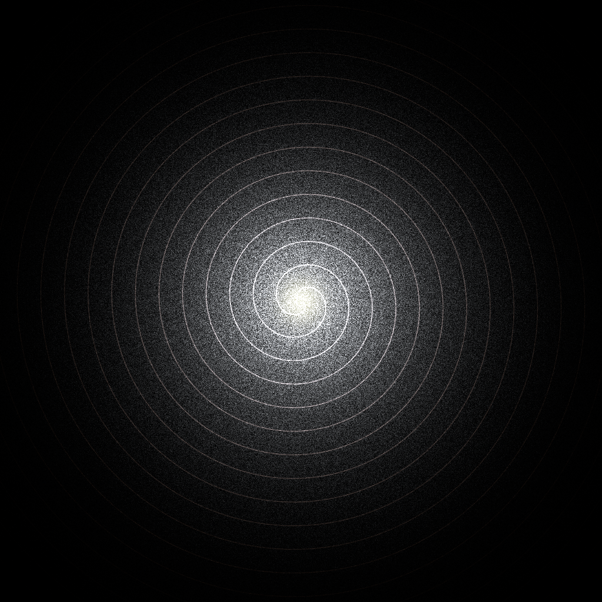
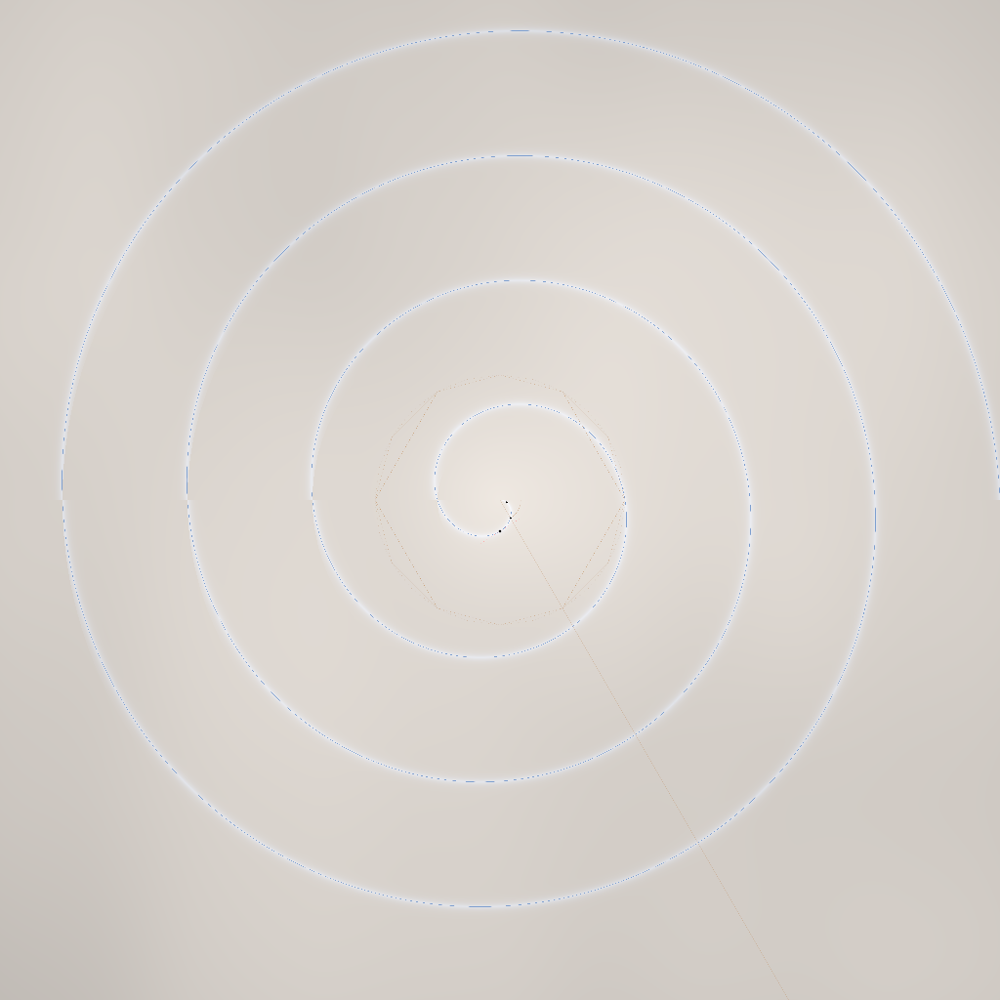
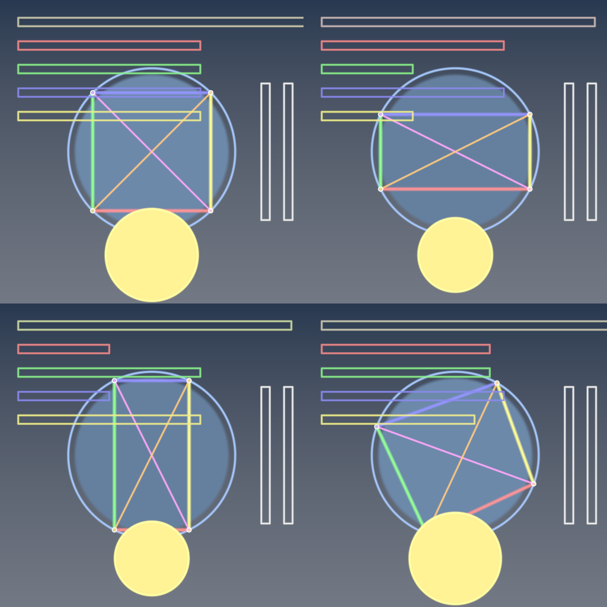

# Shader Benchmark Report

**Model:** x-ai/grok-4.1-fast
**Generated:** 2025-12-29 20:58:30
**Total Tests:** 7
**Successful Renders:** 4
**Success Rate:** 4/7 (57.1%)
**Scored Tests:** 4  

---

## Summary Statistics

### Average Scores by Category

| Category | Average Score |
|----------|---------------|
| Mathematical Accuracy | 21.8/100 |
| Visual Quality | 24.8/100 |
| Color Implementation | 20.2/100 |
| Geometric Completeness | 22.2/100 |
| Reference Elements | 19.5/100 |
| **Overall Average** | **21.7/100** |

### Performance Highlights

**Best Test:** Brahmagupta Cyclic Quadrilaterals (Total: 415/500)  
**Worst Test:** Archimedean Spiral Galaxy (Total: 5/500)  

---

## Detailed Test Results

### Test 1: Al Khwarizmi Geometric Algebra

**Test ID:** `001_al_khwarizmi_geometric_algebra`  
**Shader Files:** shader_0.wgsl  
**Execution Status:** ❌ Failed  
**Image Generated:** ❌ No  
**Judge Scores:** ✅ Available  

#### Problem Prompt

> **Objective**
> Create a shader visualization of Al-Khwarizmi's geometric solution to quadratic equations, showing how Islamic mathematicians in the 9th century used geometric algebra to solve x² + 10x = 39, bringing the birth of algebra to visual life.
> 
> **Historical Context**
> Muhammad ibn Musa al-Khwarizmi (c. 780-850 CE), working at the House of Wisdom in Baghdad, wrote "Al-Kitab al-Mukhtasar fi Hisab al-Jabr wal-Muqabala" (The Compendious Book on Calculation by Completion and Balancing), from which we derive the word "algebra." His geometric method for solving quadratics predates symbolic notation by centuries.
> 
> **Mathematical Specification**
> 
> 1. **The Classic Problem: x² + 10x = 39**
>    - Al-Khwarizmi's geometric interpretation:
>    - Start with a square of side x (representing x²)
>    - Add four rectangles of dimensions x × 2.5 to the sides
>    - This creates a larger square of side (x + 5)
> 
> 2. **Geometric Construction Steps**
>    Animate the following sequence:
>    - **Step 1**: Draw initial square of side x
>    - **Step 2**: Attach four rectangles (x × 2.5) to each side
>    - **Step 3**: Complete the figure with four corner squares (2.5 × 2.5)
>    - **Step 4**: Show that total area = x² + 10x + 25 = 39 + 25 = 64
>    - **Step 5**: Therefore (x + 5)² = 64, so x + 5 = 8, thus x = 3
> 
> 3. **Islamic Geometric Styling**
>    - Use traditional Islamic color palette:
>      * Deep blue (#1E3A8A) for the original square
>      * Gold (#F59E0B) for the added rectangles
>      * White with blue outline for corner squares
>    - Add geometric Islamic patterns in margins:
>      * 8-fold star-and-polygon tessellation
>      * Arabesque vine patterns in corners
>    - Include Arabic calligraphy styling for numbers
> 
> 4. **Visual Annotations**
>    - Label each area with both symbolic (x², 10x, 25) and numeric values
>    - Show running calculation: x² + 10x + 25 = 64
>    - Highlight the final solution x = 3 in ornate frame
>    - Add construction lines showing the completion process
> 
> 5. **Rendering Requirements**
>    - Background: Traditional Islamic manuscript color (#FEF3C7)
>    - Use parallel projection (no perspective) as in historical diagrams
>    - Include decorative border with Islamic geometric patterns
>    - Smooth animation between construction steps (5 seconds total)
>    - Resolution: 1600×1600 pixels
> 
> **Educational Goals**
> - Demonstrate the geometric origins of algebraic manipulation
> - Show how "completing the square" literally meant completing a geometric square
> - Honor Al-Khwarizmi's revolutionary contribution to mathematics
> - Connect Islamic Golden Age mathematics to modern algebra
> 
> **Deliverable**
> An animated shader that visually demonstrates Al-Khwarizmi's geometric algebra method, showing how abstract algebraic concepts emerged from concrete geometric constructions in 9th century Baghdad.

#### Rendered Output

*No image available (compilation or execution failed)*

---

### Test 2: Apollonius Conic Sections

**Test ID:** `003_apollonius_conic_sections`  
**Shader Files:** shader_0.wgsl  
**Execution Status:** ❌ Failed  
**Image Generated:** ❌ No  
**Judge Scores:** ✅ Available  

#### Problem Prompt

> **Objective**
> Create a shader visualization of Apollonius's Conic Sections as they were understood in ancient Greece (~200 BCE), showing all three conic types emerging from a single double cone through different cutting planes, honoring the geometric construction methods of antiquity.
> 
> **Historical Context**
> Apollonius of Perga (c. 240-190 BCE), known as "The Great Geometer," revolutionized the study of conic sections in his eight-volume treatise "Conics." Unlike his predecessors who used finite right circular cones, Apollonius considered arbitrary oblique double cones extending infinitely in both directions. His definitions of ellipse, parabola, and hyperbola remain in use today.
> 
> **Mathematical Specification**
> 
> 1. **The Double Cone Construction**
>    - Generate an infinite double cone with vertex at origin
>    - Cone angle: 30° from vertical axis
>    - Use parametric form: x² + y² = (z·tan(30°))²
>    - Extend from z = -3 to z = 3 for visualization
> 
> 2. **Three Classical Cutting Planes**
>    - **Ellipse**: Plane at 45° angle to cone axis, intersecting both nappes
>    - **Parabola**: Plane parallel to cone generator (exactly 30° from vertical)
>    - **Hyperbola**: Plane at 15° angle to cone axis (steeper than cone angle)
> 
> 3. **Ancient Greek Construction Visualization**
>    - Show the cone as translucent wireframe (like ancient diagrams)
>    - Display cutting planes as semi-transparent colored surfaces
>    - Highlight the intersection curves in bold, using ancient color symbolism:
>      * Ellipse: Deep blue (celestial motion)
>      * Parabola: Green (earthly trajectories)
>      * Hyperbola: Red (infinite extension)
> 
> 4. **Geometric Annotations**
>    - Add construction lines showing:
>      * Cone generators (straight lines on cone surface)
>      * Plane normal vectors
>      * Dandelin spheres tangent points (optional advanced feature)
>    - Include Greek letters α, β, γ for the three plane angles
> 
> 5. **Rendering Requirements**
>    - Use orthographic projection (as Greeks would have drawn)
>    - Apply subtle shading to show 3D form while maintaining diagram clarity
>    - Background: Parchment color (#F4E8D0)
>    - Include a small inset showing Apollonius's original cone diagram style
>    - Resolution: 1600×1600 pixels minimum
> 
> **Educational Goals**
> - Demonstrate how all conic sections emerge from a single geometric object
> - Show the elegance of ancient Greek mathematical visualization
> - Connect historical mathematics to modern computer graphics
> - Honor Apollonius's systematic approach to mathematical classification
> 
> **Deliverable**
> A single shader that renders this complete historical mathematical visualization, bringing ancient geometric wisdom into the modern digital age.

#### Rendered Output

*No image available (compilation or execution failed)*

---

### Test 3: Archimedean Spiral Galaxy

**Test ID:** `004_archimedean_spiral_galaxy`  
**Shader Files:** shader_0.wgsl  
**Execution Status:** ✅ Success  
**Image Generated:** ✅ Yes  
**Judge Scores:** ✅ Available  

#### Problem Prompt

> **Objective** – Render a face‑on **two‑arm** spiral galaxy whose stellar arms follow the *Archimedean* law $r = a\theta$.
> 
> **Star‑field specification**
> 
> * **Spiral parameters** $a = 0.25$ (units: galaxy‐normed).  Two arms offset by $\pi$. θ spans [0, 8π] (four full turns).
> * **Star sampling** – generate 120 000 stars:
> 
>   * Draw θ uniformly; compute arm centre $r=a\theta$.
>   * Tangential spread: add Gaussian offset Δθ ~ $\mathcal N(0,\sigma_{θ}^{2})$ with $\sigma_{θ}=0.035$.
>   * Radial blur: Gaussian offset Δr ~ $\mathcal N(0,\sigma_{r}^{2})$, where $\sigma_{r}=0.025(1+0.5θ)$.
>   * **Radial density fall‑off** weight $w = \exp(-r/3)$; keep star if $u<w$ where $u\sim U(0,1)$.
> * **Background** – 10 000 disc‑halo stars: radius sampled $p(r)\propto r\,e^{-r/3}$ up to $r=10$; angle uniform; small white dots.
> 
> **Colour & magnitude**
> 
> * Star colour temperature $T(r)=7200-250r\;\text{K}$; convert to sRGB with black‑body approximation.
> * Star brightness proportional to $e^{-0.5r}$ (clipped).  Render each star as Gaussian sprite of FWHM = 0.03 + 0.004 r.
> 
> **Canvas & camera**
> 
> * Orthographic view of square region r ≤ 10.  Resolution 3000 × 3000 px, black background.
> * Supernova‑like core glow: add additive circular bloom (radius 0.4, colour #ffffaa, opacity 0.6).
> 
> **Deliverable** – 16‑bit PNG.

#### Judge Scores

| Category | Score |
|----------|-------|
| Mathematical Accuracy | 1/100 |
| Visual Quality | 1/100 |
| Color Implementation | 1/100 |
| Geometric Completeness | 1/100 |
| Reference Elements | 1/100 |
| **Total** | **5/500** |
| **Average** | **1.0/100** |

#### Rendered Output

---

### Test 4: Archimedes Spiral

**Test ID:** `005_archimedes_spiral`  
**Shader Files:** shader_0.wgsl  
**Execution Status:** ✅ Success  
**Image Generated:** ✅ Yes  
**Judge Scores:** ✅ Available  

#### Problem Prompt

> **Objective**
> Create a shader visualization of Archimedes' Spiral with his original geometric properties and applications, including the trisection of angles and squaring of the circle, as discovered in ancient Syracuse circa 225 BCE.
> 
> **Historical Context**
> Archimedes of Syracuse (c. 287-212 BCE) discovered this spiral while investigating uniform motion along a rotating ray. His work "On Spirals" contains 28 propositions about this curve, including methods for trisecting angles and finding areas. The spiral r = aθ represents one of the earliest examples of a curve defined by a relationship between radius and angle.
> 
> **Mathematical Specification**
> 
> 1. **The Archimedean Spiral**
>    - Primary spiral: r = θ/π for θ ∈ [0, 8π] (4 complete turns)
>    - Show uniform spacing between turns (key property)
>    - Animate the generation: point moving outward at constant speed while ray rotates uniformly
> 
> 2. **Historical Applications Visualization**
>    
>    **A. Angle Trisection**
>    - Given angle AOB = 60°
>    - Draw arc from O intersecting OB at point C
>    - Find point P on spiral where OP = (1/3)OC
>    - Show that angle AOP = 20° (exactly 1/3 of 60°)
>    - Highlight construction with golden lines
> 
>    **B. Squaring the Circle (First Turn)**
>    - Show that area inside first turn equals πr²/3
>    - Visualize Archimedes' exhaustion method:
>      * Inscribed polygons of 6, 12, 24, 48 sides
>      * Color gradient showing convergence to exact area
>    
>    **C. Tangent Properties**
>    - At point P(r,θ), show tangent line
>    - Display angle ψ between tangent and radius vector
>    - Show Archimedes' result: tan(ψ) = r/a
> 
> 3. **Ancient Greek Styling**
>    - Background: Aged papyrus texture (#F5E6D3)
>    - Spiral in deep blue ink (#1E3263)
>    - Construction lines in faded red (#8B4513)
>    - Greek annotations: use actual Greek letters (α, β, γ, θ, π)
>    - Add water damage and aging effects to edges
> 
> 4. **Geometric Annotations**
>    - Label key points with Greek letters
>    - Show measurement marks along spiral
>    - Include Archimedes' original notations where known
>    - Add small diagrams showing:
>      * Uniform motion principle
>      * Area calculation method
> 
> 5. **Rendering Requirements**
>    - Use compass-and-straightedge construction aesthetic
>    - Show construction marks and compass arc traces
>    - Include Archimedes' portrait medallion in corner
>    - Subtle animation of spiral generation (7 seconds)
>    - Resolution: 1600×1600 pixels
> 
> **Educational Goals**
> - Demonstrate Archimedes' genius in discovering spiral properties
> - Show practical applications to classical problems
> - Visualize the exhaustion method preceding calculus by 2000 years
> - Connect ancient Greek mathematics to modern polar coordinates
> 
> **Deliverable**
> A shader that brings Archimedes' original spiral investigations to life, showing both the mathematical beauty and practical applications that made this one of antiquity's great mathematical discoveries.

#### Judge Scores

| Category | Score |
|----------|-------|
| Mathematical Accuracy | 1/100 |
| Visual Quality | 1/100 |
| Color Implementation | 1/100 |
| Geometric Completeness | 1/100 |
| Reference Elements | 1/100 |
| **Total** | **5/500** |
| **Average** | **1.0/100** |

#### Rendered Output

---

### Test 5: Barbell Dumbbell Shape

**Test ID:** `006_barbell_dumbbell_shape`  
**Shader Files:** shader_0.wgsl  
**Execution Status:** ❌ Failed  
**Image Generated:** ❌ No  
**Judge Scores:** ✅ Available  

#### Problem Prompt

> **Objective**
> Generate a high-quality visualization of a barbell (dumbbell) shape consisting of two spheres connected by a cylindrical shaft. The shape should be rendered with realistic materials and lighting.
> 
> **Mathematical Specification**
> 
> 1. **Geometric Components**
>    - Two identical spheres:
>      * Radius: 0.8 units
>      * Centers at: (-2.5, 0, 0) and (2.5, 0, 0)
>    - Connecting cylinder:
>      * Radius: 0.3 units
>      * Axis aligned with x-axis
>      * Extends from x = -1.7 to x = 1.7
>      * Smoothly blended with spheres at junction points
> 
> 2. **Smooth Blending**
>    - Use smooth minimum (smin) function for seamless transitions:
>      * smin(d1, d2, k) = -log(exp(-k*d1) + exp(-k*d2))/k
>      * Blending factor k = 2.0
>    - Apply blending at cylinder-sphere junctions
> 
> 3. **Material Properties**
>    - Metallic appearance:
>      * Base color: RGB(0.7, 0.7, 0.8)
>      * Metalness: 0.9
>      * Roughness: 0.2
>    - Different materials for spheres vs cylinder:
>      * Spheres: Polished chrome finish
>      * Cylinder: Brushed metal texture
> 
> 4. **Scene Setup**
>    - Position: Centered at origin
>    - Rotation: 
>      * Initial tilt: 15° around z-axis
>      * Continuous rotation: 1 revolution per 6 seconds around y-axis
>    - Camera: Positioned at (4, 3, 5) looking at origin
> 
> 5. **Lighting Configuration**
>    - Primary light: Directional from (1, 2, 1), intensity 0.8
>    - Fill light: Point light at (-3, 1, 2), intensity 0.4
>    - Rim light: Directional from (-1, 0, -1), intensity 0.3
>    - Environment: Simple gradient sky (light grey to white)
> 
> 6. **Rendering Details**
>    - Use physically based rendering (PBR) model
>    - Enable reflections on metallic surfaces
>    - Soft shadows with penumbra
>    - Output resolution: 1600 × 1600 pixels
>    - Antialiasing: 8× MSAA
>    - Background: Subtle radial gradient (RGB(0.9, 0.9, 0.95) to RGB(1, 1, 1))
> 
> Deliverable: Outputs a single image.

#### Rendered Output

*No image available (compilation or execution failed)*

---

### Test 6: Brahmagupta Cyclic Quadrilaterals

**Test ID:** `008_brahmagupta_cyclic_quadrilaterals`  
**Shader Files:** shader_0.wgsl  
**Execution Status:** ✅ Success  
**Image Generated:** ✅ Yes  
**Judge Scores:** ✅ Available  

#### Problem Prompt

> Create a single-file HTML shader that visualizes Brahmagupta's Cyclic Quadrilaterals and his formula for their area. The visualization should:
> 
> 1. Display a cyclic quadrilateral inscribed in a circle
> 2. Animate the quadrilateral vertices moving along the circle while maintaining the cyclic property
> 3. Calculate and display the area using Brahmagupta's formula:
>    - Area = √[(s-a)(s-b)(s-c)(s-d)]
>    - Where s = (a+b+c+d)/2 (semiperimeter)
>    - And a, b, c, d are the side lengths
> 4. Show real-time updates of:
>    - Side lengths (a, b, c, d)
>    - Semiperimeter (s)
>    - Area calculation
> 5. Demonstrate that the formula works for any cyclic quadrilateral configuration
> 6. Include special cases:
>    - Square (maximum area for given perimeter)
>    - Rectangle
>    - Irregular cyclic quadrilateral
> 7. Canvas size should be 2000×2000 pixels
> 8. Use color coding for sides and corresponding values in the formula
> 9. Add smooth transitions between different quadrilateral configurations
> 10. Include Ptolemy's theorem visualization as a bonus (ac + bd = ef for diagonals e, f)
> 
> The implementation should be a complete, self-contained HTML file with embedded WebGL shader code. The visualization should elegantly demonstrate this beautiful result from ancient Indian mathematics.

#### Judge Scores

| Category | Score |
|----------|-------|
| Mathematical Accuracy | 84/100 |
| Visual Quality | 92/100 |
| Color Implementation | 78/100 |
| Geometric Completeness | 86/100 |
| Reference Elements | 75/100 |
| **Total** | **415/500** |
| **Average** | **83.0/100** |

#### Rendered Output

---

### Test 7: Braided Rope

**Test ID:** `009_braided_rope`  
**Shader Files:** shader_0.wgsl  
**Execution Status:** ✅ Success  
**Image Generated:** ✅ Yes  
**Judge Scores:** ✅ Available  

#### Problem Prompt

> **Objective**
> Create a three-strand braided rope using helical geometry with proper phase relationships.
> 
> **Geometry**
> Three helices on cylinder radius 0.6, pitch 1.8, phase offsets 0, 120°, 240°. Tube radius 0.15. 
> 
> **Styling**
> Colour strands #c96, #6c9, #96c. Cylinder core hidden. Camera (3,2,2). 2000×1800 PNG.
> 
> **Deliverable** PNG.

#### Judge Scores

| Category | Score |
|----------|-------|
| Mathematical Accuracy | 1/100 |
| Visual Quality | 5/100 |
| Color Implementation | 1/100 |
| Geometric Completeness | 1/100 |
| Reference Elements | 1/100 |
| **Total** | **9/500** |
| **Average** | **1.8/100** |

#### Rendered Output

---

