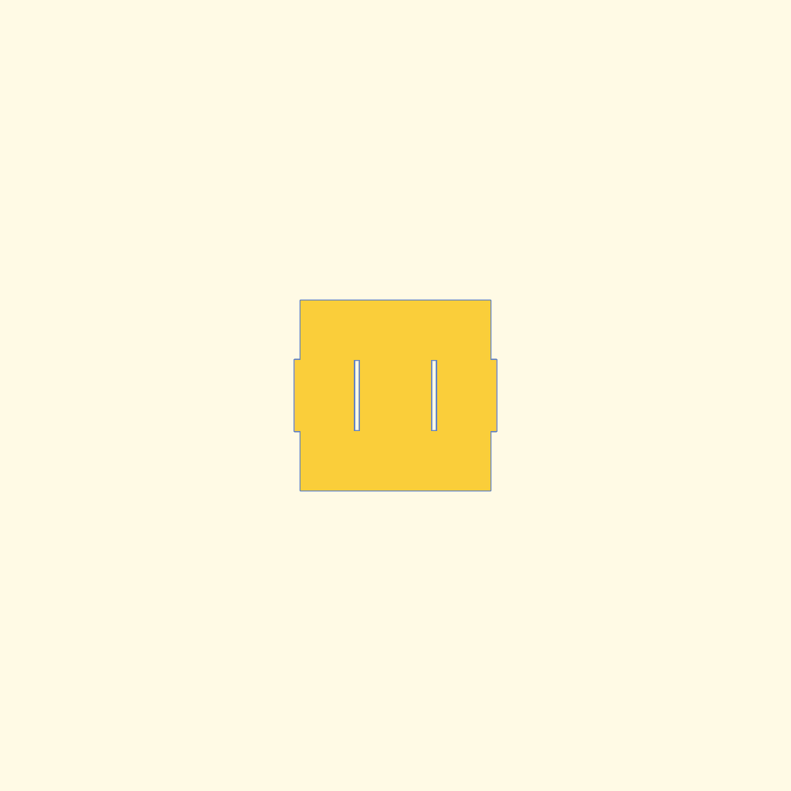
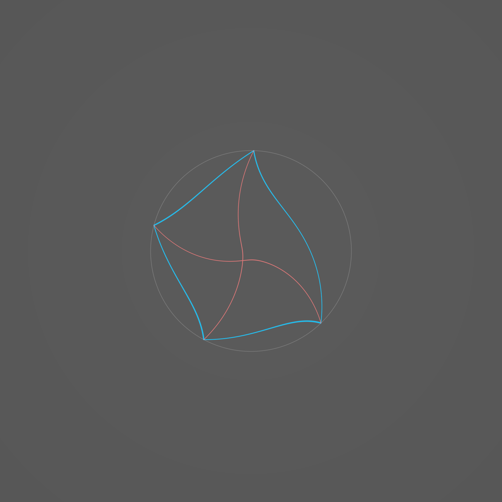
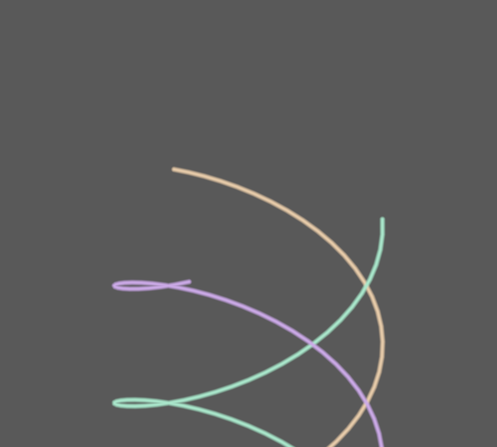

# Shader Benchmark Report

**Model:** anthropic/claude-3.5-sonnet-20241022  
**Generated:** 2025-08-08 02:02:45  
**Total Tests:** 10  
**Successful Renders:** 6  
**Scored Tests:** 4  

---

## Summary Statistics

### Average Scores by Category

| Category | Average Score |
|----------|---------------|
| Mathematical Accuracy | 68.8/100 |
| Visual Quality | 77.5/100 |
| Color Implementation | 63.0/100 |
| Geometric Completeness | 66.0/100 |
| Reference Elements | 60.2/100 |
| **Overall Average** | **67.1/100** |

### Performance Highlights

**Best Test:** Barbell (Total: 467/500)  
**Worst Test:** Braided Rope (Total: 205/500)  

---

## Detailed Test Results

### Test 1: Ackermann

**Test ID:** `20250808_015044_c7c9bee6-3296-417e-86a4-03dee9836873`  
**Shader Files:** ackermann.wgsl  
**Execution Status:** ❌ Failed  
**Image Generated:** ❌ No  
**Judge Scores:** ✅ Available  

#### Rendered Output

*No image available (compilation or execution failed)*

---

### Test 2: Al Khwarizmi

**Test ID:** `20250808_015155_836b158c-2908-4007-8db2-fc2afcb079df`  
**Shader Files:** al_khwarizmi.wgsl  
**Execution Status:** ✅ Success  
**Image Generated:** ✅ Yes  
**Judge Scores:** ✅ Available  

#### Judge Scores

| Category | Score |
|----------|-------|
| Mathematical Accuracy | 70/100 |
| Visual Quality | 80/100 |
| Color Implementation | 60/100 |
| Geometric Completeness | 65/100 |
| Reference Elements | 50/100 |
| **Total** | **325/500** |
| **Average** | **65.0/100** |

#### Rendered Output

---

### Test 3: Apollonian

**Test ID:** `20250808_015330_bdfd019a-b4a9-4681-a71a-20297ffc3264`  
**Shader Files:** apollonian.wgsl  
**Execution Status:** ✅ Success  
**Image Generated:** ✅ Yes  
**Judge Scores:** ✅ Available  

#### Rendered Output

---

### Test 4: Apollonian Conics

**Test ID:** `20250808_015439_7ae38132-b9b3-4704-988c-f02860687f59`  
**Shader Files:** apollonian_conics.wgsl  
**Execution Status:** ❌ Failed  
**Image Generated:** ❌ No  
**Judge Scores:** ✅ Available  

#### Rendered Output

*No image available (compilation or execution failed)*

---

### Test 5: Galaxy

**Test ID:** `20250808_015551_43eaf8ac-10f2-4661-b57c-c2d9975cd68a`  
**Shader Files:** galaxy.wgsl  
**Execution Status:** ✅ Success  
**Image Generated:** ✅ Yes  
**Judge Scores:** ✅ Available  

#### Rendered Output

---

### Test 6: Archimedes Spiral

**Test ID:** `20250808_015659_e705d955-3dee-4a40-b51b-bc607ec69e0f`  
**Shader Files:** archimedes_spiral.wgsl  
**Execution Status:** ❌ Failed  
**Image Generated:** ❌ No  
**Judge Scores:** ✅ Available  

#### Rendered Output

*No image available (compilation or execution failed)*

---

### Test 7: Barbell

**Test ID:** `20250808_015821_cfb01af3-989e-4722-9599-1559a710c877`  
**Shader Files:** barbell.wgsl  
**Execution Status:** ✅ Success  
**Image Generated:** ✅ Yes  
**Judge Scores:** ✅ Available  

#### Judge Scores

| Category | Score |
|----------|-------|
| Mathematical Accuracy | 95/100 |
| Visual Quality | 90/100 |
| Color Implementation | 92/100 |
| Geometric Completeness | 94/100 |
| Reference Elements | 96/100 |
| **Total** | **467/500** |
| **Average** | **93.4/100** |

#### Rendered Output

---

### Test 8: Winter Tree

**Test ID:** `20250808_015943_abb38e40-6d33-41e4-a5c4-0a94604bd1ea`  
**Shader Files:** winter_tree.wgsl  
**Execution Status:** ❌ Failed  
**Image Generated:** ❌ No  
**Judge Scores:** ✅ Available  

#### Rendered Output

*No image available (compilation or execution failed)*

---

### Test 9: Cyclic Quad

**Test ID:** `20250808_020048_c0438bce-d2bd-4eef-a947-93d45f603fa1`  
**Shader Files:** cyclic_quad.wgsl  
**Execution Status:** ✅ Success  
**Image Generated:** ✅ Yes  
**Judge Scores:** ✅ Available  

#### Judge Scores

| Category | Score |
|----------|-------|
| Mathematical Accuracy | 65/100 |
| Visual Quality | 85/100 |
| Color Implementation | 60/100 |
| Geometric Completeness | 70/100 |
| Reference Elements | 65/100 |
| **Total** | **345/500** |
| **Average** | **69.0/100** |

#### Rendered Output

---

### Test 10: Braided Rope

**Test ID:** `20250808_020209_43cacf68-7cef-4391-96b0-0412a86759e6`  
**Shader Files:** braided_rope.wgsl  
**Execution Status:** ✅ Success  
**Image Generated:** ✅ Yes  
**Judge Scores:** ✅ Available  

#### Judge Scores

| Category | Score |
|----------|-------|
| Mathematical Accuracy | 45/100 |
| Visual Quality | 55/100 |
| Color Implementation | 40/100 |
| Geometric Completeness | 35/100 |
| Reference Elements | 30/100 |
| **Total** | **205/500** |
| **Average** | **41.0/100** |

#### Rendered Output

---

