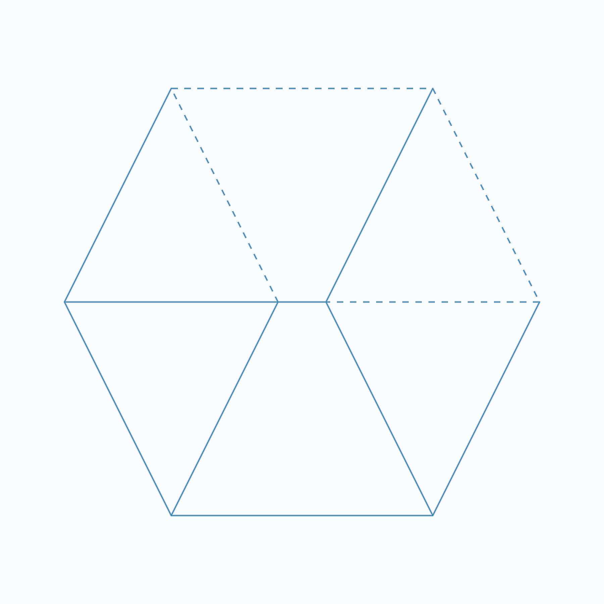

# Shader Benchmark Report

**Model:** anthropic/claude-3.5-sonnet-20241022  
**Generated:** 2025-10-23 22:26:27  
**Total Tests:** 1  
**Successful Renders:** 1  
**Scored Tests:** 1  

---

## Summary Statistics

### Average Scores by Category

| Category | Average Score |
|----------|---------------|
| Mathematical Accuracy | 78.0/100 |
| Visual Quality | 88.0/100 |
| Color Implementation | 92.0/100 |
| Geometric Completeness | 85.0/100 |
| Reference Elements | 82.0/100 |
| **Overall Average** | **85.0/100** |

### Performance Highlights

**Best Test:** Cube (Total: 425/500)  
**Worst Test:** Cube (Total: 425/500)  

---

## Detailed Test Results

### Test 1: Cube

**Test ID:** `20251023_222546_c5491832-2115-41c9-9d86-fd7f8b6b0672`  
**Shader Files:** cube.wgsl  
**Execution Status:** ✅ Success  
**Image Generated:** ✅ Yes  
**Judge Scores:** ✅ Available  

#### Judge Scores

| Category | Score |
|----------|-------|
| Mathematical Accuracy | 78/100 |
| Visual Quality | 88/100 |
| Color Implementation | 92/100 |
| Geometric Completeness | 85/100 |
| Reference Elements | 82/100 |
| **Total** | **425/500** |
| **Average** | **85.0/100** |

#### Rendered Output

---

