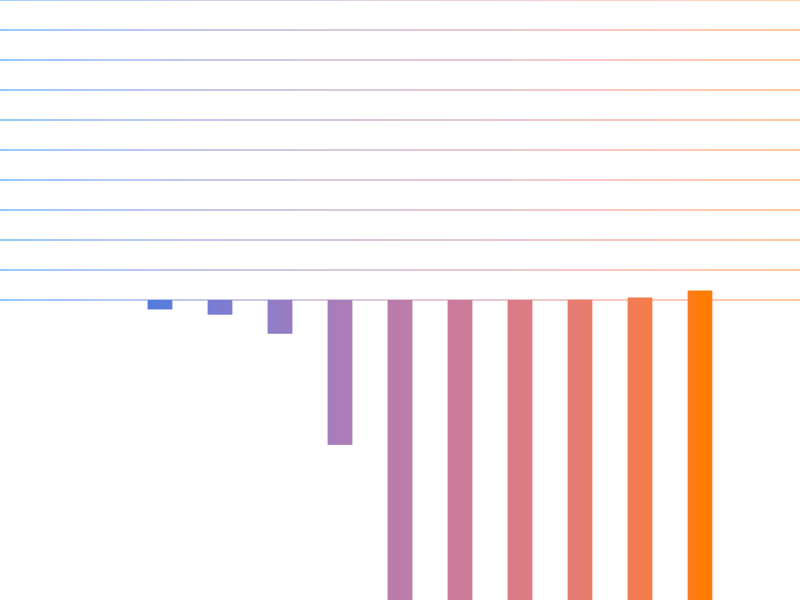

# Shader Benchmark Report

**Model:** anthropic/claude-3.5-sonnet-20241022  
**Generated:** 2025-10-23 23:14:19  
**Total Tests:** 1  
**Successful Renders:** 1  
**Scored Tests:** 1  

---

## Summary Statistics

### Average Scores by Category

| Category | Average Score |
|----------|---------------|
| Mathematical Accuracy | 25.0/100 |
| Visual Quality | 68.0/100 |
| Color Implementation | 15.0/100 |
| Geometric Completeness | 42.0/100 |
| Reference Elements | 28.0/100 |
| **Overall Average** | **35.6/100** |

### Performance Highlights

**Best Test:** Ackermann (Total: 178/500)  
**Worst Test:** Ackermann (Total: 178/500)  

---

## Detailed Test Results

### Test 1: Ackermann

**Test ID:** `20251023_231324_ba57a4c5-6c66-4a46-82b7-9e62410a7358`  
**Shader Files:** ackermann.wgsl  
**Execution Status:** ✅ Success  
**Image Generated:** ✅ Yes  
**Judge Scores:** ✅ Available  

#### Judge Scores

| Category | Score |
|----------|-------|
| Mathematical Accuracy | 25/100 |
| Visual Quality | 68/100 |
| Color Implementation | 15/100 |
| Geometric Completeness | 42/100 |
| Reference Elements | 28/100 |
| **Total** | **178/500** |
| **Average** | **35.6/100** |

#### Rendered Output

---

