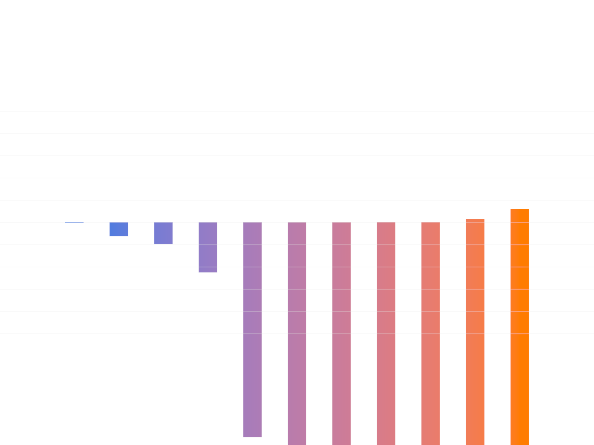

# Shader Benchmark Report

**Model:** anthropic/claude-3.5-sonnet-20241022  
**Generated:** 2025-10-23 23:54:10  
**Total Tests:** 1  
**Successful Renders:** 1  
**Scored Tests:** 1  

---

## Summary Statistics

### Average Scores by Category

| Category | Average Score |
|----------|---------------|
| Mathematical Accuracy | 42.0/100 |
| Visual Quality | 68.0/100 |
| Color Implementation | 28.0/100 |
| Geometric Completeness | 55.0/100 |
| Reference Elements | 48.0/100 |
| **Overall Average** | **48.2/100** |

### Performance Highlights

**Best Test:** Ackermann (Total: 241/500)  
**Worst Test:** Ackermann (Total: 241/500)  

---

## Detailed Test Results

### Test 1: Ackermann

**Test ID:** `20251023_235336_5ae5f7b4-98c1-4333-ba7a-c459d0ad7c6b`  
**Shader Files:** ackermann.wgsl  
**Execution Status:** ✅ Success  
**Image Generated:** ✅ Yes  
**Judge Scores:** ✅ Available  

#### Judge Scores

| Category | Score |
|----------|-------|
| Mathematical Accuracy | 42/100 |
| Visual Quality | 68/100 |
| Color Implementation | 28/100 |
| Geometric Completeness | 55/100 |
| Reference Elements | 48/100 |
| **Total** | **241/500** |
| **Average** | **48.2/100** |

#### Rendered Output

---

