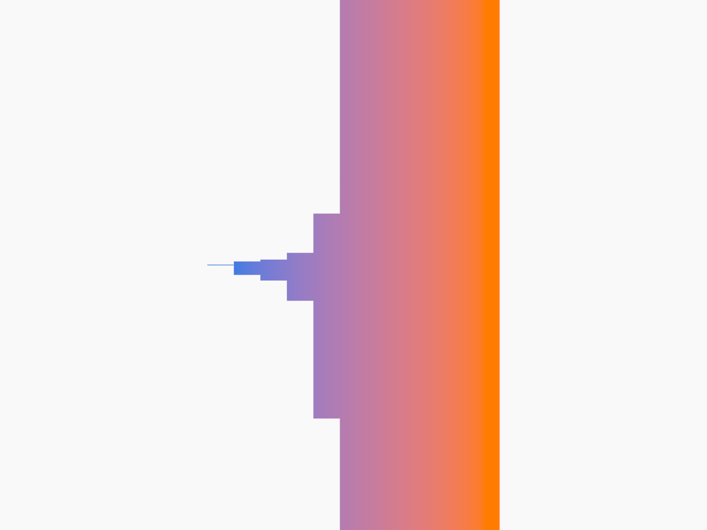

# Shader Benchmark Report

**Model:** anthropic/claude-3.5-sonnet-20241022  
**Generated:** 2025-10-24 00:02:20  
**Total Tests:** 1  
**Successful Renders:** 1  
**Scored Tests:** 1  

---

## Summary Statistics

### Average Scores by Category

| Category | Average Score |
|----------|---------------|
| Mathematical Accuracy | 5.0/100 |
| Visual Quality | 25.0/100 |
| Color Implementation | 1.0/100 |
| Geometric Completeness | 2.0/100 |
| Reference Elements | 3.0/100 |
| **Overall Average** | **7.2/100** |

### Performance Highlights

**Best Test:** Ackermann Bars (Total: 36/500)  
**Worst Test:** Ackermann Bars (Total: 36/500)  

---

## Detailed Test Results

### Test 1: Ackermann Bars

**Test ID:** `20251024_000147_deb879a3-92d8-4d16-b3e8-298a53fcaca3`  
**Shader Files:** ackermann_bars.wgsl  
**Execution Status:** ✅ Success  
**Image Generated:** ✅ Yes  
**Judge Scores:** ✅ Available  

#### Judge Scores

| Category | Score |
|----------|-------|
| Mathematical Accuracy | 5/100 |
| Visual Quality | 25/100 |
| Color Implementation | 1/100 |
| Geometric Completeness | 2/100 |
| Reference Elements | 3/100 |
| **Total** | **36/500** |
| **Average** | **7.2/100** |

#### Rendered Output

---

