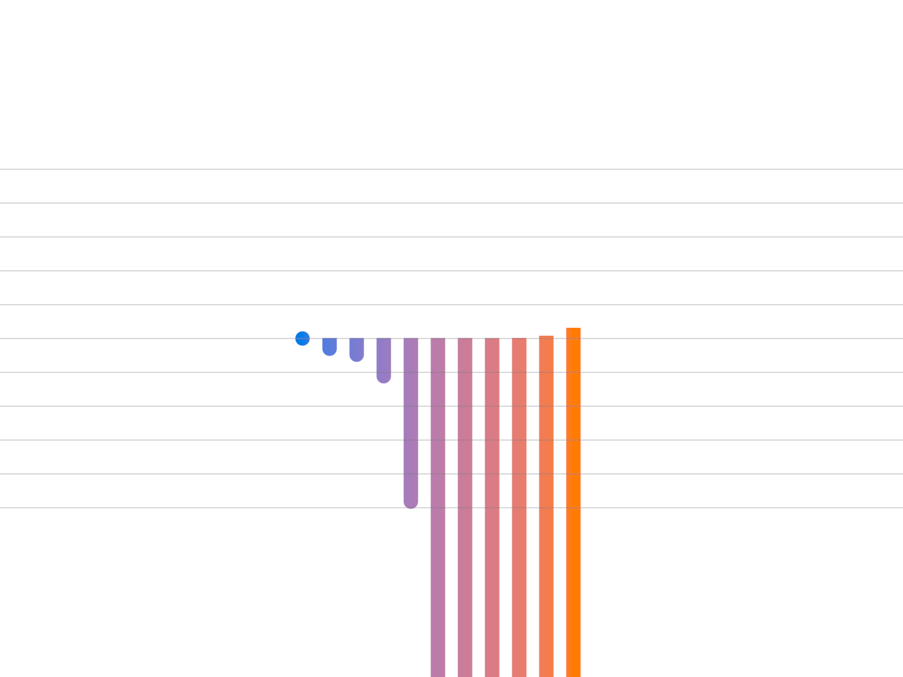

# Shader Benchmark Report

**Model:** anthropic/claude-3.5-sonnet-20241022  
**Generated:** 2025-10-24 01:07:45  
**Total Tests:** 1  
**Successful Renders:** 1  
**Scored Tests:** 1  

---

## Summary Statistics

### Average Scores by Category

| Category | Average Score |
|----------|---------------|
| Mathematical Accuracy | 35.0/100 |
| Visual Quality | 62.0/100 |
| Color Implementation | 12.0/100 |
| Geometric Completeness | 38.0/100 |
| Reference Elements | 42.0/100 |
| **Overall Average** | **37.8/100** |

### Performance Highlights

**Best Test:** Ackermann (Total: 189/500)  
**Worst Test:** Ackermann (Total: 189/500)  

---

## Detailed Test Results

### Test 1: Ackermann

**Test ID:** `20251024_010704_cf91944a-0058-4c26-904d-6c5049be04eb`  
**Shader Files:** ackermann.wgsl  
**Execution Status:** ✅ Success  
**Image Generated:** ✅ Yes  
**Judge Scores:** ✅ Available  

#### Judge Scores

| Category | Score |
|----------|-------|
| Mathematical Accuracy | 35/100 |
| Visual Quality | 62/100 |
| Color Implementation | 12/100 |
| Geometric Completeness | 38/100 |
| Reference Elements | 42/100 |
| **Total** | **189/500** |
| **Average** | **37.8/100** |

#### Rendered Output

---

