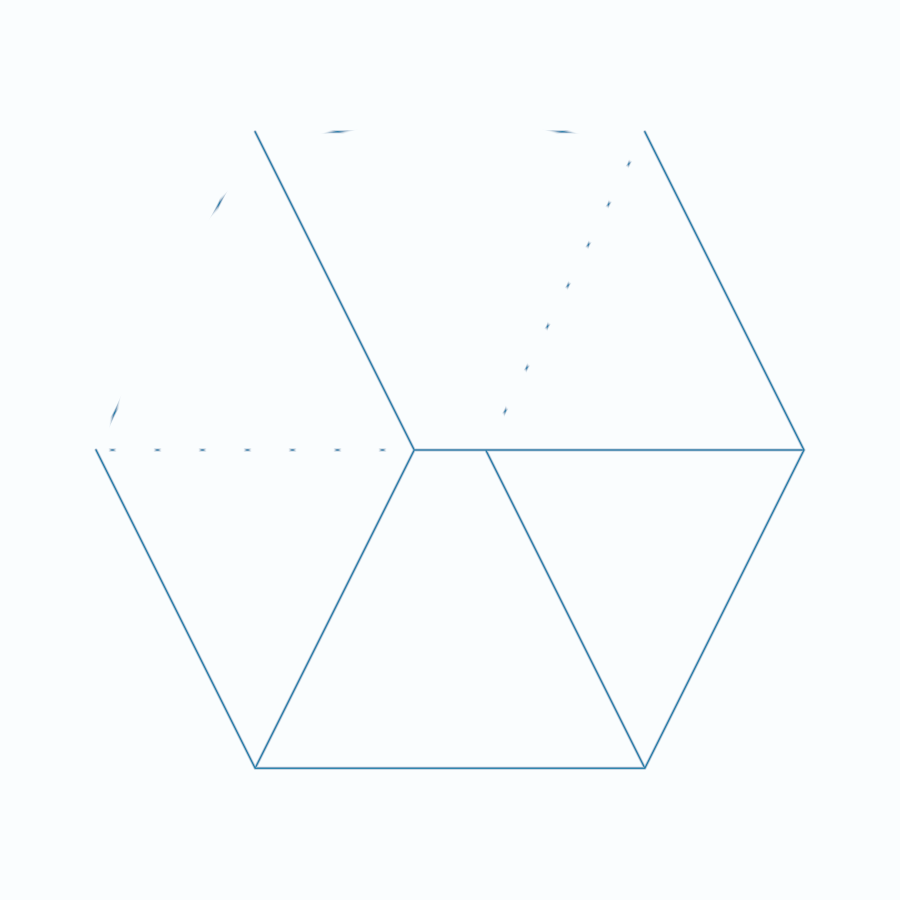

# Shader Benchmark Report

**Model:** anthropic/claude-3.5-sonnet-20241022  
**Generated:** 2025-10-24 01:20:18  
**Total Tests:** 1  
**Successful Renders:** 1  
**Scored Tests:** 1  

---

## Summary Statistics

### Average Scores by Category

| Category | Average Score |
|----------|---------------|
| Mathematical Accuracy | 70.0/100 |
| Visual Quality | 65.0/100 |
| Color Implementation | 60.0/100 |
| Geometric Completeness | 55.0/100 |
| Reference Elements | 65.0/100 |
| **Overall Average** | **63.0/100** |

### Performance Highlights

**Best Test:** Cube (Total: 315/500)  
**Worst Test:** Cube (Total: 315/500)  

---

## Detailed Test Results

### Test 1: Cube

**Test ID:** `20251024_011944_76ccd685-cb8c-4911-8641-02ca832e31b4`  
**Shader Files:** cube.wgsl  
**Execution Status:** ✅ Success  
**Image Generated:** ✅ Yes  
**Judge Scores:** ✅ Available  

#### Judge Scores

| Category | Score |
|----------|-------|
| Mathematical Accuracy | 70/100 |
| Visual Quality | 65/100 |
| Color Implementation | 60/100 |
| Geometric Completeness | 55/100 |
| Reference Elements | 65/100 |
| **Total** | **315/500** |
| **Average** | **63.0/100** |

#### Rendered Output

---

