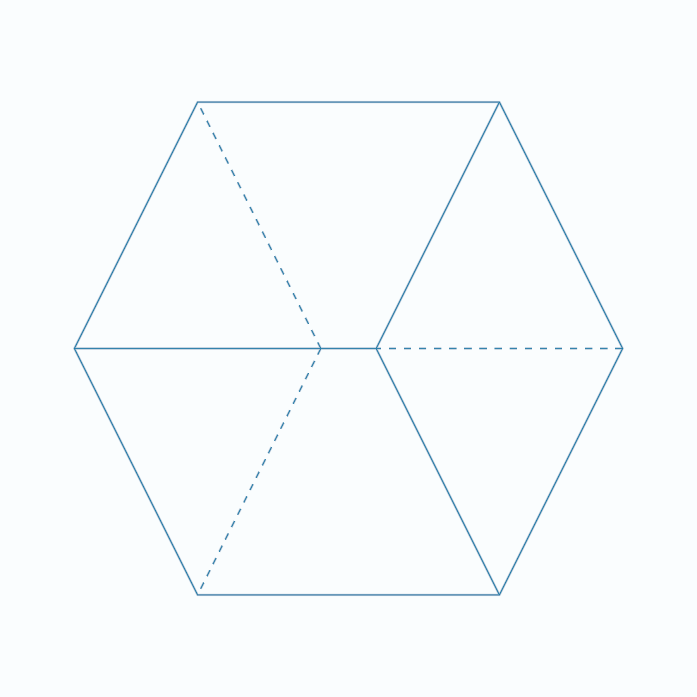

# Shader Benchmark Report

**Model:** anthropic/claude-3.5-sonnet-20241022  
**Generated:** 2025-10-24 01:58:28  
**Total Tests:** 2  
**Successful Renders:** 1  
**Scored Tests:** 1  

---

## Summary Statistics

### Average Scores by Category

| Category | Average Score |
|----------|---------------|
| Mathematical Accuracy | 53.0/100 |
| Visual Quality | 45.0/100 |
| Color Implementation | 30.0/100 |
| Geometric Completeness | 40.0/100 |
| Reference Elements | 35.0/100 |
| **Overall Average** | **40.6/100** |

### Performance Highlights

**Best Test:** Cube (Total: 203/500)  
**Worst Test:** Cube (Total: 203/500)  

---

## Detailed Test Results

### Test 1: Cube

**Test ID:** `20251024_015718_62f93bc9-dd54-4f1e-81d6-933a2f6cf414`  
**Shader Files:** cube.wgsl  
**Execution Status:** ✅ Success  
**Image Generated:** ✅ Yes  
**Judge Scores:** ✅ Available  

#### Judge Scores

| Category | Score |
|----------|-------|
| Mathematical Accuracy | 53/100 |
| Visual Quality | 45/100 |
| Color Implementation | 30/100 |
| Geometric Completeness | 40/100 |
| Reference Elements | 35/100 |
| **Total** | **203/500** |
| **Average** | **40.6/100** |

#### Rendered Output

---

### Test 2: Unknown Problem

**Test ID:** `20251024_015741_6d4b9c49-d1ca-4491-80c2-8cfe1e2a0ae5`  
**Shader Files:** None  
**Execution Status:** ❌ Failed  
**Image Generated:** ❌ No  
**Judge Scores:** ✅ Available  

#### Rendered Output

*No image available (compilation or execution failed)*

---

