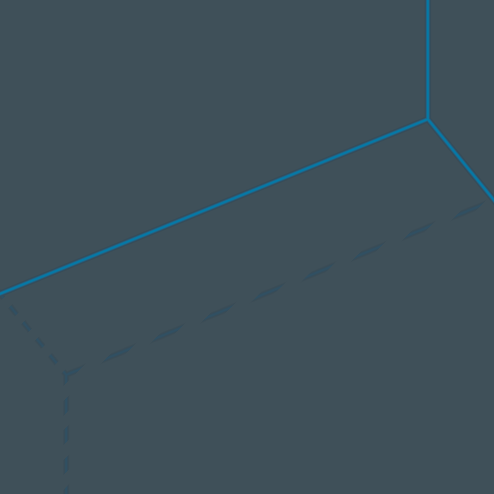

# Shader Benchmark Report

**Model:** anthropic/claude-haiku-4.5  
**Generated:** 2025-10-26 04:44:19  
**Total Tests:** 1  
**Successful Renders:** 1  
**Scored Tests:** 1  

---

## Summary Statistics

### Average Scores by Category

| Category | Average Score |
|----------|---------------|
| Mathematical Accuracy | 8.0/100 |
| Visual Quality | 18.0/100 |
| Color Implementation | 19.0/100 |
| Geometric Completeness | 27.0/100 |
| Reference Elements | 7.0/100 |
| **Overall Average** | **15.8/100** |

### Performance Highlights

**Best Test:** Shader 0 (Total: 79/500)  
**Worst Test:** Shader 0 (Total: 79/500)  

---

## Detailed Test Results

### Test 1: Shader 0

**Test ID:** `20251026_044402_d879a464-3448-48b5-9725-ae05c8531d34`  
**Shader Files:** shader_0.wgsl  
**Execution Status:** ✅ Success  
**Image Generated:** ✅ Yes  
**Judge Scores:** ✅ Available  

#### Judge Scores

| Category | Score |
|----------|-------|
| Mathematical Accuracy | 8/100 |
| Visual Quality | 18/100 |
| Color Implementation | 19/100 |
| Geometric Completeness | 27/100 |
| Reference Elements | 7/100 |
| **Total** | **79/500** |
| **Average** | **15.8/100** |

#### Rendered Output

---

