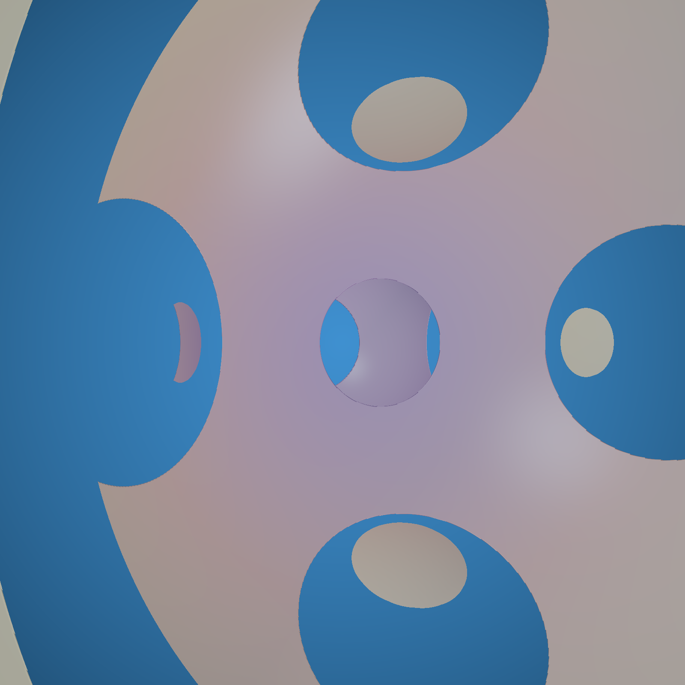
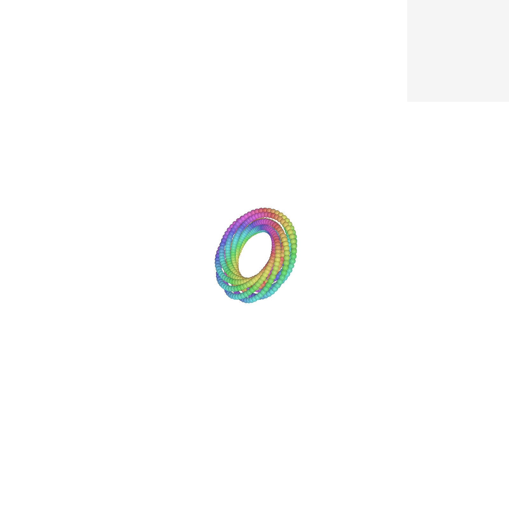

# Shader Benchmark Report

**Model:** claude-3.5-sonnet  
**Generated:** 2025-06-28 17:28:19  
**Total Tests:** 10  
**Successful Renders:** 5  
**Scored Tests:** 0  

---

## Summary Statistics

*No scored tests available for statistical analysis.*

---

## Detailed Test Results

### Test 1: Menger Cube

**Test ID:** `0d259a27-6fb1-4525-b88b-477e8655004d`  
**Timestamp:** 2025-06-28 16:55:50  
**Shader Files:** menger_cube.wgsl  
**Render Status:** ✅ Success  
**Score Status:** ❌ Not Scored  

#### Rendered Output

---

### Test 2: Hyper Menger Sphere

**Test ID:** `8a453946-d493-4550-ba7d-a2238f88bf3d`  
**Timestamp:** 2025-06-28 16:32:31  
**Shader Files:** hyper_menger_sphere.wgsl  
**Render Status:** ✅ Success  
**Score Status:** ❌ Not Scored  

#### Rendered Output

---

### Test 3: Hopf Fibration

**Test ID:** `08af6858-66f7-48ba-8e96-51f656abd732`  
**Timestamp:** 2025-06-28 16:26:44  
**Shader Files:** hopf_fibration.wgsl  
**Render Status:** ✅ Success  
**Score Status:** ❌ Not Scored  

#### Rendered Output

---

### Test 4: Hopf Fibration

**Test ID:** `3a6ea3bc-8f35-4d0e-948d-1ca00c8dbdb2`  
**Timestamp:** 2025-06-27 15:46:14  
**Shader Files:** hopf_fibration.wgsl  
**Render Status:** ✅ Success  
**Score Status:** ❌ Not Scored  

#### Rendered Output

---

### Test 5: Hopf

**Test ID:** `ab6de1d7-a72c-4a65-bce3-adca522ea981`  
**Timestamp:** 2025-06-27 15:27:29  
**Shader Files:** hopf.wgsl, fullscreen.vert.wgsl  
**Render Status:** ✅ Success  
**Score Status:** ❌ Not Scored  

#### Rendered Output

---

### Test 6: Glass Sphere

**Test ID:** `235adbd6-9d91-4847-a24c-1adbe9b687f5`  
**Shader Files:** glass_sphere.wgsl  
**Render Status:** ❌ Failed  
**Score Status:** ❌ Not Scored  

#### Rendered Output

*No image available (compilation or execution failed)*

---

### Test 7: Hopf.Vert

**Test ID:** `36cc8977-21e2-4839-932a-986d0d81780d`  
**Shader Files:** hopf.vert.wgsl, hopf.frag.wgsl  
**Render Status:** ❌ Failed  
**Score Status:** ❌ Not Scored  

#### Rendered Output

*No image available (compilation or execution failed)*

---

### Test 8: Hopf Fibration

**Test ID:** `3826f7eb-44e4-4804-9ad7-0714b031437d`  
**Shader Files:** hopf_fibration.wgsl  
**Render Status:** ❌ Failed  
**Score Status:** ❌ Not Scored  

#### Rendered Output

*No image available (compilation or execution failed)*

---

### Test 9: Menger Cube

**Test ID:** `b2365332-3e36-4273-a6db-86d94ff5d9f6`  
**Shader Files:** menger_cube.wgsl  
**Render Status:** ❌ Failed  
**Score Status:** ❌ Not Scored  

#### Rendered Output

*No image available (compilation or execution failed)*

---

### Test 10: Hopf

**Test ID:** `e3a59372-9131-48ca-b57b-db07164b8cc7`  
**Shader Files:** hopf.wgsl  
**Render Status:** ❌ Failed  
**Score Status:** ❌ Not Scored  

#### Rendered Output

*No image available (compilation or execution failed)*

---

