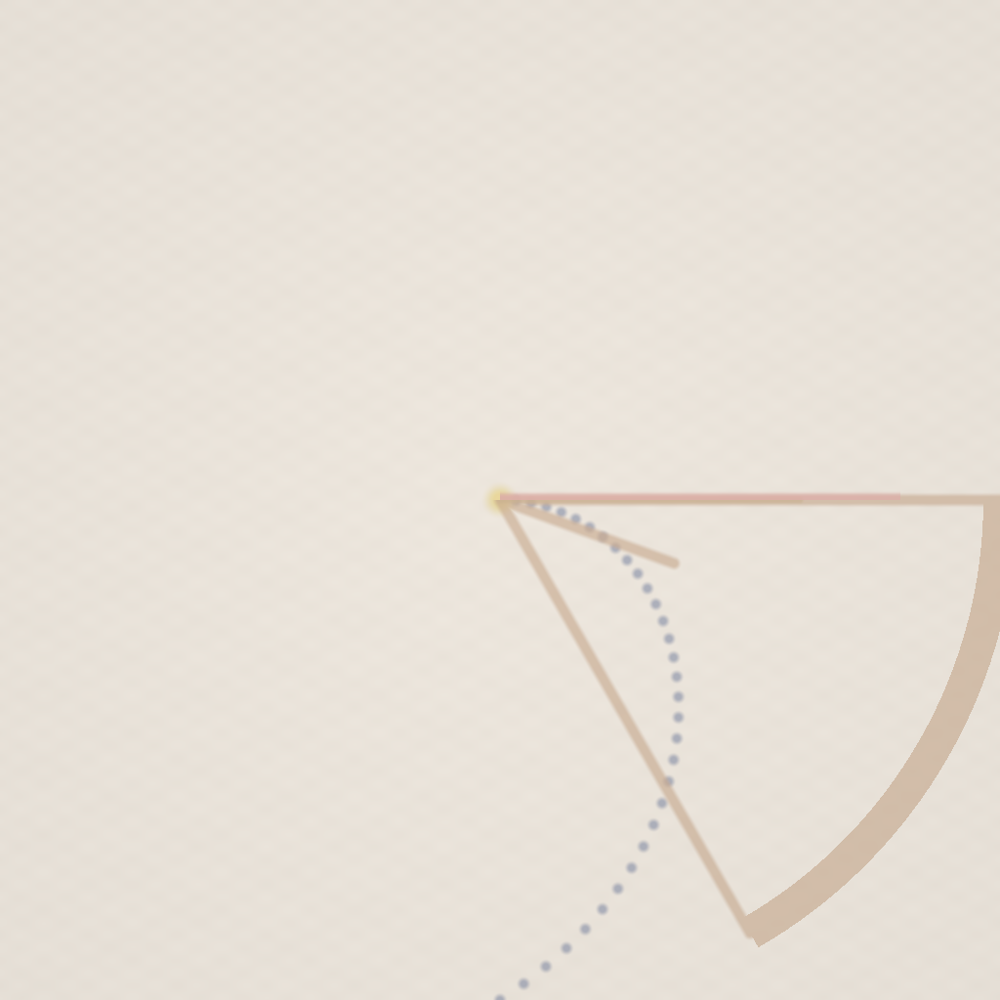

# Shader Benchmark Report

**Model:** anthropic/claude-haiku-4.5  
**Generated:** 2025-10-26 01:15:58  
**Total Tests:** 7  
**Successful Renders:** 4  
**Scored Tests:** 4  

---

## Summary Statistics

### Average Scores by Category

| Category | Average Score |
|----------|---------------|
| Mathematical Accuracy | 6.0/100 |
| Visual Quality | 21.2/100 |
| Color Implementation | 6.2/100 |
| Geometric Completeness | 7.8/100 |
| Reference Elements | 4.5/100 |
| **Overall Average** | **9.2/100** |

### Performance Highlights

**Best Test:** Shader 0 (Total: 155/500)  
**Worst Test:** Apollonius Conics (Total: 8/500)  

---

## Detailed Test Results

### Test 1: Shader 0

**Test ID:** `20251026_011128_abc332bb-0210-4a8f-8191-23eaed8d0f44`  
**Shader Files:** shader_0.wgsl  
**Execution Status:** ❌ Failed  
**Image Generated:** ❌ No  
**Judge Scores:** ✅ Available  

#### Rendered Output

*No image available (compilation or execution failed)*

---

### Test 2: Shader

**Test ID:** `20251026_011203_cdb0e850-b092-4cdb-85b0-199a9164238e`  
**Shader Files:** shader.wgsl  
**Execution Status:** ❌ Failed  
**Image Generated:** ❌ No  
**Judge Scores:** ✅ Available  

#### Rendered Output

*No image available (compilation or execution failed)*

---

### Test 3: Apollonian Gasket

**Test ID:** `20251026_011233_118b6bcf-29a4-4555-b4e9-6b7e0992de54`  
**Shader Files:** apollonian_gasket.wgsl  
**Execution Status:** ✅ Success  
**Image Generated:** ✅ Yes  
**Judge Scores:** ✅ Available  

#### Judge Scores

| Category | Score |
|----------|-------|
| Mathematical Accuracy | 2/100 |
| Visual Quality | 5/100 |
| Color Implementation | 1/100 |
| Geometric Completeness | 1/100 |
| Reference Elements | 1/100 |
| **Total** | **10/500** |
| **Average** | **2.0/100** |

#### Rendered Output

---

### Test 4: Apollonius Conics

**Test ID:** `20251026_011308_be1281be-9c05-4744-bd64-084aa68763ed`  
**Shader Files:** apollonius_conics.wgsl  
**Execution Status:** ✅ Success  
**Image Generated:** ✅ Yes  
**Judge Scores:** ✅ Available  

#### Judge Scores

| Category | Score |
|----------|-------|
| Mathematical Accuracy | 2/100 |
| Visual Quality | 3/100 |
| Color Implementation | 1/100 |
| Geometric Completeness | 1/100 |
| Reference Elements | 1/100 |
| **Total** | **8/500** |
| **Average** | **1.6/100** |

#### Rendered Output

---

### Test 5: Shader 0

**Test ID:** `20251026_011332_dc496c8e-33c4-43bb-93ac-6e7a924592a3`  
**Shader Files:** shader_0.wgsl  
**Execution Status:** ❌ Failed  
**Image Generated:** ❌ No  
**Judge Scores:** ✅ Available  

#### Rendered Output

*No image available (compilation or execution failed)*

---

### Test 6: Shader 0

**Test ID:** `20251026_011353_481920e5-d2fe-4278-8e06-798568237942`  
**Shader Files:** shader_0.wgsl  
**Execution Status:** ✅ Success  
**Image Generated:** ✅ Yes  
**Judge Scores:** ✅ Available  

#### Judge Scores

| Category | Score |
|----------|-------|
| Mathematical Accuracy | 18/100 |
| Visual Quality | 72/100 |
| Color Implementation | 22/100 |
| Geometric Completeness | 28/100 |
| Reference Elements | 15/100 |
| **Total** | **155/500** |
| **Average** | **31.0/100** |

#### Rendered Output

---

### Test 7: Braided Rope

**Test ID:** `20251026_011538_239b40d2-27b7-4a86-8525-39ec532a09b4`  
**Shader Files:** braided_rope.wgsl  
**Execution Status:** ✅ Success  
**Image Generated:** ✅ Yes  
**Judge Scores:** ✅ Available  

#### Judge Scores

| Category | Score |
|----------|-------|
| Mathematical Accuracy | 2/100 |
| Visual Quality | 5/100 |
| Color Implementation | 1/100 |
| Geometric Completeness | 1/100 |
| Reference Elements | 1/100 |
| **Total** | **10/500** |
| **Average** | **2.0/100** |

#### Rendered Output

---

