# Shader Benchmark Report

**Model:** anthropic/claude-haiku-4.5  
**Generated:** 2025-10-26 02:22:28  
**Total Tests:** 18  
**Successful Renders:** 15  
**Scored Tests:** 15  

---

## Summary Statistics

### Average Scores by Category

| Category | Average Score |
|----------|---------------|
| Mathematical Accuracy | 24.8/100 |
| Visual Quality | 45.0/100 |
| Color Implementation | 21.9/100 |
| Geometric Completeness | 25.1/100 |
| Reference Elements | 20.5/100 |
| **Overall Average** | **27.5/100** |

### Performance Highlights

**Best Test:** Capsule (Total: 472/500)  
**Worst Test:** Apollonian Gasket (Total: 10/500)  

---

## Detailed Test Results

### Test 1: Shader 0

**Test ID:** `20251026_021235_3076c07c-aa1b-49b7-b87e-8da8e867976b`  
**Shader Files:** shader_0.wgsl  
**Execution Status:** ❌ Failed  
**Image Generated:** ❌ No  
**Judge Scores:** ✅ Available  

#### Rendered Output

*No image available (compilation or execution failed)*

---

### Test 2: Al Khwarizmi Quadratic

**Test ID:** `20251026_021333_69236d8a-f733-4e70-a77c-537c81eb71e9`  
**Shader Files:** al_khwarizmi_quadratic.wgsl  
**Execution Status:** ✅ Success  
**Image Generated:** ✅ Yes  
**Judge Scores:** ✅ Available  

#### Judge Scores

| Category | Score |
|----------|-------|
| Mathematical Accuracy | 2/100 |
| Visual Quality | 45/100 |
| Color Implementation | 1/100 |
| Geometric Completeness | 8/100 |
| Reference Elements | 3/100 |
| **Total** | **59/500** |
| **Average** | **11.8/100** |

#### Rendered Output

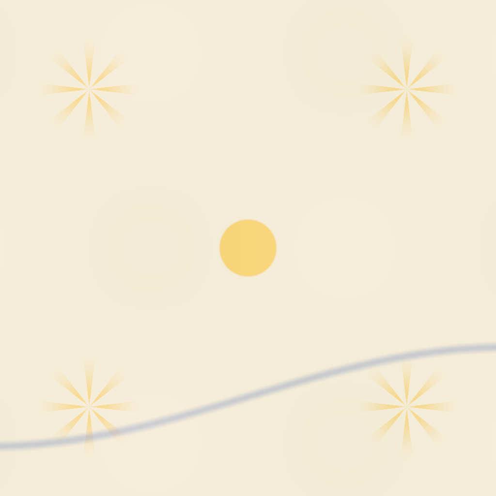

---

### Test 3: Apollonian Gasket

**Test ID:** `20251026_021358_2bec9eed-9df3-49df-9cb6-18983a015da6`  
**Shader Files:** apollonian_gasket.wgsl  
**Execution Status:** ✅ Success  
**Image Generated:** ✅ Yes  
**Judge Scores:** ✅ Available  

#### Judge Scores

| Category | Score |
|----------|-------|
| Mathematical Accuracy | 2/100 |
| Visual Quality | 5/100 |
| Color Implementation | 1/100 |
| Geometric Completeness | 1/100 |
| Reference Elements | 1/100 |
| **Total** | **10/500** |
| **Average** | **2.0/100** |

#### Rendered Output

---

### Test 4: Apollonius Conics

**Test ID:** `20251026_021445_0433cbb6-0d95-48e4-b3f0-d17bb1eb6b32`  
**Shader Files:** apollonius_conics.wgsl  
**Execution Status:** ✅ Success  
**Image Generated:** ✅ Yes  
**Judge Scores:** ✅ Available  

#### Judge Scores

| Category | Score |
|----------|-------|
| Mathematical Accuracy | 8/100 |
| Visual Quality | 12/100 |
| Color Implementation | 5/100 |
| Geometric Completeness | 6/100 |
| Reference Elements | 4/100 |
| **Total** | **35/500** |
| **Average** | **7.0/100** |

#### Rendered Output

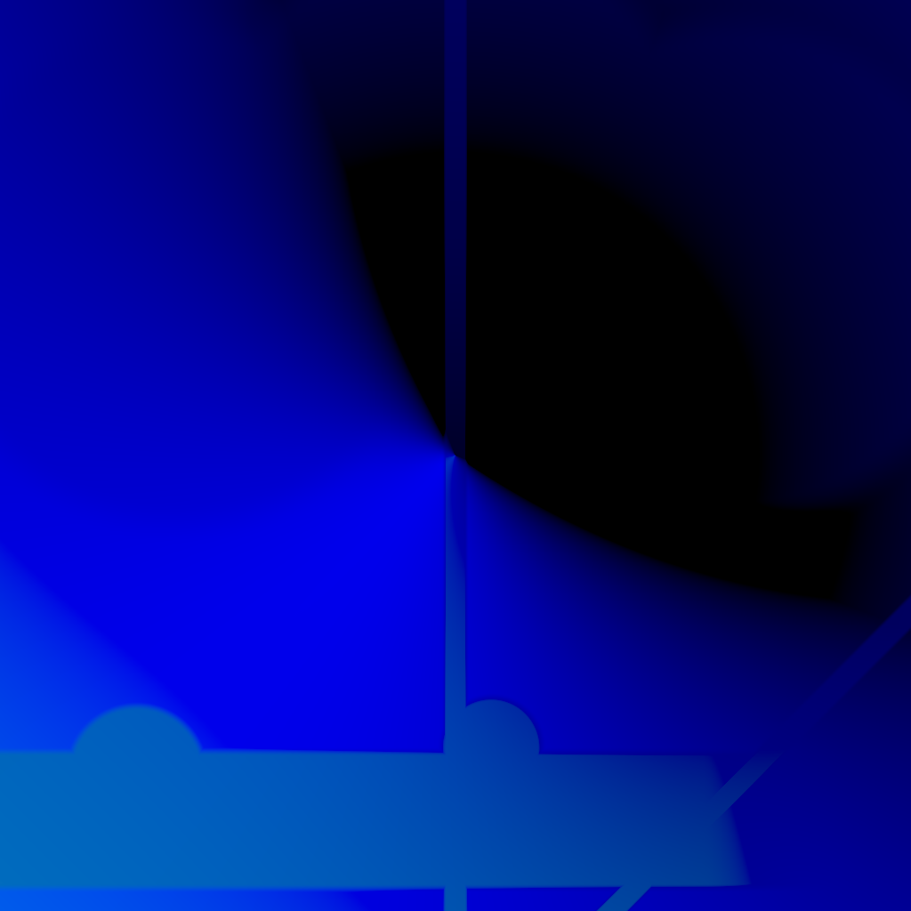

---

### Test 5: Spiral Galaxy

**Test ID:** `20251026_021516_0c0deb87-11ea-4424-8ca5-ddadc3cae4b0`  
**Shader Files:** spiral_galaxy.wgsl  
**Execution Status:** ❌ Failed  
**Image Generated:** ❌ No  
**Judge Scores:** ✅ Available  

#### Rendered Output

*No image available (compilation or execution failed)*

---

### Test 6: Archimedes Spiral

**Test ID:** `20251026_021607_9ba0924b-8db5-4b50-ad93-a37d41aa98e0`  
**Shader Files:** archimedes_spiral.wgsl  
**Execution Status:** ✅ Success  
**Image Generated:** ✅ Yes  
**Judge Scores:** ✅ Available  

#### Judge Scores

| Category | Score |
|----------|-------|
| Mathematical Accuracy | 12/100 |
| Visual Quality | 28/100 |
| Color Implementation | 8/100 |
| Geometric Completeness | 15/100 |
| Reference Elements | 10/100 |
| **Total** | **73/500** |
| **Average** | **14.6/100** |

#### Rendered Output

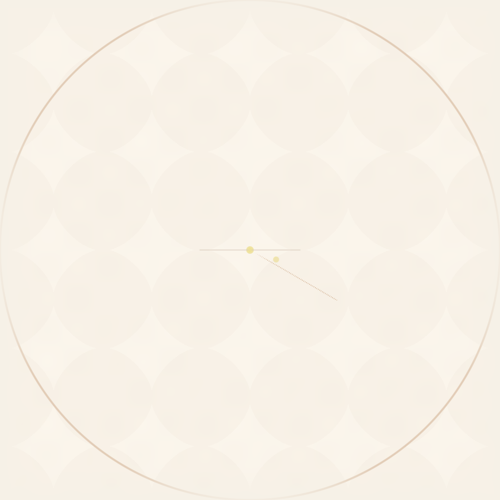

---

### Test 7: Barbell

**Test ID:** `20251026_021636_bbf1faf2-e27c-45ad-94bc-e429a29ff7a9`  
**Shader Files:** barbell.wgsl  
**Execution Status:** ✅ Success  
**Image Generated:** ✅ Yes  
**Judge Scores:** ✅ Available  

#### Judge Scores

| Category | Score |
|----------|-------|
| Mathematical Accuracy | 87/100 |
| Visual Quality | 92/100 |
| Color Implementation | 88/100 |
| Geometric Completeness | 90/100 |
| Reference Elements | 92/100 |
| **Total** | **449/500** |
| **Average** | **89.8/100** |

#### Rendered Output

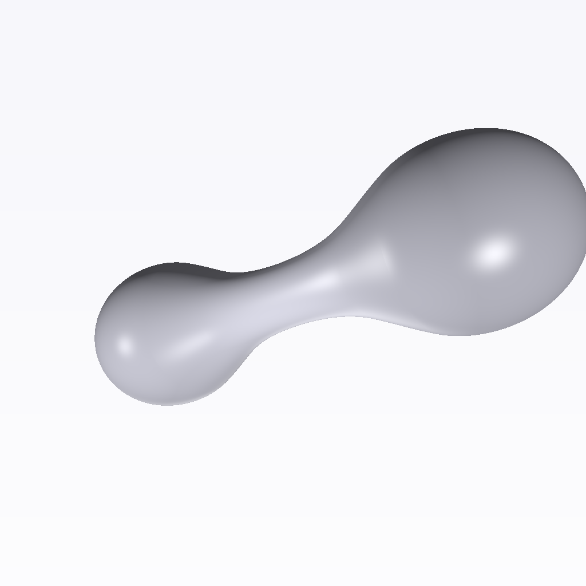

---

### Test 8: Winter Tree

**Test ID:** `20251026_021708_25e5074d-0062-412b-b8c0-6365f31b2f38`  
**Shader Files:** winter_tree.wgsl  
**Execution Status:** ✅ Success  
**Image Generated:** ✅ Yes  
**Judge Scores:** ✅ Available  

#### Judge Scores

| Category | Score |
|----------|-------|
| Mathematical Accuracy | 12/100 |
| Visual Quality | 68/100 |
| Color Implementation | 8/100 |
| Geometric Completeness | 24/100 |
| Reference Elements | 6/100 |
| **Total** | **118/500** |
| **Average** | **23.6/100** |

#### Rendered Output

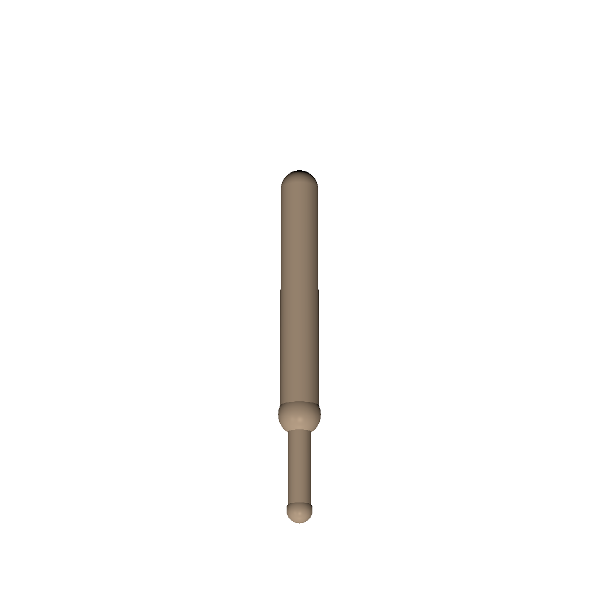

---

### Test 9: Shader 0

**Test ID:** `20251026_021750_47bdb777-122c-489b-b98c-8297dbe8f75b`  
**Shader Files:** shader_0.wgsl  
**Execution Status:** ✅ Success  
**Image Generated:** ✅ Yes  
**Judge Scores:** ✅ Available  

#### Judge Scores

| Category | Score |
|----------|-------|
| Mathematical Accuracy | 32/100 |
| Visual Quality | 72/100 |
| Color Implementation | 28/100 |
| Geometric Completeness | 35/100 |
| Reference Elements | 24/100 |
| **Total** | **191/500** |
| **Average** | **38.2/100** |

#### Rendered Output

---

### Test 10: Butterfly

**Test ID:** `20251026_021805_8b83d255-64d9-48d1-be3f-44598794c218`  
**Shader Files:** butterfly.wgsl  
**Execution Status:** ✅ Success  
**Image Generated:** ✅ Yes  
**Judge Scores:** ✅ Available  

#### Judge Scores

| Category | Score |
|----------|-------|
| Mathematical Accuracy | 5/100 |
| Visual Quality | 35/100 |
| Color Implementation | 2/100 |
| Geometric Completeness | 3/100 |
| Reference Elements | 2/100 |
| **Total** | **47/500** |
| **Average** | **9.4/100** |

#### Rendered Output

---

### Test 11: Shader

**Test ID:** `20251026_021840_d1f4f56a-6e23-43bf-be1f-0c619e464611`  
**Shader Files:** shader.wgsl  
**Execution Status:** ✅ Success  
**Image Generated:** ✅ Yes  
**Judge Scores:** ✅ Available  

#### Judge Scores

| Category | Score |
|----------|-------|
| Mathematical Accuracy | 5/100 |
| Visual Quality | 8/100 |
| Color Implementation | 2/100 |
| Geometric Completeness | 3/100 |
| Reference Elements | 2/100 |
| **Total** | **20/500** |
| **Average** | **4.0/100** |

#### Rendered Output

---

### Test 12: Capsule

**Test ID:** `20251026_021900_b06d86cc-2c65-4cc9-9add-acbb0fee0fc7`  
**Shader Files:** capsule.wgsl  
**Execution Status:** ✅ Success  
**Image Generated:** ✅ Yes  
**Judge Scores:** ✅ Available  

#### Judge Scores

| Category | Score |
|----------|-------|
| Mathematical Accuracy | 92/100 |
| Visual Quality | 95/100 |
| Color Implementation | 94/100 |
| Geometric Completeness | 96/100 |
| Reference Elements | 95/100 |
| **Total** | **472/500** |
| **Average** | **94.4/100** |

#### Rendered Output

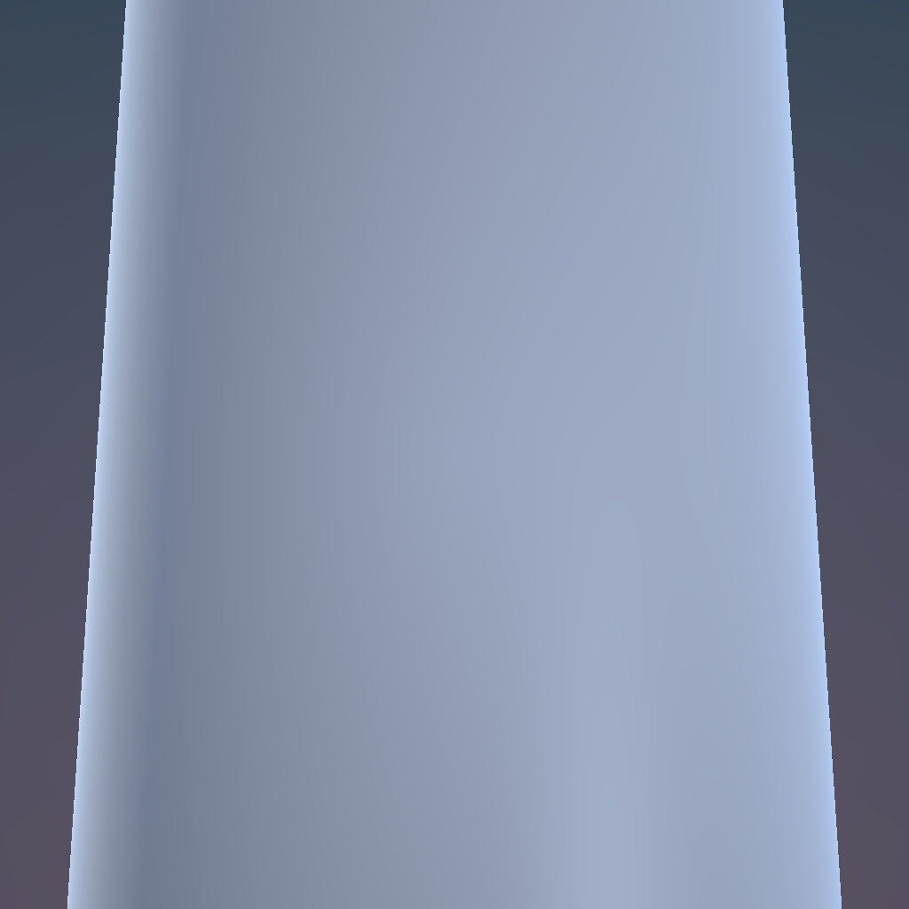

---

### Test 13: Cardioid Limacon

**Test ID:** `20251026_021920_d7ff7bf2-98ee-4031-9b4a-dc584034427c`  
**Shader Files:** cardioid_limacon.wgsl  
**Execution Status:** ✅ Success  
**Image Generated:** ✅ Yes  
**Judge Scores:** ✅ Available  

#### Judge Scores

| Category | Score |
|----------|-------|
| Mathematical Accuracy | 42/100 |
| Visual Quality | 78/100 |
| Color Implementation | 35/100 |
| Geometric Completeness | 52/100 |
| Reference Elements | 28/100 |
| **Total** | **235/500** |
| **Average** | **47.0/100** |

#### Rendered Output

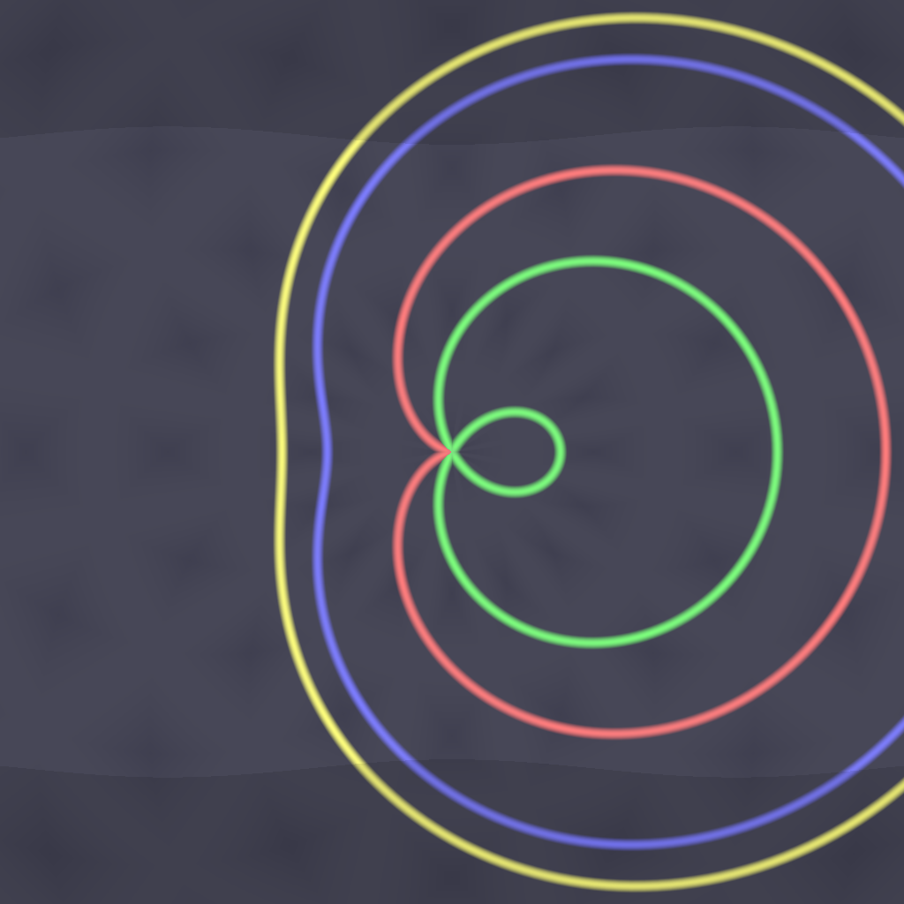

---

### Test 14: Catenoid Helicoid

**Test ID:** `20251026_021940_068e82c4-f263-49d3-9c53-11b695ae5293`  
**Shader Files:** catenoid_helicoid.wgsl  
**Execution Status:** ✅ Success  
**Image Generated:** ✅ Yes  
**Judge Scores:** ✅ Available  

#### Judge Scores

| Category | Score |
|----------|-------|
| Mathematical Accuracy | 8/100 |
| Visual Quality | 15/100 |
| Color Implementation | 5/100 |
| Geometric Completeness | 6/100 |
| Reference Elements | 4/100 |
| **Total** | **38/500** |
| **Average** | **7.6/100** |

#### Rendered Output

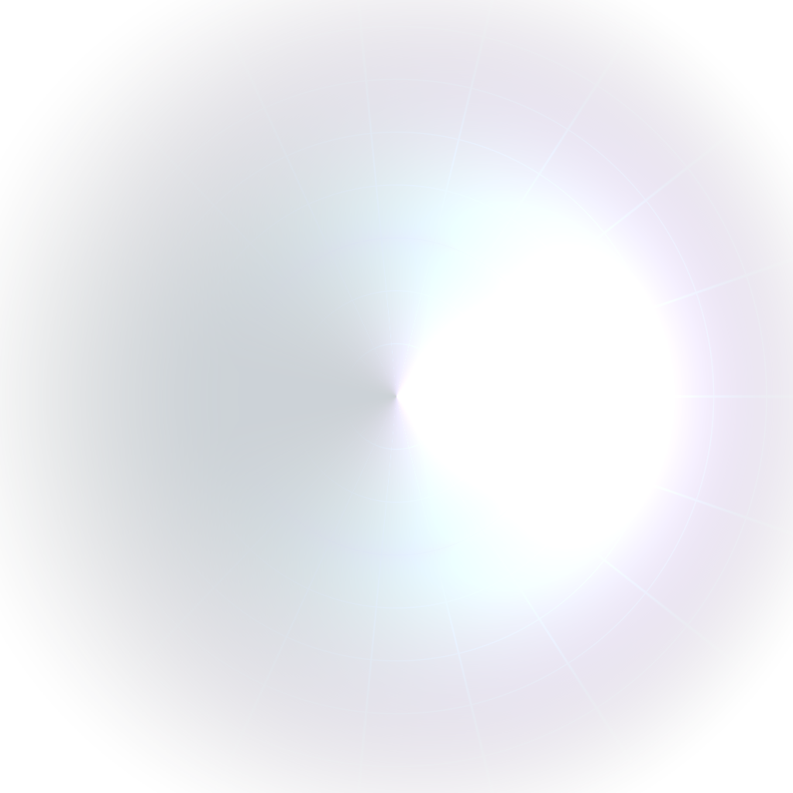

---

### Test 15: Crt Sunzi

**Test ID:** `20251026_022026_c681514e-1b4a-44b7-8ccf-27f37f77bb2c`  
**Shader Files:** crt_sunzi.wgsl  
**Execution Status:** ✅ Success  
**Image Generated:** ✅ Yes  
**Judge Scores:** ✅ Available  

#### Judge Scores

| Category | Score |
|----------|-------|
| Mathematical Accuracy | 8/100 |
| Visual Quality | 25/100 |
| Color Implementation | 5/100 |
| Geometric Completeness | 8/100 |
| Reference Elements | 6/100 |
| **Total** | **52/500** |
| **Average** | **10.4/100** |

#### Rendered Output

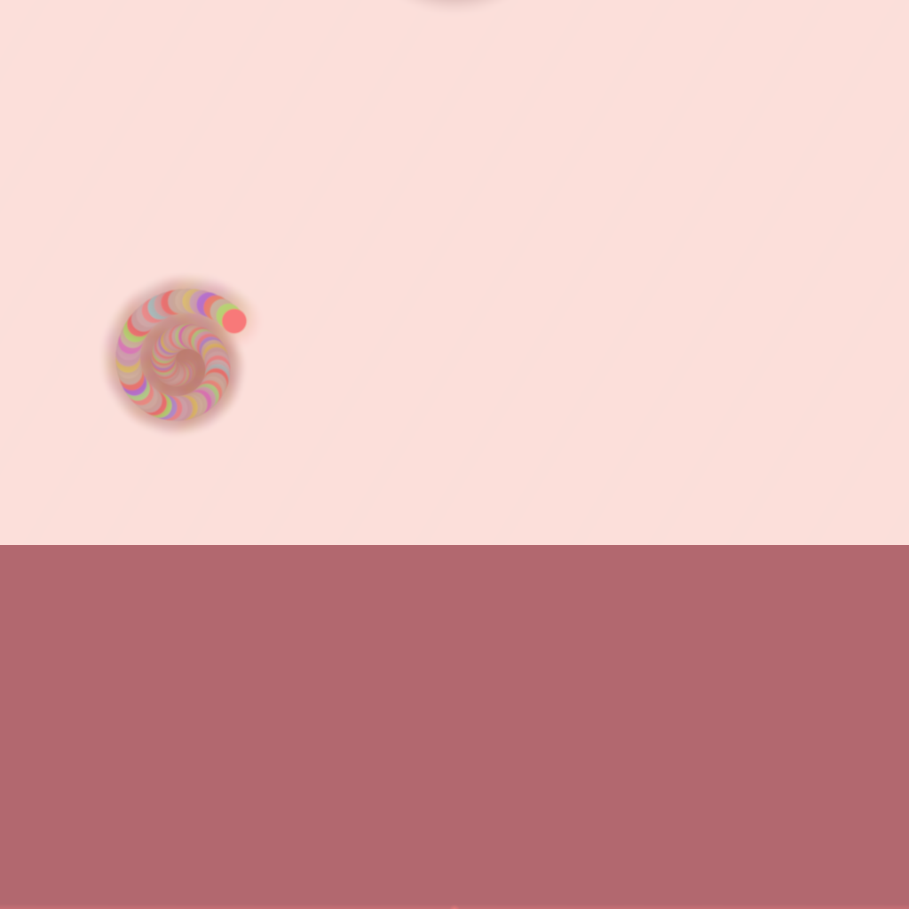

---

### Test 16: Chladni

**Test ID:** `20251026_022119_a243fd17-b273-45f4-80ac-e552c58350c5`  
**Shader Files:** chladni.wgsl  
**Execution Status:** ✅ Success  
**Image Generated:** ✅ Yes  
**Judge Scores:** ✅ Available  

#### Judge Scores

| Category | Score |
|----------|-------|
| Mathematical Accuracy | 35/100 |
| Visual Quality | 62/100 |
| Color Implementation | 28/100 |
| Geometric Completeness | 15/100 |
| Reference Elements | 22/100 |
| **Total** | **162/500** |
| **Average** | **32.4/100** |

#### Rendered Output

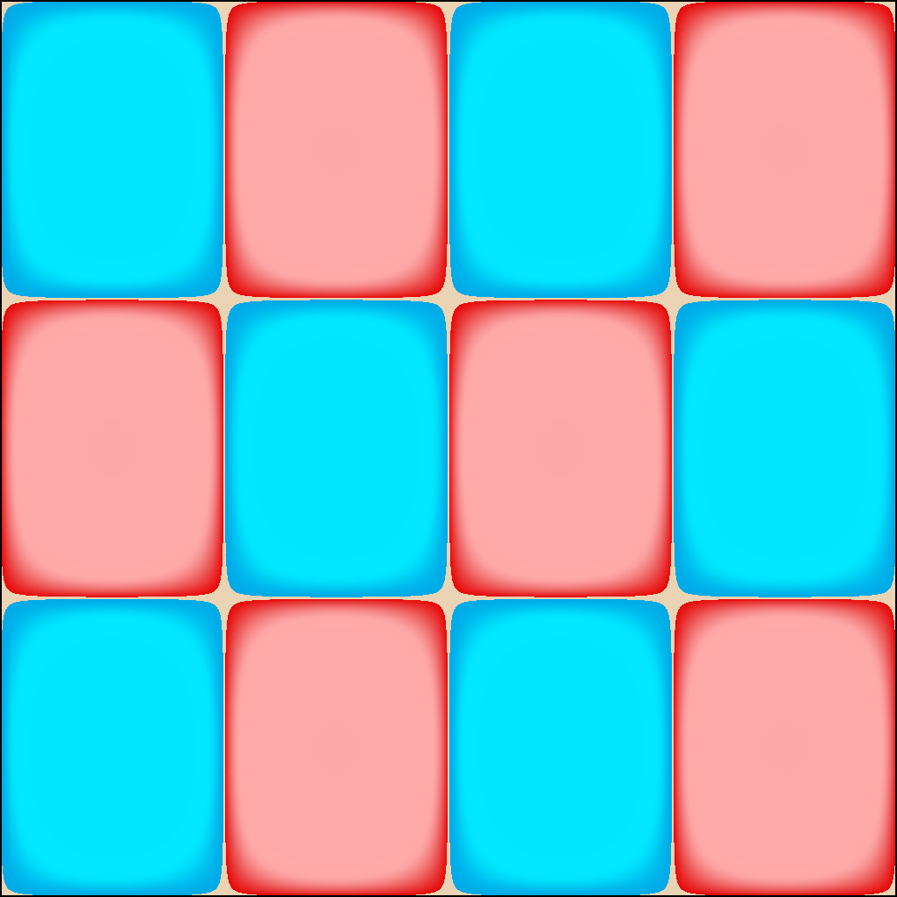

---

### Test 17: Stained Glass

**Test ID:** `20251026_022147_c294dfff-a7d0-4932-afb3-a8954ca343a4`  
**Shader Files:** stained_glass.wgsl  
**Execution Status:** ✅ Success  
**Image Generated:** ✅ Yes  
**Judge Scores:** ✅ Available  

#### Judge Scores

| Category | Score |
|----------|-------|
| Mathematical Accuracy | 22/100 |
| Visual Quality | 35/100 |
| Color Implementation | 18/100 |
| Geometric Completeness | 15/100 |
| Reference Elements | 8/100 |
| **Total** | **98/500** |
| **Average** | **19.6/100** |

#### Rendered Output

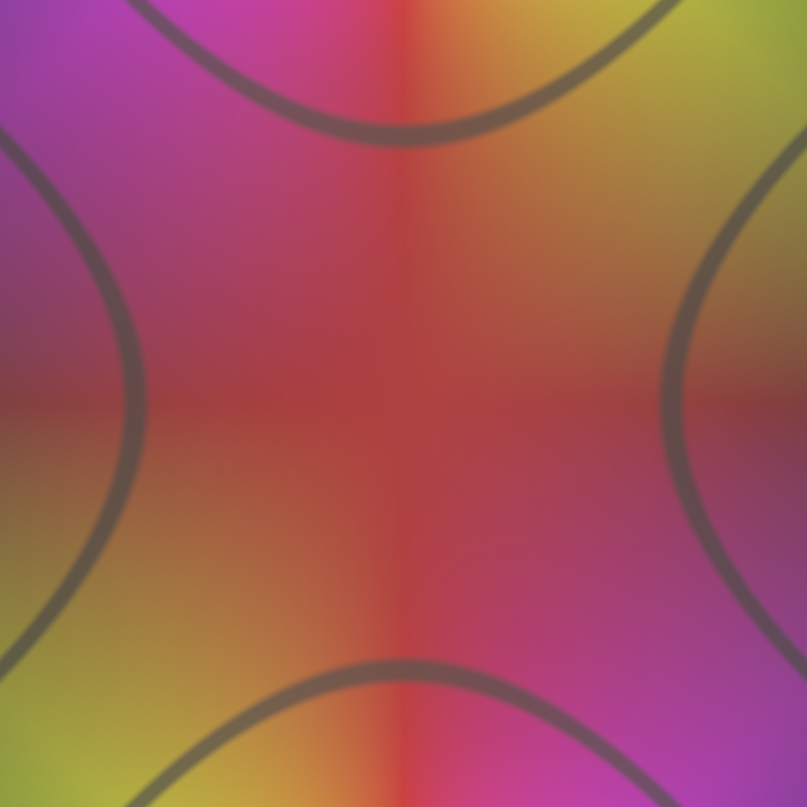

---

### Test 18: Stella Octangula

**Test ID:** `20251026_022208_e9f0752d-d68a-40ef-8fee-8f57dc6ff6cd`  
**Shader Files:** stella_octangula.wgsl  
**Execution Status:** ❌ Failed  
**Image Generated:** ❌ No  
**Judge Scores:** ✅ Available  

#### Rendered Output

*No image available (compilation or execution failed)*

---

